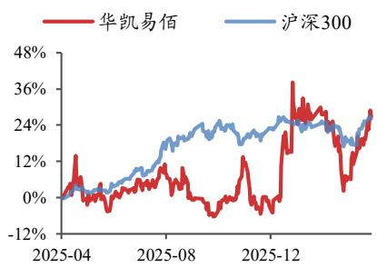

# 精品业务持续快速增长，库存优化带来盈利显著改善

## 华凯易佰（300592.SZ）

2026 年 04 月 27 日

# ——公司信息更新报告

投资评级：买入（维持）

<table><tr><td>当前股价(元)</td><td>13.93</td></tr><tr><td>一年最高最低(元)</td><td>15.16/10.09</td></tr><tr><td>总市值(亿元)</td><td>56.33</td></tr><tr><td>流通市值(亿元)</td><td>48.60</td></tr><tr><td>总股本(亿股)</td><td>4.04</td></tr><tr><td>流通股本(亿股)</td><td>3.49</td></tr><tr><td>近3个月换手率(%)</td><td>185.55</td></tr></table>

## 股价走势图

  
数据来源：聚源

## 相关研究报告

《主营业务稳健增长，库存因素短期拖累盈利能力—公司信息更新报告》-2025.5.1

黄泽鹏（分析师）

huangzepeng@kysec.cn

证书编号：S0790519110001

## ⚫ 公司 2025 年营收同比+1.2%，2026Q1 归母净利润同比+574.0%

公司发布年报、一季报：2025 年实现营收 91.33 亿元（同比+1.2%，下同）、归母净利润 1.47 亿元（-13.8%）；单 2025Q4 归母净利润 0.97 亿元（+608.9%）；2026Q1营收 19.24 亿元（-16.1%），归母净利润 0.72亿元（+574.0%），最近两个季度业绩明显好转。我们认为，公司目前库存状况已重回健康水平，未来通过数智化体系提高运营能力壁垒、打造品牌矩阵，有望重回高成长。我们维持公司 2026-2027年盈利预测不变并新增 2028 年盈利预测，预计 2026-2028 年归母净利润为3.61/4.52/5.45 亿元，对应 EPS 为 0.89/1.12/1.35 元，当前股价对应 PE 为15.6/12.5/10.3 倍，维持“买入”评级。

## ⚫ 跨境电商精品业务营收快速增长，库存去化带来盈利改善

2025 年，公司跨境出口电商/跨境电商综合服务业务分别实现营收 84.08/7.22 亿元，分别同比增长+4.2%/-23.2%。其中，核心泛品业务 2025 年实现营收 63.64亿元（-5.0%）；精品业务实现营收 20.44 亿元（+50.0%），在宠物用品与家具家居赛道取得显著突破；亿迈生态平台业务合作商户拓展至 291 家。存货方面，2025年公司库存降至 9.56 亿元（-47.4%），2026Q1 进一步降低至 8.81 亿元（环比-7.8%），存货状况健康，早期高库存带来的高费用、低毛利压力逐步解除。盈利能力方面，2025 年公司毛利率为 33.4%（-0.4pct），2026Q1 单季度毛利率恢复至35.9%（+4.4pct），同比显著提升；期间费用方面，公司 2025 年销售/管理/财务费用率为 25.4%/3.9%/-0.1%，分别同比+0.3pct/-1.0pct/-0.1pct。

## “泛品+精品”双轮驱动增长，通拓整合完成筑牢利润增长根基

（1）泛品：AI 驱动，巩固传统优势渠道同时在 Temu 等新兴平台实现快速成长；

（2）精品：专注核心品类、构建自有品牌，实现从“单品突破”迈向“品类引领”；

（3）亿迈生态平台：实现多平台同步上架推广，影响力与认可度再上新台阶；

（4）通拓科技：整合取得实质性成效，2026 年有望进一步贡献正向收益。

⚫ 风险提示：市场竞争加剧、关税和平台政策变化、新业务不及预期等。

财务摘要和估值指标
<table><tr><td>指标</td><td>2024A</td><td>2025A</td><td>2026E</td><td>2027E</td><td>2028E</td></tr><tr><td>营业收入(百万元)</td><td>9,022</td><td>9,133</td><td>10,460</td><td>11,940</td><td>13,507</td></tr><tr><td>YOY(%)</td><td>38.4</td><td>1.2</td><td>14.5</td><td>14.2</td><td>13.1</td></tr><tr><td>归母净利润(百万元)</td><td>170</td><td>147</td><td>361</td><td>452</td><td>545</td></tr><tr><td>YOY(%)</td><td>-48.8</td><td>-13.8</td><td>146.2</td><td>25.2</td><td>20.5</td></tr><tr><td>毛利率(%)</td><td>33.9</td><td>33.4</td><td>35.9</td><td>36.7</td><td>37.3</td></tr><tr><td>净利率(%)</td><td>1.9</td><td>1.7</td><td>3.5</td><td>3.8</td><td>4.0</td></tr><tr><td>ROE(%)</td><td>7.0</td><td>6.5</td><td>13.1</td><td>14.4</td><td>14.9</td></tr><tr><td>EPS(摊薄/元)</td><td>0.42</td><td>0.36</td><td>0.89</td><td>1.12</td><td>1.35</td></tr><tr><td>P/E(倍)</td><td>33.1</td><td>38.4</td><td>15.6</td><td>12.5</td><td>10.3</td></tr><tr><td>P/B(倍)</td><td>2.4</td><td>2.4</td><td>2.1</td><td>1.8</td><td>1.6</td></tr></table>

数据来源：聚源、开源证券研究所

附：财务预测摘要
<table><tr><td>资产负债表(百万元)</td><td>2024A</td><td>2025A</td><td>2026E</td><td>2027E</td><td>2028E</td></tr><tr><td>流动资产</td><td>2922</td><td>2262</td><td>3712</td><td>3043</td><td>4543</td></tr><tr><td>现金</td><td>404</td><td>651</td><td>745</td><td>851</td><td>962</td></tr><tr><td>应收票据及应收账款</td><td>443</td><td>456</td><td>554</td><td>606</td><td>704</td></tr><tr><td>其他应收款</td><td>30</td><td>36</td><td>40</td><td>46</td><td>51</td></tr><tr><td>预付账款</td><td>72</td><td>38</td><td>88</td><td>56</td><td>107</td></tr><tr><td>存货</td><td>1819</td><td>956</td><td>2101</td><td>1345</td><td>2522</td></tr><tr><td>其他流动资产</td><td>153</td><td>125</td><td>183</td><td>138</td><td>197</td></tr><tr><td>非流动资产</td><td>1527</td><td>1700</td><td>1766</td><td>1815</td><td>1861</td></tr><tr><td>长期投资</td><td>46</td><td>52</td><td>58</td><td>64</td><td>70</td></tr><tr><td>固定资产</td><td>246</td><td>205</td><td>261</td><td>316</td><td>367</td></tr><tr><td>无形资产</td><td>195</td><td>181</td><td>183</td><td>170</td><td>159</td></tr><tr><td>其他非流动资产</td><td>1040</td><td>1262</td><td>1265</td><td>1266</td><td>1265</td></tr><tr><td>资产总计</td><td>4449</td><td>3962</td><td>5479</td><td>4858</td><td>6404</td></tr><tr><td>流动负债</td><td>1328</td><td>1069</td><td>2281</td><td>1331</td><td>2425</td></tr><tr><td>短期借款</td><td>122</td><td>2</td><td>988</td><td>105</td><td>925</td></tr><tr><td>应付票据及应付账款</td><td>598</td><td>455</td><td>706</td><td>603</td><td>865</td></tr><tr><td>其他流动负债</td><td>608</td><td>612</td><td>587</td><td>623</td><td>635</td></tr><tr><td>非流动负债</td><td>744</td><td>506</td><td>449</td><td>386</td><td>321</td></tr><tr><td>长期借款</td><td>477</td><td>342</td><td>285</td><td>222</td><td>157</td></tr><tr><td>其他非流动负债</td><td>267</td><td>164</td><td>164</td><td>164</td><td>164</td></tr><tr><td>负债合计</td><td>2072</td><td>1574</td><td>2730</td><td>1717</td><td>2746</td></tr><tr><td>少数股东权益</td><td>34</td><td>57</td><td>57</td><td>57</td><td>57</td></tr><tr><td>股本</td><td>405</td><td>404</td><td>404</td><td>404</td><td>404</td></tr><tr><td>资本公积</td><td>1309</td><td>1307</td><td>1307</td><td>1307</td><td>1307</td></tr><tr><td>留存收益</td><td>663</td><td>790</td><td>1109</td><td>1495</td><td>1988</td></tr><tr><td>归属母公司股东权益</td><td>2343</td><td>2330</td><td>2692</td><td>3083</td><td>3601</td></tr><tr><td>负债和股东权益</td><td>4449</td><td>3962</td><td>5479</td><td>4858</td><td>6404</td></tr></table>

<table><tr><td>现金流量表(百万元)</td><td>2024A</td><td>2025A</td><td>2026E</td><td>2027E</td><td>2028E</td></tr><tr><td>经营活动现金流</td><td>-330</td><td>972</td><td>-615</td><td>1302</td><td>-408</td></tr><tr><td>净利润</td><td>167</td><td>154</td><td>361</td><td>452</td><td>545</td></tr><tr><td>折旧摊销</td><td>37</td><td>42</td><td>50</td><td>60</td><td>70</td></tr><tr><td>财务费用</td><td>-4</td><td>-9</td><td>73</td><td>84</td><td>95</td></tr><tr><td>投资损失</td><td>-4</td><td>-8</td><td>0</td><td>0</td><td>0</td></tr><tr><td>营运资金变动</td><td>-734</td><td>569</td><td>-1099</td><td>706</td><td>-1117</td></tr><tr><td>其他经营现金流</td><td>208</td><td>224</td><td>0</td><td>0</td><td>0</td></tr><tr><td>投资活动现金流</td><td>-302</td><td>-250</td><td>-117</td><td>-108</td><td>-116</td></tr><tr><td>资本支出</td><td>122</td><td>206</td><td>111</td><td>102</td><td>110</td></tr><tr><td>长期投资</td><td>5</td><td>0</td><td>-6</td><td>-6</td><td>-6</td></tr><tr><td>其他投资现金流</td><td>-185</td><td>-44</td><td>0</td><td>0</td><td>0</td></tr><tr><td>筹资活动现金流</td><td>515</td><td>-511</td><td>-160</td><td>-205</td><td>-185</td></tr><tr><td>短期借款</td><td>121</td><td>-120</td><td>986</td><td>-883</td><td>820</td></tr><tr><td>长期借款</td><td>307</td><td>-135</td><td>-57</td><td>-63</td><td>-66</td></tr><tr><td>普通股增加</td><td>116</td><td>-0</td><td>0</td><td>0</td><td>0</td></tr><tr><td>资本公积增加</td><td>-214</td><td>-1</td><td>0</td><td>0</td><td>0</td></tr><tr><td>其他筹资现金流</td><td>185</td><td>-254</td><td>-1089</td><td>740</td><td>-940</td></tr><tr><td>现金净增加额</td><td>-108</td><td>247</td><td>-891</td><td>988</td><td>-709</td></tr></table>

数据来源：聚源、开源证券研究所

<table><tr><td>利润表(百万元)</td><td>2024A</td><td>2025A</td><td>2026E</td><td>2027E</td><td>2028E</td></tr><tr><td>营业收入</td><td>9022</td><td>9133</td><td>10460</td><td>11940</td><td>13507</td></tr><tr><td>营业成本</td><td>5968</td><td>6081</td><td>6701</td><td>7553</td><td>8475</td></tr><tr><td>营业税金及附加</td><td>6</td><td>5</td><td>10</td><td>12</td><td>14</td></tr><tr><td>营业费用</td><td>2264</td><td>2322</td><td>2720</td><td>3176</td><td>3647</td></tr><tr><td>管理费用</td><td>440</td><td>352</td><td>387</td><td>430</td><td>473</td></tr><tr><td>研发费用</td><td>66</td><td>71</td><td>84</td><td>96</td><td>108</td></tr><tr><td>财务费用</td><td>-4</td><td>-9</td><td>73</td><td>84</td><td>95</td></tr><tr><td>资产减值损失</td><td>-74</td><td>-97</td><td>-70</td><td>-68</td><td>-65</td></tr><tr><td>其他收益</td><td>9</td><td>14</td><td>15</td><td>15</td><td>15</td></tr><tr><td>公允价值变动收益</td><td>0</td><td>-27</td><td>0</td><td>0</td><td>0</td></tr><tr><td>投资净收益</td><td>4</td><td>8</td><td>0</td><td>0</td><td>0</td></tr><tr><td>资产处置收益</td><td>2</td><td>0</td><td>0</td><td>0</td><td>0</td></tr><tr><td>营业利润</td><td>224</td><td>205</td><td>430</td><td>537</td><td>646</td></tr><tr><td>营业外收入</td><td>0</td><td>2</td><td>0</td><td>0</td><td>0</td></tr><tr><td>营业外支出</td><td>7</td><td>7</td><td>5</td><td>5</td><td>5</td></tr><tr><td>利润总额</td><td>217</td><td>200</td><td>425</td><td>532</td><td>641</td></tr><tr><td>所得税</td><td>50</td><td>46</td><td>64</td><td>80</td><td>96</td></tr><tr><td>净利润</td><td>167</td><td>154</td><td>361</td><td>452</td><td>545</td></tr><tr><td>少数股东损益</td><td>-3</td><td>7</td><td>0</td><td>0</td><td>0</td></tr><tr><td>归属母公司净利润</td><td>170</td><td>147</td><td>361</td><td>452</td><td>545</td></tr><tr><td>EBITDA</td><td>281</td><td>245</td><td>499</td><td>613</td><td>725</td></tr><tr><td>EPS(元)</td><td>0.42</td><td>0.36</td><td>0.89</td><td>1.12</td><td>1.35</td></tr></table>

<table><tr><td>主要财务比率</td><td>2024A</td><td>2025A</td><td>2026E</td><td>2027E</td><td>2028E</td></tr><tr><td>成长能力</td><td></td><td></td><td></td><td></td><td></td></tr><tr><td>营业收入(%)</td><td>38.4</td><td>1.2</td><td>14.5</td><td>14.2</td><td>13.1</td></tr><tr><td>营业利润(%)</td><td>-45.4</td><td>-8.3</td><td>109.7</td><td>24.9</td><td>20.3</td></tr><tr><td>归属于母公司净利润(%)</td><td>-48.8</td><td>-13.8</td><td>146.2</td><td>25.2</td><td>20.5</td></tr><tr><td>获利能力</td><td></td><td></td><td></td><td></td><td></td></tr><tr><td>毛利率(%)</td><td>33.9</td><td>33.4</td><td>35.9</td><td>36.7</td><td>37.3</td></tr><tr><td>净利率(%)</td><td>1.9</td><td>1.7</td><td>3.5</td><td>3.8</td><td>4.0</td></tr><tr><td>ROE(%)</td><td>7.0</td><td>6.5</td><td>13.1</td><td>14.4</td><td>14.9</td></tr><tr><td>ROIC(%)</td><td>5.9</td><td>5.6</td><td>9.4</td><td>13.5</td><td>11.7</td></tr><tr><td>偿债能力</td><td></td><td></td><td></td><td></td><td></td></tr><tr><td>资产负债率(%)</td><td>46.6</td><td>39.7</td><td>49.8</td><td>35.4</td><td>42.9</td></tr><tr><td>净负债比率(%)</td><td>18.1</td><td>-8.6</td><td>21.8</td><td>-14.3</td><td>5.3</td></tr><tr><td>流动比率</td><td>2.2</td><td>2.1</td><td>1.6</td><td>2.3</td><td>1.9</td></tr><tr><td>速动比率</td><td>0.7</td><td>1.1</td><td>0.6</td><td>1.2</td><td>0.7</td></tr><tr><td>营运能力</td><td></td><td></td><td></td><td></td><td></td></tr><tr><td>总资产周转率</td><td>2.3</td><td>2.2</td><td>2.2</td><td>2.3</td><td>2.4</td></tr><tr><td>应收账款周转率</td><td>21.5</td><td>20.3</td><td>20.7</td><td>20.6</td><td>20.6</td></tr><tr><td>应付账款周转率</td><td>11.7</td><td>11.5</td><td>11.5</td><td>11.5</td><td>11.5</td></tr><tr><td>每股指标（元）</td><td></td><td></td><td></td><td></td><td></td></tr><tr><td>每股收益(最新摊薄)</td><td>0.42</td><td>0.36</td><td>0.89</td><td>1.12</td><td>1.35</td></tr><tr><td>每股经营现金流(最新摊薄)</td><td>-0.82</td><td>2.40</td><td>-1.52</td><td>3.22</td><td>-1.01</td></tr><tr><td>每股净资产(最新摊薄)</td><td>5.79</td><td>5.76</td><td>6.66</td><td>7.62</td><td>8.90</td></tr><tr><td>估值比率</td><td></td><td></td><td></td><td></td><td></td></tr><tr><td>P/E</td><td>33.1</td><td>38.4</td><td>15.6</td><td>12.5</td><td>10.3</td></tr><tr><td>P/B</td><td>2.4</td><td>2.4</td><td>2.1</td><td>1.8</td><td>1.6</td></tr><tr><td>EV/EBITDA</td><td>21.7</td><td>22.3</td><td>12.6</td><td>8.5</td><td>8.1</td></tr></table>

## 特别声明

《证券期货投资者适当性管理办法》、《证券经营机构投资者适当性管理实施指引（试行）》已正式实施。根据上述规定，开源证券评定此研报的风险等级为R4（中高风险），因此通过公共平台推送的研报其适用的投资者类别仅限定为专业投资者及风险承受能力为C4、C5的普通投资者。若您并非专业投资者及风险承受能力为C4、C5的普通投资者，请取消阅读，请勿收藏、接收或使用本研报中的任何信息。

因此受限于访问权限的设置，若给您造成不便，烦请见谅！感谢您给予的理解与配合。

## 分析师承诺

本研究报告的署名人员具有中国证券业协会授予的证券投资咨询执业资格或相当的专业胜任能力，以勤勉的职业态度，独立、客观地出具本报告，并对内容和观点负责。本报告清晰准确地反映了署名人员的研究观点，所包含的分析基于各种假设，不同假设可能导致分析结果出现重大不同。本报告采用的各种估值方法及模型均有其局限性，估值结果不保证所涉及证券能够在该价格交易。本报告署名人员保证他们报酬的任何一部分不曾与，不与，也将不会与本报告中具体的推荐意见或观点有直接或间接的联系。

## 股票投资评级说明

<table><tr><td rowspan=1 colspan=1></td><td rowspan=1 colspan=1>评级</td><td rowspan=1 colspan=1>说明</td></tr><tr><td rowspan=4 colspan=1>证券评级</td><td rowspan=1 colspan=1>买入（Buy）</td><td rowspan=1 colspan=1>预计相对强于市场表现20%以上;</td></tr><tr><td rowspan=1 colspan=1>增持（outperform）</td><td rowspan=1 colspan=1>预计相对强于市场表现5%~20%;</td></tr><tr><td rowspan=1 colspan=1>中性（Neutral）</td><td rowspan=1 colspan=1>预计相对市场表现在-5%～+5%之间波动;</td></tr><tr><td rowspan=1 colspan=1>减持（underperform）</td><td rowspan=1 colspan=1>预计相对弱于市场表现5%以下。</td></tr><tr><td rowspan=3 colspan=1>行业评级</td><td rowspan=1 colspan=1>看好（overweight）</td><td rowspan=1 colspan=1>预计行业超越整体市场表现;</td></tr><tr><td rowspan=1 colspan=1>中性（Neutral）</td><td rowspan=1 colspan=1>预计行业与整体市场表现基本持平;</td></tr><tr><td rowspan=1 colspan=1>看淡（underperform）</td><td rowspan=1 colspan=1>预计行业弱于整体市场表现。</td></tr><tr><td rowspan=1 colspan=3>备注：评级标准为以报告日后的6~12个月内，证券相对于市场基准指数的涨跌幅表现，其中A股基准指数为沪深300 指数、港股基准指数为恒生指数、新三板基准指数为三板成指（针对协议转让标的）或三板做市指数（针对做市转让标的）美股基准指数为标普 500 或纳斯达克综合指数。我们在此提醒您，不同证券研究机构采用不同的评级术语及评级标准。我们采用的是相对评级体系，表示投资的相对比重建议；投资者买入或者卖出证券的决定取决于个人的实际情况，比如当前的持仓结构以及其他需要考虑的因素。投资者应阅读整篇报告，以获取比较完整的观点与信息，不应仅仅依靠投资评级来推断结论。</td></tr></table>

## 分析、估值方法的局限性说明

本报告所包含的分析基于各种假设，不同假设可能导致分析结果出现重大不同。本报告采用的各种估值方法及模型均有其局限性，估值结果不保证所涉及证券能够在该价格交易。

## 法律声明

开源证券股份有限公司是经中国证监会批准设立的证券经营机构，已具备证券投资咨询业务资格。

本报告仅供开源证券股份有限公司（以下简称“本公司”）的客户使用。本公司不会因接收人收到本报告而视其为客户。本报告是发送给开源证券客户的，属于商业秘密材料，只有开源证券客户才能参考或使用。

本报告是基于本公司认为可靠的已公开信息，但本公司不保证该等信息的准确性或完整性。本报告所载的资料、工具、意见及推测只提供给客户作参考之用，并非作为或被视为出售或购买证券或其他金融工具的邀请或向人做出邀请。本报告所载的资料、意见及推测仅反映本公司于发布本报告当日的判断，本报告所指的证券或投资标的的价格、价值及投资收入可能会波动，过往的业绩表现不应作为其日后表现的预示。在不同时期，本公司可发出与本报告所载资料、意见及推测不一致的报告。客户应当考虑到本公司可能存在可能影响本报告客观性的利益冲突，不应视本报告为做出投资决策的唯一因素。本报告中所指的投资及服务可能不适合个别客户，不构成客户私人咨询建议。本公司未确保本报告充分考虑到个别客户特殊的投资目标、财务状况或需要。本公司建议客户应考虑本报告的任何意见或建议是否符合其特定状况，以及（若有必要）咨询独立投资顾问。在任何情况下，本报告中的信息或所表述的意见并不构成对任何人的投资建议。在任何情况下，本公司不对任何人因使用本报告中的任何内容所引致的任何损失负任何责任。若本报告的接收人非本公司的客户，应在基于本报告做出任何投资决定或就本报告要求任何解释前咨询独立投资顾问。投资者应自主作出投资决策并自行承担投资风险，任何形式的分享证券投资收益或者分担证券投资损失的书面或口头承诺均为无效。

开源证券在法律允许的情况下可参与、投资或持有本报告涉及的证券或进行证券交易，或向本报告涉及的公司提供或争取提供包括投资银行业务在内的服务或业务支持。开源证券可能与本报告涉及的公司之间存在业务关系，并无需事先或在获得业务关系后通知客户。

本报告的版权归本公司所有。本公司对本报告保留一切权利。未经本公司事先书面授权，本报告的任何部分均不得以任何方式制作任何形式的拷贝、复印件或复制品，或再次分发给任何其他人，或以任何侵犯本公司版权的其他方式使用。所有本报告中使用的商标、服务标记及标记均为本公司的商标、服务标记及标记。

## 开源证券研究所

地址：上海市浦东新区世纪大道1788号陆家嘴金控广场1号  
楼3层  
邮编：200120  
邮箱：research@kysec.cn  
北京  
地址：北京市西城区西直门外大街18号金贸大厦C2座9层  
邮编：100044  
邮箱：research@kysec.cn  
深圳  
地址：深圳市福田区金田路2030号卓越世纪中心1号  
楼45层  
邮编：518000  
邮箱：research@kysec.cn  
西安  
地址：西安市高新区锦业路1号都市之门B座5层  
邮编：710065  
邮箱：research@kysec.cn