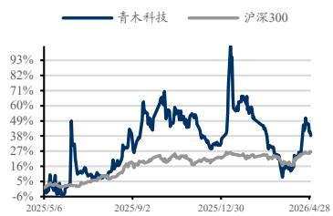

青木科技（301110）

# 2025 年报及 2026 一季报点评：26Q1 业绩落于预告上沿，品牌孵化高增驱动增长

增持（维持）

<table><tr><td>盈利预测与估值</td><td>2024A</td><td>2025A</td><td>2026E</td><td>2027E</td><td>2028E</td></tr><tr><td>营业总收入（百万元）</td><td>1,153</td><td>1,415</td><td>1,770</td><td>2,171</td><td>2,630</td></tr><tr><td>同比（%）</td><td>19.20</td><td>22.69</td><td>25.11</td><td>22.65</td><td>21.16</td></tr><tr><td>归母净利润（百万元）</td><td>90.54</td><td>123.04</td><td>196.63</td><td>264.01</td><td>353.28</td></tr><tr><td>同比（%）</td><td>73.84</td><td>35.90</td><td>59.81</td><td>34.27</td><td>33.81</td></tr><tr><td>EPS-最新摊薄（元/股）</td><td>0.98</td><td>1.33</td><td>2.12</td><td>2.85</td><td>3.82</td></tr><tr><td>P/E（现价&amp;最新摊薄）</td><td>70.03</td><td>51.53</td><td>32.25</td><td>24.02</td><td>17.95</td></tr></table>

## [Table\_S投资要点

公司公布2025年 2026Q1业绩：品牌孵化+代运营双驱动。2025全年公司营收 14.15 亿元（+22.7%，表同比，下同），归母净利润 1.23 亿元（+35.9%），扣非归母净利润 1.09 亿元（+39.6%）。25Q4 单季度营收 3.94亿元（+14.2%），归母净利润 4343 万元（+137.2%），扣非归母净利润3430 万元（+120.0%）。26Q1 营收 3.43 亿元（+25.1%），归母净利润 4212万元（+320.5%），扣非归母净利润 2982 万元（+250.6%），非经中约 1230万为联营企业源美生物核算方法从长期股权变更为其他权益工具投资。

分业务：品牌孵化业务高增，代运营盈利能力改善。①品牌孵化与管理：2025 年收入 4.74 亿元（+54.7%），占比提升至 33.5%（+6.9pct），毛利率79.4%，为最高毛利率业务板块。珂蔓朵+意卡莉+体绪三大品牌共同驱动，品牌孵化从“第二曲线”加速向核心引擎升级。②代运营服务：收入 6.34 亿元（+12.3%），毛利率 44.6%（+3.7pct），受益于阿里流量回暖+退货率改善+AI工具赋能运营效率提升。③经销代理：收入 1.94亿元（+15.8%），毛利率37.6%（+9.0pct），产品结构优化带动毛利率显著提升。

盈利能力：25年毛利率提升 5pct，26Q1费效优化显著。①毛利率：2025全年55.3%（+5.1pct），品牌孵化高毛利率业务占比提升拉动整体；26Q1毛利率 54.7%（vs 25Q1 52.3%），同比+2.4pct。②期间费用率：2025 全年销售费用率 29.5%（+5.3pct），主因品牌孵化业务市场推广费及平台费增加；26Q1 期间费用率 43.7%（vs 25Q1 48.0%），同比下降 4.3pct，管理费用率 10.1%（-4.7pct），费效优化明显。③归母净利率：2025 全年归母净利率 8.7%（+0.9pct）；26Q1 归母净利率 12.3%（+8.6pct），盈利能力大幅提升。

盈利预测与投资评级：青木科技布局多元电商服务业态，代运营纵向守住大服饰品牌头部地位、加深优质品牌合作，横向布局潮玩行业，挖掘代运营品类盈利新增量。同时品牌孵化业务卡位大健康及宠物食品小而美赛道，高增可期。考虑到公司品牌孵化业务爬坡较好，电商代运营业务协同发力，以及收购 Noromega 贡献的业绩增量，我们将公司 2026-2027 年归母净利润预测由 1.9/2.6 亿元小幅提升至 2.0/2.6 亿元，新增2028 年归母净利预测 3.5 亿元，同比分别+60%/+34%/+34%，对应 26/4/29收盘价PE 为32/24/18X，维持“增持”评级。

◼ 风险提示：品牌商合作风险、宏观经济环境波动风险、行业竞争加剧等。

2026 年 05 月 01 日

证券分析师 吴劲草

执业证书：S0600520090006

wujc@dwzq.com.cn

证券分析师 郗越

执业证书：S0600524080008

xiy@dwzq.com.cn

股价走势  

市场数据
<table><tr><td colspan="2">收盘价(元) 67.28</td></tr><tr><td>一年最低/最高价</td><td>45.60/105.90</td></tr><tr><td>市净率(倍)</td><td>4.04</td></tr><tr><td>流通A股市值(百万元)</td><td>4,397.86</td></tr><tr><td>总市值(百万元)</td><td>6,225.78</td></tr></table>

基础数据
<table><tr><td>每股净资产(元,LF)</td><td>16.65</td></tr><tr><td>资产负债率(%,LF)</td><td>16.46</td></tr><tr><td>总股本(百万股)</td><td>92.54</td></tr><tr><td>流通A股(百万股)</td><td>65.37</td></tr></table>

## 相关研究

《青木科技(301110)：2025 年三季报点评：AI 赋能代运营主业，自有品牌持续高增》

2025-10-27

《青木科技(301110)：2025 年半年报点评：25H1 营收同比+22.8%，自有品牌近翻倍增长》

2025-08-30

青木科技三大财务预测表
<table><tr><td>资产负债表(百万元)</td><td>2025A</td><td>2026E</td><td>2027E</td><td>2028E</td></tr><tr><td>流动资产</td><td>1,358</td><td>1,518</td><td>1,786</td><td>2.090</td></tr><tr><td>货币资金及交易性金融资产</td><td>887</td><td>1,035</td><td>1,214</td><td>1,425</td></tr><tr><td>经营性应收款项</td><td>303</td><td>296</td><td>359</td><td>427</td></tr><tr><td>存货</td><td>101</td><td>113</td><td>129</td><td>145</td></tr><tr><td>合同资产</td><td>0</td><td>0</td><td>0</td><td>0</td></tr><tr><td>其他流动资产</td><td>68</td><td>74</td><td>84</td><td>93</td></tr><tr><td>非流动资产</td><td>506</td><td>467</td><td>428</td><td>388</td></tr><tr><td>长期股权投资</td><td>46</td><td>46</td><td>46</td><td>46</td></tr><tr><td>固定资产及使用权资产</td><td>334</td><td>300</td><td>266</td><td>231</td></tr><tr><td>在建工程</td><td>0</td><td>0</td><td>0</td><td>0</td></tr><tr><td>无形资产</td><td>47</td><td>43</td><td>38</td><td>34</td></tr><tr><td>商誉</td><td>5</td><td>5</td><td>5</td><td>5</td></tr><tr><td>长期待摊费用</td><td>27</td><td>27</td><td>27</td><td>27</td></tr><tr><td>其他非流动资产</td><td>46</td><td>45</td><td>45</td><td>45</td></tr><tr><td>资产总计</td><td>1,865</td><td>1,984</td><td>2.214</td><td>2.,479</td></tr><tr><td>流动负债</td><td>273</td><td>260</td><td>308</td><td>329</td></tr><tr><td>短期借款及一年内到期的非流动负债</td><td>57</td><td>51</td><td>51</td><td>51</td></tr><tr><td>经营性应付款项</td><td>77</td><td>82</td><td>111</td><td>110</td></tr><tr><td>合同负债</td><td>5</td><td>9</td><td>8</td><td>12</td></tr><tr><td>其他流动负债</td><td>135</td><td>118</td><td>138</td><td>156</td></tr><tr><td>非流动负债</td><td>69</td><td>68</td><td>68</td><td>68</td></tr><tr><td>长期借款</td><td>0</td><td>0</td><td>0</td><td>0</td></tr><tr><td>应付债券</td><td>0</td><td>0</td><td>0</td><td>0</td></tr><tr><td>租赁负债</td><td>64</td><td>64</td><td>64</td><td>64</td></tr><tr><td>其他非流动负债</td><td>5</td><td>4</td><td>4</td><td>4</td></tr><tr><td>负债合计</td><td>342</td><td>328</td><td>375</td><td>396</td></tr><tr><td>归属母公司股东权益</td><td>1,502</td><td>1,638</td><td>1,823</td><td>2,070</td></tr><tr><td>少数股东权益</td><td>20</td><td>18</td><td>16</td><td>12</td></tr><tr><td>所有者权益合计</td><td>1,523</td><td>1,657</td><td>1,839</td><td>2,082</td></tr><tr><td>负债和股东权益</td><td>1,865</td><td>1,984</td><td>2,214</td><td>2.479</td></tr></table>

<table><tr><td>利润表(百万元)</td><td>2025A</td><td>2026E</td><td>2027E</td><td>2028E</td></tr><tr><td>营业总收入</td><td>1,415</td><td>1,770</td><td>2,171</td><td>2,630</td></tr><tr><td>营业成本(含金融类)</td><td>633</td><td>744</td><td>857</td><td>972</td></tr><tr><td>税金及附加</td><td>7</td><td>7</td><td>10</td><td>12</td></tr><tr><td>销售费用</td><td>417</td><td>549</td><td>706</td><td>894</td></tr><tr><td>管理费用</td><td>191</td><td>230</td><td>282</td><td>342</td></tr><tr><td>研发费用</td><td>47</td><td>53</td><td>59</td><td>66</td></tr><tr><td>财务费用</td><td>3</td><td>(13)</td><td>(17)</td><td>(23)</td></tr><tr><td>加:其他收益</td><td>3</td><td>4</td><td>4</td><td>5</td></tr><tr><td>投资净收益</td><td>10</td><td>35</td><td>43</td><td>53</td></tr><tr><td>公允价值变动</td><td>0</td><td>0</td><td>0</td><td>0</td></tr><tr><td>减值损失</td><td>(3)</td><td>(3)</td><td>(3)</td><td>(3)</td></tr><tr><td>资产处置收益</td><td>1</td><td>0</td><td>0</td><td>0</td></tr><tr><td>营业利润</td><td>129</td><td>235</td><td>320</td><td>422</td></tr><tr><td>营业外净收支</td><td>14</td><td>(1)</td><td>(1)</td><td>(1)</td></tr><tr><td>利润总额</td><td>142</td><td>235</td><td>319</td><td>421</td></tr><tr><td>减：所得税</td><td>24</td><td>40</td><td>57</td><td>72</td></tr><tr><td>净利润</td><td>119</td><td>195</td><td>261</td><td>350</td></tr><tr><td>减:少数股东损益</td><td>(4)</td><td>(2)</td><td>(3)</td><td>(3)</td></tr><tr><td>归属母公司净利润</td><td>123</td><td>197</td><td>264</td><td>353</td></tr><tr><td>每股收益-最新股本摊薄(元)</td><td>1.33</td><td>2.12</td><td>2.85</td><td>3.82</td></tr><tr><td>EBIT</td><td>120</td><td>222</td><td>302</td><td>399</td></tr><tr><td>EBITDA</td><td>171</td><td>266</td><td>347</td><td>444</td></tr><tr><td>毛利率(%)</td><td>55.27</td><td>57.95</td><td>60.52</td><td>63.07</td></tr><tr><td>归母净利率(%)</td><td>8.70</td><td>11.11</td><td>12.16</td><td>13.43</td></tr><tr><td>收入增长率(%)</td><td>22.69</td><td>25.11</td><td>22.65</td><td>21.16</td></tr><tr><td>归母净利润增长率(%)</td><td>35.90</td><td>59.81</td><td>34.27</td><td>33.81</td></tr></table>

<table><tr><td>现金流量表(百万元）</td><td>2025A</td><td>2026E</td><td>2027E</td><td>2028E</td></tr><tr><td>经营活动现金流</td><td>130</td><td>192</td><td>227</td><td>276</td></tr><tr><td>投资活动现金流</td><td>(88)</td><td>28</td><td>37</td><td>46</td></tr><tr><td>筹资活动现金流</td><td>(16)</td><td>(70)</td><td>(84)</td><td>(111)</td></tr><tr><td>现金净增加额</td><td>23</td><td>148</td><td>179</td><td>210</td></tr><tr><td>折旧和摊销</td><td>51</td><td>44</td><td>45</td><td>45</td></tr><tr><td>资本开支</td><td>(103)</td><td>(7)</td><td>(7)</td><td>(7)</td></tr><tr><td>营运资本变动</td><td>(37)</td><td>(21)</td><td>(45)</td><td>(76)</td></tr></table>

数据来源:Wind,东吴证券研究所，全文如无特殊注明，相关数据的货币单位均为人民币，预测均为东吴证券研究所预测。

<table><tr><td>重要财务与估值指标</td><td>2025A</td><td>2026E</td><td>2027E</td><td>2028E</td></tr><tr><td>每股净资产(元)</td><td>16.24</td><td>17.70</td><td>19.70</td><td>22.37</td></tr><tr><td>最新发行在外股份（百万股）</td><td>93</td><td>93</td><td>93</td><td>93</td></tr><tr><td>ROIC(%)</td><td>6.30</td><td>10.78</td><td>13.28</td><td>15.95</td></tr><tr><td>ROE-摊薄(%)</td><td>8.19</td><td>12.00</td><td>14.48</td><td>17.07</td></tr><tr><td>资产负债率(%)</td><td>18.33</td><td>16.51</td><td>16.96</td><td>15.99</td></tr><tr><td>P/E（现价&amp;最新股本摊薄）</td><td>51.53</td><td>32.25</td><td>24.02</td><td>17.95</td></tr><tr><td>P/B（现价）</td><td>4.22</td><td>3.87</td><td>3.48</td><td>3.06</td></tr></table>

## 免责声明

东吴证券股份有限公司经中国证券监督管理委员会批准，已具备证券投资咨询业务资格。

本研究报告仅供东吴证券股份有限公司（以下简称“本公司”）的客户使用。本公司不会因接收人收到本报告而视其为客户。在任何情况下，本报告中的信息或所表述的意见并不构成对任何人的投资建议，本公司及作者不对任何人因使用本报告中的内容所导致的任何后果负任何责任。任何形式的分享证券投资收益或者分担证券投资损失的书面或口头承诺均为无效。

在法律许可的情况下，东吴证券及其所属关联机构可能会持有报告中提到的公司所发行的证券并进行交易，还可能为这些公司提供投资银行服务或其他服务。

市场有风险，投资需谨慎。本报告是基于本公司分析师认为可靠且已公开的信息，本公司力求但不保证这些信息的准确性和完整性，也不保证文中观点或陈述不会发生任何变更，在不同时期，本公司可发出与本报告所载资料、意见及推测不一致的报告。

本报告的版权归本公司所有，未经书面许可，任何机构和个人不得以任何形式翻版、复制和发布。经授权刊载、转发本报告或者摘要的，应当注明出处为东吴证券研究所，并注明本报告发布人和发布日期，提示使用本报告的风险，且不得对本报告进行有悖原意的引用、删节和修改。未经授权或未按要求刊载、转发本报告的，应当承担相应的法律责任。本公司将保留向其追究法律责任的权利。

## 东吴证券投资评级标准

投资评级基于分析师对报告发布日后 6 至 12 个月内行业或公司回报潜力相对基准表现的预期（A 股市场基准为沪深 300 指数，香港市场基准为恒生指数，美国市场基准为标普500 指数，新三板基准指数为三板成指（针对协议转让标的）或三板做市指数（针对做市转让标的），北交所基准指数为北证 50指数），具体如下：

公司投资评级：

买入：预期未来 6 个月个股涨跌幅相对基准在 15%以上；

增持：预期未来 6个月个股涨跌幅相对基准介于5%与15%之间；

中性：预期未来 6个月个股涨跌幅相对基准介于-5%与 5%之间；

减持：预期未来 6 个月个股涨跌幅相对基准介于-15%与-5%之间；

卖出：预期未来 6 个月个股涨跌幅相对基准在-15%以下。

行业投资评级：

增持： 预期未来 6 个月内，行业指数相对强于基准 5%以上；

中性： 预期未来 6个月内，行业指数相对基准-5%与5%；

减持： 预期未来 6 个月内，行业指数相对弱于基准 5%以上。

我们在此提醒您，不同证券研究机构采用不同的评级术语及评级标准。我们采用的是相对评级体系，表示投资的相对比重建议。投资者买入或者卖出证券的决定应当充分考虑自身特定状况，如具体投资目的、财务状况以及特定需求等，并完整理解和使用本报告内容，不应视本报告为做出投资决策的唯一因素。

