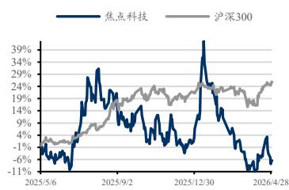

焦点科技（002315）

# 2026年一季报业绩点评：付费会员持续增长，未来 AI 持续变现可期

买入（维持）

<table><tr><td>盈利预测与估值</td><td>2024A</td><td>2025A</td><td>2026E</td><td>2027E</td><td>2028E</td></tr><tr><td>营业总收入（百万元）</td><td>1,669</td><td>1,921</td><td>2,260</td><td>2,668</td><td>3,157</td></tr><tr><td>同比（%）</td><td>9.32</td><td>15.12</td><td>17.65</td><td>18.04</td><td>18.32</td></tr><tr><td>归母净利润（百万元）</td><td>451.19</td><td>503.58</td><td>644.53</td><td>831.32</td><td>995.78</td></tr><tr><td>同比（%）</td><td>19.09</td><td>11.61</td><td>27.99</td><td>28.98</td><td>19.78</td></tr><tr><td>EPS-最新摊薄（元/股）</td><td>1.42</td><td>1.59</td><td>2.03</td><td>2.62</td><td>3.14</td></tr><tr><td>P/E（现价&amp;最新摊薄）</td><td>21.40</td><td>19.18</td><td>14.98</td><td>11.62</td><td>9.70</td></tr></table>

## 投资要点

事件：2026Q1公司单季度实现营业收入 5.11亿元，同比增长 15.81%；归母净利润 0.98亿元，同比下降 12.53%；扣非净利润 0.96亿元，同比下降 11.96%。

股权激励费用短期扰动表观利润，剔除后主业盈利仍保持稳健增长：2026Q1 公司归母净利润和扣非净利润表观同比下滑，主要受到股份支付费用及职工薪酬增加影响。若剔除本期 3,561.26万元股份支付费用，公司归母净利润同比增长 12.98%，扣非净利润同比增长 14.25%，真实盈利增速显著高于表观。本期利润端压力更多来自股权激励费用、人员投入及成本端阶段性扰动，公司主业盈利能力并未发生明显弱化。随着收入规模持续增长、股份支付费用影响逐步被消化，公司未来业绩有望持续回升。

中国制造网会员突破三万，现金回款短期承压：截至 2026 年 3 月末，中国制造网收费会员数达到 30,294位，较去年同期增加 2,176位，同比增长约 7.7%；较2025年末增加 501位，付费商户规模继续稳步扩张，核心主业仍保持较好的增长韧性。考虑到公司收入端仍保持双位数增长，中国制造网收费会员数继续提升，卖家端客户基础保持稳固，未来主业预计将保持稳健增长趋势。

AI 麦可会员数持续增长，产品渗透率进一步提升：截至 2026 年 3 月末，AI 麦可付费会员数达到 12,766位，累计购买 AI 麦可的会员数达到 20,466 位，较 2025 年末的 18,494 位增加 1,972 位，增长约 10.7%。若以中国制造网收费会员数为基数测算，26Q1 AI 麦可累计购买会员渗透率约为 67.6%，较 2025 年末的 62.1%提升约 5.5 个百分点，公司 AI产品在卖家端的覆盖度和商业化渗透率仍在持续上行。

盈利预测与投资评级：由于公司整体经营情况稳健，各项业务持续推进，因此我们维持公司 2026-2028 年的归母净利润盈利预测为 6.45/8.31/9.96亿元，2026-2028 年现价对应 PE 为 14.98/11.62/9.70 倍。我们认为公司是被低估的数字经济平台龙头，有望受益于“科技赋能+SaaS 模式+政策利好”三大优势，迎来加速增长，维持“买入”评级。

风险提示：市场需求波动和国际贸易环境变化；跨境经营和交易监管风险；数据安全与隐私保护风险；AI业务发展不达预期的风险

2026 年 05 月 03 日

证券分析师 张良卫

执业证书：S0600516070001

021-60199793

zhanglw@dwzq.com.cn

证券分析师 张家琦

执业证书：S0600521070001

zhangjiaqi@dwzq.com.cn

证券分析师 戴晨

执业证书：S0600524050002

daichen@dwzq.com.cn

股价走势  

市场数据
<table><tr><td>收盘价(元)</td><td>30.44</td></tr><tr><td>一年最低/最高价</td><td>29.80/63.47</td></tr><tr><td>市净率(倍)</td><td>3.36</td></tr><tr><td>流通A股市值(百万元)</td><td>8,003.08</td></tr><tr><td>总市值(百万元)</td><td>12,553.66</td></tr></table>

基础数据
<table><tr><td>每股净资产(元,LF)</td><td>9.07</td></tr><tr><td>资产负债率(%,LF)</td><td>38.93</td></tr><tr><td>总股本(百万股)</td><td>412.41</td></tr><tr><td>流通A股(百万股)</td><td>262.91</td></tr></table>

## 相关研究

《焦点科技(002315)：2025 年年报业绩点评：主业延续高质量增长，AI 商业化打开未来业绩空间》

2026-03-30

《焦点科技(002315)：2025 年三季报业绩点评：股权激励费用影响业绩释放，未来业绩有望持续回升》

2025-10-30

焦点科技三大财务预测表
<table><tr><td>资产负债表(百万元)</td><td>2025A</td><td>2026E</td><td>2027E</td><td>2028E</td></tr><tr><td>流动资产</td><td>2,700</td><td>2,084</td><td>2.910</td><td>4,004</td></tr><tr><td>货币资金及交易性金融资产</td><td>2,450</td><td>1,749</td><td>2.551</td><td>3,614</td></tr><tr><td>经营性应收款项</td><td>46</td><td>60</td><td>69</td><td>82</td></tr><tr><td>存货</td><td>4</td><td>19</td><td>21</td><td>25</td></tr><tr><td>合同资产</td><td>0</td><td>0</td><td>0</td><td>0</td></tr><tr><td>其他流动资产</td><td>200</td><td>256</td><td>269</td><td>284</td></tr><tr><td>非流动资产</td><td>2,118</td><td>2,175</td><td>2,174</td><td>2,162</td></tr><tr><td>长期股权投资</td><td>59</td><td>59</td><td>64</td><td>69</td></tr><tr><td>固定资产及使用权资产</td><td>417</td><td>454</td><td>445</td><td>426</td></tr><tr><td>在建工程</td><td>0</td><td>0</td><td>0</td><td>0</td></tr><tr><td>无形资产</td><td>33</td><td>48</td><td>63</td><td>78</td></tr><tr><td>商誉</td><td>0</td><td>0</td><td>0</td><td>0</td></tr><tr><td>长期待摊费用</td><td>1</td><td>1</td><td>1</td><td>1</td></tr><tr><td>其他非流动资产</td><td>1,608</td><td>1,613</td><td>1,601</td><td>1,588</td></tr><tr><td>资产总计</td><td>4,818</td><td>4,260</td><td>5,084</td><td>6,167</td></tr><tr><td>流动负债</td><td>1,724</td><td>483</td><td>474</td><td>560</td></tr><tr><td>短期借款及一年内到期的非流动负债</td><td>10</td><td>10</td><td>10</td><td>10</td></tr><tr><td>经营性应付款项</td><td>77</td><td>231</td><td>239</td><td>285</td></tr><tr><td>合同负债</td><td>1,361</td><td>0</td><td>0</td><td>0</td></tr><tr><td>其他流动负债</td><td>276</td><td>242</td><td>226</td><td>265</td></tr><tr><td>非流动负债</td><td>324</td><td>364</td><td>364</td><td>364</td></tr><tr><td>长期借款</td><td>0</td><td>0</td><td>0</td><td>0</td></tr><tr><td>应付债券</td><td>0</td><td>0</td><td>0</td><td>0</td></tr><tr><td>租赁负债</td><td>5</td><td>45</td><td>45</td><td>45</td></tr><tr><td>其他非流动负债</td><td>319</td><td>319</td><td>319</td><td>319</td></tr><tr><td>负债合计</td><td>2,049</td><td>847</td><td>839</td><td>925</td></tr><tr><td>归属母公司股东权益</td><td>2,741</td><td>3,384</td><td>4,216</td><td>5,212</td></tr><tr><td>少数股东权益</td><td>28</td><td>28</td><td>30</td><td>30</td></tr><tr><td>所有者权益合计</td><td>2,769</td><td>3,413</td><td>4,245</td><td>5,242</td></tr><tr><td>负债和股东权益</td><td>4,818</td><td>4,260</td><td>5.084</td><td>6,167</td></tr></table>

<table><tr><td>利润表(百万元)</td><td>2025A</td><td>2026E</td><td>2027E</td><td>2028E</td></tr><tr><td>营业总收入</td><td>1,921</td><td>2,260</td><td>2,668</td><td>3,157</td></tr><tr><td>营业成本(含金融类)</td><td>396</td><td>438</td><td>469</td><td>554</td></tr><tr><td>税金及附加</td><td>14</td><td>16</td><td>19</td><td>22</td></tr><tr><td>销售费用</td><td>687</td><td>816</td><td>907</td><td>1,042</td></tr><tr><td>管理费用</td><td>169</td><td>212</td><td>251</td><td>297</td></tr><tr><td>研发费用</td><td>181</td><td>203</td><td>240</td><td>284</td></tr><tr><td>财务费用</td><td>(51)</td><td>(46)</td><td>(32)</td><td>(50)</td></tr><tr><td>加:其他收益</td><td>12</td><td>38</td><td>39</td><td>30</td></tr><tr><td>投资净收益</td><td>19</td><td>32</td><td>37</td><td>30</td></tr><tr><td>公允价值变动</td><td>3</td><td>0</td><td>0</td><td>0</td></tr><tr><td>减值损失</td><td>0</td><td>0</td><td>0</td><td>0</td></tr><tr><td>资产处置收益</td><td>0</td><td>0</td><td>0</td><td>0</td></tr><tr><td>营业利润</td><td>559</td><td>690</td><td>891</td><td>1,068</td></tr><tr><td>营业外净收支</td><td>(6)</td><td>11</td><td>12</td><td>12</td></tr><tr><td>利润总额</td><td>553</td><td>701</td><td>903</td><td>1,080</td></tr><tr><td>减：所得税</td><td>48</td><td>56</td><td>70</td><td>83</td></tr><tr><td>净利润</td><td>505</td><td>645</td><td>833</td><td>997</td></tr><tr><td>减:少数股东损益</td><td>1</td><td>0</td><td>1</td><td>1</td></tr><tr><td>归属母公司净利润</td><td>504</td><td>645</td><td>831</td><td>996</td></tr><tr><td>每股收益-最新股本摊薄(元)</td><td>1.59</td><td>2.03</td><td>2.62</td><td>3.14</td></tr><tr><td>EBIT</td><td>486</td><td>655</td><td>871</td><td>1,030</td></tr><tr><td>EBITDA</td><td>547</td><td>786</td><td>1,047</td><td>1,216</td></tr><tr><td>毛利率(%)</td><td>79.30</td><td>80.64</td><td>82.44</td><td>82.45</td></tr><tr><td>归母净利率(%)</td><td>26.32</td><td>28.52</td><td>31.16</td><td>31.54</td></tr><tr><td>收入增长率(%)</td><td>15.12</td><td>17.65</td><td>18.04</td><td>18.32</td></tr><tr><td></td><td>11.61</td><td>27.99</td><td></td><td></td></tr><tr><td>归母净利润增长率(%)</td><td></td><td></td><td>28.98</td><td>19.78</td></tr></table>

<table><tr><td>现金流量表(百万元）</td><td>2025A</td><td>2026E</td><td>2027E</td><td>2028E</td></tr><tr><td>经营活动现金流</td><td>888</td><td>(594)</td><td>929</td><td>1,196</td></tr><tr><td>投资活动现金流</td><td>(377)</td><td>(146)</td><td>(26)</td><td>(33)</td></tr><tr><td>筹资活动现金流</td><td>(386)</td><td>40</td><td>0</td><td>0</td></tr><tr><td>现金净增加额</td><td>124</td><td>(701)</td><td>902</td><td>1,163</td></tr><tr><td>折旧和摊销</td><td>61</td><td>131</td><td>176</td><td>186</td></tr><tr><td>资本开支</td><td>(8)</td><td>(149)</td><td>(148)</td><td>(148)</td></tr><tr><td>营运资本变动</td><td>346</td><td>(1,328)</td><td>(32)</td><td>55</td></tr></table>

数据来源:Wind,东吴证券研究所，全文如无特殊注明，相关数据的货币单位均为人民币，预测均为东吴证券研究所预测。

<table><tr><td>重要财务与估值指标</td><td>2025A</td><td>2026E</td><td>2027E</td><td>2028E</td></tr><tr><td>每股净资产(元)</td><td>8.64</td><td>10.67</td><td>13.29</td><td>16.43</td></tr><tr><td>最新发行在外股份（百万股）</td><td>317</td><td>317</td><td>317</td><td>317</td></tr><tr><td>ROIC(%)</td><td>16.60</td><td>19.27</td><td>20.68</td><td>19.81</td></tr><tr><td>ROE-摊薄(%)</td><td>18.37</td><td>19.04</td><td>19.72</td><td>19.11</td></tr><tr><td>资产负债率(%)</td><td>42.52</td><td>19.88</td><td>16.50</td><td>14.99</td></tr><tr><td>P/E（现价&amp;最新股本摊薄）</td><td>19.18</td><td>14.98</td><td>11.62</td><td>9.70</td></tr><tr><td>P/B（现价）</td><td>3.52</td><td>2.85</td><td>2.29</td><td>1.85</td></tr></table>

## 免责声明

东吴证券股份有限公司经中国证券监督管理委员会批准，已具备证券投资咨询业务资格。

会因接收人收到本报告而视其为客户。在任何情况下，本报告中的信息或所表述的意见并不构成对任何人的投资建议，本公司及作者不对任何人因使用本报告中的内容所导致的任何后果负任何责任。任何形式的分享证券投资收益或者分担证券投资损失的书面或口头承诺均为无效。

在法律许可的情况下，东吴证券及其所属关联机构可能会持有报告中提到的公司所发行的证券并进行交易，还可能为这些公司提供投资银行服务或其他服务。

市场有风险，投资需谨慎。本报告是基于本公司分析师认为可靠且已公开的信息，本公司力求但不保证这些信息的准确性和完整性，也不保证文中观点或陈述不会发生任何变更，在不同时期，本公司可发出与本报告所载资料、意见及推测不一致的报告。

本报告的版权归本公司所有，未经书面许可，任何机构和个人不得以任何形式翻版、复制和发布。经授权刊载、转发本报告或者摘要的，应当注明出处为东吴证券研究所，并注明本报告发布人和发布日期，提示使用本报告的风险，且不得对本报告进行有悖原意的引用、删节和修改。未经授权或未按要求刊载、转发本报告的，应当承担相应的法律责任。本公司将保留向其追究法律责任的权利。

## 东吴证券投资评级标准

投资评级基于分析师对报告发布日后 6 至 12 个月内行业或公司回报潜力相对基准表现的预期（A 股市场基准为沪深 300 指数，香港市场基准为恒生指数，美国市场基准为标普500 指数，新三板基准指数为三板成指（针对协议转让标的）或三板做市指数（针对做市转让标的），北交所基准指数为北证 50指数），具体如下：

公司投资评级：

买入：预期未来 6 个月个股涨跌幅相对基准在 15%以上；

增持：预期未来 6个月个股涨跌幅相对基准介于5%与15%之间；

中性：预期未来 6个月个股涨跌幅相对基准介于-5%与 5%之间；

减持：预期未来 6 个月个股涨跌幅相对基准介于-15%与-5%之间；

卖出：预期未来 6 个月个股涨跌幅相对基准在-15%以下。

行业投资评级：

增持： 预期未来 6 个月内，行业指数相对强于基准 5%以上；

中性： 预期未来 6个月内，行业指数相对基准-5%与5%；

减持： 预期未来 6 个月内，行业指数相对弱于基准 5%以上。

我们在此提醒您，不同证券研究机构采用不同的评级术语及评级标准。我们采用的是相对评级体系，表示投资的相对比重建议。投资者买入或者卖出证券的决定应当充分考虑自身特定状况，如具体投资目的、财务状况以及特定需求等，并完整理解和使用本报告内容，不应视本报告为做出投资决策的唯一因素。

