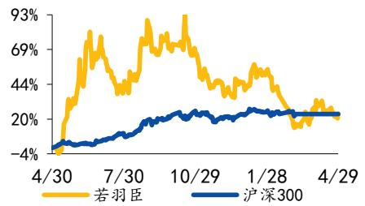

# [Table\_Title] 26Q1 营收利润增长超预期，收购奥伦纳素打开全球化空间

买入|维持

# 若羽臣(003010)2026 年一季报点评

[Table\_事件：

公司发布 2026 年一季报。

## 点评：

##  26Q1营收利润增长超预期，毛利率环比持续优化

26Q1 公司实现营业收入 9.95 亿元，同比+73.34%；归母净利润 7233.37万元，同比+163.78%。毛利率 64.66%，环比+2.69pct，同比+10.72pct。费用率方面，26Q1公司加大推广及研发投入，管理规模效应凸显。销售/管理/研发费用率分别为 53.16%/1.70%/0.89%，环比+6.62/-1.56/+0.15pct，同比分别+7.27/-1.21/-0.23pct。毛销差为 11.5%，同比+3.45pct。

 自有品牌势能持续推高，收购高端护肤品牌奥伦纳素打开全球化空间26Q1高端家清品牌绽家宣首位全球代言人成毅，合作推广香水油洗衣凝珠系列，持续推高品牌势能。官宣 1小时成交1680 万+，24小时全渠道销售额4140万，GMV 环比增长1233%，登顶天猫家清、抖音家清类目TOP1。口服美容品牌斐萃上市新品雌马酚胶囊小粉瓶，核心产品NAD+鎏金瓶、抗衰小紫瓶表现亮眼，合作屈臣氏开展多城线下联动，年内有望逐步上线全国的 1000 家屈臣氏门店。4 月 11 日公司公告收购美国高端护肤品牌奥伦纳素美国运营主体、中国运营实体及其下属公司 100%股权，交易定价为4382万美元（合人民币 2.99 亿元）。2025 年标的公司整体实现收入 5996 万美元，净利润-333万美元。奥伦纳素于 1927年由匈牙利皮肤学专家奥伦纳素博士创立，定位高端护肤，品牌资产优质，旗下主要产品包括“冰白面膜”“豆腐霜”“方罐油霜”“PH3 系列”等。公司通过收购补齐高端美妆空白，扩充自有品牌矩阵，有望复用绽家、斐萃成功运营经验赋能收购品牌焕新。

##  投资建议与盈利预测

公司多年深耕消费品牌数字化管理，凭借精准消费洞察和爆品转化能力孵化自有品牌。绽家多品类全渠道拓展，斐萃表现超预期。考虑到公司海外并购首单落地打开增长空间，我们调整盈利预测，预计公司 2026-2028 年归母净利润分别为 3.99/5.75/7.90 亿元，EPS 分别为 1.28/1.85/2.54 元，对应 PE 分别为 24.19/16.78/12.22，维持“买入”评级。

##  风险提示

行业竞争加剧的风险，品牌拓展不及预期的风险

[Table\_Finance] 附表：盈利预测
<table><tr><td>财务数据和估值</td><td>2024A</td><td>2025A</td><td>2026E</td><td>2027E</td><td>2028E</td></tr><tr><td>营业收入(百万元)</td><td>1765.78</td><td>3431.78</td><td>5932.01</td><td>7953.46</td><td>9736.75</td></tr><tr><td>收入同比(%)</td><td>29.26</td><td>94.35</td><td>72.86</td><td>34.08</td><td>22.42</td></tr><tr><td>归母净利润(百万元)</td><td>105.64</td><td>194.40</td><td>398.96</td><td>575.33</td><td>789.70</td></tr><tr><td>归母净利润同比(%)</td><td>94.58</td><td>84.03</td><td>105.22</td><td>44.21</td><td>37.26</td></tr><tr><td>ROE(%)</td><td>9.57</td><td>27.03</td><td>32.59</td><td>31.96</td><td>30.50</td></tr><tr><td>每股收益(元)</td><td>0.34</td><td>0.62</td><td>1.28</td><td>1.85</td><td>2.54</td></tr><tr><td>市盈率(P/E)</td><td>91.37</td><td>49.65</td><td>24.19</td><td>16.78</td><td>12.22</td></tr></table>

资料来源：iFind，国元证券研究所

## [Table\_Ba基本数据

52 周最高/最低价（元）：79.21 / 28.4

A股流通股（百万股）： 226.14

A股总股本（百万股）： 311.06

流通市值（百万元）： 6985.53

总市值（百万元）： 9608.63

## [Table\_ 过去一年股价走势 PicQuote]

  
资料来源：iFind

## [Table\_ 相关研究报告 DocRep

《国元证券公司研究-若羽臣（003010） 2025年年报点评：25 年营收净利同比高增，自有品牌势能强劲》2026.03.26

《国元证券行业研究-商社美护行业周报：政府工作报告加码促内需，证监会支持新型消费、现代服务业企业创业板上市》2026.03.10

## [Table\_ 报告作者Au

分析师 李典

执业证书编号 S0020516080001

电话 021-51097188-1866

邮箱 lidian@gyzq.com.cn

分析师 徐梓童

执业证书编号 S0020525080002

电话 021-51097188

邮箱 xuzitong@gyzq.com.cn

<table><tr><td colspan="5">资产负债表</td></tr><tr><td>会计年度</td><td>2024A</td><td>2025A</td><td>2026E</td><td>2027E</td><td>2028E</td></tr><tr><td>流动资产</td><td>1188.62</td><td>1823.92</td><td>1857.53</td><td>2541.89</td><td>3450.09</td></tr><tr><td>现金</td><td>607.08</td><td>858.90</td><td>646.14</td><td>1011.89</td><td>1633.53</td></tr><tr><td>应收账款</td><td>199.26</td><td>156.94</td><td>271.28</td><td>363.73</td><td>445.28</td></tr><tr><td>其他应收款</td><td>45.02</td><td>57.83</td><td>99.97</td><td>134.03</td><td>164.08</td></tr><tr><td>预付账款</td><td>102.60</td><td>234.34</td><td>370.41</td><td>457.38</td><td>536.79</td></tr><tr><td>存货</td><td>225.71</td><td>461.80</td><td>436.14</td><td>538.54</td><td>632.04</td></tr><tr><td>其他流动资产</td><td>8.95</td><td>54.10</td><td>33.58</td><td>36.32</td><td>38.37</td></tr><tr><td>非流动资产</td><td>362.23</td><td>359.69</td><td>338.52</td><td>335.80</td><td>326.44</td></tr><tr><td>长期投资</td><td>91.50</td><td>67.93</td><td>72.39</td><td>74.09</td><td>72.49</td></tr><tr><td>固定资产</td><td>170.88</td><td>167. 62</td><td>159.07</td><td>150.52</td><td>141.97</td></tr><tr><td>无形资产</td><td>4.93</td><td>3.98</td><td>3.98</td><td>3.98</td><td>3.98</td></tr><tr><td>其他非流动资产</td><td>94.92</td><td>120.16</td><td>103.08</td><td>107.22</td><td>108.00</td></tr><tr><td>资产总计</td><td>1550.85</td><td>2183.61</td><td>2196.04</td><td>2877.70</td><td>3776.53</td></tr><tr><td>流动负债</td><td>406.58</td><td>1108.91</td><td>629.05</td><td>732. 47</td><td>842.19</td></tr><tr><td>短期借款</td><td>274.48</td><td>663.71</td><td>250.77</td><td>281.24</td><td>328.22</td></tr><tr><td>应付账款</td><td>46.99</td><td>176.44</td><td>278.89</td><td>344.37</td><td>404.15</td></tr><tr><td>其他流动负债</td><td>85.10</td><td>268.76</td><td>99.39</td><td>106.86</td><td>109.82</td></tr><tr><td>非流动负债</td><td>40.08</td><td>355.54</td><td>342.70</td><td>345.33</td><td>344.79</td></tr><tr><td>长期借款</td><td>0.00</td><td>315.00</td><td>315.00</td><td>315.00</td><td>315.00</td></tr><tr><td>其他非流动负债</td><td>40.08</td><td>40.54</td><td>27.70</td><td>30.33</td><td>29.79</td></tr><tr><td>负债合计</td><td>446. 66</td><td>1464.45</td><td>971.74</td><td>1077.80</td><td>1186.98</td></tr><tr><td>少数股东权益</td><td>0.00</td><td>0.00</td><td>0.00</td><td>0.00</td><td>0.00</td></tr><tr><td>股本</td><td>164.03</td><td>311.06</td><td>311.06</td><td>311.06</td><td>311.06</td></tr><tr><td>资本公积</td><td>536.16</td><td>116.14</td><td>116.14</td><td>116.14</td><td>116.14</td></tr><tr><td>留存收益</td><td>440.18</td><td>488.61</td><td>794.25</td><td>1369.58</td><td>2159.28</td></tr><tr><td>归属母公司股东权益</td><td>1104.19</td><td>719.16</td><td>1224.30</td><td>1799.89</td><td>2589.55</td></tr><tr><td>负债和股东权益</td><td>1550.85</td><td>2183.61</td><td>2196.04</td><td>2877.70</td><td>3776.53</td></tr></table>

<table><tr><td colspan="6">现金流量表 单位：百万元</td></tr><tr><td>会计年度</td><td>2024A</td><td>2025A</td><td>2026E</td><td>2027E</td><td>2028E</td></tr><tr><td>经营活动现金流</td><td>333.71</td><td>151.80</td><td>141.57</td><td>340.61</td><td>570.99</td></tr><tr><td>净利润</td><td>105.64</td><td>194.40</td><td>398.96</td><td>575.33</td><td>789.70</td></tr><tr><td>折旧摊销</td><td>14.35</td><td>15.98</td><td>8.55</td><td>8.55</td><td>8.55</td></tr><tr><td>财务费用</td><td>-11. 45</td><td>30.05</td><td>24.69</td><td>10.82</td><td>2.30</td></tr><tr><td>投资损失</td><td>-1.77</td><td>-3.57</td><td>-2. 77</td><td>-2.87</td><td>-2.96</td></tr><tr><td>营运资金变动</td><td>168.99</td><td>-78.10</td><td>-307.04</td><td>-258.58</td><td>-233. 65</td></tr><tr><td>其他经营现金流</td><td>57.95</td><td>-6.97</td><td>19.19</td><td>7.36</td><td>7. 04</td></tr><tr><td>投资活动现金流</td><td>-54.83</td><td>16.84</td><td>-3.26</td><td>1.72</td><td>4.50</td></tr><tr><td>资本支出</td><td>14.82</td><td>11.40</td><td>0.00</td><td>0.00</td><td>0.00</td></tr><tr><td>长期投资</td><td>41.05</td><td>-24. 42</td><td>7.14</td><td>0.79</td><td>-1.58</td></tr><tr><td>其他投资现金流</td><td>1.04</td><td>3.82</td><td>3.88</td><td>2.51</td><td>2.92</td></tr><tr><td>筹资活动现金流</td><td>-25.47</td><td>112. 31</td><td>-351.08</td><td>23.43</td><td>46.15</td></tr><tr><td>短期借款</td><td>103.59</td><td>389.23</td><td>-412.94</td><td>30.48</td><td>46.98</td></tr><tr><td>长期借款</td><td>0.00</td><td>315.00</td><td>0.00</td><td>0.00</td><td>0.00</td></tr><tr><td>普通股增加</td><td>41.70</td><td>147.03</td><td>0.00</td><td>0.00</td><td>0.00</td></tr><tr><td>资本公积增加</td><td>-97.93</td><td>-420.02</td><td>0.00</td><td>0.00</td><td>0.00</td></tr><tr><td>其他筹资现金流</td><td>-72.83</td><td>-318.93</td><td>61.86</td><td>-7.05</td><td>-0.83</td></tr><tr><td>现金净增加额</td><td>263.81</td><td>255.84</td><td>-212.77</td><td>365.76</td><td>621.64</td></tr></table>

资料来源：iFind，国元证券研究所

<table><tr><td colspan="6">利润表 单位：百万元</td></tr><tr><td>会计年度</td><td>2024A</td><td>2025A</td><td>2026E</td><td>2027E</td><td>2028E</td></tr><tr><td>营业收入</td><td>1765.78</td><td>3431.78</td><td>5932.01</td><td>7953.46</td><td>9736.75</td></tr><tr><td>营业成本</td><td>978.73</td><td>1379. 64</td><td>2180.71</td><td>2692.70</td><td>3160.19</td></tr><tr><td>营业税金及附加</td><td>7.57</td><td>10.96</td><td>20.76</td><td>28.07</td><td>33.73</td></tr><tr><td>营业费用</td><td>525.85</td><td>1647.49</td><td>3007.53</td><td>4239.19</td><td>5238.37</td></tr><tr><td>管理费用</td><td>98.27</td><td>115.47</td><td>177.96</td><td>238.60</td><td>292.10</td></tr><tr><td>研发费用</td><td>25.74</td><td>32.64</td><td>59.32</td><td>79.53</td><td>97.37</td></tr><tr><td>财务费用</td><td>-11.45</td><td>30.05</td><td>24.69</td><td>10.82</td><td>2.30</td></tr><tr><td>资产减值损失</td><td>-8.06</td><td>-0.97</td><td>-3.40</td><td>-3.37</td><td>-2.98</td></tr><tr><td>公允价值变动收益</td><td>-5.40</td><td>-1.09</td><td>0.00</td><td>0.00</td><td>0.00</td></tr><tr><td>投资净收益</td><td>1.77</td><td>3.57</td><td>2.77</td><td>2.87</td><td>2.96</td></tr><tr><td>营业利润</td><td>130.72</td><td>226.54</td><td>465.05</td><td>669.75</td><td>918.66</td></tr><tr><td>营业外收入</td><td>0.12</td><td>0.95</td><td>0.53</td><td>0.60</td><td>0.63</td></tr><tr><td>营业外支出</td><td>2.76</td><td>1.70</td><td>2.20</td><td>2.13</td><td>2.08</td></tr><tr><td>利润总额</td><td>128.08</td><td>225.79</td><td>463.38</td><td>668.22</td><td>917.21</td></tr><tr><td>所得税</td><td>22.44</td><td>31.39</td><td>64.42</td><td>92.89</td><td>127.51</td></tr><tr><td>净利润</td><td>105.64</td><td>194.40</td><td>398.96</td><td>575.33</td><td>789.70</td></tr><tr><td>少数股东损益</td><td>0.00</td><td>0.00</td><td>0.00</td><td>0.00</td><td>0.00</td></tr><tr><td>归属母公司净利润</td><td>105.64</td><td>194.40</td><td>398.96</td><td>575.33</td><td>789.70</td></tr><tr><td>EBITDA</td><td>133.62</td><td>272.57</td><td>498.29</td><td>689.12</td><td>929.51</td></tr><tr><td>EPS（元）</td><td>0.64</td><td>0.62</td><td>1.28</td><td>1.85</td><td>2.54</td></tr></table>

<table><tr><td>会计年度</td><td></td><td>2025A</td><td>2026E</td><td>2027E</td><td>2028E</td></tr><tr><td>成长能力</td><td>2024A</td><td></td><td></td><td></td><td></td></tr><tr><td>营业收入(%)</td><td>29.26</td><td>94.35</td><td>72.86</td><td>34.08</td><td>22.42</td></tr><tr><td>营业利润(%)</td><td>120.61</td><td>73.31</td><td>105.29</td><td>44.02</td><td>37.16</td></tr><tr><td>归属母公司净利润(%)</td><td></td><td>84.03</td><td>105.22</td><td>44.21</td><td>37.26</td></tr><tr><td>获利能力</td><td>94.58</td><td></td><td></td><td></td><td></td></tr><tr><td>毛利率(%)</td><td>44.57</td><td>59.80</td><td>63.24</td><td>66.14</td><td>67.54</td></tr><tr><td>净利率(%)</td><td>5.98</td><td>5.66</td><td>6.73</td><td>7.23</td><td>8.11</td></tr><tr><td>ROE (%)</td><td></td><td>27.03</td><td>32.59</td><td>31.96</td><td>30.50</td></tr><tr><td>ROIC (%)</td><td>9.57</td><td></td><td></td><td></td><td></td></tr><tr><td>偿债能力</td><td>15.19</td><td>29.57</td><td>40.53</td><td>45.74</td><td>52.94</td></tr><tr><td>资产负债率(%)</td><td></td><td></td><td></td><td>37.45</td><td></td></tr><tr><td>净负债比率(%)</td><td>28.80</td><td>67.07 70.02</td><td>44.25</td><td>58.16</td><td>31.43 56.90</td></tr><tr><td>流动比率</td><td>63.45</td><td></td><td>61.02</td><td>3.47</td><td>4.10</td></tr><tr><td>速动比率</td><td>2.92</td><td>1.64</td><td>2.95</td><td></td><td></td></tr><tr><td>营运能力</td><td>2.37</td><td>1.23</td><td>2.26</td><td>2.74</td><td>3.35</td></tr><tr><td>总资产周转率</td><td></td><td></td><td></td><td></td><td></td></tr><tr><td></td><td>1.22</td><td>1.84</td><td>2.71</td><td>3.14</td><td>2.93</td></tr><tr><td>应收账款周转率</td><td>8.96</td><td>18.07</td><td>26.27</td><td>23.75</td><td>22.82</td></tr><tr><td>应付账款周转率</td><td>29.23</td><td>12.35</td><td>9.58</td><td>8.64</td><td>8.44</td></tr><tr><td>每股指标(元)</td><td></td><td></td><td></td><td></td><td></td></tr><tr><td>每股收益(最新摊薄)</td><td>0.34</td><td>0.62</td><td>1.28</td><td>1.85</td><td>2.54</td></tr><tr><td>每股经营现金流(最新摊薄)</td><td>1.07</td><td>0.49</td><td>0.46</td><td>1.09</td><td>1.84</td></tr><tr><td>每股净资产(最新摊薄)</td><td>3.55</td><td>2.31</td><td>3.94</td><td>5.79</td><td>8.32</td></tr><tr><td>估值比率</td><td></td><td></td><td></td><td></td><td></td></tr><tr><td>P/E</td><td>91.37</td><td>49.65</td><td>24.19</td><td>16.78</td><td>12.22</td></tr><tr><td>P/B</td><td>8.74</td><td>13.42</td><td>7.88</td><td>5.36</td><td>3.73</td></tr><tr><td>EV/EBITDA</td><td>72.76</td><td>35.67</td><td>19.51</td><td>14.11</td><td>10.46</td></tr></table>

## 投资评级说明

<table><tr><td>(1)</td><td>公司评级定义</td><td>(2) ）行业评级定义</td></tr><tr><td>买入</td><td>股价涨幅优于基准指数15%以上</td><td>推荐 行业指数表现优于基准指数10%以上</td></tr><tr><td>增持</td><td>股价涨幅相对基准指数介于5%与15%之间</td><td>中性 行业指数表现相对基准指数介于-10%~10%之间</td></tr><tr><td>持有</td><td>股价涨幅相对基准指数介于-5%与5%之间</td><td>行业指数表现劣于基准指数10%以上</td></tr><tr><td>卖出</td><td>股价涨幅劣于基准指数5%以上</td><td>回避</td></tr></table>

备注：评级标准为报告发布日后的6个月内公司股价（或行业指数）相对同期基准指数的相对市场表现，其中 A股市场基准为沪深 300指数，香港市场基准为恒生指数，美国市场基准为标普500 指数或纳斯达克指数，新三板基准指数为三板成指（针对协议转让标的）或三板做市指数（针对做市转让标的），北交所基准指数为北证50 指数。

## 分析师声明

作者具有中国证券业协会授予的证券投资咨询执业资格或相当的专业胜任能力，以勤勉的职业态度，独立、客观地出具本报告。本人承诺报告所采用的数据均来自合规渠道，分析逻辑基于作者的职业操守和专业能力，本报告清晰准确地反映了本人的研究观点并通过合理判断得出结论，结论不受任何第三方的授意、影响，特此声明。

## 证券投资咨询业务的说明

根据中国证监会颁发的《经营证券业务许可证》（Z23834000），国元证券股份有限公司具备中国证监会核准的证券投资咨询业务资格。证券投资咨询业务是指取得监管部门颁发的相关资格的机构及其咨询人员为证券投资者或客户提供证券投资的相关信息、分析、预测或建议，并直接或间接收取服务费用的活动。证券研究报告是证券投资咨询业务的一种基本形式，指证券公司、证券投资咨询机构对证券及证券相关产品的价值、市场走势或者相关影响因素进行分析，形成证券估值、投资评级等投资分析意见，制作证券研究报告，并向客户发布的行为。

## 法律声明

本报告由国元证券股份有限公司（以下简称“本公司”）在中华人民共和国境内（台湾、香港、澳门地区除外）发布，仅供本公司的客户使用。本公司不会因接收人收到本报告而视其为客户。若国元证券以外的金融机构或任何第三方机构发送本报告，则由该金融机构或第三方机构独自为此发送行为负责。本报告不构成国元证券向发送本报告的金融机构或第三方机构之客户提供的投资建议，国元证券及其员工亦不为上述金融机构或第三方机构之客户因使用本报告或报告载述的内容引起的直接或连带损失承担任何责任。本报告是基于本公司认为可靠的已公开信息，但本公司不保证该等信息的准确性或完整性。本报告所载的信息、资料、分析工具、意见及推测只提供给客户作参考之用，并非作为或被视为出售或购买证券或其他投资标的的投资建议或要约邀请。本报告所指的证券或投资标的的价格、价值及投资收入可能会波动。在不同时期，本公司可发出与本报告所载资料、意见及推测不一致的报告。本公司建议客户应考虑本报告的任何意见或建议是否符合其特定状况，以及（若有必要）咨询独立投资顾问。在法律许可的情况下，本公司及其所属关联机构可能会持有本报告中所提到的公司所发行的证券头寸并进行交易，还可能为这些公司提供或争取投资银行业务服务或其他服务，上述交易与服务可能与本报告中的意见与建议存在不一致的决策。

## 免责条款

本报告是为特定客户和其他专业人士提供的参考资料。文中所有内容均代表个人观点。本公司力求报告内容的准确可靠，但并不对报告内容及所引用资料的准确性和完整性作出任何承诺和保证。本公司不会承担因使用本报告而产生的法律责任。本报告版权归国元证券所有，未经授权不得复印、转发或向特定读者群以外的人士传阅，如需引用或转载本报告，务必与本公司研究所联系并获得许可。网址：www.gyzq.com.cn

国元证券研究所
<table><tr><td>合肥</td><td>上海</td><td>北京</td></tr><tr><td></td><td>地址：安徽省合肥市梅山路18号安徽 地址：上海市浦东新区民生路1199</td><td>地址：北京市朝阳区安定路5号院3号楼</td></tr><tr><td>国际金融中心A座国元证券</td><td>号证大五道口广场16楼国元证券</td><td>中建财富国际中心5层</td></tr><tr><td>邮编：230000</td><td>邮编：200135</td><td>邮编：100029</td></tr></table>