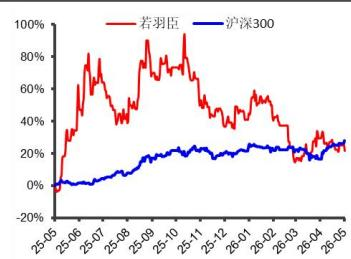

# 业绩延续强劲增长动能，品牌矩阵持续扩充验证公司复制能力

增持（维持）

若羽臣（003010）2026年一季报点评

2026 年 5 月 11 日

分析师：邓升亮

SAC执业证书编号：

S0340523050001

电话：0769-22119410

邮箱：

dengshengliang@dgzq.com

.cn

主要数据
<table><tr><td colspan="2">2026年5月8日</td></tr><tr><td>收盘价 (元)</td><td>29.95</td></tr><tr><td>总市值（亿元）</td><td>93.16</td></tr><tr><td>总股本 (亿股)</td><td>3.11</td></tr><tr><td>流通股本 (亿股)</td><td>2.26</td></tr><tr><td>ROE（TTM)</td><td>30.24%</td></tr><tr><td>12 月最高价(元)</td><td>79.21</td></tr><tr><td>12月最低价(元)</td><td>28.05</td></tr></table>

## 股价走势

  
资料来源：东莞证券研究所，iFind

## 相关报告

## 投资要点：

事件：若羽臣发布2026年一季度报告。

## 点评：

 一季度业绩延续高增。若羽臣2026年第一季度实现营业收入9.95亿元，同比增长73.34%；实现归母净利润0.72亿元，同比增长163.78%；扣非后归母净利润0.67亿元，同比增长167.45%。归母净利润增速显著快于收入增速，公司盈利能力进入快速释放阶段。2026年一季度业绩延续高增长，动能主要来自高毛利的自有品牌及品牌管理业务持续扩张，品牌管理业务占比相对收缩带动整体盈利能力改善。2026年一季度公司营业利润同比增长202.22%，毛利率同比提升10.7个百分点至64.66%。公司持续推进从“代运营服务商”向“品牌管理+自有品牌”转型，自有品牌已逐步成为核心增长引擎。2025年公司自有品牌实现营业收入18.13亿元，同比增长261.94%，收入占比首次提升至52.83%；品牌管理业务实现收入8.95亿元，同比增长78.63%，整体呈现“自有品牌放量、品牌管理协同增长、电商运营稳步提效”的结构性升级。整体来看，公司自有品牌成长逻辑正在持续兑现。

 自有品牌阵容持续扩充，公司打造爆款能力得到验证。公司销售费用同比增长100.80%，主要系市场推广费用增加所致，但销售费用率同比下降至53.2%，规模效应开始显现。抗衰品牌“斐萃”已成为公司第二增长曲线。2025年斐萃实现营业收入6.96亿元，同比增长5645.39%，毛利率高达86.96%。公司持续加码产品研发及营销推广投入。伴随抖音、天猫等核心渠道运营能力强化，公司的竞争优势有望进一步扩大。此外，公司收购高端护肤品牌奥伦纳素，进一步扩充自有品牌矩阵，向高端美妆及全球化品牌运营延伸。依托公司的数字化运营能力及品牌孵化经验，未来有望继续复制爆款。

 给予公司“增持”的投资评级。公司自有品牌与品牌管理业务高增长推动收入利润快速释放，业务结构调整成功带来盈利能力大幅提升。长期看，公司具备成熟的消费品数字化运营能力及品牌孵化体系，在国潮崛起背景下具备较强成长空间。当前公司盈利能力进入加速释放阶段，同时品牌矩阵持续扩张，预计未来两年利润端有望维持较高增速。预计公司2026/2027年的每股收益分别为1.23/1.83元，当前股价对应PE分别为24.66/16.57倍，给予公司“增持”的投资评级。

 风险提示：宏观经济波动、新品牌开拓不及预期、自有品牌销量增长不及预期、代运营等传统业务收缩等风险。

表 1：公司盈利预测简表（截至 2026年 5月 8日）
<table><tr><td colspan="2">科目(百万元）</td><td>2025A</td><td>2026E</td><td>2027E</td><td>2028E</td></tr><tr><td colspan="2">营业总收入</td><td>3,432</td><td>5820</td><td>7,729</td><td>9996</td></tr><tr><td colspan="2">营业总成本</td><td>3,216</td><td>5357</td><td>7,024</td><td>9073</td></tr><tr><td colspan="2">营业成本</td><td>1,380</td><td>2,026</td><td>2,600</td><td>3,352</td></tr><tr><td colspan="2">营业税金及附加</td><td>11</td><td>23</td><td>31</td><td>40</td></tr><tr><td colspan="2">销售费用</td><td>1647</td><td>3026</td><td>4019</td><td>5198</td></tr><tr><td colspan="2">管理费用</td><td>115</td><td>175</td><td>232</td><td>300</td></tr><tr><td colspan="2">财务费用</td><td>30</td><td>51</td><td>68</td><td>88</td></tr><tr><td colspan="2">研发费用</td><td>33</td><td>55</td><td>74</td><td>95</td></tr><tr><td colspan="2">公允价值变动净收益</td><td>(1)</td><td>(2)</td><td>(3)</td><td>(2)</td></tr><tr><td colspan="2">资产减值损失 营业利润</td><td>(1)</td><td>1</td><td>0</td><td>0</td></tr><tr><td colspan="2"></td><td>227</td><td>454</td><td>698</td><td>925</td></tr><tr><td colspan="2">加：营业外收入</td><td>1</td><td>0</td><td>0</td><td>0</td></tr><tr><td colspan="2">减：营业外支出</td><td>2</td><td>9</td><td>3</td><td>5</td></tr><tr><td colspan="2">利润总额 减：所得税</td><td>226</td><td>445</td><td>695</td><td>920</td></tr><tr><td colspan="2"></td><td>31</td><td>62</td><td>125</td><td>175</td></tr><tr><td colspan="2">净利润</td><td>194</td><td>383</td><td>570</td><td>746</td></tr><tr><td colspan="2">减：少数股东损益</td><td>0</td><td>0</td><td>0</td><td>0</td></tr><tr><td colspan="2">归母公司所有者的净利润</td><td>194</td><td>383</td><td>570</td><td>746</td></tr><tr><td colspan="2">摊薄每股收益(元)</td><td>0.62</td><td>1.23</td><td>1.83</td><td>2.40</td></tr><tr><td colspan="2">PE（倍）</td><td>47.92</td><td>24.35</td><td>16.35</td><td>12.50</td></tr></table>

数据来源：iFind，东莞证券研究所

## 东莞证券研究报告评级体系：

<table><tr><td rowspan=1 colspan=2>公司投资评级</td></tr><tr><td rowspan=1 colspan=1>买入</td><td rowspan=1 colspan=1>预计未来6个月内，股价表现强于市场指数15%以上</td></tr><tr><td rowspan=1 colspan=1>增持</td><td rowspan=1 colspan=1>预计未来6个月内，股价表现强于市场指数5%-15%之间</td></tr><tr><td rowspan=1 colspan=1>持有</td><td rowspan=1 colspan=1>预计未来6个月内，股价表现介于市场指数±5%之间</td></tr><tr><td rowspan=1 colspan=1>减持</td><td rowspan=1 colspan=1>预计未来6个月内，股价表现弱于市场指数5%以上</td></tr><tr><td rowspan=1 colspan=1>无评级</td><td rowspan=1 colspan=1>因无法获取必要的资料，或者公司面临无法预见结果的重大不确定性事件，或者其他原因，导致无法给出明确的投资评级；股票不在常规研究覆盖范围之内</td></tr><tr><td rowspan=1 colspan=2>行业投资评级</td></tr><tr><td rowspan=1 colspan=1>超配</td><td rowspan=1 colspan=1>预计未来6个月内，行业指数表现强于市场指数10%以上</td></tr><tr><td rowspan=1 colspan=1>标配</td><td rowspan=1 colspan=1>预计未来6个月内，行业指数表现介于市场指数±10%之间</td></tr><tr><td rowspan=1 colspan=1>低配</td><td rowspan=1 colspan=1>预计未来6个月内，行业指数表现弱于市场指数10%以上</td></tr></table>

说明：本评级体系的“市场指数”，A 股参照标的为沪深300 指数；新三板参照标的为三板成指。

证券研究报告风险等级及适当性匹配关系
<table><tr><td rowspan=1 colspan=1>低风险</td><td rowspan=1 colspan=1>宏观经济及政策、财经资讯、国债等方面的研究报告</td></tr><tr><td rowspan=1 colspan=1>中低风险</td><td rowspan=1 colspan=1>债券、货币市场基金、债券基金等方面的研究报告</td></tr><tr><td rowspan=1 colspan=1>中风险</td><td rowspan=1 colspan=1>主板股票及基金、可转债等方面的研究报告，市场策略研究报告</td></tr><tr><td rowspan=1 colspan=1>中高风险</td><td rowspan=1 colspan=1>创业板、科创板、北京证券交易所、新三板（含退市整理期）等板块的股票、基金、可转债等方面的研究报告，港股股票、基金研究报告以及非上市公司的研究报告</td></tr><tr><td rowspan=1 colspan=1>高风险</td><td rowspan=1 colspan=1>期货、期权等衍生品方面的研究报告</td></tr></table>

投资者与证券研究报告的适当性匹配关系：“保守型”投资者仅适合使用“低风险”级别的研报，“谨慎型”投资者仅适合使用风险级别不高于“中低风险”的研报，“稳健型”投资者仅适合使用风险级别不高于“中风险”的研报，“积极型”投资者仅适合使用风险级别不高于“中高风险”的研报，“激进型”投资者适合使用我司各类风险级别的研报。

## 证券分析师承诺：

本人具有中国证券业协会授予的证券投资咨询执业资格或相当的专业胜任能力，以勤勉的职业态度，独立、客观地在所知情的范围内出具本报告。本报告清晰准确地反映了本人的研究观点，不受本公司相关业务部门、证券发行人、上市公司、基金管理公司、资产管理公司等利益相关者的干涉和影响。本人保证与本报告所指的证券或投资标的无任何利害关系，没有利用发布本报告为自身及其利益相关者谋取不当利益，或者在发布证券研究报告前泄露证券研究报告的内容和观点。

## 声明：

东莞证券股份有限公司为全国性综合类证券公司，具备证券投资咨询业务资格。

本报告仅供东莞证券股份有限公司（以下简称“本公司”）的客户使用。本公司不会因接收人收到本报告而视其为客户。本报告所载资料及观点均为合规合法来源且被本公司认为可靠，但本公司对这些信息的准确性及完整性不作任何保证。本报告所载的资料、意见及推测仅反映本公司于发布本报告当日的判断，可随时更改。本报告所指的证券或投资标的的价格、价值及投资收入可跌可升。本公司可发出其它与本报告所载资料不一致及有不同结论的报告，亦可因使用不同假设和标准、采用不同观点和分析方法而与本公司其他业务部门或单位所给出的意见不同或者相反。在任何情况下，本报告所载的资料、工具、意见及推测只提供给客户作参考之用，并不构成对任何人的投资建议。投资者需自主作出投资决策并自行承担投资风险，据此报告做出的任何投资决策与本公司和作者无关。在任何情况下，本公司不对任何人因使用本报告中的任何内容所引致的任何损失负任何责任，任何形式的分享证券投资收益或者分担证券投资损失的书面或口头承诺均为无效。本公司及其所属关联机构在法律许可的情况下可能会持有本报告中提及公司所发行的证券头寸并进行交易，还可能为这些公司提供或争取提供投资银行、经纪、资产管理等服务。本报告版权归东莞证券股份有限公司及相关内容提供方所有，未经本公司事先书面许可，任何人不得以任何形式翻版、复制、刊登。如引用、刊发，需注明本报告的机构来源、作者和发布日期，并提示使用本报告的风险，不得对本报告进行有悖原意的引用、删节和修改。未经授权刊载或者转发本证券研究报告的，应当承担相应的法律责任。

东莞证券股份有限公司研究所

广东省东莞市可园南路 1号金源中心 24楼

邮政编码：523000

电话：（0769）22115843

网址：www.dgzq.com.cn