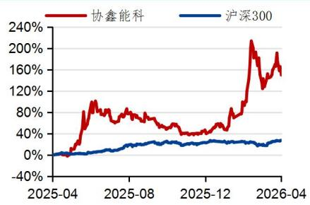

协鑫能科（002015.SZ）

## 扣非净利润增长，算力+电力产业协同

## 投资要点

 事件：公司公告 2025年年报与 2026年一季度报告，全年实现营业收入 103.26 亿元，同比+5.40%，归母净利润 4.04亿元，同比-17.35%。其中，扣非归母净利润3.29亿元，同比+11.82%。2026年一季度，实现扣非归母净利润 2.53亿元，同比+31.01%。

 扣非净利增长，战略转型成效显著。公司 2025 年度业绩变动，主要原因：（1）不断深化能源服务领域布局，滚动开发分布式光伏等节能服务业务，持续提升能源资产管理、虚拟电厂、售电、绿电、绿证、碳资产交易等能源服务的业务规模，能源服务收入及利润同比提升。同时，下属风电、热电联产等存量电厂本期业绩同比也有所提升；（2）持续动态优化调整资产结构，对预计收益率不达预期的部分项目相关资产进行了处置或减值准备计提，导致归属于上市公司股东的净利润同比下降。2025年，能源资产业务方面，持续拓展热电联产、新能源资产等业务，通过新增项目以及对现有设备的改造或异地重建，热电联产、新能源资产的装机容量进一步提升。截止 25 年底，公司并网运营总装机容量为 6,106.56MW，其中：燃机热电联产 2,017.14MW，燃煤热电联产 182MW，光伏发电（含集中式和分布式）2,150.03MW，风电 817.85MW，垃圾发电 149MW，储能 790.54MW，可再生能源装机占发电总装机的比例达 58.63%。公司 2026 年一季业绩实现稳增，显示出在优化资产结构、拓展能源应用场景以及提升核心业务能力方面取得成效。

 构建“能源+算力”双核驱动，深化产业协同。能源服务业务方面，聚焦节能服务及交易服务两大方向。节能服务端，以“鑫零碳”工商业品牌和“鑫阳光”户用品牌为核心，持续滚动开发分布式光伏项目。截至 25 年底，分布式光伏项目并网装机容量1,686.32MW。报告期内，分布式光伏累计新增并网 915.49MW。交易服务端，围绕电力交易，持续提升能源资产管理、虚拟电厂、售电、绿电、绿证、碳资产交易等能源服务的业务规模。报告期内，公司管理售电量约 470 亿 kWh，绿电交易7.86 亿 kWh，国内国际绿证对应电量合计 20.03 亿 kWh。公司虚拟电厂业务已由江苏逐步拓展至上海、浙江、四川、深圳等区域，截至25 年底，虚拟电厂业务可调负荷规模约 855MW，其中，在江苏省内辅助服务市场实际可调负荷规模占比约 33%，拥有国家“需求侧管理服务机构”一级资质，平台管理用户规模超 28GW。

 数字能源耦合深化，新能源RWA 前景广阔。新能源资产凭借稳定现金流预期、实体价值锚定明确、全生命周期运营成本低等核心特性，已成为当前能源资产通证化的最优锚定标的。2025 年 6 月，公司携手蚂蚁数科成立合资企业“蚂蚁鑫能”，通过融合蚂蚁数科的尖端数字技术与公司深耕能源产业的场景积淀，聚焦电站智能运维、电力交易策略优化及虚拟电厂协同控制三大核心场景的 AI 技术落地。蚂蚁鑫能将成为协鑫在新时代的核心增长引擎之一，标志着公司实现从“业务驱动”到“价值驱动”的战略升级，科技能力将全面转化为公司的核心竞争优势。

 投资建议：公司持续优化资产结构，深入推进“双轮驱动”战略。立足多业态绿色

公司研究●证券研究报告

## 公司快报

电力及公用事业 | 其他发电Ⅲ

投资评级 买入(维持)

股价(2026-04-30) 17.75 元

## 交易数据

<table><tr><td>总市值(百万元）</td><td>28,814.01</td></tr><tr><td>流通市值(百万元）</td><td>28,814.01</td></tr><tr><td>总股本（百万股）</td><td>1,623.32</td></tr><tr><td>流通股本（百万股）</td><td>1,623.32</td></tr><tr><td>12个月价格区间</td><td>20.73/7.18</td></tr></table>

## 一年股价表现

  
资料来源：聚源

<table><tr><td>升幅%</td><td>1M</td><td>3M</td><td>12M</td></tr><tr><td>相对收益</td><td>-0.86</td><td>67.22</td><td>119.05</td></tr><tr><td>绝对收益</td><td>6.16</td><td>69.37</td><td>146.39</td></tr></table>

分析师 贺朝晖

SAC 执业证书编号：S0910525030003

hezhaohui@huajinsc.cn

## 相关报告

协鑫能科：业绩稳健增长，新能源 RWA 前景广阔-华金证券-电新-协鑫能科-公司快报2025.9.4

协鑫能科：24年扣非净利润增长，能源服务增速亮眼-华金证券-电新-协鑫能科-公司快报 2025.5.2

能源资产管理，打造多品类综合能源服务，有望成为领先的能源生态服务商。预测公司 2026-2028 年归母净利润分别为 9.57、11.80 和 13.99 亿元，对应 EPS 为 0.59、0.73和 0.86元，PE为 30、24、21倍，维持“买入”评级。

 风险提示：1、政策落地风险。2、新能源装机低于预期。3、行业竞争加剧。

## 财务数据与估值

<table><tr><td>会计年度</td><td>2024A</td><td>2025A</td><td>2026E</td><td>2027E</td><td>2028E</td></tr><tr><td>营业收入(百万元)</td><td>9,796</td><td>10,326</td><td>11,037</td><td>11,852</td><td>12,866</td></tr><tr><td>YoY(%)</td><td>-3.4</td><td>5.4</td><td>6.9</td><td>7.4</td><td>8.6</td></tr><tr><td>归母净利润(百万元)</td><td>489</td><td>404</td><td>957</td><td>1,180</td><td>1,399</td></tr><tr><td>YoY(%)</td><td>-46.2</td><td>-17.4</td><td>136.8</td><td>23.3</td><td>18.6</td></tr><tr><td>毛利率(%)</td><td>27.7</td><td>28.4</td><td>28.6</td><td>28.8</td><td>28.9</td></tr><tr><td>EPS(摊薄/元)</td><td>0.30</td><td>0.25</td><td>0.59</td><td>0.73</td><td>0.86</td></tr><tr><td>ROE(%)</td><td>4.3</td><td>4.7</td><td>6.6</td><td>7.6</td><td>8.4</td></tr><tr><td>P/E(倍）</td><td>58.9</td><td>71.3</td><td>30.1</td><td>24.4</td><td>20.6</td></tr><tr><td>P/B(倍）</td><td>2.5</td><td>2.4</td><td>2.3</td><td>2.1</td><td>1.9</td></tr><tr><td>净利率(%)</td><td>5.0</td><td>3.9</td><td>8.7</td><td>10.0</td><td>10.9</td></tr></table>

数据来源：聚源、华金证券研究所

## 财务报表预测和估值数据汇总

资产负债表(百万元)
<table><tr><td>会计年度</td><td>2024A</td><td>2025A</td><td>2026E</td><td>2027E</td><td>2028E</td></tr><tr><td>流动资产</td><td>11968</td><td>11368</td><td>12024</td><td>10091</td><td>12933</td></tr><tr><td>现金</td><td>4151</td><td>4582</td><td>3813</td><td>1969</td><td>3796</td></tr><tr><td>应收票据及应收账款</td><td>5010</td><td>4271</td><td>5649</td><td>5004</td><td>6561</td></tr><tr><td>预付账款</td><td>264</td><td>192</td><td>328</td><td>584</td><td>168</td></tr><tr><td>存货</td><td>640</td><td>348</td><td>338</td><td>396</td><td>399</td></tr><tr><td>其他流动资产</td><td>1904</td><td>1974</td><td>1896</td><td>2139</td><td>2009</td></tr><tr><td>非流动资产</td><td>28491</td><td>27241</td><td>26727</td><td>25889</td><td>25299</td></tr><tr><td>长期投资</td><td>2394</td><td>1870</td><td>2037</td><td>1916</td><td>1950</td></tr><tr><td>固定资产</td><td>18164</td><td>17316</td><td>17119</td><td>16866</td><td>16628</td></tr><tr><td>无形资产</td><td>2688</td><td>2548</td><td>2426</td><td>2250</td><td>2100</td></tr><tr><td>其他非流动资产</td><td>5245</td><td>5507</td><td>5144</td><td>4857</td><td>4621</td></tr><tr><td>资产总计</td><td>40459</td><td>38609</td><td>38751</td><td>35980</td><td>38232</td></tr><tr><td>流动负债</td><td>12370</td><td>11213</td><td>12246</td><td>10321</td><td>13134</td></tr><tr><td>短期借款</td><td>3956</td><td>3648</td><td>3648</td><td>3648</td><td>3648</td></tr><tr><td>应付票据及应付账款</td><td>1175</td><td>490</td><td>1285</td><td>614</td><td>1444</td></tr><tr><td>其他流动负债</td><td>7239</td><td>7075</td><td>7313</td><td>6059</td><td>8042</td></tr><tr><td>非流动负债</td><td>14625</td><td>13759</td><td>11902</td><td>10034</td><td>8195</td></tr><tr><td>长期借款</td><td>8596</td><td>8168</td><td>6311</td><td>4443</td><td>2604</td></tr><tr><td>其他非流动负债</td><td>6029</td><td>5591</td><td>5591</td><td>5591</td><td>5591</td></tr><tr><td>负债合计</td><td>26995</td><td>24972</td><td>24147</td><td>20355</td><td>21329</td></tr><tr><td>少数股东权益</td><td>1725</td><td>1825</td><td>1835</td><td>1847</td><td>1861</td></tr><tr><td>股本</td><td>1623</td><td>1623</td><td>1623</td><td>1623</td><td>1623</td></tr><tr><td>资本公积</td><td>8592</td><td>8427</td><td>8427</td><td>8427</td><td>8427</td></tr><tr><td>留存收益</td><td>2004</td><td>2250</td><td>2971</td><td>3919</td><td>5053</td></tr><tr><td>归属母公司股东权益</td><td>11739</td><td>11812</td><td>12769</td><td>13778</td><td>15042</td></tr><tr><td>负债和股东权益</td><td>40459</td><td>38609</td><td>38751</td><td>35980</td><td>38232</td></tr></table>

利润表(百万元)

现金流量表(百万元)
<table><tr><td>会计年度</td><td>2024A</td><td>2025A</td><td>2026E</td><td>2027E</td><td>2028E</td></tr><tr><td>经营活动现金流</td><td>2425</td><td>3167</td><td>3601</td><td>742</td><td>4494</td></tr><tr><td>净利润</td><td>582</td><td>648</td><td>967</td><td>1192</td><td>1413</td></tr><tr><td>折旧摊销</td><td>1093</td><td>1243</td><td>1131</td><td>1183</td><td>1236</td></tr><tr><td>财务费用</td><td>716</td><td>713</td><td>575</td><td>501</td><td>380</td></tr><tr><td>投资损失</td><td>-280</td><td>-209</td><td>-210</td><td>-218</td><td>-225</td></tr><tr><td>营运资金变动</td><td>-186</td><td>262</td><td>1202</td><td>-1835</td><td>1797</td></tr><tr><td>其他经营现金流</td><td>500</td><td>510</td><td>-65</td><td>-80</td><td>-108</td></tr><tr><td>投资活动现金流</td><td>-5234</td><td>-1439</td><td>-343</td><td>-47</td><td>-313</td></tr><tr><td>筹资活动现金流</td><td>3568</td><td>-1308</td><td>-4027</td><td>-2539</td><td>-2354</td></tr><tr><td>每股指标（元）</td><td></td><td></td><td></td><td></td><td></td></tr><tr><td>每股收益(最新摊薄)</td><td>0.30</td><td>0.25</td><td>0.59</td><td>0.73</td><td>0.86</td></tr><tr><td>每股经营现金流(最新摊薄)</td><td>1.49</td><td>1.95</td><td>2.22</td><td>0.46</td><td>2.77</td></tr><tr><td>每股净资产(最新摊薄)</td><td>7.23</td><td>7.28</td><td>7.87</td><td>8.49</td><td>9.27</td></tr></table>

<table><tr><td>会计年度</td><td>2024A</td><td>2025A</td><td>2026E</td><td>2027E</td><td>2028E</td></tr><tr><td>营业收入</td><td>9796</td><td>10326</td><td>11037</td><td>11852</td><td>12866</td></tr><tr><td>营业成本</td><td>7086</td><td>7394</td><td>7885</td><td>8436</td><td>9142</td></tr><tr><td>营业税金及附加</td><td>89</td><td>93</td><td>88</td><td>84</td><td>91</td></tr><tr><td>营业费用</td><td>108</td><td>93</td><td>99</td><td>107</td><td>116</td></tr><tr><td>管理费用</td><td>855</td><td>864</td><td>883</td><td>948</td><td>1029</td></tr><tr><td>研发费用</td><td>30</td><td>18</td><td>19</td><td>18</td><td>18</td></tr><tr><td>财务费用</td><td>716</td><td>713</td><td>575</td><td>501</td><td>380</td></tr><tr><td>资产减值损失</td><td>-382</td><td>-508</td><td>-221</td><td>-119</td><td>-129</td></tr><tr><td>公允价值变动收益</td><td>5</td><td>0</td><td>0</td><td>0</td><td>0</td></tr><tr><td>投资净收益</td><td>280</td><td>209</td><td>210</td><td>218</td><td>225</td></tr><tr><td>营业利润</td><td>944</td><td>1143</td><td>1609</td><td>2003</td><td>2360</td></tr><tr><td>营业外收入</td><td>51</td><td>36</td><td>34</td><td>41</td><td>40</td></tr><tr><td>营业外支出</td><td>59</td><td>93</td><td>56</td><td>67</td><td>69</td></tr><tr><td>利润总额</td><td>936</td><td>1085</td><td>1587</td><td>1976</td><td>2331</td></tr><tr><td>所得税</td><td>354</td><td>437</td><td>620</td><td>784</td><td>918</td></tr><tr><td>税后利润</td><td>582</td><td>648</td><td>967</td><td>1192</td><td>1413</td></tr><tr><td>少数股东损益</td><td>93</td><td>243</td><td>10</td><td>12</td><td>14</td></tr><tr><td>归属母公司净利润</td><td>489</td><td>404</td><td>957</td><td>1180</td><td>1399</td></tr><tr><td>EBITDA</td><td>2712</td><td>2951</td><td>3291</td><td>3648</td><td>3934</td></tr></table>

资料来源：聚源、华金证券研究所

主要财务比率
<table><tr><td>会计年度</td><td>2024A</td><td>2025A</td><td>2026E</td><td>2027E</td><td>2028E</td></tr><tr><td>成长能力</td><td></td><td></td><td></td><td></td><td></td></tr><tr><td>营业收入(%)</td><td>-3.4</td><td>5.4</td><td>6.9</td><td>7.4</td><td>8.6</td></tr><tr><td>营业利润(%)</td><td>-26.0</td><td>21.0</td><td>40.8</td><td>24.5</td><td>17.8</td></tr><tr><td>归属于母公司净利润(%)</td><td>-46.2</td><td>-17.4</td><td>136.8</td><td>23.3</td><td>18.6</td></tr><tr><td>获利能力</td><td></td><td></td><td></td><td></td><td></td></tr><tr><td>毛利率(%)</td><td>27.7</td><td>28.4</td><td>28.6</td><td>28.8</td><td>28.9</td></tr><tr><td>净利率(%)</td><td>5.0</td><td>3.9</td><td>8.7</td><td>10.0</td><td>10.9</td></tr><tr><td>ROE(%)</td><td>4.3</td><td>4.7</td><td>6.6</td><td>7.6</td><td>8.4</td></tr><tr><td>ROIC(%)</td><td>3.1</td><td>3.1</td><td>4.4</td><td>5.1</td><td>5.8</td></tr><tr><td>偿债能力</td><td></td><td></td><td></td><td></td><td></td></tr><tr><td>资产负债率(%)</td><td>66.7</td><td>64.7</td><td>62.3</td><td>56.6</td><td>55.8</td></tr><tr><td>流动比率</td><td>1.0</td><td>1.0</td><td>1.0</td><td>1.0</td><td>1.0</td></tr><tr><td>速动比率</td><td>0.8</td><td>0.9</td><td>0.8</td><td>0.8</td><td>0.8</td></tr><tr><td>营运能力</td><td></td><td></td><td></td><td></td><td></td></tr><tr><td>总资产周转率</td><td>0.3</td><td>0.3</td><td>0.3</td><td>0.3</td><td>0.3</td></tr><tr><td>应收账款周转率</td><td>2.2</td><td>2.2</td><td>2.2</td><td>2.2</td><td>2.2</td></tr><tr><td>应付账款周转率</td><td>6.3</td><td>8.9</td><td>8.9</td><td>8.9</td><td>8.9</td></tr><tr><td>估值比率</td><td></td><td></td><td></td><td></td><td></td></tr><tr><td>P/E</td><td>58.9</td><td>71.3</td><td>30.1</td><td>24.4</td><td>20.6</td></tr><tr><td>P/B</td><td>2.5</td><td>2.4</td><td>2.3</td><td>2.1</td><td>1.9</td></tr><tr><td>EV/EBITDA</td><td>17.3</td><td>15.8</td><td>13.4</td><td>12.0</td><td>10.2</td></tr></table>

## 投资评级说明

公司投资评级：

买入 — 未来 6-12个月内相对同期相关证券市场代表性指数涨幅大于 15%；

增持 — 未来 6-12个月内相对同期相关证券市场代表性指数涨幅在 5%至 15%之间；

中性 — 未来 6-12个月内相对同期相关证券市场代表性指数涨幅在-5%至 5%之间；

减持 — 未来 6-12个月内相对同期相关证券市场代表性指数跌幅在 5%至 15%之间；

卖出 — 未来 6-12个月内相对同期相关证券市场代表性指数跌幅大于 15%。

行业投资评级：

领先大市 — 未来 6-12个月内相对同期相关证券市场代表性指数领先 10%以上；

同步大市 — 未来 6-12个月内相对同期相关证券市场代表性指数涨跌幅介于-10%至 10%；

落后大市 — 未来 6-12个月内相对同期相关证券市场代表性指数落后 10%以上。

基准指数说明：A股市场以沪深 300 指数为基准；新三板市场以三板成指（针对协议转让标的） 或三板做市指数（针对做市转让标的）为基准；香港市场以恒生指数为基准，美股市场以标普 500指数为基准。

## 分析师声明

贺朝晖声明，本人具有中国证券业协会授予的证券投资咨询执业资格，勤勉尽责、诚实守信。本人对本报告的内容和观点负责，保证信息来源合法合规、研究方法专业审慎、研究观点独立公正、分析结论具有合理依据，特此声明。

## 本公司具备证券投资咨询业务资格的说明

华金证券股份有限公司（以下简称“本公司”）经中国证券监督管理委员会核准，取得证券投资咨询业务许可。本公司及其投资咨询人员可以为证券投资人或客户提供证券投资分析、预测或者建议等直接或间接的有偿咨询服务。发布证券研究报告，是证券投资咨询业务的一种基本形式，本公司可以对证券及证券相关产品的价值、市场走势或者相关影响因素进行分析，形成证券估值、投资评级等投资分析意见，制作证券研究报告，并向本公司的客户发布。

## 免责声明：

本报告仅供华金证券股份有限公司（以下简称“本公司”）的客户使用。本公司不会因为任何机构或个人接收到本报告而视其为本公司的当然客户。

本报告基于已公开的资料或信息撰写，但本公司不保证该等信息及资料的完整性、准确性。本报告所载的信息、资料、建议及推测仅反映本公司于本报告发布当日的判断，本报告中的证券或投资标的价格、价值及投资带来的收入可能会波动。在不同时期，本公司可能撰写并发布与本报告所载资料、建议及推测不一致的报告。本公司不保证本报告所含信息及资料保持在最新状态，本公司将随时补充、更新和修订有关信息及资料，但不保证及时公开发布。同时，本公司有权对本报告所含信息在不发出通知的情形下做出修改，投资者应当自行关注相应的更新或修改。任何有关本报告的摘要或节选都不代表本报告正式完整的观点，一切须以本公司向客户发布的本报告完整版本为准。

在法律许可的情况下，本公司及所属关联机构可能会持有报告中提到的公司所发行的证券或期权并进行证券或期权交易，也可能为这些公司提供或者争取提供投资银行、财务顾问或者金融产品等相关服务，提请客户充分注意。客户不应将本报告为作出其投资决策的惟一参考因素，亦不应认为本报告可以取代客户自身的投资判断与决策。在任何情况下，本报告中的信息或所表述的意见均不构成对任何人的投资建议，无论是否已经明示或暗示，本报告不能作为道义的、责任的和法律的依据或者凭证。在任何情况下，本公司亦不对任何人因使用本报告中的任何内容所引致的任何损失负任何责任。

本报告版权仅为本公司所有，未经事先书面许可，任何机构和个人不得以任何形式翻版、复制、发表、转发、篡改或引用本报告的任何部分。如征得本公司同意进行引用、刊发的，需在允许的范围内使用，并注明出处为“华金证券股份有限公司研究所”，且不得对本报告进行任何有悖原意的引用、删节和修改。

华金证券股份有限公司对本声明条款具有惟一修改权和最终解释权。

## 风险提示：

报告中的内容和意见仅供参考，并不构成对所述证券买卖的出价或询价。投资者对其投资行为负完全责任，我公司及其雇员对使用本报告及其内容所引发的任何直接或间接损失概不负责。

华金证券股份有限公司

办公地址：

上海市浦东新区杨高南路 759号陆家嘴世纪金融广场 30层

北京市朝阳区建国路 108号横琴人寿大厦 17层

深圳市福田区益田路 6001号太平金融大厦 10楼 05单元

电话：021-20655588

网址： www.huajinsc.cn