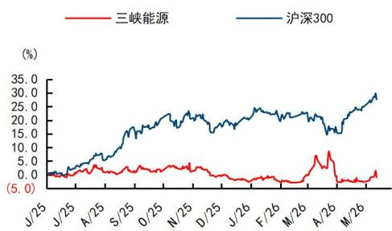
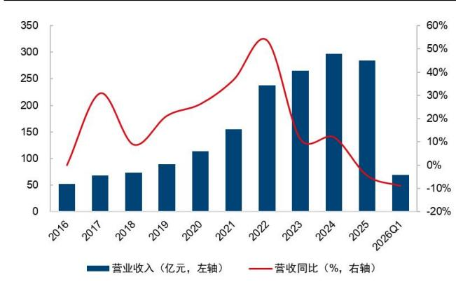
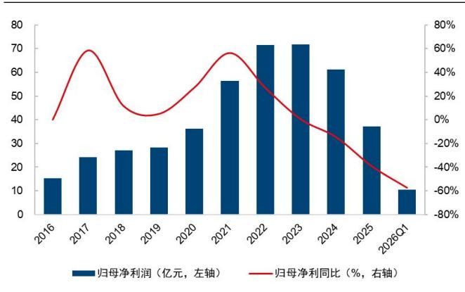
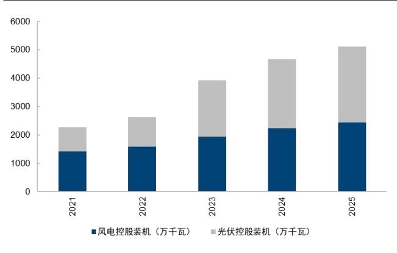
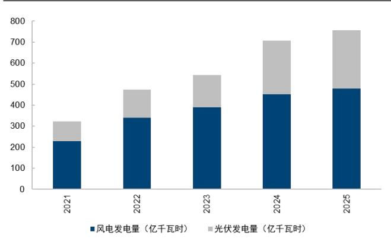
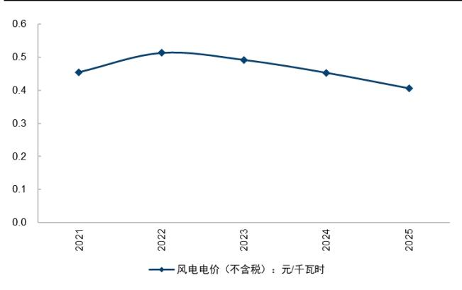
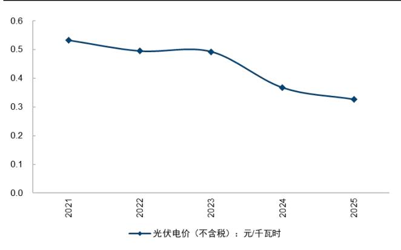
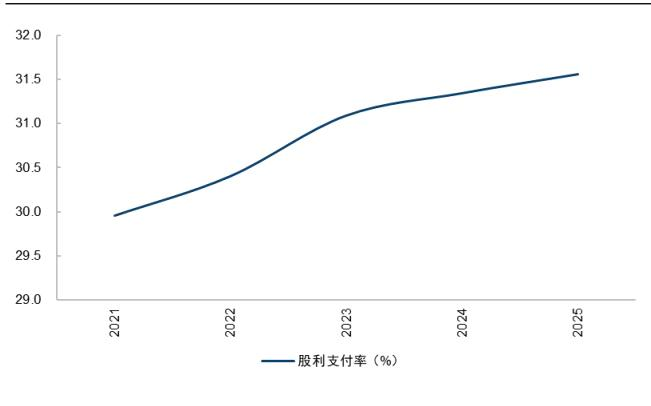
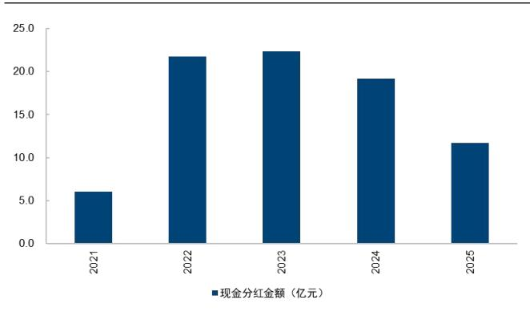

# 三峡能源（600905.SH）

# 发电量稳步增长，电价下行及资产减值致利润承压

## 核心观点

2025年装机规模持续扩张，电价下行及减值计提拖累业绩。2025年公司实现营业收入283.99亿元，同比下降4.43%；归属于上市公司股东的净利润37.14亿元，同比大幅下降39.20%。业绩下滑主要受多重因素影响：1）受部分区域消纳形势变化等因素影响，发电量不及预期；2）市场化交易比例提升拉低平均上网电价；3）以及公司基于谨慎性原则，对个别参股股权投资、固定资产、商誉等长期资产计提的减值准备同比增加。2026Q1公司实现收入69.48亿元，同比下降8.92%；实现归母净利10.4亿元，同比下降57.49%，业绩持续承压。

装机规模稳步增长，但利用小时数下滑。2025年公司新增并网装机461.53万千瓦，年末累计装机容量达5237.41 万千瓦。全年完成发电量762.61亿千瓦时，同比增长5.99%。分类型看，风电发电量479.21亿千瓦时，同比增长6.08%；太阳能发电量276.54亿千瓦时，同比增长8.87%。然而，利用效率有所下降，风电平均利用小时数为2128小时，同比减少215小时；太阳能发电平均利用小时数为1139小时，同比减少191小时。

市场化交易占比提升，平均电价承压，成本及减值侵蚀利润。2025年公司平均上网电价为0.3767元/千瓦时，同比下降10.74%。市场化交易电量487.41亿千瓦时，占总上网电量比例由上年的58.59%提升至65.80%。成本端，营业成本同比增长 17.36%至 165.25 亿元，主要系新投产项目带来的折旧及运营成本增加。公司财务费用管控良好，同比减少3.85%至41.45亿元。

分红政策稳健回报股东。根据2025 年度利润分配预案，公司拟向全体股东每10股派发现金红利0.41元（含税），合计拟派发现金股利11.72亿元（含税）。现金分红占归母净利润的比例为31.56%，对应2026.5.14收盘价的股息率为 0.99%。

风险提示：电量下降；电价下滑；新能源项目投运不及预期；行业政策变化风险。

投资建议：下调盈利预测，维持 “优于大市”评级。随着电力现货市场覆盖范围不断扩大，市场化交易比例提升，国内电价仍可能面临一定的下行压力，我们下调盈利预测，预计 2026-2028 年归母净利润为 37.64/43.59/46.88亿元（2026-2027 年原值为 72.32/77.44 亿元），同比增速 1.3/15.8/7.5%，当前股价对应PE=31/27/25x，维持“优于大市”评级。

<table><tr><td>盈利预测和财务指标</td><td>2024</td><td>2025</td><td>2026E</td><td>2027E</td><td>2028E</td></tr><tr><td>营业收入(百万元)</td><td>29,717</td><td>28,399</td><td>29,376</td><td>31,180</td><td>32,918</td></tr><tr><td>(+/-%)</td><td>12.2%</td><td>-4.4%</td><td>3.4%</td><td>6.1%</td><td>5.6%</td></tr><tr><td>净利润(百万元)</td><td>6111</td><td>3714</td><td>3764</td><td>4359</td><td>4688</td></tr><tr><td>(+/-%)</td><td>-14.9%</td><td>-39.2%</td><td>1.3%</td><td>15.8%</td><td>7.5%</td></tr><tr><td>每股收益 (元)</td><td>0.21</td><td>0.13</td><td>0.13</td><td>0.15</td><td>0.16</td></tr><tr><td>EBITMargin</td><td>45.8%</td><td>34.3%</td><td>36.7%</td><td>36.1%</td><td>35.6%</td></tr><tr><td>净资产收益率(ROE)</td><td>7.0%</td><td>4.2%</td><td>4.1%</td><td>4.6%</td><td>4.8%</td></tr><tr><td>市盈率 (PE)</td><td>19.5</td><td>32.0</td><td>31.6</td><td>27.3</td><td>25.4</td></tr><tr><td>EV/EBITDA</td><td>14.7</td><td>16.9</td><td>15.8</td><td>15.4</td><td>14.8</td></tr><tr><td>市净率(PB)</td><td>1. 37</td><td>1.34</td><td>1.30</td><td>1.26</td><td>1. 22</td></tr></table>

资料来源：Wind、国信证券经济研究所预测  
注：摊薄每股收益按最新总股本计算

## 公司研究·财报点评

公用事业·电力

证券分析师：黄秀杰 021-61761029 huangxiujie@guosen.com.cn S0980521060002

证券分析师：崔佳诚 021-60375416 cuijiacheng@guosen.com.cn S0980525070002

证券分析师：刘汉轩   
010-88005198   
liuhanxuan@guosen.com.cn   
S0980524120001

## 基础数据

<table><tr><td>投资评级</td><td>优于大市 (维持)</td></tr><tr><td>合理估值 收盘价</td><td>4.16元</td></tr><tr><td>总市值/流通市值</td><td>118925/118925百万元</td></tr><tr><td>52周最高价/最低价</td><td>4.67/4.06元</td></tr><tr><td>近3个月日均成交额</td><td>1021.59百万元</td></tr></table>

## 市场走势

  
资料来源：Wind、国信证券经济研究所整理

## 相关研究报告

《三峡能源（600905.SH）-利用小时数、电价下降影响利润，新能源项目建设稳步推进》 ——2025-09-01

《三峡能源（600905.SH）-电价下降影响业绩表现，新能源项目建设有序推进》 — —2025-05-06

《三峡能源（600905.SH）-电量增长使得营收提升，电价下降影响利润》 —— 2024-11-03

《三峡能源（600905.SH）-电价下降影响业绩表现，在建项目装机容量较大》 ——2024-09-01

2025 年装机规模持续扩张，电价下行及减值计提拖累业绩。2025 年公司实现营业收入 283.99 亿元，同比下降 4.43%；归属于上市公司股东的净利润 37.14 亿元，同比大幅下降 39.20%。业绩下滑主要受多重因素影响：1）受部分区域消纳形势变化等因素影响，发电量不及预期；2）市场化交易比例提升拉低平均上网电价；3）以及公司基于谨慎性原则，对个别参股股权投资、固定资产、商誉等长期资产计提的减值准备同比增加。2026Q1 公司实现收入 69.48 亿元，同比下降 8.92%；实现归母净利 10.4 亿元，同比下降 57.49%，业绩持续承压。

图1：长江电力营业收入及增速（单位：亿元、%）  
  
资料来源：公司公告、Wind、国信证券经济研究所整理

图2：三峡能源归母净利润及增速情况（单位：亿元、%）  

资料来源：公司公告、Wind、国信证券经济研究所整理

装机规模稳步增长，但利用小时数下滑。2025 年公司新增并网装机 461.53 万千瓦，年末累计装机容量达 5237.41万千瓦。全年完成发电量 762.61 亿千瓦时，同比增长 5.99%。分类型看，风电发电量 479.21 亿千瓦时，同比增长 6.08%；太阳能发电量 276.54 亿千瓦时，同比增长 8.87%。然而，利用效率有所下降，风电平均利用小时数为 2128 小时，同比减少 215 小时；太阳能发电平均利用小时数为1139小时，同比减少 191小时。

图3：公司控股发电装机情况  
  
资料来源：公司公告、Wind、国信证券经济研究所整理

图4：公司发电量情况  
  
资料来源：公司公告、Wind、国信证券经济研究所整理

市场化交易占比提升，平均电价承压，成本及减值侵蚀利润。2025年公司平均上网电价为 0.3767 元/千瓦时，同比下降 10.74%。市场化交易电量 487.41 亿千瓦时，占总上网电量比例由上年的 58.59%提升至 65.80%。成本端，营业成本同比增长 17.36%至 165.25 亿元，主要系新投产项目带来的折旧及运营成本增加。公司财务费用管控良好，同比减少 3.85%至 41.45亿元。

图5：公司风电上网电价情况  
  
资料来源：公司公告、Wind、国信证券经济研究所整理

图6：公司光伏上网电价情况  
  
资料来源：公司公告、Wind、国信证券经济研究所整理

分红政策稳健回报股东。根据 2025 年度利润分配预案，公司拟向全体股东每 10股派发现金红利 0.41 元（含税），合计拟派发现金股利 11.72 亿元（含税）。现金分红占归母净利润的比例为 31.56%，对应 2026.5.14 收盘价的股息率为 0.99%。

图7：三峡能源历史股利支付率情况  
  
资料来源：公司公告、Wind、国信证券经济研究所整理

图8：三峡能源历史分红金额情况  
  
资料来源：公司公告、Wind、国信证券经济研究所整理

投资建议：下调盈利预测，维持 “优于大市”评级。随着电力现货市场覆盖范围不断扩大，市场化交易比例提升，国内电价仍可能面临一定的下行压力，我们下调盈利预测，预计 2026-2028 年归母净利润为 37.64/43.59/46.88 亿元（2026-2027年 原 值 为 72.32/77.44 亿 元 ） ， 同 比 增 速 1.3/15.8/7.5% ， 当 前 股 价 对 应PE=31/27/25x，维持“优于大市”评级。

风险提示：电量下降；电价下滑；新能源项目投运不及预期；行业政策变化风险。

表1：可比公司估值表
<table><tr><td rowspan="2">公司简称</td><td rowspan="2">代码</td><td rowspan="2">股价</td><td rowspan="2">总市 值 亿元</td><td rowspan="2"></td><td colspan="3">EPS</td><td colspan="5">PE</td><td rowspan="2">ROE PEG</td><td rowspan="2">投资 评级 26E</td></tr><tr><td>25A</td><td>26E</td><td>27E</td><td>28E 25A</td><td>26E</td><td>27E</td><td>28E</td><td>25A</td></tr><tr><td>三峡能源</td><td>600905.SH</td><td>4.16</td><td>1189</td><td>0.13</td><td>0.13</td><td>0.15</td><td>0.16</td><td>32.05</td><td>32.00</td><td>27.73</td><td>26.00</td><td>4.24</td><td>24.62</td><td>优于 大市</td></tr><tr><td></td><td>可比公司</td><td></td><td></td><td></td><td></td><td></td><td></td><td></td><td></td><td></td><td></td><td></td><td></td><td></td></tr><tr><td>龙源电力</td><td>001289.SZ</td><td>17.71</td><td>1481</td><td>0.54</td><td>0.56</td><td>0.63</td><td>0.71</td><td>32.71</td><td>31.48</td><td>27.95</td><td>25.02</td><td>6.11</td><td>8.06</td><td>优于 大市</td></tr><tr><td>华电新能</td><td>600930.SH</td><td>6.44</td><td>2686</td><td>0.18</td><td>0.16</td><td>0.17</td><td>0.18</td><td>35.78</td><td>39.46</td><td>37.01</td><td>35.96</td><td>5.99</td><td>-6.29</td><td>无</td></tr><tr><td>华能国际</td><td>600011.SH</td><td>7.53</td><td>1182</td><td>0.74</td><td>0.84</td><td>0.89</td><td>0.95</td><td>10.18</td><td>8.94</td><td>8.44</td><td>7.89</td><td>10.30</td><td>-1.08</td><td>优于 大市</td></tr></table>

资料来源:Wind、国信证券经济研究所整理 注：可比公司取自Wind一致预期（股价数据更新至2026.5.14）

财务预测与估值
<table><tr><td>资产负债表（百万元）</td><td>2024</td><td>2025</td><td>2026E</td><td>2027E</td><td>2028E</td></tr><tr><td>现金及现金等价物</td><td>5431</td><td>3776</td><td>4372</td><td>4659</td><td>4386</td></tr><tr><td>应收款项</td><td>45902</td><td>49517</td><td>51598</td><td>53748</td><td>55893</td></tr><tr><td>存货净额</td><td>470</td><td>467</td><td>272</td><td>296</td><td>318</td></tr><tr><td>其他流动资产</td><td>3122</td><td>3136</td><td>3708</td><td>3552</td><td>3847</td></tr><tr><td>流动资产合计</td><td>54925</td><td>56895</td><td>59950</td><td>62255</td><td>64443</td></tr><tr><td>固定资产</td><td>246696</td><td>270075</td><td>284632</td><td>295873</td><td>302151</td></tr><tr><td>无形资产及其他</td><td>6453</td><td>7527</td><td>8575</td><td>9624</td><td>10672</td></tr><tr><td>投资性房地产</td><td>31168</td><td>34882</td><td>34882</td><td>34882</td><td>34882</td></tr><tr><td>长期股权投资</td><td>17629</td><td>17777</td><td>17777</td><td>17777</td><td>17777</td></tr><tr><td>资产总计</td><td>356871</td><td>387156</td><td>405817</td><td></td><td>429925</td></tr><tr><td>短期借款及交易性金融</td><td></td><td></td><td></td><td>420410</td><td></td></tr><tr><td>负债</td><td>30742</td><td>29987</td><td>50087</td><td>66251</td><td>76441</td></tr><tr><td>应付款项</td><td>28914</td><td>30410</td><td>30410</td><td>30410</td><td>30410</td></tr><tr><td>其他流动负债</td><td>3728</td><td>3486</td><td>3526</td><td>3237</td><td>3494</td></tr><tr><td>流动负债合计</td><td>63384</td><td>63883</td><td>84023</td><td>99899</td><td>110345</td></tr><tr><td>长期借款及应付债券</td><td>152193</td><td>169118</td><td>164118</td><td>159118</td><td>154118</td></tr><tr><td>其他长期负债</td><td>37648</td><td>45410</td><td>45410</td><td>45410</td><td>45410</td></tr><tr><td>长期负债合计</td><td>189841</td><td>214528</td><td>209528</td><td>204528</td><td>199528</td></tr><tr><td>负债合计</td><td>253225</td><td>278411</td><td>293551</td><td>304427</td><td>309873</td></tr><tr><td>少数股东权益</td><td>16929</td><td>20087</td><td>20376</td><td>20712</td><td>21073</td></tr><tr><td>股东权益</td><td>86717</td><td>88658</td><td>91293</td><td>94344</td><td>97626</td></tr><tr><td>负债和股东权益总计</td><td>356871</td><td>387156</td><td>405220</td><td>419483</td><td>428572</td></tr></table>

<table><tr><td>关键财务与估值指标</td><td>2024</td><td>2025</td><td>2026E</td><td>2027E</td><td>2028E</td></tr><tr><td>每股收益</td><td>0.21</td><td>0.13</td><td>0.13</td><td>0.15</td><td>0.16</td></tr><tr><td>每股红利</td><td>0.07</td><td>0.04</td><td>0.04</td><td>0.05</td><td>0.05</td></tr><tr><td>每股净资产</td><td>3.03</td><td>3.10</td><td>3.19</td><td>3.30</td><td>3.41</td></tr><tr><td>ROIC</td><td>5%</td><td>3%</td><td>3%</td><td>3%</td><td>3%</td></tr><tr><td>ROE</td><td>7%</td><td>4%</td><td>4%</td><td>5%</td><td>5%</td></tr><tr><td>毛利率</td><td>53%</td><td>42%</td><td>44%</td><td>44%</td><td>43%</td></tr><tr><td>EBIT Margin</td><td>46%</td><td>34%</td><td>37%</td><td>36%</td><td>36%</td></tr><tr><td>EBITDAMargin</td><td>85%</td><td>83%</td><td>89%</td><td>88%</td><td>88%</td></tr><tr><td>收入增长</td><td>12%</td><td>-4%</td><td>3%</td><td>6%</td><td>6%</td></tr><tr><td>净利润增长率</td><td>-15%</td><td>-39%</td><td>1%</td><td>16%</td><td>8%</td></tr><tr><td>资产负债率</td><td>76%</td><td>77%</td><td>77%</td><td>78%</td><td>77%</td></tr><tr><td>息率</td><td>1. 6%</td><td>1.0%</td><td>0.9%</td><td>1.1%</td><td>1.2%</td></tr><tr><td>P/E</td><td>19.5</td><td>32.0</td><td>31.6</td><td>27.3</td><td>25.4</td></tr><tr><td>P/B</td><td>1.4</td><td>1.3</td><td>1.3</td><td>1.3</td><td>1.2</td></tr><tr><td>EV/EBITDA</td><td>14.7</td><td>16.9</td><td>15.8</td><td>15. 4</td><td>14.8</td></tr></table>

资料来源：Wind、国信证券经济研究所预测

<table><tr><td>利润表 (百万元）</td><td>2024</td><td>2025</td><td>2026E</td><td>2027E</td><td>2028E</td></tr><tr><td>营业收入</td><td>29717</td><td>28399</td><td>29376</td><td>31180</td><td>32918</td></tr><tr><td>营业成本</td><td>14078</td><td>16525</td><td>16397</td><td>17564</td><td>18705</td></tr><tr><td>营业税金及附加</td><td>238</td><td>279</td><td>288</td><td>306</td><td>323</td></tr><tr><td>销售费用</td><td>0</td><td>0</td><td>0</td><td>0</td><td>0</td></tr><tr><td>管理费用</td><td>2370</td><td>2488</td><td>2676</td><td>2764</td><td>2891</td></tr><tr><td>财务费用</td><td>4310</td><td>4145</td><td>4432</td><td>4386</td><td>4473</td></tr><tr><td>投资收益</td><td>667</td><td>1390</td><td>924</td><td>994</td><td>1103</td></tr><tr><td>资产减值及公允价值变 动</td><td>(661)</td><td>(1381)</td><td>(1875)</td><td>(1693)</td><td>(1566)</td></tr><tr><td>其他收入</td><td>(202)</td><td>106</td><td>413</td><td>341</td><td>384</td></tr><tr><td>营业利润</td><td>8525</td><td>5078</td><td>5045</td><td>5801</td><td>6447</td></tr><tr><td>营业外净收支</td><td>35</td><td>(45)</td><td></td><td></td><td></td></tr><tr><td>利润总额</td><td>8560</td><td>5032</td><td>55 5100</td><td>105 5906</td><td>(95)</td></tr><tr><td>所得税费用</td><td>1103</td><td>910</td><td>922</td><td>1068</td><td>6351</td></tr><tr><td>少数股东损益</td><td>1346</td><td>408</td><td>414</td><td>479</td><td>1148 515</td></tr><tr><td>归属于母公司净利润</td><td>6111</td><td>3714</td><td>3764</td><td>4359</td><td>4688</td></tr><tr><td></td><td></td><td></td><td></td><td></td><td></td></tr></table>

<table><tr><td>现金流量表（百万元）</td><td>2024</td><td>2025</td><td>2026E</td><td>2027E</td><td>2028E</td></tr><tr><td>净利润</td><td>6111</td><td>3714</td><td>3764</td><td>4359</td><td>4688</td></tr><tr><td>资产减值准备</td><td>670</td><td>720</td><td>493</td><td>19</td><td>(28)</td></tr><tr><td>折旧摊销</td><td>11673</td><td>13705</td><td>15256</td><td>16272</td><td>17208</td></tr><tr><td>公允价值变动损失</td><td>670</td><td>720</td><td>493</td><td>19</td><td>(28)</td></tr><tr><td>财务费用</td><td>4310</td><td>4145</td><td>4432</td><td>4386</td><td>4473</td></tr><tr><td>营运资本变动</td><td>(6561)</td><td>(2423)</td><td>(2360)</td><td>(2307)</td><td>(2205)</td></tr><tr><td>其它</td><td>6333</td><td>4501</td><td>3304</td><td>3708</td><td>3759</td></tr><tr><td>经营活动现金流</td><td>18897</td><td>20938</td><td>20951</td><td>22071</td><td>23395</td></tr><tr><td>资本开支</td><td>(30874)</td><td>(32112)</td><td>(31414)</td><td>(28580)</td><td>(24507)</td></tr><tr><td>其它投资现金流</td><td>0</td><td>0</td><td>0</td><td>0</td><td>0</td></tr><tr><td>投资活动现金流</td><td>(31668)</td><td>(30533)</td><td>(31414)</td><td>(28580)</td><td>(24507)</td></tr><tr><td>权益性融资</td><td>2926</td><td>3652</td><td>0</td><td>0</td><td>0</td></tr><tr><td>负债净变化</td><td>13528</td><td>8930</td><td>(5000)</td><td>(5000)</td><td>(5000)</td></tr><tr><td>支付股利、利息</td><td>(1917)</td><td>(1144)</td><td>(1129)</td><td>(1308)</td><td>(1406)</td></tr><tr><td>其它融资现金流</td><td>(4595)</td><td>(16507)</td><td>20099</td><td>16164</td><td>10190</td></tr><tr><td>融资活动现金流</td><td>13129</td><td>7935</td><td>10462</td><td>6465</td><td>413</td></tr><tr><td>现金净变动</td><td>331</td><td>(1655)</td><td>0</td><td>(45)</td><td>(699)</td></tr><tr><td>货币资金的期初余额</td><td>5100</td><td>5431</td><td>3776</td><td>4372</td><td>4659</td></tr><tr><td>货币资金的期末余额</td><td>5431</td><td>3776</td><td>3776</td><td>4327</td><td>3960</td></tr><tr><td>企业自由现金流</td><td>0</td><td>(12838)</td><td>(9688)</td><td>(5388)</td><td>92</td></tr><tr><td>权益自由现金流</td><td>0</td><td>(20415)</td><td>1781</td><td>2183</td><td>1617</td></tr></table>

## 免责声明

分析师声明

作者保证报告所采用的数据均来自合规渠道；分析逻辑基于作者的职业理解，通过合理判断并得出结论，力求独立、客观、公正，结论不受任何第三方的授意或影响；作者在过去、现在或未来未就其研究报告所提供的具体建议或所表述的意见直接或间接收取任何报酬，特此声明。

## 国信证券投资评级

<table><tr><td rowspan=1 colspan=1>投资评级标准</td><td rowspan=1 colspan=1>类别</td><td rowspan=1 colspan=1>级别</td><td rowspan=1 colspan=1>说明</td></tr><tr><td rowspan=7 colspan=1>报告中投资建议所涉及的评级（如有）分为股票评级和行业评级（另有说明的除外）。评级标准为报告发布日后6到12个月内的相对市场表现，也即报告发布日后的6到12个月内公司股价(或行业指数)相对同期相关证券市场代表性指数的涨跌幅作为基准。A股市场以沪深 300 指数（000300.SH）作为基准；新三板市场以三板成指（899001.CSI）为基准；香港市场以恒生指数(HSI.HI)作为基准；美国市场以标普500指数(SPX.GI)或纳斯达克指数（IXIC.GI）为基准。</td><td rowspan=4 colspan=1>股票投资评级</td><td rowspan=1 colspan=1>优于大市</td><td rowspan=1 colspan=1>股价表现优于市场代表性指数10%以上</td></tr><tr><td rowspan=1 colspan=1>中性</td><td rowspan=1 colspan=1>股价表现介于市场代表性指数±10%之间</td></tr><tr><td rowspan=1 colspan=1>弱于大市</td><td rowspan=1 colspan=1>股价表现弱于市场代表性指数10%以上</td></tr><tr><td rowspan=1 colspan=1>无评级</td><td rowspan=1 colspan=1>股价与市场代表性指数相比无明确观点</td></tr><tr><td rowspan=3 colspan=1>行业投资评级</td><td rowspan=1 colspan=1>优于大市</td><td rowspan=1 colspan=1>行业指数表现优于市场代表性指数10%以上</td></tr><tr><td rowspan=1 colspan=1>中性</td><td rowspan=1 colspan=1>行业指数表现介于市场代表性指数±10%之间</td></tr><tr><td rowspan=1 colspan=1>弱于大市</td><td rowspan=1 colspan=1>行业指数表现弱于市场代表性指数10%以上</td></tr></table>

## 重要声明

本报告由国信证券股份有限公司（已具备中国证监会许可的证券投资咨询业务资格）制作；报告版权归国信证券股份有限公司

关本报告的摘要或节选都不代表本报告正式完整的观点，一切须以我公司向客户发布的本报告完整版本为准。

本报告基于已公开的资料或信息撰写，但我公司不保证该资料及信息的完整性、准确性。本报告所载的信息、资料、建议及推测仅反映我公司于本报告公开发布当日的判断，在不同时期，我公司可能撰写并发布与本报告所载资料、建议及推测不一致的报告。我公司不保证本报告所含信息及资料处于最新状态；我公司可能随时补充、更新和修订有关信息及资料，投资者应当自行关注相关更新和修订内容。我公司或关联机构可能会持有本报告中所提到的公司所发行的证券并进行交易，还可能为这些公司提供或争取提供投资银行、财务顾问或金融产品等相关服务。本公司的资产管理部门、自营部门以及其他投资业务部门可能独立做出与本报告中意见或建议不一致的投资决策。

本报告仅供参考之用，不构成出售或购买证券或其他投资标的要约或邀请。在任何情况下，本报告中的信息和意见均不构成对任何个人的投资建议。任何形式的分享证券投资收益或者分担证券投资损失的书面或口头承诺均为无效。投资者应结合自己的投资目标和财务状况自行判断是否采用本报告所载内容和信息并自行承担风险，我公司及雇员对投资者使用本报告及其内容而造成的一切后果不承担任何法律责任。

## 证券投资咨询业务的说明

本公司具备中国证监会核准的证券投资咨询业务资格。证券投资咨询，是指从事证券投资咨询业务的机构及其投资咨询人员以下列形式为证券投资人或者客户提供证券投资分析、预测或者建议等直接或者间接有偿咨询服务的活动：接受投资人或者客户委托，提供证券投资咨询服务；举办有关证券投资咨询的讲座、报告会、分析会等；在报刊上发表证券投资咨询的文章、评论、报告，以及通过电台、电视台等公众传播媒体提供证券投资咨询服务；通过电话、传真、电脑网络等电信设备系统，提供证券投资咨询服务；中国证监会认定的其他形式。

发布证券研究报告是证券投资咨询业务的一种基本形式，指证券公司、证券投资咨询机构对证券及证券相关产品的价值、市场走势或者相关影响因素进行分析，形成证券估值、投资评级等投资分析意见，制作证券研究报告，并向客户发布的行为。

## 国信证券经济研究所

深圳深圳市福田区福华一路 125 号国信金融大厦 36 层邮编：518046 总机：0755-82130833

上海  
上海浦东民生路 1199 弄证大五道口广场 1 号楼 12 层  
邮编：200135  
北京  
北京西城区金融大街兴盛街 6 号国信证券 9 层  
邮编：100032