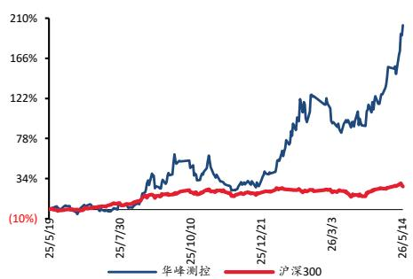

# 业绩持续增长，看好 8600 放量

## 走势比较

## 股票数据

<table><tr><td>总股本/流通(亿股)</td><td>1.36/1.36</td></tr><tr><td>总市值/流通(亿元)</td><td>558.4/558.4</td></tr><tr><td>12个月内最高/最低价</td><td>419.88/128.39</td></tr><tr><td>（元）</td><td></td></tr></table>

## 相关研究报告

<<华峰测控 2025 三季报点评：业绩持续高速增长，市场需求不断扩容>>--2025-11-11

<<华峰测控 2025 中报点评：2025H1业绩高增，AI 刺激新品需求旺盛>>--2025-09-02

<<太平洋证券公司点评-华峰测控（688200）：发布股权激励计划，彰显公司业绩高增长信心>>--2025-07-04

证券分析师：张世杰

E-MAIL：zhangsj@tpyzq.com

分析师登记编号：S1190523020001

证券分析师：罗平

E-MAIL：luoping@tpyzq.com

分析师登记编号：S1190524030001

事件：华峰测控发布 2025 年年报，2025 年公司实现营收 13.46 亿元，同比增长 48.72%；实现归母净利润 5.36 亿元，同比增长 60.55%。华峰测控发布 2026 年一季报，2026Q1 公司实现营收 2.72 亿元，同比增长 37.52%；实现归母净利润 0.94 亿元，同比增长 52.12%。

把握行业景气度上行机遇，营收利润双增长。2025 年，公司在持续优化产品矩阵，致力于为客户打造多样化、高效率的综合测试解决方案，全面提升了整体运营效能的同时，紧密把握国内宏观经济企稳向好及下游行业需求复苏的有利契机，2025年全年及 2026 年一季度公司经营业绩均实现了显著增长。2025年公司实现毛利率73.79%，，2026Q1实现毛利率75.30%，整体毛利率保持在较高水平，盈利能力持续增强。

期间费用把控合理，经营质量进一步提升。2025年公司发生销售费用1.57亿元，销售费率 11.66%，同比减少 2.48 pcts；发生管理费用 0.65 亿元，管理费率 4.83%，同比减少 1.58 pcts；发生研发费用 2.66 亿元，研发费率 19.76%，同比增长 0.76 pcts，主要系公司基于发展战略扩大研发团队，加快新产品研发进程并加大项目投入，以增强技术储备和市场竞争力；发生财务费用-0.35 亿元，同比增长 0.16 亿元，主要汇率变动导致汇兑损益变动所致。

半导体产业链资本开支明显增强，多系列产品线布局积极推进。从设备端看，半导体产业链资本开支在近年来明显增强，设备市场景气度高于行业整体增速。据 SEMI 预测，全球 300 毫米晶圆厂设备投资预计在 2026 年增长 18%至 1330 亿美元，2027 年再增长 14%至 1510 亿美元。公司围绕不同应用场景构建了较为完善的产品体系，主力机型 STS8200 系列聚焦模拟及功率IC测试，STS8300系列专注于混合信号及电源管理IC测试，STS8600系列面向高性能 SoC 芯片测试。各系列产品均基于平台化设计理念，具备良好的扩展性、兼容性和可复用性，能够较好适应被测芯片快速更新迭代及客户多样化测试需求，形成持续的产品竞争优势。

## 盈利预测

我们预计公司 2026-2028 年实现营收 18.04、21.97、28.03 亿元，实现归母净利润 7.29、9.24、11.82 亿元，对应 PE 76.59、60.45、47.26 亿元，维持公司“买入”评级。

风险提示：新产品拓展不及预期风险；下游需求不及预期风险，其他风险。

盈利预测和财务指标
<table><tr><td></td><td>2025A</td><td>2026E</td><td>2027E</td><td>2028E</td></tr><tr><td>营业收入 (百万元)</td><td>1,346</td><td>1,804</td><td>2,197</td><td>2,803</td></tr><tr><td>营业收入增长率(%)</td><td>48.72%</td><td>33.95%</td><td>21.79%</td><td>27. 60%</td></tr><tr><td>归母净利 (百万元)</td><td>536</td><td>729</td><td>924</td><td>1,182</td></tr><tr><td>净利润增长率(%)</td><td>60.55%</td><td>36.00%</td><td>26.70%</td><td>27.91%</td></tr><tr><td>摊薄每股收益 (元)</td><td>3.96</td><td>5.38</td><td>6.82</td><td>8.72</td></tr><tr><td>市盈率(PE)</td><td>104.16</td><td>76.59</td><td>60.45</td><td>47.26</td></tr></table>

资料来源：携宁，太平洋证券，注：摊薄每股收益按最新总股本计算

资产负债表（百万）
<table><tr><td colspan="6">资） 负债表（目万）</td></tr><tr><td></td><td>2024A</td><td>2025A</td><td>2026E</td><td>2027E</td><td>2028E</td></tr><tr><td>货币资金</td><td>2,090</td><td>2,066</td><td>2,604</td><td>3,138</td><td>3,712</td></tr><tr><td>应收和预付款项</td><td>519</td><td>753</td><td>771</td><td>867</td><td>1,146</td></tr><tr><td>存货</td><td> 177</td><td>300</td><td>279</td><td>327</td><td>405</td></tr><tr><td>其他流动资产</td><td>148</td><td>275</td><td>386</td><td>437</td><td>503</td></tr><tr><td>流动资产合计</td><td>2,934</td><td>3,395</td><td>4, 040</td><td>4, 771</td><td>5,766</td></tr><tr><td>长期股权投资</td><td>0</td><td>0</td><td>0</td><td>0</td><td>0</td></tr><tr><td>投资性房地产</td><td>0</td><td>0</td><td>0</td><td>0</td><td>0</td></tr><tr><td>固定资产</td><td>421</td><td>422</td><td>396</td><td>370</td><td>343</td></tr><tr><td>在建工程</td><td>0</td><td>0</td><td>0</td><td>0</td><td>0</td></tr><tr><td>无形资产开发支出</td><td>27</td><td>55</td><td>55</td><td>55</td><td>55</td></tr><tr><td>长期待摊费用</td><td>2</td><td>4</td><td>4</td><td>4</td><td>4</td></tr><tr><td>其他非流动资产</td><td>3,358</td><td>4,020</td><td>4,698</td><td>5,428</td><td>6,424</td></tr><tr><td>资产总计</td><td>3,808</td><td>4, 501</td><td>5,152</td><td>5,857</td><td>6,826</td></tr><tr><td>短期借款</td><td>0</td><td>0</td><td>0</td><td>0</td><td>0</td></tr><tr><td>应付和预收款项</td><td>54</td><td>83</td><td>101</td><td>119</td><td>148</td></tr><tr><td>长期借款</td><td>0</td><td>0</td><td>0</td><td>0</td><td>0</td></tr><tr><td>其他负债</td><td>183</td><td>330</td><td>456</td><td>496</td><td>609</td></tr><tr><td>负债合计</td><td>238</td><td>412</td><td>556</td><td>615</td><td>757</td></tr><tr><td>股本</td><td>135</td><td>136</td><td>136</td><td>136</td><td>136</td></tr><tr><td>资本公积</td><td>1,815</td><td>1,845</td><td>1,845</td><td>1,845</td><td>1,845</td></tr><tr><td>留存收益</td><td>1,525</td><td>1,976</td><td>2,484</td><td>3,130</td><td>3,957</td></tr><tr><td>归母公司股东权益</td><td>3,570</td><td>4,079</td><td>4,586</td><td>5,232</td><td>6,059</td></tr><tr><td>少数股东权益</td><td>0</td><td>10</td><td>10</td><td>10</td><td>10</td></tr><tr><td>股东权益合计</td><td>3,570</td><td>4,088</td><td>4,596</td><td>5,242</td><td>6,068</td></tr><tr><td>负债和股东权益</td><td>3,808</td><td>4, 501</td><td>5,152</td><td>5,857</td><td>6,826</td></tr></table>

<table><tr><td colspan="6">现金流量表（百万）</td></tr><tr><td></td><td>2024A</td><td>2025A</td><td>2026E</td><td>2027E</td><td>2028E</td></tr><tr><td>经营性现金流</td><td>188</td><td>304</td><td>711</td><td>809</td><td>926</td></tr><tr><td>投资性现金流</td><td>77</td><td>-51</td><td>49</td><td>3</td><td>3</td></tr><tr><td>融资性现金流</td><td>-122</td><td>-100</td><td>-220</td><td>-278</td><td>-355</td></tr><tr><td>现金增加额</td><td>145</td><td>150</td><td>538</td><td>534</td><td>573</td></tr></table>

资料来源：携宁，太平洋证券

<table><tr><td colspan="6">利润表 (百万）</td></tr><tr><td></td><td>2024A</td><td>2025A</td><td>2026E</td><td>2027E</td><td>2028E</td></tr><tr><td>营业收入</td><td>905</td><td>1,346</td><td>1,804</td><td>2, 197</td><td>2,803</td></tr><tr><td>营业成本</td><td>242</td><td>353</td><td>468</td><td>550</td><td>670</td></tr><tr><td>营业税金及附加</td><td>12</td><td>14</td><td>23</td><td>28</td><td>36</td></tr><tr><td>销售费用</td><td>128</td><td>157</td><td>198</td><td>198</td><td>252</td></tr><tr><td>管理费用</td><td>58</td><td>65</td><td>90</td><td>110</td><td>140</td></tr><tr><td>财务费用</td><td>-51</td><td>-35</td><td>-74</td><td>-68</td><td>0</td></tr><tr><td>资产减值损失</td><td>-1</td><td>-2</td><td>0</td><td>0</td><td>0</td></tr><tr><td>投资收益</td><td>0</td><td>0</td><td>14</td><td>10</td><td>5</td></tr><tr><td>公允价值变动</td><td>-12</td><td>46</td><td>0</td><td>0</td><td>0</td></tr><tr><td>营业利润</td><td>361</td><td>583</td><td>789</td><td>999</td><td>1,278</td></tr><tr><td>其他非经营损益</td><td>1</td><td>0</td><td>0</td><td>0</td><td>0</td></tr><tr><td>利润总额</td><td>361</td><td>583</td><td>789</td><td>999</td><td>1,278</td></tr><tr><td>所得税</td><td>27</td><td>47</td><td>60</td><td>76</td><td>97</td></tr><tr><td>净利润</td><td>334</td><td>536</td><td>729</td><td>924</td><td>1,182</td></tr><tr><td>少数股东损益</td><td>0</td><td>0</td><td>0</td><td>0</td><td>0</td></tr><tr><td>归母股东净利润</td><td>334</td><td>536</td><td>729</td><td>924</td><td>1,182</td></tr></table>

<table><tr><td rowspan=1 colspan=1>预测指标</td></tr><tr><td rowspan=1 colspan=1>2024A  2025A  2026E  2027E  2028E</td></tr><tr><td rowspan=1 colspan=1>毛利率                 73.31%73.79%74.06%74.95%76.09%</td></tr><tr><td rowspan=1 colspan=1>销售净利率             36.88%39.82% 40. 42%  42. 05% 42. 16%</td></tr><tr><td rowspan=1 colspan=1>销售收入增长率        31.05%48.72%33.95%21.79%27.60%</td></tr><tr><td rowspan=1 colspan=1>EBIT 增长率           49.56% 55. 97% 42.36%30.30%37. 25%</td></tr><tr><td rowspan=1 colspan=1>净利润增长率          32. 69% 60.55%36.00% 26.70%27.91%</td></tr><tr><td rowspan=1 colspan=1>ROE                     9.35% 13.14% 15. 90% 17. 65% 19.50%</td></tr><tr><td rowspan=1 colspan=1>ROA                     9.18% 12.90%15.11%16.78% 18.63%</td></tr><tr><td rowspan=1 colspan=1>ROIC                    8.30%11. 22% 14.30% 16.35% 19. 40%</td></tr><tr><td rowspan=1 colspan=1>EPS (X)                   2.46   3.96   5.38   6.82  8.72</td></tr><tr><td rowspan=1 colspan=1>PE (X)                   167. 23104. 16  76. 59  60.45  47. 26</td></tr><tr><td rowspan=1 colspan=1>PB(X)                    15.64  13.69 12.18  10.67  9.22</td></tr><tr><td rowspan=1 colspan=1> PS (X)                   61. 68  41. 47 30.96  25. 42  19. 92</td></tr><tr><td rowspan=1 colspan=1>EV/EBITDA (X)           34.35  44.22  71.89  55.07  39.98</td></tr></table>

## 投资评级说明

## 1、行业评级

看好：预计未来 6个月内，行业整体回报高于沪深 300指数5%以上；

中性：预计未来 6个月内，行业整体回报介于沪深 300指数-5%与5%之间；

看淡：预计未来 6个月内，行业整体回报低于沪深 300指数5%以下。

## 2、公司评级

买入：预计未来 6个月内，个股相对沪深 300指数涨幅在 15%以上；

增持：预计未来 6个月内，个股相对沪深 300指数涨幅介于 5%与15%之间；

持有：预计未来 6个月内，个股相对沪深 300指数涨幅介于-5%与5%之间；

减持：预计未来 6个月内，个股相对沪深 300指数涨幅介于-5%与-15%之间；

卖出：预计未来 6个月内，个股相对沪深 300指数涨幅低于-15%以下。

## 太平洋证券股份有限公司

云南省昆明市盘龙区北京路 926号同德广场写字楼 31楼

北京市西城区北展北街九号

华远·企业号 D座

投诉电话： 95397

投诉邮箱： kefu@tpyzq.com

## 免责声明

太平洋证券股份有限公司（以下简称“我公司”或“太平洋证券”）具备中国证券监督管理委员会核准的证券投资咨询业务资格。

本报告仅向与太平洋证券签署服务协议的签约客户发布，为太平洋证券签约客户的专属研究产品，若您并非太平洋证券签约客户，请取消接收、订阅或使用本报告中的任何信息；太平洋证券不会因接收人收到、阅读或关注媒体推送本报告中的内容而视其为太平洋证券的客户。在任何情况下，本报告中的信息或所表述的意见并不构成对任何机构和个人的投资建议，投资者应自主作出投资决策并自行承担投资风险，任何形式的分享证券投资收益或者分担证券投资损失的书面或口头承诺均为无效。

本报告信息均来源于公开资料，我公司对这些信息的准确性和完整性不作任何保证。负责准备本  
报告以及撰写本报告的所有研究分析师或工作人员在此保证，本研究报告中关于任何发行商或证券所  
发表的观点均如实反映研究人员的个人观点。报告中的内容和意见仅供参考，并不构成对所述证券买  
卖的出价或询价。我公司及其雇员对使用本报告及其内容所引发的任何直接或间接损失概不负责。我  
公司或关联机构可能会持有报告中所提到的公司所发行的证券头寸并进行交易，还可能为这些公司提面许可任何机

构和个人不得以任何形式翻版、复制、刊登。任何人使用本报告，视为同意以上声明。