## 澜起科技（688008）：全球互连芯片龙头厂商，聚焦“运力”构建AI战略护城河公司深度报告

增持（首次覆盖）

证券分析师

方霁S0630523060001

fangji@longone.com.cn

证券分析师

董经纬 S0630526040001

djwei@longone.com.cn

方逸洋

fyy@longone.com.cn

<table><tr><td rowspan=1 colspan=1>数据日期</td><td rowspan=1 colspan=1>2026/05/19</td></tr><tr><td rowspan=1 colspan=1>收盘价</td><td rowspan=1 colspan=1>247.11</td></tr><tr><td rowspan=1 colspan=1>总股本（万股)</td><td rowspan=1 colspan=1>122,220</td></tr><tr><td rowspan=1 colspan=1>流通A股/B股（万股）</td><td rowspan=1 colspan=1>114,643/0</td></tr><tr><td rowspan=1 colspan=1>资产负债率(%)</td><td rowspan=1 colspan=1>4.17%</td></tr><tr><td rowspan=1 colspan=1>市净率(倍)</td><td rowspan=1 colspan=1>14.54</td></tr><tr><td rowspan=1 colspan=1>净资产收益率(加权)</td><td rowspan=1 colspan=1>5.39</td></tr><tr><td rowspan=1 colspan=1>12个月内最高/最低价</td><td rowspan=1 colspan=1>282.00/75.15</td></tr></table>

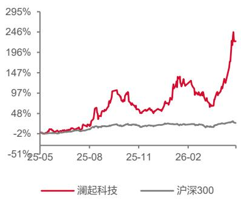

## 投资要点：

V 公司是全球内存互连芯片龙头厂商，也是少数能提供全系列全/半缓冲式DDR2至DDR5内存接口解决方案的企业，2024年全球市占率约36.8%位列第一，客户涵盖三星电子、SK海力士、美光等全球头部DRAM厂商，持续引领行业产品迭代。当前AI服务器加速渗透，出货量上升，叠加存储周期上行，拉动内存接口芯片的需求上行，根据TrendForce，2026年AI服务器出货量有望同比增长28.3%超200万台。DDR5子代迭代速度正不断加快，不仅拉动内存接口芯片量价齐升，同时新增配套芯片需求，此外适用于高带宽需求AI服务器的MRDIMM正在逐步商业化落地，其内存接口芯片用量和价值量超越同时期RDIMM，有望进一步拉动内存接口芯片市场增长，2026年全球内存互连芯片市场规模有望达到18.46亿美元，预计2025-2030年全球内存互连芯片市场规模CAGR将达25.9%。全球内存接口芯片市场主要被澜起科技、瑞萨电子（IDT）、Rambus占据，公司2024年市占率36.8%位列第一，作为JEDEC董事会成员，公司深度参与行业标准制定并引领技术迭代，并导入了三星电子、SK海力士、美光等全球头部DRAM供应商供应链，与CPU、GPU制造商建立了长期合作伙伴关系，有助于保持产品的前瞻性开发。目前公司DDR5第三子代RCD芯片营收已超过第二子代，第四子代已量产，产品领先行业一个子代，同时是全球唯二提供DDR5第一及第二子代MRCD/MDB芯片的供应商，也是业内首家发布并试产DDR5CKD芯片的厂商，有望率先受益于内存互连芯片需求的上升。

公司PCleRetimer芯片迅速起量，2024年市占率全球第二，自研SerDesIP构建技术核心护城河，支撑PCIe/CXL互连芯片的性能升级，叠加高粘性客群基础，助力打造公司新的增长曲线。（1）目前PCle5.0已成为市场主流，8卡AI服务器通常配备8-16颗PCleRetimer和2-4颗PCle Switch，2026年全球PCle互连芯片市场规模有望达到39.04亿美元，预计2025-2030年全球PCle市场规模CAGR达20.1%。全球PCle Retimer市场主要被AsteraLabs占据，PCle Switch市场主要由博通主导，公司作为主要供货PCle5.0Retimer芯片的两家厂商之一，2024年产品迅速起量，市占率约10.9%位列全球第二，2025年已推出PCle6.x/CXL3.xRetimer芯片，并稳步推进PCleSwitch研发中，自研SerDes IP构筑核心技术护城河，公司已成功研发速率为32GT/s和64GT/s的SerDes IP，PCle7.0 SerDes IP在研中。（2）CXLMXC和CXLSwitch协同构建CXL互连解决方案，目前单个内存池化服务器通常需要配置16-32颗CXLMXC和2-4颗CXLSwitch芯片，主流CPU厂商、内存模组厂商均相继研发和推出支持CXL协议的产品，服务器平台也有相关产品开始应用，预计2025-2030年全球CXL互连芯片市场规模CAGR有望达到170.2%，公司全球首发CXLMXC芯片，进入CXL联盟合规供应商清单并导入全球龙头内存厂商，目前已推出基于CXL3.1标准的MXC芯片并向主要客户送样测试，CXL生态成熟后有望成为公司业绩的新增长极。

投资建议：首次覆盖，给予“增持”评级。随着AI服务器渗透率提升与出货量增长，市场对高性能互连类芯片需求持续上升，公司作为互连类芯片全球头部厂商，有望率先受益于产品子代迭代与需求增长，我们预计公司2026-2028年营业收入分别为75.07、95.62和117.74亿元，同比增速分别为37.58%、27.37%和23.14%；归母净利润分别为32.70、44.70和58.66亿元，同比分别增长46.27%、36.71%、31.23%。对应2026-2028年的PE分别为92、68、51倍。

》风险提示：产品研发与导入不及预期；地缘政治风险；市场需求不及预期风险；估值回调风险。

盈利预测与估值简表
<table><tr><td></td><td>2023A</td><td>2024A</td><td>2025A</td><td>2026E</td><td>2027E</td><td>2028E</td></tr><tr><td>主营收入(百万元)</td><td>2,285.74</td><td>3,638.91</td><td>5,456.32</td><td>7,506.78</td><td>9,561.63</td><td>11,773.73</td></tr><tr><td>同比增速(%)</td><td>-37.76%</td><td>59.20%</td><td>49.94%</td><td>37.58%</td><td>27.37%</td><td>23.14%</td></tr><tr><td>归母净利润(百万元)</td><td>450.91</td><td>1,411.78</td><td>2,235.57</td><td>3,269.90</td><td>4,470.45</td><td>5,866.38</td></tr><tr><td>同比增速(%)</td><td>-65.3%</td><td>213.1%</td><td>58.4%</td><td>46.27%</td><td>36.71%</td><td>31.23%</td></tr><tr><td>毛利率(%)</td><td>58.91%</td><td>58.13%</td><td>62.23%</td><td>64.11%</td><td>65.93%</td><td>67.51%</td></tr><tr><td>每股盈利(元)</td><td>0.37</td><td>1.16</td><td>1.83</td><td>2.68</td><td>3.66</td><td>4.80</td></tr><tr><td>ROE(%)</td><td>4.4%</td><td>12.4%</td><td>17.3%</td><td>21.9%</td><td>24.8%</td><td>26.6%</td></tr><tr><td>PE(倍)</td><td>669.80</td><td>213.93</td><td>135.10</td><td>92.36</td><td>67.56</td><td>51.48</td></tr></table>

资料来源：携宁，东海证券研究所，截至2026年5月19日

## 正文目录

1.全球互连芯片龙头企业，业绩进入增长快车道. 6  
1.1．全球数据处理及互连芯片设计龙头企业 6  
1.2．率先受益于AI驱动与周期上行，充足备货奠定业绩高增基础 8  
2．全球最大的内存互连芯片供应商，产品技术迭代行业领先....12  
2.1.DDR5已成为内存接口技术主流标准 12  
2.2.AI服务器需求上行与内存迭代加速拉动内存接口芯片量价齐升 15  
2.3．深度构建供应链合作关系，引领行业产品代际更新.. .17  
3.PCle/CXL互连芯片开拓新增长曲线，自研SerDes IP 构建核心护  
城河. 21  
3.1.PCleRetimer核心供应商，PCleSwitch研发稳步推进 .21  
3.2.全球首发CXLMXC芯片，生态成熟后有望率先受益. .25  
3.3．布局一站式时钟芯片解决方案，挖掘以太网和光互连市场新机遇 .28  
4.盈利预测 31  
4.1．业务拆分与假设 .31  
4.2．可比公司估值. .32  
4.3.投资建议.. 32  
5.风险提示 33

## 图表目录

图1公司历史沿革... ..6  
图2 2020-2026 年第一季度公司营业收入与同比增速. ...9  
图32020-2026年第一季度公司归母净利润与同比增速， ..9  
图4 2020-2025年公司分业务营业收入与营收占比..  
图5 2020-2025年公司分业务毛利率. ..9  
图6 2020-2026 年第一季度公司与可比公司毛利率.. ...0  
图72020-2026 年第一季度公司与可比公司净利率.. ..10  
图8 2020-2026年第一季度公司各费用率..  
图92020-2026年第一季度公司研发费用与同比增速. ….10  
图10 2020-2026 年第一季度末公司存货与存货周转天数. ...1  
图11计算机系统内存互连芯片与其他组件连接方式. .13  
图12 DDR5 MRDIMM /MCRDIMM 内存接口芯片 ..13  
图13内存互连芯片在不同类型的存模组中的应用及配比数量….15  
图14 2020-2026E年全球PC 出货量及同比增速. ..15  
图15 2023-2026E年全球服务器出货量年增速. ...5  
图16 2022-2030E年按DRAM代际划分全球服务器内存模组出货量（百万根） .….16  
图172025-2030E年全球MRDIMM出货量（百万根）. ..16  
图18 2022-2030E年全球各类内存互连芯片市场规模（百万美元） .. 16  
图19 2024年全球内存互连芯片市场格局.. .17  
图20 瑞萨电子服务器 DDR5 MRDIMM 解决方案... 17  
图 21 Rambus DDR5 RDIMM 内存接口...  
图 22 公司 DDR4 全缓冲"1+9"架构.  
图23 公司DDR5各子代内存接口芯片迭代情况， ...19  
图24 公司CKD 芯片在CUDIMM中的位置分布， ...200  
图 25 公司内存模组配套芯片在典型内存模组中的位置分布. ...20  
图 26 PCle 协议迭代中 I/O 带宽每三年..  
图27 PCle不同通道数和不同代际决定的总带宽. ..22  
图28无PCle Retimer和配备一个的传输长度对比.. ...22  
图 29 PCle Retimer 的典型应用场景. ..22  
图 30 PCle Switch 主要功能. ...23  
图 31 2023-2030E年全球 PCle 互连芯片市场规模. .24  
图322024年全球PCle Retimer市场竞争格局. ...4  
图33 2025年全球 PCle Switch市场竞争格局. ..4  
图34公司PCle Retimer芯片及对应板卡示意图 ...25  
图 35 CXL2.0机架级内存池. ...26  
图 36 CXL 3.0 Fabric Architecture. .. 26  
图 37 CXL MXC 和 CXL Switch 典型应用场景 ..26  
图 38 CXL.MXC在.AIC 连接标准DDR5/4存模组中的产品应用形态. ..7  
图 39 CXL MXC 芯片在 EDSFF 内存模组中的产品应用形..  
图40 2024-2030E年全球CXL互连芯片市场规模（百万美元）  
图41 2024-2030E年全球CXL互连芯片市场规模（亿美元） ..28  
图422025-2030E全球以太网互连芯片市场规模（亿美元） ..29  
图432025-2030E全球光互连芯片市场规模（亿美元） ..29  
图44公司时钟芯片系列产品示意图，  
表1公司主要产品、功能及应用. ..7  
表2公司高管履历. 8  
表3内存模组主要类型 .12  
表4 DDR5 DIMMs 相比 DDR4 DIMMs 的优势 .13  
表5公司DDR5MRCD/MDB芯片及主要应用情况. .19  
表62023-2028E澜起科技分业务营收及毛利率预测（百万元） .31  
表72023-2028E澜起科技盈利预测结果（百万元） .32  
表8可比公司PE估值 .32  
附录：三大报表预测值 .34

## 1.全球互连芯片龙头企业，业绩进入增长快车道

## 1.1.全球数据处理及互连芯片设计龙头企业

（1）澜起科技是全球数据处理及互连芯片设计龙头企业，专为云计算和AI基建提供创新、可靠、高能效的互连解决方案。公司成立于2004年，2019 年于上交所科创板上市，2026 年于港股上市。公司产品主要包含DDR2至DDR5内存互连芯片、PCle/CXL互连芯片、时钟芯片以及津逮CPU产品等，以服务器为主要应用场景，兼有部分PC应用，因此广泛适用于数据中心、云计算、人工智能等下游领域。公司在2024年全球内存互连芯片市场中份额位列第一，在全球PCle Retimer市场中份额位列第二，公司同时也是JEDEC（固态技术协会）董事会成员，牵头制定了DDR5RCD、MDB及CKD 芯片国际标准。

图1 公司历史沿革  
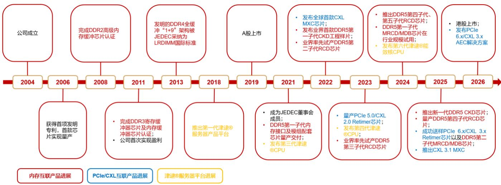  
资料来源：公司公告，公司官网，东海证券研究所

（2）公司产品线主要分为互连类芯片与津逮产品两大产品线，其中：互连类芯片主要包括DDR 协议的内存接口芯片和内存模组配套芯片、PCle/CXL互连芯片以及时钟芯片；津逮?产品主要包括津逮?CPU及数据保护和可信计算加速芯片等。

1）内存接口芯片是服务器内存模组（内存条）的核心逻辑器件，主要功能是优化数据传输速度、提高信号完整性并实现计算系统的稳定性，也是公司的基石业务，公司是全球可提供从DDR2到DDR5内存全缓冲/半缓冲完整解决方案的主要供应商之一。公司内存接口芯片主要包含RCD/DB、MRCD/MDB 和CKD。

2）内存模组配套芯片包括串行检测集线器（SPD）、温度传感器（TS）以及电源管理芯片（PMIC）。根据JEDEC 标准，上述芯片在DDR5内存模组中广泛应用，为服务器及PC 提供性能更优、容量更大的一站式内存接口解决方案。

3)PCle互连芯片是数据中心和服务器高速数据互连的核心组件，主要包含解决数据在高速、远距离传输场景中时序不齐、损耗严重、完整性差等问题的PCleRetimer芯片，以及扩产PCle通道可用性、实现多设备间高密度PCle互连的PCleSwitch芯片；CXL互连芯片主要用于内存扩展和内存池化场景，公司CXLMXC 芯片于2022年全球首发。

4）时钟芯片是为电子系统提供其必要的时钟脉冲的芯片，为不同的芯片和功能模块提供统一的时序基准，确保各部件的协调稳定。公司已发布的时钟芯片主要包含时钟发生器芯片、时钟缓冲芯片和展频振荡器等。

5）津逮?服务器平台主要包含津逮?CPU及数据保护和可信计算加速芯片等，具备芯片级实时安全监控功能，可在信息安全领域发挥重要作用，为云计算数据中心提供更安全可靠的运算平台。公司利用从英特尔采购的x86 内核开发了津逮?CPU，具备PrC（预检测）或DSC（动态安全检查）功能，目前公司已发布第六代津逮?能效核CPU和性能核CPU。

表1公司主要产品、功能及应用
<table><tr><td colspan="2">产品线</td><td>主要协议</td><td>主要产品 RCD、DB、</td><td>功能</td><td>下游应用</td></tr><tr><td rowspan="4">互连类 芯片</td><td rowspan="2">内存互连 芯片</td><td rowspan="2">DDR 协议</td><td>MRCD、 MDB、CKD</td><td>作为服务器CPU存取内存数据的通路， 提升内存数据访问的速度及可靠性 内存模组配套芯片，用于实现系统主控设</td><td>服务器及 PC 内存模组</td></tr><tr><td>SPD、 PMIC、 TS</td><td>备与内存模组上组件之间的通信管理、内 存模组上其他芯片的电源管理、内存模组 温度监控等功能</td><td>服务器及 PC 内存模组</td></tr><tr><td>PCle/CXL 互连芯片</td><td>PCle/CXL 协议</td><td>PCle Retimer CXL MXC</td><td>主要用于解决在高速、远距离传输场景中 时序不齐、衰减、完整性差等信号问题 用于内存池化及内存扩展</td><td>服务器 服务器</td></tr><tr><td rowspan="2">时钟芯片</td><td rowspan="2">/</td><td>时钟发生器、 时钟缓冲器、</td><td>为电子系统提供其必要的时钟脉冲，为不 同的芯片和功能模块提供统一的时序基</td><td>服务器、通信基础 设施、工控设备、 消费电子、</td></tr><tr><td>展频振荡器 津逮@CPU等 /</td><td>准，确保系统各部件的协调、稳定运行 是具有PrC（预检测）或 DSC（动态安全 检查）功能的x86架构 CPU</td><td>汽车电子 服务器</td></tr></table>

资料来源：公司公告，东海证券研究所

（3）公司基本通过直销销售产品，客户涵盖全球领先服务器DRAM厂商。公司供应商主要为晶圆代工厂、封测厂、配套芯片及CPU内核提供商，包括台积电、Amkor、STATSChipPAC、聚辰半导体和英特尔等，其中公司以公平方式采购英特尔的标准CPU内核，并将其与公司专有的PrC（预检测）或DSC（动态安全检查）功能集成。从客户角度看，公司主要通过直销方式销售互连类芯片，小部分通过分销渠道来优化应收账款周期和提升客户管理效率。公司互连类芯片客户主要包括内存模组制造商及服务器OEM/ODM；津逮?平台客户主要包括企业及服务器OEM/ODM；终端客户包括云厂商。客户有CEAC、美光、三星、SK 海力士等，据弗若斯特沙利文数据，美光、三星和SK海力士在2024年合计占据全球服务器DRAM市场超过90%。2025年公司前五大客户销售额占年度总销售额的77.24%，前五大供应商采购额占年度采购总额的79.39%。

（4）公司高管层以半导体行业资深专家为核心，兼具顶尖学府背景与产业深度融合的复合优势。公司创始人杨崇和博士和 Stephen Kuong-lo Tai先生于2004年共同创立澜起科技并任职至今，不仅具备相关顶尖学术背景，且曾在海内外头部半导体厂商有相关研发管理经验，核心技术人员杨崇和博士、常仲元先生、史刚先生均具备在IDT、Marvel等国际一流半导体企业的履历，支撑起公司在高速互连芯片领域的技术护城河，使公司既能紧跟国际前沿标准制定，又能高效实现产品落地。

表2公司高管履历
<table><tr><td>姓名</td><td>职位</td><td>性别</td><td>履历</td></tr><tr><td>杨崇和</td><td>董事长、 首席执行官、 核心技术人员</td><td>男</td><td>美国国籍，拥有中华人民共和国外国人永久居留权，美国俄勒冈州立大学电子 与计算机工程学硕士及博士。1990-1994年于美国国家半导体等公司从事芯 片设计研发工作；1994-1996 年任上海贝岭新产品研发部负责人。1997年与 同仁共同创建新涛科技，该公司于2001年与IDT公司成功合并；2004年与 StephenTai共同创立澜起科技，自创立至今任公司董事长兼首席执行官。杨 博士于2010年当选美国电气和电子工程师协会院士（IEEEFellow），2022 年11月，杨博士被授予 IEEE终身院士（IEEELife Fellow）称号。</td></tr><tr><td>Stephen Kuong-lo Tai</td><td>执行董事、 总经理</td><td>男</td><td>美国国籍，美国约翰霍普金斯大学电子与计算机工程学士，斯坦福大学电子工 程学硕士，拥有30 年的半导体架构、设计和工程管理经验。1994-1995年任 SigmaxTechnology 公司资深设计工程师；1995-2003年参与创建Marvell科 技集团并担任工程研发总监；自澜起科技创立至今任公司董事兼总经理。</td></tr><tr><td>苏琳</td><td>副总经理、 财务负责人</td><td>女</td><td>中国国籍，无境外永久居留权，复旦大学学士。曾任普华永道会计师事务所审 计经理，道康宁有机硅贸易（上海）有限公司财务总监，道康宁（张家港）有 限公司财务总监。2007年9月加入澜起科技，历任财务总监、行政与财务副 总裁，副总经理兼财务负责人。</td></tr><tr><td>傅晓</td><td>董事会秘书</td><td>女</td><td>中国国籍，无境外永久居留权，华东政法大学经济法学硕士，具备法律职业资 格。曾任上海金桥信息股份有限公司证券事务代表兼法务，新焦点集团董事会 办公室助理兼法务。2016年加入澜起科技，历任公司证券事务经理、证券事 务高级经理、证券事务代表。2021年9月起担任澜起科技董事会秘书。</td></tr><tr><td>常仲元</td><td>核心技术人员、 研发部负责人</td><td>男</td><td>比利时国籍，比利时鲁文大学微电子学博士。1990-2000 年任Alcatel Bell Belgium 高级IC 设计工程师；2000-2010年任IDT副总裁；2010-2013年任 上海贝岭首席技术官。2013年7月加入澜起有限，现任研发部负责人。 中国国籍，无境外永久居留权，复旦大学电子工程系微电子硕士。1992-1994</td></tr><tr><td>史刚</td><td>核心技术人员、 运营部负责人</td><td>男</td><td>年任上海先进半导体公司质量工程师及质量部经理；1998年任新涛科技营运 副总经理；2001-2004年任IDT-新涛科技营运副总经理；2004-2012年历任 上海新进半导体制造有限公司营运副总裁，第一产品事业群总经理；2012- 2017年任Diodes Inc分立器件事业群保护类产品事业部总经理兼分立器件事 业群中国市场总监。2017年8月加入澜起有限，现任运营部负责人。</td></tr></table>

资料来源：wind，东海证券研究所

## 1.2.率先受益于AI驱动与周期上行，充足备货奠定业绩高增基础

(1)2024年起公司营收与归母净利润恢复高速增长。公司下游存储行业具备明显的周期性特点，2021年公司主要利润来源DDR4内存接口芯片进入产品生命周期后期，DDR5还未大规模起量；2023年公司受全球服务器及计算机行业需求下滑导致的客户去库影响，内存接口芯片与津逮?CPU出货量同比下滑较多，使得2021和2023年公司归母净利润有所承压，但自2024年起行业需求回暖，2025年存储进入超级周期，叠加DDR5渗透率持续提升，公司产品性能与代际行业领先，整体营收与归母净利润显著回升，同时公司积极拓展PCle与CXL产业版图,2025年公司营收同比增长49.9%,归母净利润同比增长58.4%，均达历史新高。2026 年第一季度，公司营收同比增长58.4%，归母净利润同比增长61.3%，同样创下单季度新高。

图22020-2026年第一季度公司营业收入与同比增速  
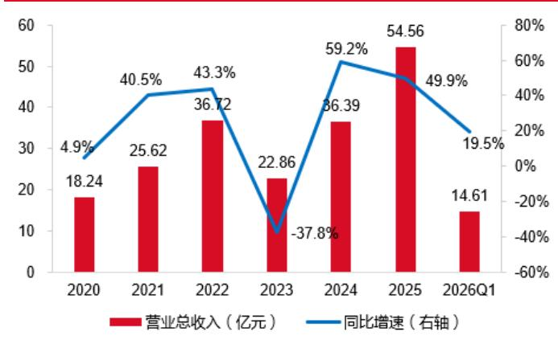  
资料来源：iFind，东海证券研究所

图3 2020-2026年第一季度公司归母净利润与同比增速  
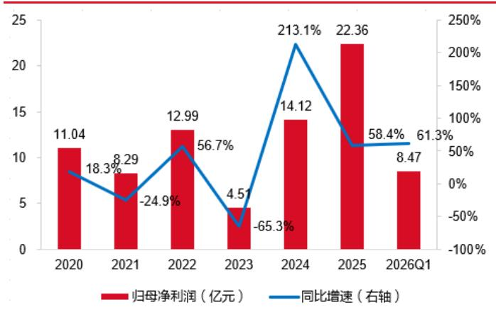  
资料来源：iFind，东海证券研究所

（2）互连类芯片贡献营收的90%以上，且随着子代迭代和高毛利率产品份额上升，2026Q1公司互连类芯片毛利率进一步上升至71.5%。按照业务划分，公司营收可分为互连类芯片和津逮服务器平台。2021年公司因津逮CPU业务取得重大突破，且当时主要利润来源DDR4内存接口芯片进入产品生命周期后期，价格下降，而DDR5产品在2021Q4才正式量产出货，因此造成互连类芯片产品线营收与毛利率均同比有所下滑。2023年起，公司互连类芯片占比维持在90%以上，毛利率逐年上升，主要系产品不断迭代，高价值量产品占比提升。2025年，公司互连类芯片营收占比94.18%，毛利率为65.57%；津逮服务器平台营收占比5.65%，毛利率为7.42%。2026 年第一季度，公司互连类芯片毛利率进一步提升至71.5%，同比增长7个百分点，环比增长3.8个百分点。

图42020-2025年公司分业务营业收入与营收占比  
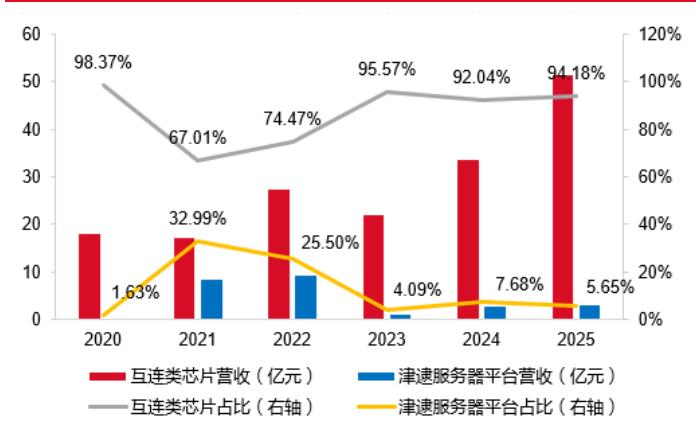  
资料来源：iFind，东海证券研究所

图52020-2025年公司分业务毛利率  
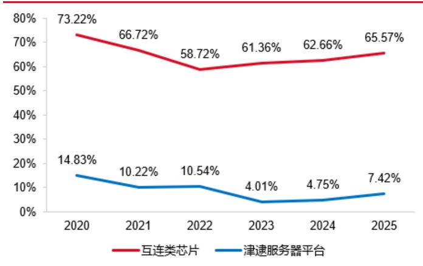  
资料来源：iFind，东海证券研究所

（3)公司毛利率与净利率处于行业较高水平，由于公司产品性能与迭代节奏行业领先，随着产品结构优化，高毛利产品占比提升，公司毛利率自2023年起持续攀升，2026Q1净利率达2021年起最高水平。此处选取了国内存储芯片头部厂商兆易创新、普冉股份，CPU头部厂商海光信息、服务器厂商中科曙光以及同样以内存接口芯片为主营业务的海外厂商Rambus，与公司毛利率和净利率进行对比。从对比结果可知，公司毛利率和净利率处于行业较高水平，2026 年第一季度公司综合毛利率为69.79%，同比上升9.34个百分点，仅次于 Rambus，净利率为56.80%，居于上述厂商最高水平，体现公司产品竞争力较强，产品结构持续优化，带动盈利能力上行，同时公司也拥有较好的费用控制与成本优化能力。

图62020-2026年第一季度公司与可比公司毛利率  
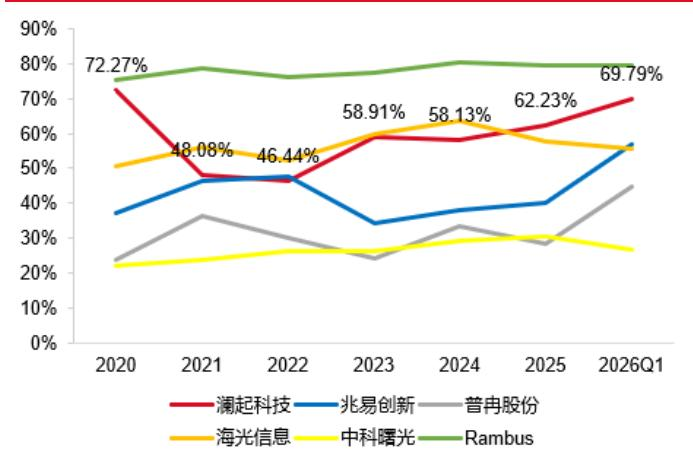  
资料来源：iFind，东海证券研究所（注：数据标签为公司毛利率）

图72020-2026年第一季度公司与可比公司净利率  
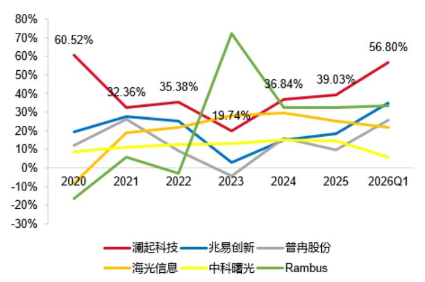  
资料来源：iFind，东海证券研究所（注：数据标签为公司净利率）

（4）研发投入稳步增长，其余三费费率较为稳定。随着公司营收规模扩大，研发费用投入也在逐年增长，2026Q1公司研发费用同比增长22.92%，占营业收入的12.88%，截至2025 年末，公司研发人员占总人数的比例约为74.4%，其中具备硕士及以上学历的占比约64%。除研发费用外，公司销售、管理、财务费率较为稳定，2025年公司管理费率略有上升，主要系实施核心高管激励计划导致股份支付费用增加所致。

图82020-2026年第一季度公司各费用率  
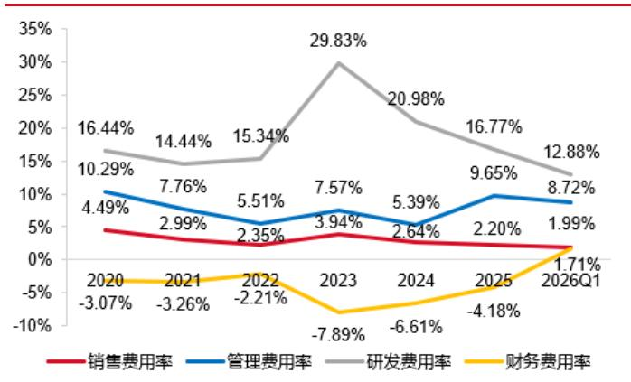  
资料来源：iFind，东海证券研究所

图92020-2026年第一季度公司研发费用与同比增速  
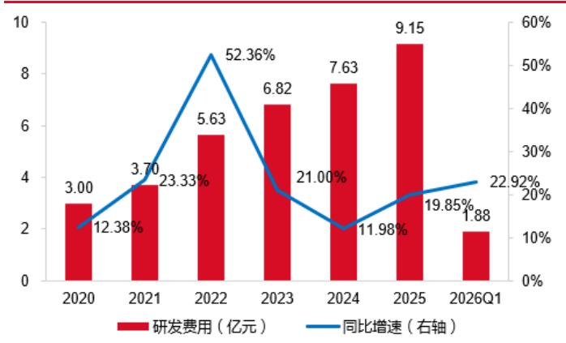  
资料来源：iFind，东海证券研究所

（5）2025年末公司存货大幅增长，其中互连类芯片库存量同比增长184.09%达1.34亿颗，2026Q1末存货进一步增长至9.82亿元，为2026年业绩高增奠定坚实基础。2025年公司互连类芯片生产量同比2024年增长66.28%，销售量同比增长53.04%，库存量同比增长184.09%达1.34亿颗，使得2025年末公司存货大幅增长至8.96亿元，主要系客户需求及销售订单增长，公司相应增加备货所致，其中互连类芯片库存量包含了所有存货的数量（库存商品数量及原材料、委托加工物资模拟转换为库存商品的数量，其中库存商品数量为2495.78万颗），成为2026年公司业绩同比继续高增的有力支撑。2026Q1末公司存货进一步增长至9.82亿元，印证了需求端的高景气度。

图102020-2026年第一季度末公司存货与存货周转天数  
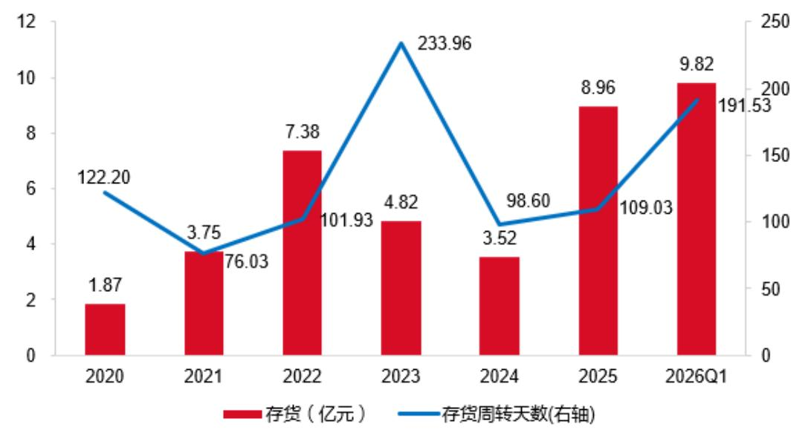  
资料来源：iFind，东海证券研究所

## 2.全球最大的内存互连芯片供应商，产品技术迭代行业领先

## 2.1.DDR5已成为内存接口技术主流标准

（1）内存模组是CPU和硬盘的数据中转站，应用场景涵盖服务器、台式机和笔记本等。内存模组将多个DRAM芯片颗粒及辅助元件封装在一起，可临时存储数据，且存储和读取速度远高于硬盘，因此内存模组是计算机架构的核心组成部分之一。按照下游应用划分，内存模组可分为服务器内存模组和普通台式机、笔记本内存模组等，前者主要涵盖RDIMM、LRDIMM等类型，后者主要包括UDIMM、SODIMM等。UDIMM由于无缓冲，内存控制器的信号直接传输到颗粒，因此结构简单，成本更低，同时容量较低，稳定性相对较差；而RDIMM存在寄存器进行缓冲，可提升信号的驱动能力，减少长距离传输中的衰减，因此容量、稳定性都更高。内存模组的技术演进具有明确的代际发展路径，JEDEC(固态技术协会）负责制定相关技术规范，包括模组结构、性能指标及具体参数等。为适应传输速度的提升以及新兴市场需求，JEDEC还相继推出了多种新型内存模组架构，如面向服务器的MRDIMM，以及适用于台式机和笔记本电脑的CUDIMM、CSODIMM、CAMM、LPCAMM等。

表3内存模组主要类型
<table><tr><td>内存模组类型</td><td>含义</td><td>应用场景</td></tr><tr><td>UDIMM</td><td>Unbuffered Dual In-Line Memory Module，无缓冲双列直插内存模组，指 地址和控制信号不经缓冲器，无需做任何时序调整的内存模组</td><td>台式机</td></tr><tr><td>CUDIMM</td><td> Clocked Unbuffered DIMM，指搭配一颗 CKD 芯片的 UDIMM</td><td>台式机</td></tr><tr><td>SODIMM</td><td>Small Outline DIMM，小型双列直插内存模组</td><td>笔记本电脑</td></tr><tr><td>CSODIMM</td><td>Clocked Small Outline DIMM，指搭配一颗 CKD 芯片的 SODIMM Compression Attached Memory Module，一种新型内存模组标准，采用</td><td>笔记本电脑</td></tr><tr><td>CAMM</td><td>DDR5内存颗粒，通过优化模组布局和使用更紧凑的连接器，实现更轻薄 尺寸、更高容量、更低功耗和更优散热性能</td><td>笔记本电脑、 移动工作站</td></tr><tr><td>LPCAMM</td><td>Low PowerCAMM的缩写，结合了LPDDR内存的低功耗特性与CAMM 模组的紧凑设计，提供高性能、低功耗且可升级的内存解决方案</td><td>轻薄笔记本、 移动工作站等</td></tr><tr><td>RDIMM</td><td>Registered DIMM，寄存式双列直插内存模组，采用了RCD芯片对地址、 命令、控制信号进行缓冲</td><td>服务器</td></tr><tr><td>LRDIMM</td><td>Load Reduced DIMM，减载双列直插内存模组，采用了 RCD 和 DB 套片 对地址、命令、控制信号及数据信号进行缓冲</td><td>服务器</td></tr><tr><td>MRDIMM /MCRDIMM</td><td>Multiplexed Rank DIMM，多路复用双列直插内存模组，是一种更高带宽 的服务器内存模组，基于DDR5 LRDIMM架构，采用“1+10”设计方案 （搭配1颗MRCD 芯片和10颗MDB 芯片），与RDIMM/LRDIMM相比， MRDIMM可以同时访问内存模组上的两个阵列，实现双倍带宽。部分厂家 将第一子代产品称为MCRDIMM</td><td>服务器</td></tr></table>

资料来源：公司公告，东海证券研究所

（2）内存接口芯片是服务器内存模组的核心部件，可优化数据传输速度、提高信号完整性、增强计算系统稳定性。内存接口芯片作为CPU与内存模组之间的高速桥梁，能够实现对计算机内存的更快和更可靠的访问，以满足对CPU速度和容量日益提高的需求。内存接口芯片主要包含RCD/DB、MRCD/MDB、CKD 等。

1）RCD（Registering Clock Driver，寄存时钟驱动器）可缓存来自内存控制器的地址、命令、时钟和控制信号，主要用于RDIMM和LRDIMM；DB（Data Buffer，数据缓冲器）可缓存来自内存控制器或DRAM 颗粒的数据信号，主要用于LRDIMM。

2）MRCD（ Multiplexed Rank RCD ）及 MDB（ Multiplexed Rank DB）是MRDIMM/MCRDIMM的核心逻辑器件，两者功能类似RCD和DB，但设计更为复杂、支持速率更高，且在标准数据速率下，MDB芯片允许同时访问两个DRAM阵列（传统的RDIMM只能访问一个阵列)，从而实现双倍的带宽。

3）CKD（ClockDriver，时钟驱动器）用于缓冲及重新驱动时钟信号，以维持高速时钟信号的完整性及可靠性。在采用DDR5内存模组之前，时钟驱动功能集成在RCD芯片中，但随着DDR5数据传输速率的不断提高，时钟信号频率亦显著上升，导致信号完整性面临越来越大的挑战。根据JEDEC规范，当DDR5数据速率达到6400MT/s及以上时，台式机及笔记本电脑所使用的内存模组需配备一颗专用的CKD，其核心功能是对来自CPU的高速内存时钟信号进行缓冲处理后，输出到内存模组（如CUDIMM、CSODIMM）上的多个内存颗粒，以确保高频率下的时序一致性和信号完整性。

图11计算机系统内存互连芯片与其他组件连接方式  
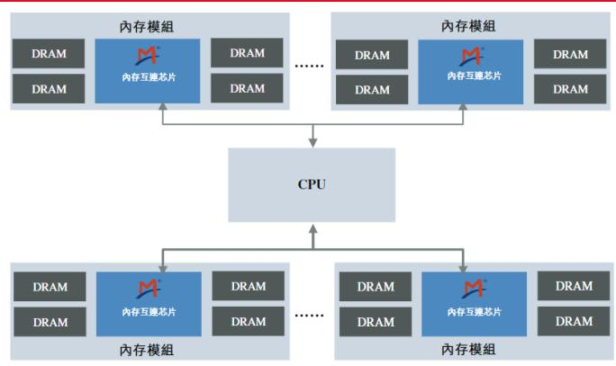  
资料来源：公司公告，东海证券研究所

图12DDR5MRDIMM/MCRDIMM内存接口芯片  
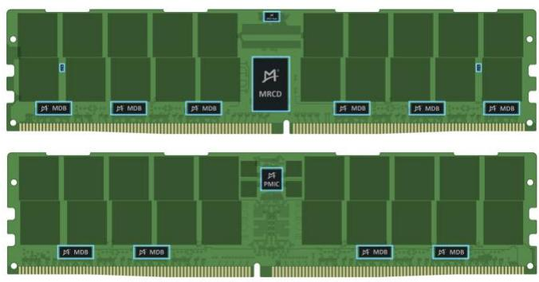  
资料来源：公司官网，东海证券研究所

（3）内存接口产品基于内存接口技术，目前DDR5已逐渐成为主流标准，在数据传输速度、带宽、容量及能效等方面相比前代都有所提升。该技术随着JEDEC制定的内存模组标准迭代而不断演进，目前应用最广泛的标准之一是DDRSDRAM（DoubleData RateSDRAM，双倍数据速率同步动态随机存取存储器），在SDRAM的基础上，DDR通过时钟信号的上升沿和下降沿同时传输数据，实现双倍于传统SDRAM的传输速率。DDR1于2000年前后商业化，后续DDR标准在数据传输速度、带宽、容量及能效方面都在不断迭代提升。2016 年起，DDR4技术进入成熟期并成为内存市场的主流技术，DDR4世代共有四个子代产品，最后一个子代产品支持的最高传输速率达到3200MT/s。当前，行业正从DDR4转向DDR5,DDR5标准正式于2020年发布，尤其在服务器和高吞吐量应用中已成为主流标准，目前DDR5第一、第二、第三子代内存产品已实现量产，JEDEC已完成第四子代产品标准制定，并正在推进第五、第六子代产品标准的制定。相较DDR4最后一个子代产品，DDR5内存接口芯片采用了更低的工作电压（1.1V)，并在传输效率和可靠性上进一步提升。DDR5内存接口芯片(RDIMM)前五个子代产品支持速率分别是4800MT/s、5600MT/s、6400MT/s、7200MT/s、8000MT/s，最后一个子代支持速率预计将达到9200MT/s。

表4DDR5DIMMs 相比DDR4 DIMMs的优势
<table><tr><td>特性</td><td>DDR4 DIMMs</td><td>DDR5 DIMMs</td><td>DDR5优势</td></tr><tr><td>传输速率</td><td>1.6-3.2 GT/s、</td><td>4.8-8.4 GT/s、 0.8-1.6 GHz时钟速度1.6-4.2 GHz 时钟速度</td><td>更高的带宽</td></tr><tr><td>I0 电压</td><td>1.2V</td><td>1.1V</td><td>更低的功耗</td></tr><tr><td>电源管理</td><td>在主板</td><td>在 DIMM PMIC</td><td>更高的能效、 更强的扩展性</td></tr></table>

<table><tr><td rowspan="2">通道位宽</td><td colspan="3">72位（64位数据通道40位（32位数据通道</td><td rowspan="2">更高的内存效率、 更低的延迟</td></tr><tr><td>+8位 ECC）</td><td>+8位 ECC） 一个 DIMM一个子通 一个 DIMM 两个子通</td><td></td></tr><tr><td>突发长度</td><td>道</td><td>道（双通道内存）</td><td></td><td>更高的内存效率</td></tr><tr><td>单芯片封装支持最</td><td>BC4，BL8</td><td>BC8，BL16</td><td>更高容量的DIMMs</td><td></td></tr><tr><td>大 DRAM 容量 SPD</td><td>16Gb SPD（I2C）</td><td>64Gb</td><td>SPD Hub 与温度传感增强的系统管理、</td><td>更高级的热管理遥测功能</td></tr></table>

资料来源：Rambus，东海证券研究所

（4）DDR5世代，不仅衍生出新的接口芯片种类，包括用于服务器新型高带宽内存模组MRDIMM的MRCD/MDB芯片，以及用于PC端内存模组的CKD 芯片，内存模组在内存接口芯片外还需配备SPD、PMIC和TS 配套芯片。

1）DDR5MRDIMM相比DDR5RDIMM在数据传输速率和整体系统性能方面都有所提升。在DDR5世代，MRDIMM相关技术标准的设立主要为了应对随着AI快速发展，CPU核数日益增多，对内存带宽的需求急剧增长的情况。多路复用允许将多个数据信号组合并通过单个通道传输，从而在不增加额外物理连接的情况下提升带宽，实现无缝带宽升级，使数据速率超过同期的DDR5RDIMM。MRDIMM平台与RDIMM兼容，提供灵活的用户带宽配置；采用标准的DDR5DIMM组件，便于推广；利用RCD/DB逻辑处理能力实现高效的I/O扩展；借助现有的LRDIMM生态系统进行设计和测试。MRDIMM需要搭配1颗MRCD 和10颗MDB芯片，其设计复杂度和速率要求高于普通的RCD和DB芯片。MRDIMM第一子代支持8800MT/s 速率，第二子代支持12800MT/s 速率，正在定义的第三子代有望实现16000MT/s支持速率。

2）DDR5服务器内存模组需要额外配置SPD、PMIC和TS芯片；DDR5PC端内存模组需要额外配置SPD、PMIC和CKD 芯片（其中内存速率在6400MT/s及以上需要配备CKD芯片）。SPD（串行检测集线器）芯片能够促进主控器件与其他组件之间的通信；PMIC芯片（电源管理芯片）提供电源支持；TS（温度传感器）芯片可监控内存模组的温度。根据JEDEC 定义，DDR5 服务器内存模组在内存接口芯片之外还需配置一颗 SPD 芯片、一颗PMIC芯片和两颗TS芯片；普通台式机和笔记本电脑内存模组（UDIMM、SODIMM）则需要配置一颗 SPD 芯片和一颗PMIC 芯片。此外，在PC 端，随着 DDR5 传输速率持续提升，原本无需信号缓冲的 UDIMM、SODIMM 将需要配备一颗 CKD 芯片。JEDEC 已制定了CUDIMM和CSODIMM内存模组相关标准，以及CKD芯片标准，将应用于支持6400MT/s及以上内存速率的台式机和笔记本电脑。

图13内存互连芯片在不同类型的内存模组中的应用及配比数量  
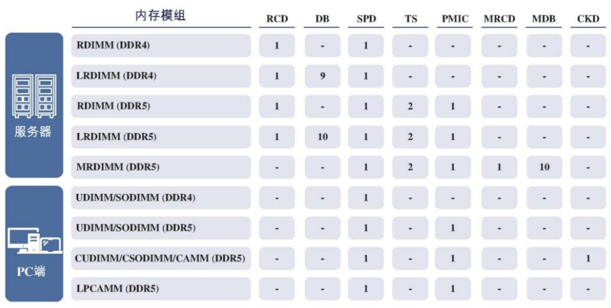  
资料来源：公司公告，东海证券研究所

## 2.2.AI服务器需求上行与内存迭代加速拉动内存接口芯片量 价齐升

(1)服务器和PC出货量直接影响内存接口芯片的需求，其中服务器为主要下游应用，且AI服务器搭载内存模组数量超越通用服务器，预计2026年全球AI服务器出货量为267.74万台，同比增长28.3%。一方面，短期看受存储价格上涨影响，2026年全球PC 出货量或有所下调，根据 IDC数据，预期同比下滑11.3%，但远期看在AIAgent拉动下，端侧AI或有革新，AIPC 渗透率提升或将拉动未来PC 出货量的增长。另一方面，内存接口芯片虽在服务器、PC等场景皆有应用，但以服务器为主，且服务器中的内存接口芯片用量较PC 更大，同时，在当前AI需求的拉动下，算力基建速度加快，从而带动AI服务器出货量高速增长，一般一台通用服务器配置8-12根内存模组，而一台AI服务器通常机头满插内存模组，配置16-24根，对内存接口芯片的需求量也更大。根据TrendForce，2026 年AI服务器出货量有望同比增长28.3%超过200万台，增速远超服务器总出货量，AI服务器渗透率也因此进一步提升，拉动内存接口芯片需求量上行。

图142020-2026E年全球PC出货量及同比增速  
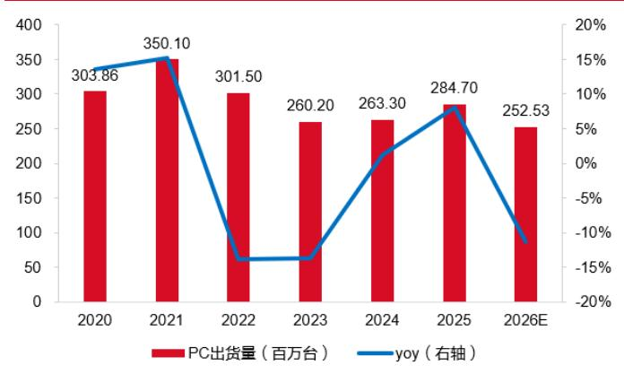  
资料来源：IDC，东海证券研究所

图152023-2026E年全球服务器出货量年增速  
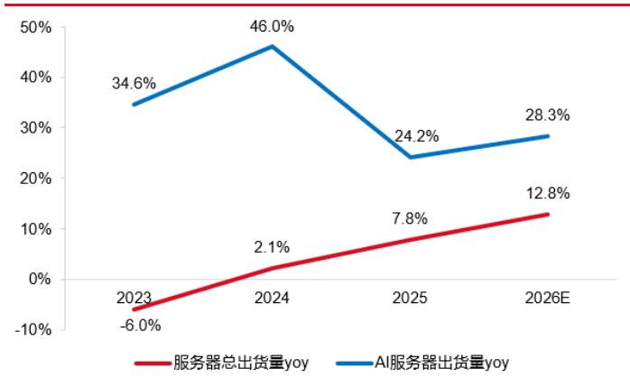  
资料来源：TrendForce，东海证券研究所

（2）内存颗粒与内存模组的迭代升级拉动相关内存接口芯片量价齐升：2025年DDR5渗透率有望超越85%，DDR6有望于2029年前后实现商业化应用，同时MRDIMM未来将在AI和高性能计算中广泛使用，2030 年渗透率有望达30%。DDR4的生命周期为2013-

2025年，而DDR5预计将从2021年延续至2030年，DDR5目前JEDEC已规划了6个子代，根据弗若斯特沙利文，2024年DDR5 渗透率已超过50%，2025 年有望超过85%，DDR5 相比DDR4不仅RCD、SPD 等芯片价值量显著提升，同时新增了PMIC、TS等配套芯片，DDR6有望于2029 年前后实现商业化应用，持续拉动内存接口芯片市场需求；此外，MRDIMM能够满足AI服务器对内存带宽的要求，2025年已开始在下游规模应用，未来渗透率有望进一步提升，预计在2030年MRDIMM在AI服务器内存模组中的渗透率将达30%，其MRCD价值量相比RCD更高，且相比RDIMM额外需要10颗MDB，进一步印证了未来内存接口芯片量价齐升的趋势。

图162022-2030E年按DRAM代际划分全球服务器内存模组出货量（百万根）  
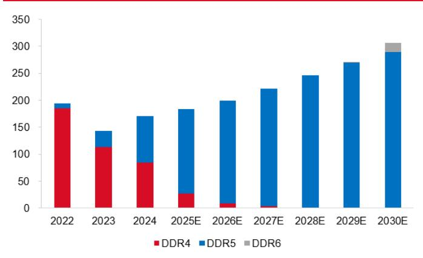  
资料来源：弗若斯特沙利文，东海证券研究所

图172025-2030E年全球MRDIMM出货量（百万根）  
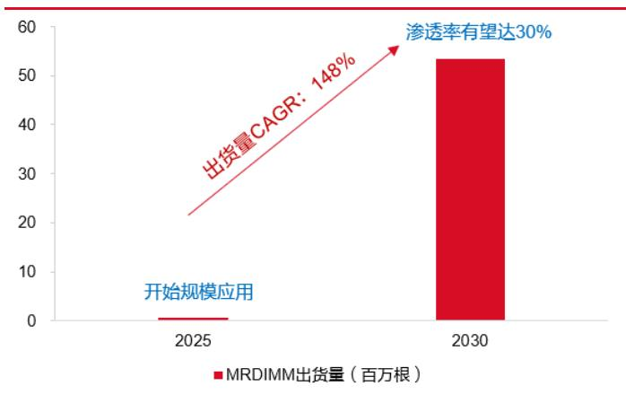  
资料来源：公司公告，东海证券研究所

(3)2026年全球内存互连芯片市场规模有望达到18.46亿美元，2025-2030年CAGR或达25.96%，其中MRCD/MDB为驱动增长的强大动力之一。2025年以前，内存互连芯片市场主要由 RCD 以及模组配套芯片占据，随着 DDR5 在 PC 端的普及使其需要配备一颗CKD 芯片，以及AI服务器对高内存带宽的需求带来MRDIMM渗透率的提升，给全球内存互连芯片市场带来了新的增长动力，2026 年全球内存互连芯片市场规模有望达到18.46 亿美元，同比增长16.91%，到2030年市场规模或将达到 50.05亿美元，2025-2030年CAGR或达25.9%。

图182022-2030E年全球各类内存互连芯片市场规模（百万美元）  
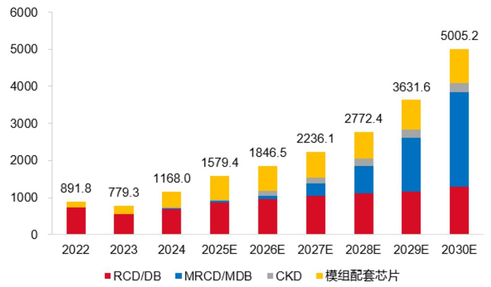  
资料来源：弗若斯特沙利文，东海证券研究所

（4）内存接口芯片供给格局高度集中，主要被澜起科技、瑞萨电子、Rambus占据，2024年澜起科技全球内存互连芯片市场份额排名第一，为36.8%。澜起科技长期深耕内存接口芯片业务；日本瑞萨电子于2019年通过收购美国IDT整合了相关产品技术，是DDR5模块内存接口产品的全系统解决方案供应商，提供高速DDR4RDIMM和LRDIMM解决方案，以及DDR5RDIMM、LRDIMM、NVDIMM、游戏DIMM等解决方案，此外还有I3C 智能开关和扩展器、SDR 解决方案；美国Rambus也在内存接口芯片产品方面有长年的技术积累，产品包含支持DDR4最高带宽和容量标准的服务器 DDR4 RDIMM（含RCD、DB、NVRCD）以及基于DDR5 最新一代服务器的DDR5RDIMM芯片组（含RCD、SPD Hub、TS）等。

图192024年全球内存互连芯片市场格局  
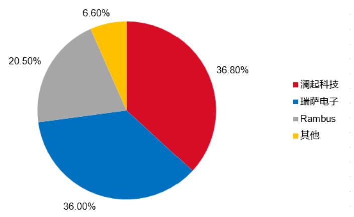  
资料来源：弗若斯特沙利文，东海证券研究所

图20瑞萨电子服务器DDR5MRDIMM解决方案  
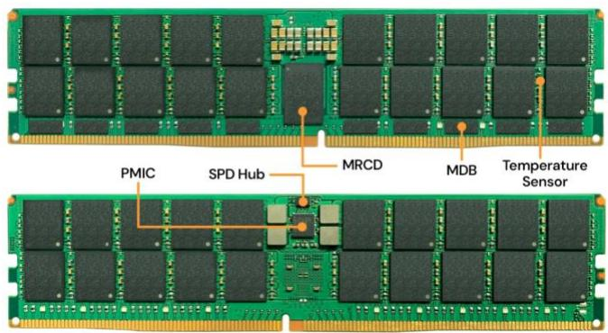  
资料来源：瑞萨电子，东海证券研究所

图21Rambus DDR5RDIMM内存接口芯片  
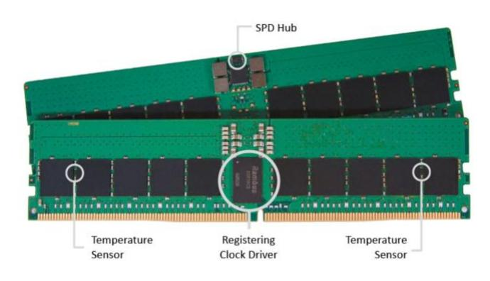  
资料来源：Rambus，东海证券研究所

## 2.3.深度构建供应链合作关系，引领行业产品代际更新

（1）公司是全球少数能提供全系列全/半缓冲式DDR2至DDR5内存接口解决方案的龙头厂商，首创“1+9”分布式缓冲内存子系统框架，内存接口技术构建核心护城河。公司深耕内存互连芯片领域二十年，拥有自主知识产权的高速、低功耗技术，不断在内存接口技术方面实现突破，在DDR4 世代，公司首创“1+9”分布式缓冲内存子系统框架，突破了DDR2、DDR3的集中式架构设计，并大大降低了CPU及DRAM芯片之间的负载效应，降低了信号传输损耗，解决了内存子系统大容量与高速度之间的矛盾，该架构在DDR5世代进一步演化为“1+10”框架；在DDR5世代，公司创新了电路及算法设计以解决信号完整性问题，并开发出自适应电源管理及动态时钟分配等新技术以降低功耗。随着持续创新与积累，公司已掌握了DDR5高速内存接口所需的关键设计技术，并开发了高速高精度自动化测试技术与平台，加快了产品设计、全面评估与迭代速度，为新一子代产品的研发奠定坚实基础。

（2）公司作为JEDEC董事会成员，深度参与内存互连行业标准制定，引领产品规格迭代。公司是JEDEC董事会活跃成员并担任3个委员会主席级职位，深度参与制定和建立内存互连国际标准。公司是DDR5RCD、MDB以及CKD芯片的国际标准牵头制定者，同时公司首创的“1+9”与“1+10”架构已被JEDEC采纳为LRDIMM的国际标准，并进一步衍生出MRDIMM的国际标准。随着DDR5的不断渗透，公司成为其规格迭代的领导者，推动内存接口芯片子代升级以及新一代MRCD/MDB/CKD芯片的开发。

图22 公司 DDR4全缓冲“1+9”架构  
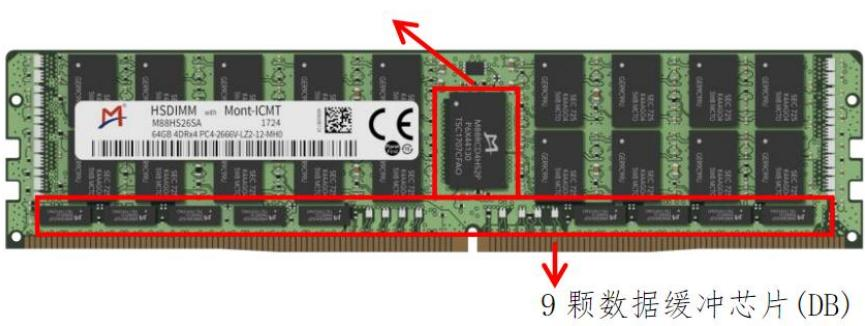  
资料来源：公司招股说明书，东海证券研究所

（3）客户涵盖全球头部DRAM厂商，同时与CPU及GPU制造商建立了长期合作伙伴关系。公司与内存模组供应商、服务器OEM/ODM、CPU及GPU供应商及云服务提供商都建立并维持了战略关系，其中包括三星电子、SK海力士、美光等全球领先的DRAM供应商，2024年该等供应商合计共占全球服务器DRAM行业90%以上的市场份额，在当下AI浪潮与存储的超级周期下，与其建立长期关系不仅奠定了公司内存互连芯片业务的高增速基础，同时有助于构建公司竞争护城河。此外，公司与英特尔和AMD等CPU和GPU全球龙头企业建立了密切合作关系，使公司能够保持产品上的前瞻性开发，率先布局未来核心技术，并精准满足市场需求，保障了产品的适配性。

（4）2025年下半年公司DDR5第三子代RCD芯片销售收入已超过第二子代，第四子代 RCD 芯片已量产，目前第六子代RCD芯片在研中，产品领先行业一个子代。随着DDR5在行业内的渗透率提升，公司目前内存接口芯片收入已大部分来自于DDR5。公司DDR5 内存接口芯片的研发处于国际领先水平，是业内首先试产第二子代及第三子代DDR5RCD 芯片的公司，2025 年下半年公司 DDR5 第三子代 RCD 芯片销售收入已超过第二子代产品，同时已量产支持7200MT/s 速率的第四子代RCD 芯片，第五子代RCD 芯片已研发完成，支持速率8000MT/s，第六子代RCD产品目前在研中，支持速率高达9200MT/s。在新产品的研发与商业化进程方面公司均行业领先。

图23公司DDR5各子代内存接口芯片迭代情况  
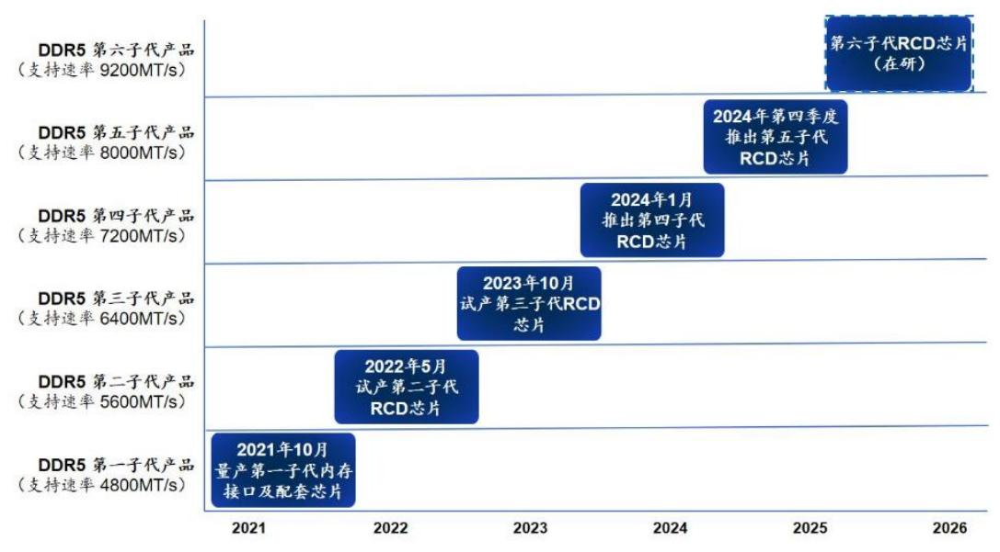  
资料来源：公司公告，东海证券研究所

（5）公司是全球唯二提供DDR5第一及第二子代MRCD/MDB芯片的供应商，2025Q4起公司第二子代产品出货量已显著提升。MRDIMM所需的内存接口芯片（1MRCD+10MDB）价值量相比RDIMM（1RCD）大幅提升，在速率与生态方面具备显著优势，随着主流CPU厂商产品的逐渐支持，公司有望首先受益于MRDIMM量价齐升的趋势。公司于2025年1月推出了第二子代 MRCD/MDB 芯片，支持12800MT/s 速率，较第一子代提升 45%，自2025Q4起，公司第二子代芯片出货量显著提升，截至2025年10月27日，公司预计未来六个月内交付的第二子代芯片在手订单金额已超过人民币1.4亿元。公司凭借 MRCD/MDB芯片优异的性能和出色的稳定性，后续有望实现持续规模交付。

表5公司DDR5MRCD/MDB芯片及主要应用情况
<table><tr><td>DDR5高带宽内存接口芯片</td><td>主要应用</td></tr><tr><td>Gen1.0 DDR5 MRCD 芯片</td><td>DDR5 MRDIMM/MCRDIMM，支持速率达 DDR5-8800</td></tr><tr><td>Gen1.0 DDR5 MDB 芯片</td><td>DDR5 MRDIMM/MCRDIMM，支持速率达 DDR5-8800</td></tr><tr><td>Gen2.0 DDR5 MRCD 芯片</td><td>DDR5MRDIMM，支持速率达DDR5-12800</td></tr><tr><td> Gen2.0 DDR5 MDB 芯片</td><td>DDR5 MRDIMM，支持速率达 DDR5-12800</td></tr></table>

资料来源：公司公告，东海证券研究所

（6）公司于业内首家发布并试产DDR5CKD芯片，目前已推出新一代DDR5CKD芯片，最高支持9200MT/s速率。公司于2024年在业内率先试产支持7200MT/s速率的DDR5CKD 芯片，支持双边带总线地址访问及I²C、I3C接口，通过配置寄存器控制字，芯片可以调整其输出信号特性以匹配不同DIMM的网络拓扑结构，并且可以禁用未使用的输出信号以降低功耗。2025年11月，公司推出新一代Gen1.0PlusDDR5CKD芯片，支持速率高达9200MT/s，适配DDR5UDIMM/CUDIMM/CAMM，可为下一代高性能PC 提供关键技术支持，随着数据速率的提升，CKD在PC端内存模组的渗透率有望持续上升，进而促进公司CKD 芯片出货量快速增长。

图24公司CKD芯片在CUDIMM中的位置分布  
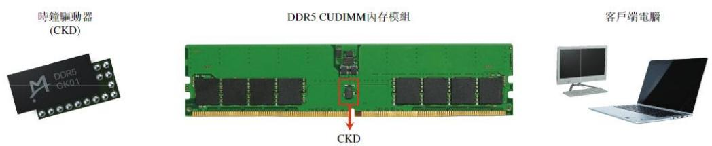  
资料来源：公司公告，东海证券研究所

（7）内存模组配套芯片方面，公司产品包括SPD、PMIC和TS。公司与合作伙伴共同研发了DDR5 SPD，内部集成了8Kbit EEPROM、I²C/I3C 总线集线器（Hub）和TS，应用范围包括服务器、台式机和笔记本内存模组；TS作为SPD芯片的从设备，可以工作在时钟频率分别高达1MHzI²C和12.5MHzI3C 总线上，CPU可经由SPD 芯片与TS 进行通讯，实现对内存模组的温度管理，一般来说一条DDR5服务器内存模组配置2颗TS；同时CPU可经由 SPD 芯片与PMIC 进行通讯，为内存模组上的 DRAM、RCD、DB、SPD、TS 等其他芯片提供电源支持，实现电源管理。

图25公司内存模组配套芯片在典型内存模组中的位置分布  
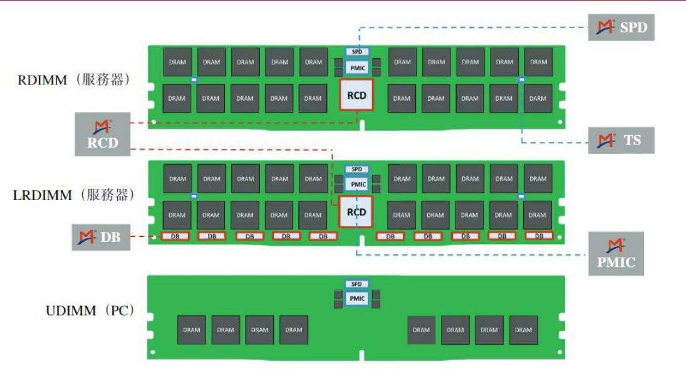  
资料来源：公司公告，东海证券研究所

## 3.PCIe/CXL互连芯片开拓新增长曲线，自研SerDes IP构建核心护城河

## 3.1.PCle Retimer核心供应商，PCle Switch研发稳步推进

（1）PCle协议属于PCI-SIG标准体系，目前支持PCle5.0协议的芯片和设备已在下游应用中成为市场主流。PCI-SIG是专注制定、管理计算机总线标准的国际性行业联盟，核心职责是推动 PCl（Peripheral Component Interconnect，外围组件互连）等技术的标准化与应用，标准体系涵盖PCI、PCI-X、PCle。PCle（PCIExpress）协议技术是一种高速串行接口标准，用于将显卡、固态硬盘、和网卡等组件连接到计算机主板上，通过多通道实现快速数据传输和可扩展带宽，可实现高速串行点对点双通道高带宽传输，也是全球应用最广泛的高性能外设接口之一，适用于云计算、服务器、存储、网络、检测仪表和消费类电子产品等。

1)随着PCIe协议的每次迭代，其单条通道的带宽几乎翻倍，未来技术将持续向更高速率、更低延迟和低功耗演进。衡量PCIe数据传输的单位是GT/s（每秒干兆次传输），而带宽（有效传输速率）通常用GB/s（每秒干兆字节）衡量，指传输有效数据的速度（传输时受到编码效率影响，但随着代际发展，影响逐渐忽略不计）。近年来随着AI及其他数据密集型应用持续快速扩展，PCle协议技术迭代加速，从PCle5.0（32GT/s）、PCle6.0（64GT/s）到PCle7.0（128GT/s），以及未来PCle8.0（256GT/s），传输速率每代实现翻倍，目前下游应用方面，支持PCle5.0协议的相关芯片和设备正成为市场主流，而PCle6.0正在数据中心网络中筹备落地。

图26PCle协议迭代中I/O带宽每三年翻倍  
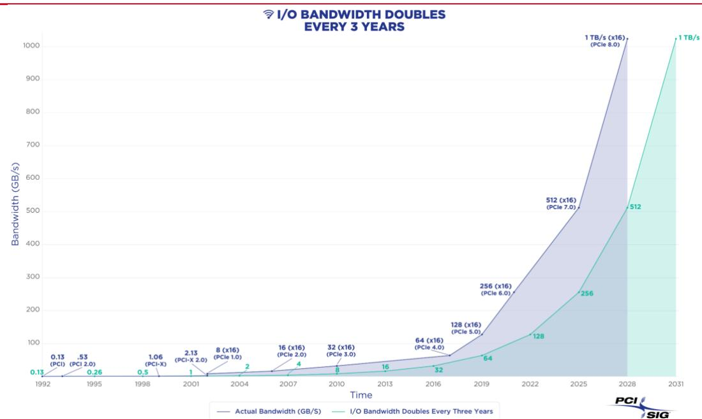  
资料来源：PCI-SIG，东海证券研究所

2)PCle通道数进一步影响设备的性能和连接能力，与PCle协议版本共同决定总带宽。每个PCle通道由两组差分信号线组成（一组发送链路，一组接收链路），可以独立传输数据，常见的PCle通道数包括×1、x2、x4、x8和×16，×16意味着共拥有16 组发送链路和16 组接收链路，因此通道数量越多，数据传输速率越快，带宽越高，PCle5.0×16总带宽可达128GB/s。

图27PCle不同通道数和不同代际决定的总带宽  
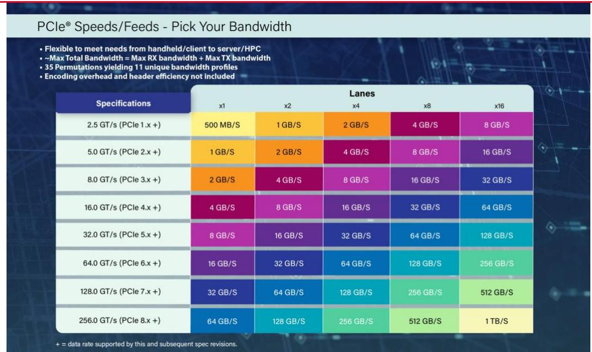  
资料来源：PCl-SIG，东海证券研究所（注：由于单条lane同时支持双向数据传输，且1Byte=8bit,以PCle 5.0 为例，采用128b/130b 编码，编码效率128/130≈100%，总带宽 GB/s=32 GT/s\*2\*编码效率\*通道数/8)

（2）PCle互连芯片是遵循PCI-SIG标准体系中PCle协议技术的一种高速互连类芯片,主要包括PCle Retimer和PCleSwitch.8卡AI服务器通常配备8-16颗PCle Retimer和 2-4颗 PCle Switch。

1）PCleRetimer是一种超高速时序整合芯片，在PCle5.0时代已成为行业主流解决方案。随着PCle协议迭代，整个链路的插损预算逐渐增长（PCle5.0时代增长至36dB）,PCleRetimer通过补偿信道损耗及抑制抖动，能提升信号完整性，增加有效传输距离，可解决数据中心数据高速、远距离传输时信号时序不齐、损耗大、完整性差等问题，在CPU与高速外设（GPU、AI加速卡、SSD卡及网卡等）的互连中发挥重要作用，未来还可根据系统配置灵活切换至PCle或CXL模式。在PCle5.0时代，PCleRetimer芯片已成为AI服务器主流解决方案，以8卡Al服务器为例，通常需要8-16颗PCleRetimer芯片，部分国产AI服务器为满足扩展的需求，配备了24颗；从定价来看，不同产品差异较大，2024年行业均价范围在25-50美元。

图28无PCle Retimer和配备一个的传输长度对比  
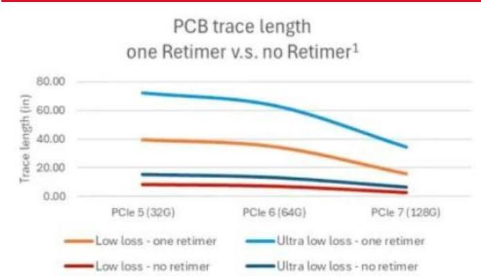  
资料来源：PCI-SIG，东海证券研究所（注：均采用标准插损预算：PCle 5.0为36dB，PCle 6.0为32dB，PCle7.0为36dB。Low loss PCB的损耗特性类似MEG2 材料，UItra lowloss PCB类似于MEG8 材料）

图29PCleRetimer的典型应用场景  
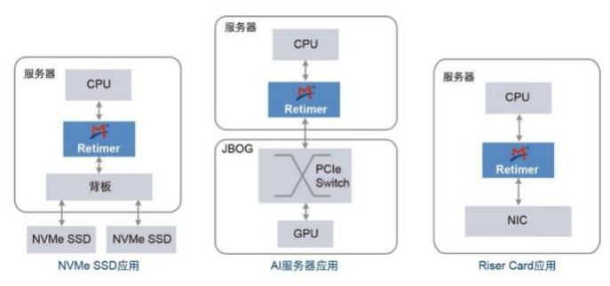  
资料来源：公司公告，东海证券研究所

2）PCleSwitch是PCle交换芯片，用于扩展PCle通道可用性。PCleSwitch通过拓展PCIe拓扑，实现CPU与外围设备（NIC、SSD、GPU等）间的高速数据转发，主要功能包括扩展接口、数据转发、实现分区功能，且支持NTB技术。PCleSwitch 能够实现多设备高密度PCle互连，解决主机与外围设备间的带宽瓶颈问题，在数据中心和云计算中，PCleSwitch芯片可以连接多块GPU/AI加速卡进行并行计算，也可以构建GPU/AI加速卡集群进行超大规模计算；在存储系统中，PCleSwitch芯片可以连接大量NVMeSSD，构建高速存储池；在网络设备中，PCle Switch芯片可以连接多块100G/400G 网卡，管理高速端口的数据转发。8卡AI服务器通常配备2-4颗PCleSwitch，其价格主要取决于支持的链路数，2024年行业均价范围在600-1200 美元。

图30PCle Switch主要功能  
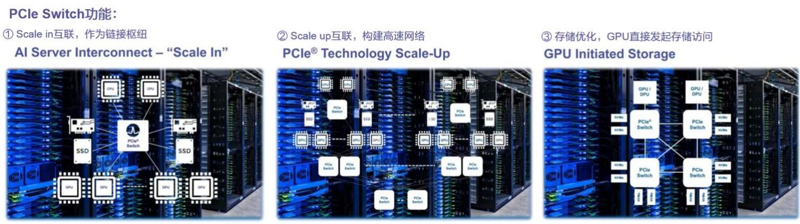  
资料来源：PCI-SIG，东海证券研究所

（3）数据量的指数级增长、AI算力集群架构向“强扩展”模式的迭代、以及随着PCle协议速率提升带来的信号衰减等问题催生了对PCle互连芯片的大量需求，2025-2030年全球PCIe市场规模CAGR有望达到20.1%。随着全球数据量的指数级增长，高速互连芯片作为数据传输的关键，其需求随之大幅攀升。虽然PCle通信协议的升级带来了速率翻倍，但也引发了信号衰减等问题，凸显了高性能互连芯片解决信号完整性问题的必要性，PCleRetimer的应用场景从当前CPU及GPU/AI加速卡/SSD/网卡互连将延伸至有源线缆(AEC）边缘计算设备、智能汽车等连接密集型场景；同时，AI大模型推动服务器架构向“强扩展”模式转型，旨在构建高带宽、低延迟的算力集群，这一转变使得从芯片到数据中心的全链路互连需求急剧增加，PCleSwitch需承担多设备带宽优化与拓扑架构升级任务，在AI推理服务、数据中心高密度部署等场景中重要性持续提升，对互连芯片的数量与复杂度提出了更高标准。2025年，全球PCle互连芯片市场规模有望达到31.09亿美元，2025-2030年CAGR有望达到20.1%，其中PCle Switch 市场规模更大。

图312023-2030E年全球PCle互连芯片市场规模  
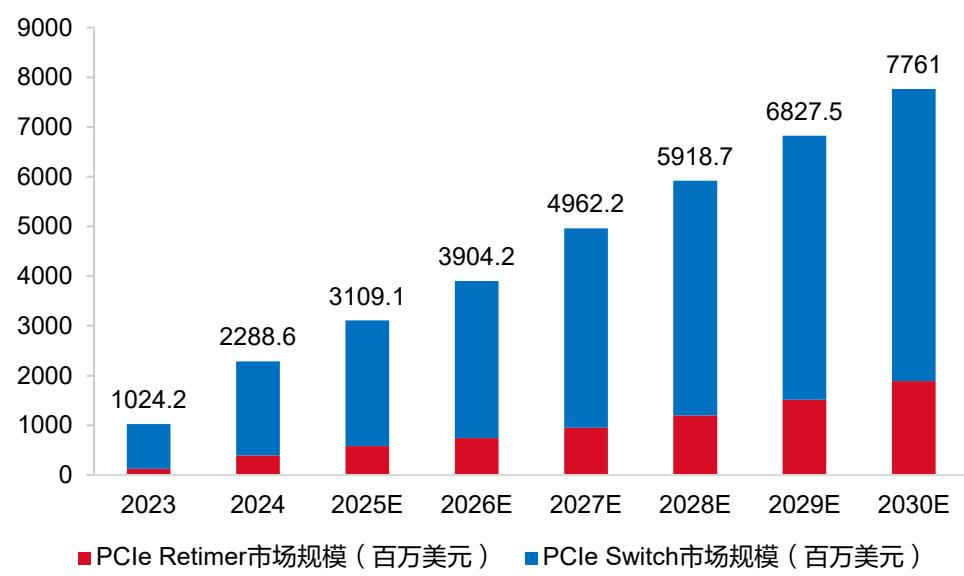  
资料来源：弗若斯特沙利文，东海证券研究所

（4)PCle互连芯片市场高度集中，头部厂商占据了90%以上的份额，公司作为行业新进入者，2024年PCle Retimer市占率全球排名第二。全球 PCle Retimer市场中，AsteraLabs 和澜起科技处于主导地位，2024年二者市占率分别为86.0%和10.9%，Astera Labs已量产PCle 5.0 Retimer产品，PCle6.0 相关产品正处于试产状态。在PCle Switch市场中，主要由博通占据了全球 90%以上的份额，博通 PCle 5.0 Switch 产品为PEX89000 系列，每个端口（x16）提供高达128GB/s 的原始带宽，PCle6.0 Switch 已有相关产品亮相，并计划于2026 和2027年分别推出PCle6.0 和7.0 世代相关交换芯片。

图322024年全球PCleRetimer市场竞争格局  
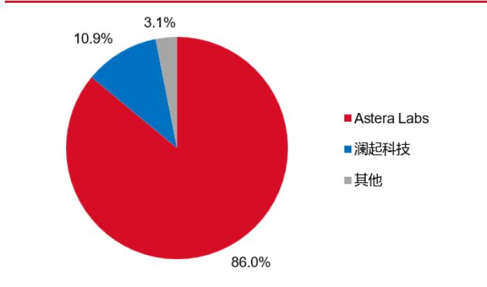  
资料来源：公司公告，东海证券研究所

图332025年全球PCleSwitch市场竞争格局  
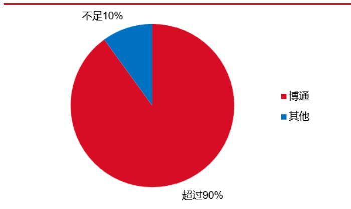  
资料来源：公司公告，华经情报网，东海证券研究所

（5）公司是全球量产PCle4.0Retimer芯片的三家厂商之一，也是主要供货PCle 5.0Retimer芯片的两家厂商之一,目前已量产PCle 4.0Retimer及PCle 5.0/CXL2.0 Retimer,2025年推出了PCle6.x/CXL3.xRetimer芯片。凭借持续的产品研发和迭代，2024年起公司 PCle Retimer芯片出货快速增长，其中PCle 4.0 Retimer支持16GT/s 传输速率，可补偿 28dB 信道损耗；PCle 5.0/CXL2.0 Retimer符合 PCle5.0 和CXL2.0 基本规范，支持32GT/s传输速率，可补偿高达36dB信道损耗，支持业界主流封装，功耗、传输延时等关键性能指标达国际先进水平，并已与CPU、PCleSwitch、固态硬盘、GPU及网卡等进行了广泛的互操作测试；2025年1月公司推出PCle6.x/CXL3.× Retimer芯片并向客户送样，采用了自主研发的PAM4 SerDes IP，支持低传输时延及高达43dB 的链路预算；2026 年1月发布了PCle6.x/CXL3.xAEC 解决方案（AEC 场景中PCle Retimer相比以太网Retimer带宽较低但时延更小，在推理服务器可能具备一定优势）；目前正在积极推进PCle7.0Retimer芯片的研发。

图34公司PCleRetimer芯片及对应板卡示意图  
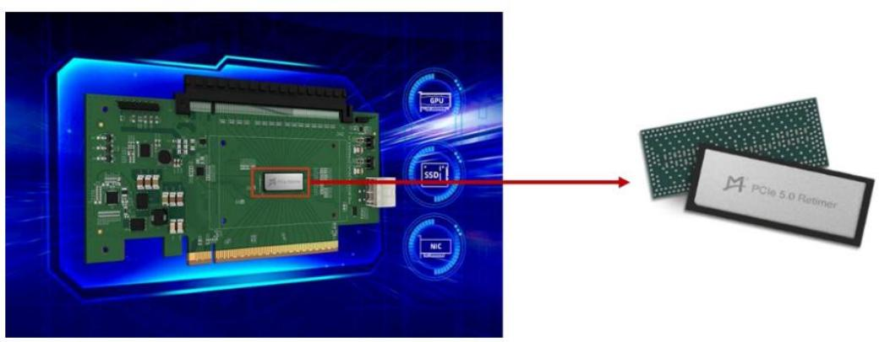  
资料来源：公司公告，东海证券研究所

（6）自研SerDesIP为产品迭代奠定坚实基础，目前公司已成功研发速率为32GT/s和64GT/s 的 SerDes IP，PCle 7.0 SerDes IP 在研中。SerDes 高速串行接口技术是SERializer（串行器）和DESerializer（解串器）的简称，是一种主流的时分多路复用、点对点的串行通信技术，能够在发送端将多路低速并行信号转换成高速串行信号，并通过传输介质（光缆或铜缆）传输，最终在接收端将高速串行信号重新转换成低速并行信号。SerDes是多种重要高速传输技术（如PCle、USB、以太网等）的物理层基础，广泛应用于服务器、异构计算、汽车电子和通信等领域的高速互连。从PCle5.0到PCle6.0，SerDesIP的技术框架发生了质的变化，编码方式由NRZ改变为PAM4，因此PCle6.0SerDes 同样的波特率能够让传输速度翻倍。但是相对NRZ，PAM4在相同的幅度范围内需要容纳四个电平，信号幅度只有NRZ的三分之一，同时信噪比也只有NRZ三分之一，对串扰和电路本身的噪声更加的敏感，因此PCle6.0相关的SerDes IP难度大幅提升。公司已成功研发数据速率为32GT/s 的 SerDes IP，并应用于PCle 5.0/CXL2.0 Retimer，在此基础上进一步攻克了数据速率为64GT/s的SerDes IP，并应用于PCle6.x/CXL3.xRetimer产品，目前在研的PCle 7.0 SerDes IP 支持速率高达128GT/s，未来公司将继续推进 SerDes 技术的迭代升级。

（7）公司正稳步推进PCle Switch芯片工程研发中。PCleSwitch与PCle Retimer的核心底层技术均包括高速 SerDes 技术，且客群高度重合，凭借在PCle Retimer商业化过程中积累的技术和客户资源,公司有望顺利研发并交付PCle Switch产品，打造新增长曲线。

## 3.2.全球首发CXLMXC芯片，生态成熟后有望率先受益

（1）CXL协议是一种开放性的高速互连行业标准，旨在提供CPU和加速器、内存扩展或其他设备间的高效、低延时接口，以满足内存一致性和高效运算的需求。CXL（ComputeExpressLink）协议由英特尔于2019 年牵头发布，旨在解决数据中心的内存扩展和性能瓶颈，包括传统服务器架构存在的内存墙、PCle无法支持异构计算的缓存一致性、以及PCle带宽与语义不足等问题。CXL协议在物理层（PHY）沿用了PCle 标准，以促进CPU、GPU与内存模组间的高速低延迟数据交换，降低了产业链的接受门槛。CXL包括三大基础协议：CXL.io、CXL.cache 和CXL.memory，CXL 协议在不断迭代中，CXL1.0/CXL1.1解决了异构计算和内存扩展性挑战；CXL2.0 物理层沿用了PCle 5.0，引入了CXLSwitch、内存池化和共享能力，意味着内存可以开始作为独立的资源池按需分配，从节点级扩展至机架级互连；CXL3.0 时代物理层沿用了PCle6.0，将带宽翻倍至64GT/s且额外延迟为0，并引入了基于Fabric 的灵活组网能力，开始支持更大规模的内存池；CXL4.0于2025 年11月发布，物理层沿用PCle7.0，带宽达128GT/s，针对AI大规模集群进行了进一步优化，扩展了连接距离，能够最多支持4级Retimer芯片来显著增强信号传输，支持跨机架部署，并通过引入捆绑端口的概念允许将多个物理CXL端口聚合成一个逻辑实体，提升总带宽。

图35CXL2.0机架级内存池化  
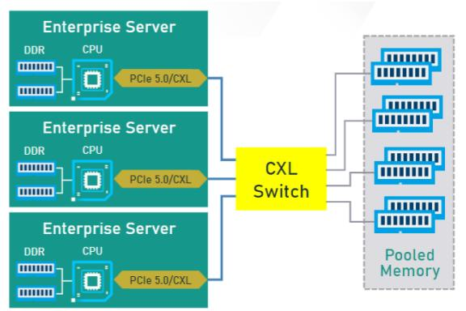  
资料来源：CXL官网，东海证券研究所

图36 CXL 3.0 Fabric Architecture  
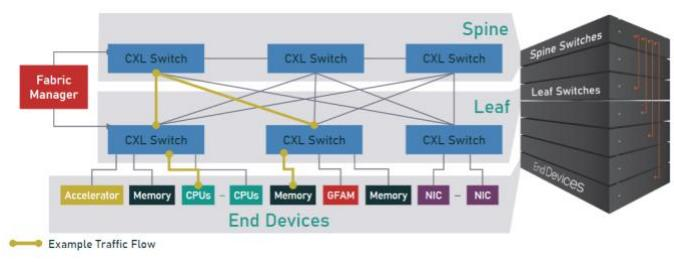  
资料来源：CXL官网，东海证券研究所

（2）CXL互连芯片主要包括CXLMXC和CXLSwitch，两者协同构建CXL互连解决方案，但整体还未形成大规模商业部署，目前单个内存池化服务器通常需要配置16-32颗CXLMXC和2-4颗CXLSwitch芯片。CXL互连芯片主要应用于内存扩展和内存池化场景，但由于CXL的应用和生态系统开发仍处早期阶段，因此大规模商业部署尚未实现，也未形成客观完整的竞争格局和成熟的定价体系，目前产品价格范围约为100美元至1000美元以上。

1）CXLMXC（内存扩展控制器）芯片是处理器与CXL内存模块的高速连接枢纽，负责完成协议转换、内存访问调度及缓存一致性控制，是构建内存扩展和内存池化架构的关键控制器，确保跨硬件节点的无缝数据管理，实现CPU与各CXL设备间的内存共享，在大幅提升系统性能的同时显著降低软件堆栈复杂性和数据中心TCO（总拥有成本）。MXC芯片主要为内存AIC扩展卡（AddInCard，通过PCle接口连接主板，不占用DIMM插槽）、背板及EDSFF（企业和数据中心标准外形规格）内存模组设计。

2）CXLSwitch芯片用于实现多个CXL主机及设备之间的互连与资源管理，支持单个或多个CPU连接多个CXL内存或加速设备，提升系统扩展能力和资源利用效率，是大规模内存池化架构的核心支持组件。

图37 CXL MXC 和CXL Switch典型应用场景  
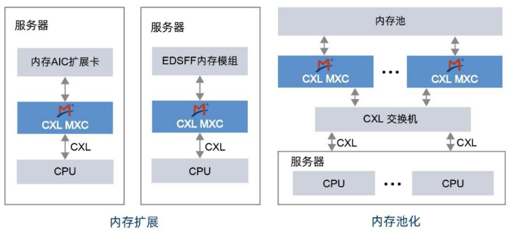  
资料来源：公司公告，东海证券研究所

图38CXL MXC 在AIC 连接标准DDR5/4内存模组中的产品应用形态  
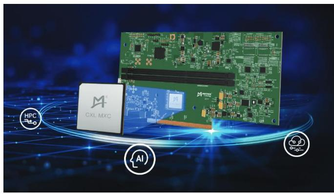  
资料来源：公司公告，东海证券研究所

图39CXLMXC芯片在EDSFF内存模组中的产品应用形态  
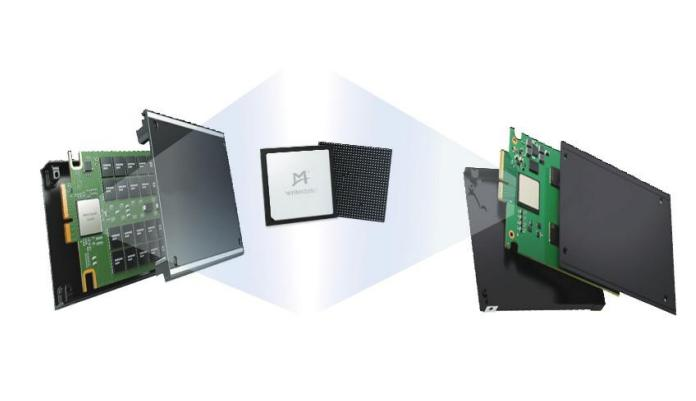  
资料来源：公司公告，东海证券研究所

（3）目前主流CPU厂商、内存模组厂商均相继研发和推出支持CXL协议的产品，服务器平台也有相关产品开始应用，2026年全球CXL互连芯片市场规模有望达到0.99亿美元，2025-2030年CAGR有望达到170.2%。目前，全球头部互联网企业正在探索在其新型服务器集群中部署CXL内存资源池，如阿里云在2025年9月推出了全球首款基于CXL2.0Switch技术的PolarDB数据库专用服务器，延迟可低至百纳秒级，带宽吞吐达到数TB/s;主流CPU厂商如英特尔和AMD均已发布了支持CXL2.0协议的CPU；头部内存模组厂商SK 海力士和三星电子也正在积极研发并量产CXL兼容的内存模块。CXL互连芯片有望在2026年下半年开始规模应用，2027年起进入快速增长轨道，后续生态成熟后市场规模有望显著增长，2025-2030 年全球CXL互连芯片市场规模CAGR 有望达170.2%。

图402024-2030E年全球CXL互连芯片市场规模（百万美元）  
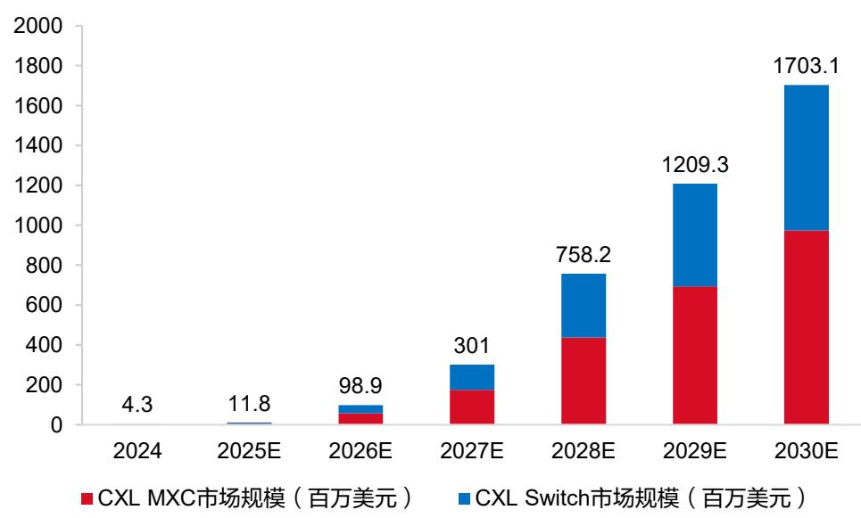  
资料来源：弗若斯特沙利文，东海证券研究所

（4）公司全球首发CXLMXC芯片，进入CXL联盟合规供应商清单并导入全球龙头内存厂商，目前已推出基于CXL3.1标准的MXC芯片并向主要客户送样测试。2022年5月，公司发布了全球首款CXLMXC芯片，并支持三星电子、SK海力士等内存厂商推出相关CXL内存产品。公司MXC芯片已通过CXL联盟数十项严格测试，成为全球首家通过CXL1.1测试的内存扩展控制器产品，2025年入选CXL联盟公布的首批CXL2.0合规供应商清单，同期入选的三星电子、SK 海力士受测产品也均采用了公司的 MXC 芯片。目前，公司已完成

CXL2.0MXC芯片量产版本的研发，推出了CXL3.1MXC芯片，采用自研PCle6.2物理层接口，支持最高86GT/s 的传输速率（x8通道），内置双通道DDR5内存控制器，支持速率高达8000MT/s，并已开始向主要客户送样测试。目前全球大多数云厂商和内存厂商均基于公司MXC芯片做样机研发测试，随着后续生态逐渐成熟，公司有望率先受益于需求爆发。

## 3.3.布局一站式时钟芯片解决方案，挖掘以太网和光互连市场 新机遇

（1）时钟芯片是为电子系统提供其必要的时钟脉冲的芯片，主要包括时钟发生器、去抖时钟芯片、时钟缓冲芯片和展频振荡器等。时钟脉冲是按一定电压幅度和时间间隔连续发出的周期性电信号，是集成电路运转的节拍器，其性能决定了系统能否运行到目标速度。时钟芯片主要用于生成、分配和管理时钟信号，可以提供精准的时钟脉冲（节拍）来同步各模块间的运算操作和数据传输交互，保障高频/高性能数字模块的正确运行，其提供的输出时钟需要具备高可靠性、宽广的输出频率范围、优良抖动特性以及扩频功能，否则会导致模块和设备无法运作。时钟发生器是根据参考时钟合成多个不同频率时钟的芯片，是各下游应用领域基础芯片；去抖时钟芯片是为其他芯片提供低抖动低噪声的参考时钟的芯片；时钟缓冲芯片适用于时钟脉冲复制、格式转换、电平转化等；展频振荡器基于扩展频谱技术的晶体振荡器，通过调制原始时钟信号的频率分布，将能量分散到更宽的频带内，从而降低电磁干扰（EMI）峰值并提升系统稳定性。

（2）时钟芯片市场空间较大但相对成熟，预计2025-2030年全球时钟芯片市场规模CAGR为5.3%；但高性能时钟芯片国产化率较低，且随着AI服务器、高速通信、智能驾驶、工业边缘计算等对高精度时钟的需求增长，市场有望受益于量价齐升的逻辑。时钟芯片广泛应用于通信基础设施、数据中心、工业自动化、汽车电子、消费电子等场景，全球时钟芯片市场已进入稳定增长阶段，2025年全球市场规模约为23亿美元，预计到2030年有望增长至30亿美元，CAGR为5.3%。目前高性能时钟芯片国产化率低，市场玩家基本为海外头部模拟厂商，且随着AI服务器AEC/AOC等高速互连技术升级，对高性能时钟芯片需求不断增长，目前单台服务器内一般需要10 颗左右时钟芯片，单台中高端仪器仪表使用约4颗时钟芯片，后续时钟芯片市场有望受益于量价齐升的逻辑。

图412024-2030E年全球CXL互连芯片市场规模（亿美元）  
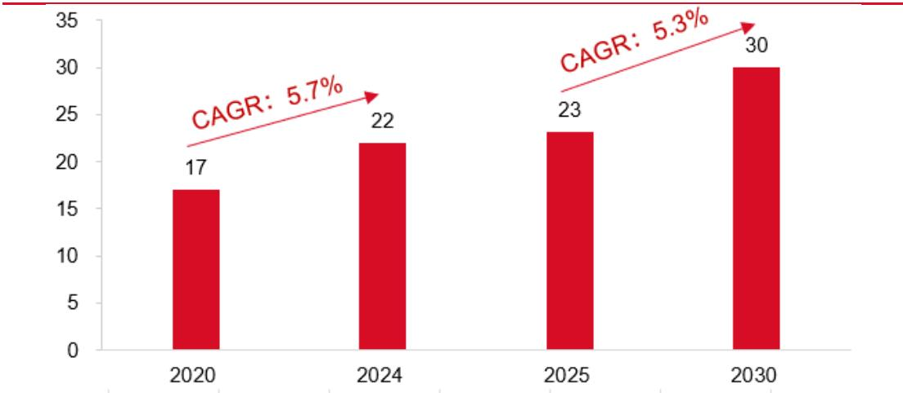  
资料来源：弗若斯特沙利文，东海证券研究所

（3）以太网（Ethernet）是局域网（LAN）中最主流的通信技术标准，以太网互连芯片是数据中心、云计算及AI基础设施的核心硬件，随着400G/800G以太网标准的部署落地以及未来向1.6T的演进，有望驱动以太网互连芯片市场进一步增长。以太网凭借高可靠性、可扩展性和持续演进的标准，成为有线网络的核心技术。以太网互连芯片用于实现设备间高速数据交换与低时延通信，主要包括以太网交换芯片（EthernetSwitch）、NIC（网卡芯片）和EthernetRetimer芯片。以太网交换芯片是数据中心网络的骨干器件，用于数据包转发和网络流量调度；NIC部署于服务器端，是主机接入以太网并实现数据传输的关键接口；EthernetRetimer芯片用于解决长距离高速信号传输中的时序失真和信号衰减，保障数据传输的完整性与系统稳定性，尤其适用于AI服务器与云计算节点。2024年全球以太网互连芯片市场规模为94亿美元，预计2030年将达到247亿美元，2025年-2030年CAGR有望达到17.9%，增长动力主要来自于云计算和数字基础设施建设，当前在算力基建进一步加速的背景下，以太网标准方案有望朝着更高速率演进，带动以太网互连芯片量价齐升。

（4）光互连是利用光信号进行数据传输的互连技术，光互连芯片通过光电转换技术支撑下一代AI基础设施对高带宽、低功耗互连的需求，随着光互连成为数据中心的核心技术，以及光模块在数据中心的规模化部署和迭代，有望带动相关芯片量价齐升。光互连通过采用光纤或集成光波导替代传统铜缆，解决电互连在带宽、传输距离和能效方面的瓶颈，是数据中心、5G通信及云计算的核心技术。光互连芯片是实现高速数据传输的关键组件，光互连芯片主要分为oDSP芯片、激光驱动芯片（Driver）、跨阻放大器（TIA）以及硅光芯片等，2024年全球光互连芯片市场规模为26亿美元，预计2030年将达到99亿美元，2025-2030年CAGR有望达到21.5%。

图422025-2030E全球以太网互连芯片市场规模（亿美元）  
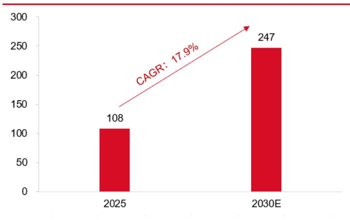  
资料来源：公司公告，东海证券研究所

图432025-2030E全球光互连芯片市场规模（亿美元）  
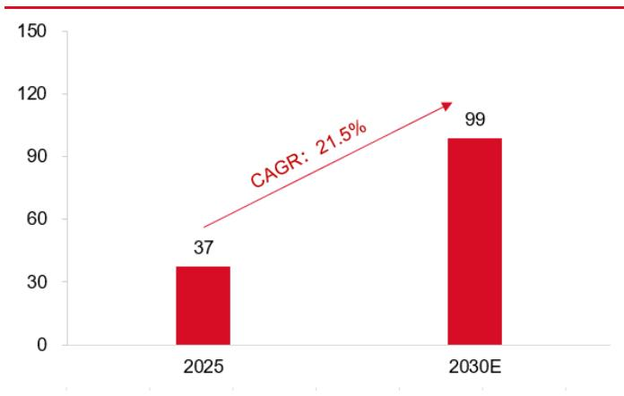  
资料来源：公司公告，东海证券研究所

（5)公司正布局一站式时钟芯片解决方案。公司已推出一系列可编程时钟发生器芯片，可输出1MHz至333.33MHz间的任意频率，该系列芯片采用公司先进的I/O技术，具备出色的抖动性能，可为低相噪声扩频应用提供覆盖频率范围很广的时钟信号，同时还可提供1/2/4 路差分时钟输出，每个输出端口特性均可独立灵活配置，可满足尖端应用的高要求输入参考时钟需求，包括PCleGen5/6、100G以太网、USB3.×、WiFi6等。除时钟发生器芯片外，2025年公司完成了首批时钟缓冲芯片和展频振荡器的工程研发，已向客户送样，未来有望布局一站式时钟芯片解决方案。

图44公司时钟芯片系列产品示意图  
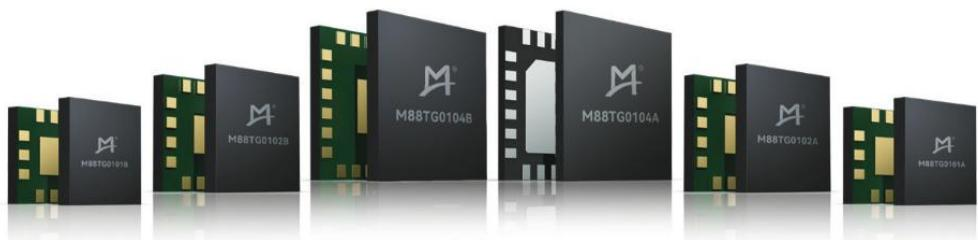  
资料来源：公司公告，东海证券研究所

（6）以太网和光互连领域是公司未来的重点发展方向。由于以太网和光互连市场空间广阔，且在底层SerDes技术和客户群体上与公司现有业务有部分重合，因此公司将充分借助自身在内存互连和PCle/CXL互连领域的技术积累和资源储备，灵活运用自研、合作及/或投资等多种方式，积极探索这一市场。目前公司正在研发以太网PhyRetimer芯片，加快在该领域的产品布局，计划2026 年完成工程样片流片。

## 4.盈利预测

## 4.1.业务拆分与假设

根据公司公告披露的业务拆分，我们将澜起科技的业务分为互连类芯片、津逮产品与其他业务并作盈利预测，其中：

## （1）互连类芯片：

1）目前公司互连类芯片以DDR5内存接口芯片为主，目前公司DDR5第三子代 RCD收入已超过第二子代，预计2026年将以第三子代为主，兼有部分第四子代的出货，随着AI服务器出货量的增加以及其搭载内存模组数量的增长，DDR5内存接口芯片需求量显著上升，同时子代迭代速度显著加快，带动产品价值量有所提升。

2）MRDIMM方面，目前商业化仍处于起步阶段，但是2025年第四季度起市场需求明显增加，MRDIMM相比主流RDIMM单模组的价值量提升大几十美金，MRCD 第二子代生态适配也更为完善，预计主流CPU厂商将于2026下半年推出支持第二子代MRDIMM芯片的相关CPU产品，带动市场需求和公司营收进一步上行。

3）PCle 5.0Retimer是公司目前主要出货产品，是公司增速较快的产品板块，PCle6.0Retimer已送样，导入后有望进一步支撑公司业绩；PCleSwitch正处于工程研发阶段，公司拥有自研SerDes IP优势，且该产品客户与PCleRetimer客群高度重合，有望成为公司新的增长曲线。

4)CXL相关产品预计从2026下半年起市场开始规模应用，2027年进入快速发展轨道，公司CXLMXC 芯片全球首发，CXL3.1MXC 芯片已向主要客户送样测试，技术迭代保持领先，全球大多数云厂商和内存厂商均基于公司MXC芯片做样机研发测试，生态成熟后公司有望率先受益于需求增长。

我们预计公司互连类芯片2026-2028年营收分别为71.60、91.85、113.67亿元，同比分别增长39.33%、28.28%、23.76%，毛利率分别为66.78%、68.22%、69.52%。

(2)津逮产品：2023年起公司津逮产品营收占总收入的比重均不超过10%，主要为津逮CPU及数据保护和可信计算加速芯片等，公司相关产品不断迭代，目前已发布第六代津逮能效核CPU和性能核CPU，主要针对中国本土市场，已有多家服务器厂商采用，开发出了系列高性能且具有独特安全功能的服务器机型，应用到政务、交通等领域及高科技企业中，为用户实现计算资源池的无缝升级和扩容，同时保护用户的数据、信息安全。我们预计公司津逮产品2026-2028年营收分别为3.37、3.67、3.95亿元，同比分别增长9.38%、8.74%、7.81%，毛利率分别为8.36%、9.50%、10.64%。

表62023-2028E澜起科技分业务营收及毛利率预测（百万元）
<table><tr><td></td><td></td><td>2023</td><td>2024</td><td>2025</td><td>2026E</td><td>2027E</td><td>2028E</td></tr><tr><td>总营收</td><td></td><td>2,285.74</td><td>3,638.91</td><td>5,456.32</td><td>7,506.78</td><td>9,561.63</td><td>11,773.73</td></tr><tr><td></td><td>yoy</td><td>-37.76%</td><td> 59.20%</td><td>49.94%</td><td> 37.58%</td><td>27.37%</td><td>23.14%</td></tr><tr><td>总毛利率</td><td></td><td>58.91%</td><td>58.13%</td><td>62.23%</td><td>64.11%</td><td>65.93%</td><td>67.51%</td></tr><tr><td>互连类芯片</td><td></td><td>2,184.59</td><td>3,349.18</td><td>5,138.53</td><td>7,159.73</td><td>9,184.54</td><td>11,367.19</td></tr><tr><td></td><td>yoy</td><td>-20.11%</td><td>53.31%</td><td>53.43%</td><td>39.33%</td><td>28.28%</td><td>23.76%</td></tr><tr><td></td><td>毛利率</td><td>61.36%</td><td>62.66%</td><td>65.57%</td><td>66.78%</td><td>68.22%</td><td>69.52%</td></tr><tr><td></td><td>营收占比</td><td>95.57%</td><td>92.04%</td><td>94.18%</td><td>95.38%</td><td>96.06%</td><td>96.55%</td></tr><tr><td>津逮产品</td><td></td><td>93.55</td><td>279.59</td><td>308.23</td><td>337.15</td><td>366.61</td><td>395.24</td></tr><tr><td></td><td>yoy</td><td>-90.01%</td><td>198.87%</td><td>10.25%</td><td>9.38%</td><td>8.74%</td><td>7.81%</td></tr></table>

<table><tr><td>毛利率</td><td>4.01%</td><td> 4.75%</td><td>7.42%</td><td>8.36%</td><td>9.50%</td><td>10.64%</td></tr><tr><td>营收占比</td><td>4.09%</td><td>7.68%</td><td>5.65%</td><td>4.49%</td><td>3.83%</td><td>3.36%</td></tr></table>

资料来源：公司公告，东海证券研究所

盈利预测结果：我们对公司2026-2028年各类费用等进行了预测，最终预计公司2026-2028年归母净利润分别为32.70、44.70和58.66亿元，同比分别增长46.27%、36.71%、31.23%。

表72023-2028E澜起科技盈利预测结果（百万元）
<table><tr><td></td><td>2023</td><td>2024</td><td>2025</td><td>2026E</td><td>2027E</td><td>2028E</td></tr><tr><td>营业总收入</td><td>2,285.74</td><td>3,638.91</td><td>5,456.32</td><td>7,506.78</td><td>9,561.63</td><td> 11,773.73</td></tr><tr><td>营业成本</td><td>939.22</td><td>1,523.61</td><td>2,060.96</td><td>2,694.46</td><td>3,257.58</td><td>3,825.78</td></tr><tr><td>税金及附加</td><td>5.54</td><td>6.33</td><td>6.65</td><td>7.51</td><td>8.61</td><td>9.42</td></tr><tr><td>销售费用</td><td>89.96</td><td>96.01</td><td>120.23</td><td>142.63</td><td>162.55</td><td>176.61</td></tr><tr><td>管理费用</td><td>173.13</td><td>196.26</td><td>526.29</td><td>675.61</td><td>836.64</td><td>1,000.77</td></tr><tr><td>研发费用</td><td>681.81</td><td>763.47</td><td>915.03</td><td>975.88</td><td>1,147.40</td><td>1,295.11</td></tr><tr><td>财务费用</td><td>-180.26</td><td>-240.50</td><td>-228.32</td><td>-126.02</td><td>-148.46</td><td>-187.86</td></tr><tr><td>营业利润</td><td> 472.04</td><td> 1,412.89</td><td>2,321.78</td><td> 3,385.99</td><td> 4,628.79</td><td>6,073.86</td></tr><tr><td>营业外收支</td><td>0.18</td><td>-0.28</td><td>-1.21</td><td>-1.00</td><td>-1.00</td><td>-1.00</td></tr><tr><td>所得税</td><td>21.07</td><td>71.88</td><td>190.93</td><td>270.80</td><td> 370.22</td><td>485.83</td></tr><tr><td>归母净利润</td><td>450.91</td><td>1,411.78</td><td>2,235.57</td><td>3,269.90</td><td>4,470.45</td><td>5,866.38</td></tr></table>

资料来源：公司公告，东海证券研究所

## 4.2.可比公司估值

公司为全球互连类芯片龙头企业，由于该业务竞争对手主要为海外厂商，因此我们选取国内存储、CPU、服务器相关龙头厂商兆易创新、江波龙、中科曙光、海光信息作为可比公司。截至2026年5月19日，上述可比公司2026-2028年平均PE为139、59、47倍，考虑到澜起科技在DDR5内存接口芯片全球领先，MRDIMM、PCIe、CXL相关芯片有望率先放量进一步加速业绩上行，我们预计公司对应当前市值的2026-2028年PE分别为92、68、51倍。

表8 可比公司 PE估值
<table><tr><td rowspan="2">股票代码</td><td rowspan="2">公司简称</td><td rowspan="2">市值（亿元）</td><td colspan="3">EPS（元/股）</td><td colspan="3">PE（倍）</td></tr><tr><td>2026E</td><td>2027E</td><td>2028E</td><td>2026E</td><td>2027E</td><td>2028E</td></tr><tr><td>603986.SH</td><td>兆易创新</td><td>2872.58</td><td>6.31</td><td>7.80</td><td>11.33</td><td>171.28</td><td>64.87</td><td>52.61</td></tr><tr><td>301308.SZ</td><td>江波龙</td><td>2379.42</td><td>29.45</td><td>24.22</td><td>25.82</td><td>169.58</td><td>19.28</td><td>23.43</td></tr><tr><td>603019.SH</td><td>中科曙光</td><td>1437.66</td><td>1.98</td><td>2.48</td><td>2.91</td><td>60.37</td><td>49.59</td><td>39.70</td></tr><tr><td>688041.SH</td><td>海光信息</td><td>7252.40</td><td>2.01</td><td>3.04</td><td> 4.23</td><td>113.17</td><td>74.70</td><td>53.71</td></tr><tr><td></td><td>可比公司均值</td><td></td><td>9.94</td><td>9.38</td><td>11.07</td><td>139.20</td><td>59.10</td><td>47.39</td></tr><tr><td>688008.SH</td><td>澜起科技</td><td>3113.20</td><td>2.68</td><td>3.66</td><td>4.80</td><td>92.36</td><td>67.56</td><td>51.48</td></tr></table>

资料来源：携宁，兆易创新、普冉股份为同花顺一致预期，东海证券研究所（截止至2026年5月19日）

## 4.3.投资建议

首次覆盖，给予“增持”评级。随着AI服务器渗透率提升与出货量增长以及其对高性能互连类芯片需求的持续上升，公司作为互连类芯片全球头部厂商，有望率先受益于产品子代迭代与需求增长，我们预计公司2026-2028年营业收入分别为75.07、95.62和117.74亿

元，同比增速分别为37.58%、27.37%和23.14%；归母净利润分别为32.70、44.70和58.66亿元，同比分别增长46.27%、36.71%、31.23%。对应2026-2028 年的PE分别为92、68、51倍。

## 5.风险提示

(1)产品研发与导入不及预期：公司新一子代互连类芯片、PCle/CXL相关芯片正处于客户导入或工程研发阶段中，若产品研发、验证和市场化程度不及预期，或影响后续公司盈利水平；

（2）地缘政治风险：目前中美关系正处于博弈阶段，半导体相关政策走向尚不明朗，若紧张局势进一步升级，或影响公司业绩；

（3）市场需求不及预期风险：若AI基建速度放缓，导致内存厂商或服务器厂商互连类芯片需求减弱，或导致公司业绩不及预期。

（4）估值回调风险：当前存储板块需求旺盛，带动相关标的估值水平上升，若存储周期下行，存储颗粒、模组价格有所下滑，或使公司估值出现回调。

## 附录：三大报表预测值

利润表
<table><tr><td>单位：（百万元）</td><td>2025A</td><td>2026E</td><td>2027E</td><td>2028E</td></tr><tr><td>营业总收入</td><td>5,456</td><td>7,507</td><td>9,562</td><td> 11,774</td></tr><tr><td>%同比增速</td><td>50%</td><td>38%</td><td>27%</td><td>23%</td></tr><tr><td>营业成本</td><td>2,061</td><td>2,694</td><td>3,258</td><td>3,826</td></tr><tr><td>毛利</td><td>3,395</td><td>4,812</td><td>6,304</td><td>7,948</td></tr><tr><td>%营业收入</td><td>62%</td><td>64%</td><td>66%</td><td>68%</td></tr><tr><td>税金及附加</td><td>7</td><td>8</td><td>9</td><td>9</td></tr><tr><td>%营业收入</td><td>0%</td><td>0%</td><td>0%</td><td>0%</td></tr><tr><td>销售费用</td><td>120</td><td>143</td><td>163</td><td>177</td></tr><tr><td>%营业收入</td><td>2%</td><td>2%</td><td>2%</td><td>2%</td></tr><tr><td>管理费用</td><td>526</td><td>676</td><td>837</td><td>1,001</td></tr><tr><td>%营业收入</td><td>10%</td><td>9%</td><td>9%</td><td>9%</td></tr><tr><td>研发费用</td><td>915</td><td>976</td><td>1,147</td><td>1,295</td></tr><tr><td>%营业收入</td><td>17%</td><td>13%</td><td>12%</td><td>11%</td></tr><tr><td>财务费用</td><td> -228</td><td> -126</td><td> -148</td><td> -188</td></tr><tr><td>%营业收入</td><td>-4%</td><td>-2%</td><td>-2%</td><td>-2%</td></tr><tr><td>资产减值损失</td><td>28</td><td> -50</td><td>-50</td><td> -50</td></tr><tr><td>信用减值损失</td><td>-1</td><td>-1</td><td>-1</td><td>-1</td></tr><tr><td>其他收益</td><td>116</td><td>188</td><td>239</td><td>294</td></tr><tr><td>投资收益</td><td>97</td><td>113</td><td>143</td><td>177</td></tr><tr><td>净敞口套期收益</td><td>0</td><td>0</td><td>0</td><td>0</td></tr><tr><td>公允价值变动收益</td><td>26</td><td>0</td><td>0</td><td>0</td></tr><tr><td>资产处置收益</td><td>0</td><td>0</td><td>0</td><td>0</td></tr><tr><td>营业利润</td><td>2,322</td><td>3,386</td><td>4,629</td><td>6,074</td></tr><tr><td>%营业收入</td><td>43%</td><td> 45%</td><td>48%</td><td> 52%</td></tr><tr><td>营业外收支</td><td>-1</td><td>-1</td><td>-1</td><td>-1</td></tr><tr><td>利润总额</td><td>2,321</td><td>3,385</td><td> 4,628</td><td>6,073</td></tr><tr><td>%营业收入</td><td>43%</td><td>45%</td><td>48%</td><td>52%</td></tr><tr><td>所得税费用</td><td>191</td><td>271</td><td>370</td><td>486</td></tr><tr><td>净利润</td><td>2,130</td><td>3,114</td><td>4,258</td><td>5,587</td></tr><tr><td>%同比增速</td><td>59%</td><td>46%</td><td>37%</td><td> 31%</td></tr><tr><td>归属于母公司的净利润</td><td>2,236</td><td>3,270</td><td>4,470</td><td>5,866</td></tr><tr><td>%营业收入</td><td> 41%</td><td> 44%</td><td> 47%</td><td> 50%</td></tr><tr><td>少数股东损益</td><td>-106</td><td>-156</td><td>-213</td><td>-279</td></tr><tr><td>EPS（元/股）</td><td>1.83</td><td>2.68</td><td>3.66</td><td>4.80</td></tr></table>

资产负债表
<table><tr><td>单位：（百万元）</td><td>2025A</td><td>2026E</td><td>2027E</td><td>2028E</td></tr><tr><td>货币资金</td><td>8,479</td><td>9,975</td><td>12,602</td><td>16,213</td></tr><tr><td>交易性金融资产</td><td>823</td><td>923</td><td>1,023</td><td>1,123</td></tr><tr><td>应收账款及应收票据</td><td>568</td><td>729</td><td>795</td><td>815</td></tr><tr><td>存货</td><td>896</td><td>998</td><td>1,076</td><td>1,125</td></tr><tr><td>预付账款</td><td>133</td><td>135</td><td>130</td><td>115</td></tr><tr><td>其他流动资产</td><td>135</td><td>185</td><td>236</td><td>288</td></tr><tr><td>流动资产合计</td><td>11,034</td><td>12,945</td><td>15,863</td><td>19,679</td></tr><tr><td>长期股权投资</td><td>92</td><td>112</td><td>132</td><td>152</td></tr><tr><td>投资性房地产</td><td>377</td><td>372</td><td>367</td><td>362</td></tr><tr><td>固定资产合计</td><td>716</td><td>876</td><td>1,002</td><td>1,096</td></tr><tr><td>无形资产</td><td>113</td><td>122</td><td>130</td><td>137</td></tr><tr><td>商誉</td><td>0</td><td>0</td><td>0</td><td>0</td></tr><tr><td>递延所得税资产</td><td>43</td><td>47</td><td>47</td><td>47</td></tr><tr><td>其他非流动资产</td><td>1,372</td><td>1,330</td><td>1,291</td><td>1,269</td></tr><tr><td>资产总计</td><td>13,748</td><td>15,805</td><td>18,832</td><td>22,741</td></tr><tr><td>短期借款</td><td>0</td><td>0</td><td>0</td><td>0</td></tr><tr><td>应付票据及应付账款</td><td>208</td><td>225</td><td>226</td><td>213</td></tr><tr><td>预收账款</td><td>0</td><td>0</td><td>0</td><td>0</td></tr><tr><td>应付职工薪酬</td><td>294</td><td>404</td><td>489</td><td>574</td></tr><tr><td>应交税费</td><td>112</td><td>150</td><td>191</td><td>235</td></tr><tr><td>其他流动负债</td><td>155</td><td>205</td><td>245</td><td>284</td></tr><tr><td>流动负债合计</td><td>770</td><td>984</td><td>1,151</td><td>1,306</td></tr><tr><td>长期借款</td><td>0</td><td>0</td><td>0</td><td>0</td></tr><tr><td>应付债券</td><td>0</td><td>0</td><td>0</td><td>0</td></tr><tr><td>递延所得税负债</td><td>9</td><td>7</td><td>7</td><td>7</td></tr><tr><td>其他非流动负债</td><td>98</td><td>98</td><td>98</td><td>98</td></tr><tr><td>负债合计</td><td>877</td><td>1,088</td><td>1,255</td><td>1,411</td></tr><tr><td>归属母公司所有者权益</td><td>12,924</td><td>14,925</td><td>17,998</td><td>22,031</td></tr><tr><td>少数股东权益</td><td>-53</td><td>-208</td><td>-421</td><td>-701</td></tr><tr><td>股东权益</td><td>12,871</td><td>14,716</td><td>17,577</td><td> 21,331</td></tr><tr><td>负债及股东权益 现金流量表</td><td>13,748</td><td>15,805</td><td>18,832</td><td>22,741</td></tr></table>

基本指标

<table><tr><td></td><td>2025A</td><td>2026E</td><td>2027E</td><td>2028E</td></tr><tr><td>EPS</td><td>1.83</td><td>2.68</td><td>3.66</td><td>4.80</td></tr><tr><td>BVPS</td><td>10.57</td><td>12.21</td><td>14.73</td><td>18.03</td></tr><tr><td>PE</td><td>135.10</td><td>92.36</td><td>67.56</td><td>51.48</td></tr><tr><td>PEG</td><td>2.32</td><td>2.00</td><td>1.84</td><td>1.65</td></tr><tr><td>PB</td><td>23.37</td><td>20.24</td><td>16.78</td><td>13.71</td></tr><tr><td>EV/EBITDA</td><td>59.12</td><td>84.94</td><td>61.76</td><td> 46.79</td></tr><tr><td>ROE</td><td>17%</td><td>22%</td><td>25%</td><td>27%</td></tr><tr><td>ROIC</td><td>14%</td><td>20%</td><td>23%</td><td>25%</td></tr></table>

资料来源：携宁，东海证券研究所，截至2026年5月19日

<table><tr><td>单位：百万元</td><td>2025A</td><td>2026E</td><td>2027E</td><td>2028E</td></tr><tr><td>经营活动现金流净额</td><td>2,022</td><td>3,075</td><td>4,299</td><td>5,687</td></tr><tr><td>投资</td><td>1,055</td><td> -135</td><td>-135</td><td> -135</td></tr><tr><td>资本性支出</td><td>-266</td><td>-273</td><td>-273</td><td>-273</td></tr><tr><td>其他</td><td>61</td><td>98</td><td>133</td><td>167</td></tr><tr><td>投资活动现金流净额</td><td>850</td><td>-310</td><td>-275</td><td>-241</td></tr><tr><td>债权融资</td><td>0</td><td>2</td><td>0</td><td>0</td></tr><tr><td>股权融资</td><td>100</td><td>0</td><td>0</td><td>0</td></tr><tr><td>支付股利及利息</td><td>-670</td><td>-1,023</td><td>3-1,98-1,34</td><td></td></tr><tr><td>其他</td><td>-459</td><td>-105</td><td>0</td><td>0</td></tr><tr><td>筹资活动现金流净额</td><td></td><td></td><td>-1,029-1,126-1,398-1,834</td><td></td></tr><tr><td>现金净流量</td><td>1,717</td><td>1,496</td><td>2,627</td><td>3,612</td></tr></table>

## 一、评级说明

<table><tr><td rowspan=1 colspan=1></td><td rowspan=1 colspan=1>评级</td><td rowspan=1 colspan=1>说明</td></tr><tr><td rowspan=3 colspan=1>市场指数评级</td><td rowspan=1 colspan=1>看多</td><td rowspan=1 colspan=1>未来6个月内上证综指上升幅度达到或超过20%</td></tr><tr><td rowspan=1 colspan=1>看平</td><td rowspan=1 colspan=1>未来6个月内上证综指波动幅度在-20%一20%之间</td></tr><tr><td rowspan=1 colspan=1>看空</td><td rowspan=1 colspan=1>未来6个月内上证综指下跌幅度达到或超过20%</td></tr><tr><td rowspan=3 colspan=1>行业指数评级</td><td rowspan=1 colspan=1>超配</td><td rowspan=1 colspan=1>未来6个月内行业指数相对强于上证指数达到或超过10%</td></tr><tr><td rowspan=1 colspan=1>标配</td><td rowspan=1 colspan=1>未来6个月内行业指数相对上证指数在-10%一10%之间</td></tr><tr><td rowspan=1 colspan=1>低配</td><td rowspan=1 colspan=1>未来6个月内行业指数相对弱于上证指数达到或超过10%</td></tr><tr><td rowspan=5 colspan=1>公司股票评级</td><td rowspan=1 colspan=1>买入</td><td rowspan=1 colspan=1>未来6个月内股价相对强于上证指数达到或超过15%</td></tr><tr><td rowspan=1 colspan=1>增持</td><td rowspan=1 colspan=1>未来6个月内股价相对强于上证指数在5%一15%之间</td></tr><tr><td rowspan=1 colspan=1>中性</td><td rowspan=1 colspan=1>未来6个月内股价相对上证指数在-5%一5%之间</td></tr><tr><td rowspan=1 colspan=1>减持</td><td rowspan=1 colspan=1>未来6个月内股价相对弱于上证指数5%一15%之间</td></tr><tr><td rowspan=1 colspan=1>卖出</td><td rowspan=1 colspan=1>未来6个月内股价相对弱于上证指数达到或超过15%</td></tr></table>

## 二、分析师声明：

本报告署名分析师具有中国证券业协会授予的证券投资咨询执业资格并注册为证券分析师，具备专业胜任能力，保证以专业严谨的研究方法和分析逻辑，采用合法合规的数据信息，审慎提出研究结论，独立、客观地出具本报告。

本报告中准确反映了署名分析师的个人研究观点和结论，不受任何第三方的授意或影响，其薪酬的任何组成部分无论是在过去、现在及将来，均与其在本报告中所表述的具体建议或观点无任何直接或间接的关系。

署名分析师本人及直系亲属与本报告中涉及的内容不存在任何利益关系。

## 三、免责声明：

本报告基于本公司研究所及研究人员认为合法合规的公开资料或实地调研的资料，但对这些信息的真实性、准确性和完整性不做任何保证。本报告仅反映研究人员个人出具本报告当时的分析和判断，并不代表东海证券股份有限公司，或任何其附属或联营公司的立场，本公司可能发表其他与本报告所载资料不一致及有不同结论的报告。本报告可能因时间等因素的变化而变化从而导致与事实不完全一致，敬请关注本公司就同一主题所出具的相关后续研究报告及评论文章。在法律允许的情况下，本公司的关联机构可能会持有报告中涉及的公司所发行的证券并进行交易，并可能为这些公司正在提供或争取提供多种金融服务。

本报告仅供“东海证券股份有限公司”客户、员工及经本公司许可的机构与个人阅读和参考。在任何情况下，本报告中的信息和意见均不构成对任何机构和个人的投资建议，任何形式的保证证券投资收益或者分担证券投资损失的书面或口头承诺均为无效，本公司亦不对任何人因使用本报告中的任何内容所引致的任何损失负任何责任。本公司客户如有任何疑问应当咨询独立财务顾问并独自进行投资判断。

本报告版权归“东海证券股份有限公司”所有，未经本公司书面授权，任何人不得对本报告进行任何形式的翻版、复制、刊登、发表或者引用。

## 四、资质声明：

东海证券股份有限公司是经中国证监会核准的合法证券经营机构，已经具备证券投资咨询业务资格。我们欢迎社会监督并提醒广大投资者，参与证券相关活动应当审慎选择具有相当资质的证券经营机构，注意防范非法证券活动。

上海东海证券研究所

北京东海证券研究所

地址：上海市浦东新区东方路1928号东海证券大厦

地址：北京市西三环北路87号国际财经中心D座15F

网址：Http://www.longone.com.cn

网址：Http://www.longone.com.cn

电话：（8621）20333619

电话：（8610）59707105

传真：（8621）50585608

邮编：200215

传真：（8610）59707100

邮编：100089