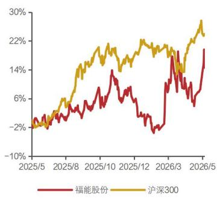

非金融|公司点评报告

hyzqdatemark2026 年 05 月 21 日

投资评级： 买入（维持）

证券分析师

查浩

SAC：S1350524060004

zhahao@huayuanstock.com

刘晓宁

SAC：S1350523120003

liuxiaoning@huayuanstock.com

蔡思

SAC：S1350524070005

caisi@huayuanstock.com

## 联系人

## 市场表现：

## 基本数据

2026 年 05 月 20 日
<table><tr><td>收盘价 (元) 一年内最高/最低</td><td>10.75</td></tr><tr><td>（元）</td><td>11.39/9. 03</td></tr><tr><td>总市值 (百万元) 流通市值 (百万元)</td><td>29,886.53 29,886.53</td></tr><tr><td>总股本 (百万股)</td><td>2,780.14</td></tr><tr><td>资产负债率(%)</td><td>40.44</td></tr><tr><td>每股净资产 (元/股)</td><td>10.02</td></tr></table>

资料来源：聚源数据

# 福能股份(600483.SH)

## 风资源影响 Q1 业绩 兼具红利与成长的稳健标的

## 投资要点：

 事件：公司披露 2025 年年报和 2026 年一季度报告，2025 年公司实现归母净利润 29.57 亿元，同比增长 5.9%，2026年一季度公司实现归母净利润 6.5亿元，同比下滑13.6%。

 2025年火电利润高增，风电利润受所得税减免政策到期影响有所下滑。从主要子公司/参股公司的利润来看，1）煤电：鸿山热电净利润 8.28亿元，同比增长 34%，国能石狮净利润7.18亿元，同比增长 115%，主因煤炭成本下降；2）气电：晋江气电净利润 2.45亿元，同比增长125%；3）风电：福能新能源净利润9.66 亿元，同比下滑 13.2%，海峡发电净利润 13.7 亿元，同比下滑 15.4%，福能海峡净利润 6.2亿元，同比增长 7.5%，风电利润下滑主因风电电价下降、部分机组所得税减免政策到期。

 经营数据来看，2025 年公司火电发电量 174.9 亿千瓦时，同比下滑 3.23%，福建煤电电价0.4141元/千瓦时，同比下降约4 分钱/千瓦时；2025 年公司风电发电量59.95亿千瓦时，同比下滑 0.3%，风电电价下降约 2分钱/千瓦时。

 2026Q1风电发电量下滑影响业绩。2026年一季度公司风电发电量 16.43亿千瓦时，同比下滑 14.1%，导致公司风电利润表现不佳，但公司火电发电量同比增长 17.1%，在一定程度上抵消了电价下降带来的影响。

 2025年全年分红率提升至40%，公司红利属性逐步显现。2025年公司年末分红 0.353元/股，加上中期分红 0.073 元/股，合计股利 0.43 元/股，对应分红率 40.1%，相较于2024 年提升 9个百分点，充分体现公司提高股东回报的想法。按照当前每股分红 0.43元，公司股息率 4%（2026年 5月 20 日收盘价），红利属性逐步显现。

 在手海风项目、热电联产项目即将开工，未来 2-3 年公司成长性较强。公司长乐外海 J区项目（65.6万千瓦海上风电）启动招标，泉惠热电联产二期项目即将开工，叠加前期计划开工的泉惠一期项目，公司当前在建拟建总装机达到 328 万千瓦（66 万千瓦海风+262 万千瓦热电联产）。海风项目（长乐外海 J 区）风资源较好，等效利用小时数 4551 小时，热电联产项目配套石化工业园区供热，预计盈利水平较高。除此之外，2024年泉州公司（福能股份参股23%）三期 2×660MW 和石狮公司（福能股份参股 49%）三期1×1000MW扩建项目获得核准，预计项目有望在 2027-2028年陆续投产，为公司未来业绩增长奠定基础。

 盈利预测与评级：我们预计公司 2026-2028年归母净利润分别为 25.8、27.5、32.8亿元，同比增速分别为-12.9%、6.9%、19.2%，当前股价对应的 PE 分别为 12、11、9 倍，按照 40%的分红率计算，公司 2026-2028 年股息率分别为 3.5%、3.7%、4.4%，维持“买入”评级。

 风险提示。电量存在不确定性，电价存在不确定性，在建项目投产进度存在不确定性

盈利预测与估值（人民币）
<table><tr><td></td><td>2024</td><td>2025</td><td>2026E</td><td>2027E</td><td>2028E</td></tr><tr><td></td><td></td><td></td><td></td><td></td><td></td></tr><tr><td>营业收入 (百万元) 同比增长率 (%)</td><td>14,563</td><td>13,751</td><td>13,845</td><td>14,608</td><td>17,900</td></tr><tr><td></td><td>-0.90% 2,793</td><td>-5.58%</td><td>0.69%</td><td>5.51%</td><td>22.54%</td></tr><tr><td>归母净利润 (百万元) 同比增长率 (%)</td><td>6.47%</td><td>2,957</td><td>2,577</td><td>2,753</td><td>3,281</td></tr><tr><td>每股收益 (元/股)</td><td>1.00</td><td>5.87% 1.06</td><td>-12.86%</td><td>6.85%</td><td>19.16%</td></tr><tr><td>ROE(%)</td><td>11.05%</td><td>10.79%</td><td>0.93</td><td>0.99</td><td>1.18</td></tr><tr><td>市盈率 (P/E)</td><td>10.70</td><td></td><td>8.90%</td><td>8.99%</td><td>10.07%</td></tr><tr><td></td><td></td><td>10. 11</td><td>11.60</td><td>10.85</td><td>9.11</td></tr></table>

资料来源：公司公告，华源证券研究所预测

附录：财务预测摘要  
资产负债表（百万元）
<table><tr><td>会计年度</td><td>2025</td><td>2026E</td><td>2027E</td><td>2028E</td></tr><tr><td>货币资金</td><td>11,034</td><td>9,880</td><td>8,814</td><td>7,971</td></tr><tr><td>应收票据及账款</td><td>5,377</td><td>5,414</td><td>5,712</td><td>6,999</td></tr><tr><td>预付账款</td><td>29</td><td>29</td><td>31</td><td>38</td></tr><tr><td>其他应收款</td><td>19</td><td>19</td><td>20</td><td>25</td></tr><tr><td>存货</td><td>602</td><td>637</td><td>666</td><td>802</td></tr><tr><td>其他流动资产</td><td>217</td><td>219</td><td>231</td><td>283</td></tr><tr><td>流动资产总计</td><td>17,279</td><td>16,198</td><td>15, 473</td><td>16,118</td></tr><tr><td>长期股权投资</td><td>10,447</td><td>11,647</td><td>12,917</td><td>14,187</td></tr><tr><td>固定资产</td><td>23,167</td><td>25,140</td><td>28,861</td><td>32,330</td></tr><tr><td>在建工程</td><td>5,497</td><td>5,665</td><td>3,832</td><td>2,000</td></tr><tr><td>无形资产</td><td>779</td><td>798</td><td>863</td><td>926</td></tr><tr><td>长期待摊费用</td><td>27</td><td>23</td><td>19</td><td>16</td></tr><tr><td>其他非流动资产</td><td>1,997</td><td>2,047</td><td>2,047</td><td>2,046</td></tr><tr><td>非流动资产合计</td><td>41,915</td><td>45,319</td><td>48, 539</td><td>51, 504</td></tr><tr><td>资产总计</td><td>59, 193</td><td>61, 518</td><td>64,012</td><td>67, 622</td></tr><tr><td>短期借款</td><td>320</td><td>0</td><td>0</td><td>0</td></tr><tr><td>应付票据及账款</td><td>1,462</td><td>1,547</td><td>1,617</td><td>1,947</td></tr><tr><td>其他流动负债</td><td>3,758</td><td>3,947</td><td>4,123</td><td>4,970</td></tr><tr><td>流动负债合计</td><td>5,541</td><td>5,494</td><td>5,740</td><td>6,918</td></tr><tr><td>长期借款</td><td>18,271</td><td>18,493</td><td>18,446</td><td>18,142</td></tr><tr><td>其他非流动负债</td><td>940</td><td>940</td><td>940</td><td>940</td></tr><tr><td>非流动负债合计</td><td>19, 211</td><td>19, 433</td><td>19, 387</td><td>19, 082</td></tr><tr><td>负债合计</td><td>24,752</td><td>24, 927</td><td>25,126</td><td>26,000</td></tr><tr><td>股本</td><td>5,021</td><td>5,021</td><td>5,021</td><td>5,021</td></tr><tr><td>资本公积</td><td>7,612</td><td>7,612</td><td>7,612</td><td>7,612</td></tr><tr><td>留存收益</td><td>14,782</td><td>16,328</td><td>17,980</td><td>19,949</td></tr><tr><td>归属母公司权益</td><td>27,415</td><td>28,961</td><td>30,613</td><td>32,582</td></tr><tr><td>少数股东权益</td><td>7,026</td><td>7,629</td><td>8,273</td><td>9,040</td></tr><tr><td>股东权益合计</td><td>34, 442</td><td>36, 590</td><td>38, 886</td><td>41, 622</td></tr><tr><td>负债和股东权益合计</td><td>59,193</td><td>61,518</td><td>64,012</td><td>67, 622</td></tr></table>

利润表（百万元）
<table><tr><td>会计年度</td><td>2025</td><td>2026E</td><td>2027E</td><td>2028E</td></tr><tr><td>营业收入</td><td>13,751</td><td>13,845</td><td>14, 608</td><td>17,900</td></tr><tr><td>营业成本</td><td>9,799</td><td>10,364</td><td>10,832</td><td>13,048</td></tr><tr><td>税金及附加</td><td>151</td><td>152</td><td>161</td><td>197</td></tr><tr><td>销售费用</td><td>30</td><td>30</td><td>32</td><td>39</td></tr><tr><td>管理费用</td><td>359</td><td>305</td><td>307</td><td>376</td></tr><tr><td>研发费用</td><td>121</td><td>122</td><td>129</td><td>158</td></tr><tr><td>财务费用</td><td>368</td><td>519</td><td>521</td><td>519</td></tr><tr><td>资产减值损失</td><td>-11</td><td>-11</td><td>-12</td><td>-14</td></tr><tr><td>信用减值损失</td><td>9</td><td>9</td><td>9</td><td>12</td></tr><tr><td>其他经营损益</td><td>0</td><td>0</td><td>0</td><td>0</td></tr><tr><td>投资收益</td><td>1,318</td><td>1,320</td><td>1,390</td><td>1,390</td></tr><tr><td>公允价值变动损益</td><td>0</td><td>0</td><td>0</td><td>0</td></tr><tr><td>资产处置收益</td><td>5</td><td>5</td><td>5</td><td>5</td></tr><tr><td>其他收益</td><td>162</td><td>162</td><td>162</td><td>162</td></tr><tr><td>营业利润</td><td>4,406</td><td>3,839</td><td>4,181</td><td>5,118</td></tr><tr><td>营业外收入</td><td>67</td><td>67</td><td>67</td><td>67</td></tr><tr><td>营业外支出</td><td>28</td><td>28</td><td>28</td><td>28</td></tr><tr><td>其他非经营损益</td><td>0</td><td>0</td><td>0</td><td>0</td></tr><tr><td>利润总额</td><td>4,445</td><td>3,877</td><td>4,220</td><td>5,157</td></tr><tr><td>所得税</td><td>796</td><td>698</td><td>823</td><td>1,109</td></tr><tr><td>净利润</td><td>3,649</td><td>3,180</td><td>3,397</td><td>4, 048</td></tr><tr><td>少数股东损益</td><td>691</td><td>603</td><td>644</td><td>767</td></tr><tr><td>归属母公司股东净利润</td><td>2, 957</td><td>2, 577</td><td>2,753</td><td>3,281</td></tr><tr><td>EPS(元)</td><td>1. 06</td><td>0.93</td><td>0.99</td><td>1. 18</td></tr></table>

现金流量表（百万元）
<table><tr><td>会计年度</td><td>2025</td><td>2026E</td><td>2027E</td><td>2028E</td></tr><tr><td>税后经营利润</td><td>3,649</td><td>1,928</td><td>2,112</td><td>2,795</td></tr><tr><td>折旧与摊销</td><td>1,755</td><td>1,896</td><td>2,150</td><td>2,405</td></tr><tr><td>财务费用</td><td>368</td><td>519</td><td>521</td><td>519</td></tr><tr><td>投资损失</td><td>-1,318</td><td>-1,320</td><td>-1,390</td><td>-1,390</td></tr><tr><td>营运资金变动</td><td>582</td><td>200</td><td>-96</td><td>-309</td></tr><tr><td>其他经营现金流</td><td>74</td><td>1,521</td><td>1,591</td><td>1,591</td></tr><tr><td>经营性现金净流量</td><td>5,109</td><td>4,743</td><td>4, 889</td><td>5,612</td></tr><tr><td>投资性现金净流量</td><td>-2,789</td><td>-4,250</td><td>-4,286</td><td>-4, 318</td></tr><tr><td>筹资性现金净流量</td><td>3,087</td><td>-1, 647</td><td>-1,670</td><td>-2,136</td></tr><tr><td>现金流量净额</td><td>5,407</td><td>-1,154</td><td>-1,067</td><td>-842</td></tr></table>

资料来源：公司公告，华源证券研究所预测

主要财务比率
<table><tr><td>会计年度</td><td>2025</td><td>2026E</td><td>2027E</td><td>2028E</td></tr><tr><td>成长能力</td><td></td><td></td><td></td><td></td></tr><tr><td>营收增长率</td><td>-5.58%</td><td>0.69%</td><td>5.51%</td><td>22.54%</td></tr><tr><td>营业利润增长率</td><td>8.75%</td><td>-12.88%</td><td>8.93%</td><td>22.40%</td></tr><tr><td>归母净利润增长率</td><td>5.87%</td><td>-12.86%</td><td>6.85%</td><td>19.16%</td></tr><tr><td>经营现金流增长率</td><td>9.05%</td><td>-7.16%</td><td>3.08%</td><td>14.78%</td></tr><tr><td>盈利能力</td><td></td><td></td><td></td><td></td></tr><tr><td>毛利率</td><td>28.74%</td><td>25.14%</td><td>25.85%</td><td>27.11%</td></tr><tr><td>净利率</td><td>26.53%</td><td>22.96%</td><td>23.26%</td><td>22. 62%</td></tr><tr><td>ROE</td><td>10.79%</td><td>8.90%</td><td>8.99%</td><td>10.07%</td></tr><tr><td>ROA</td><td>5.00%</td><td>4.19%</td><td>4.30%</td><td>4.85%</td></tr><tr><td>估值倍数</td><td></td><td></td><td></td><td></td></tr><tr><td>P/E</td><td>10.11</td><td>11.60</td><td>10.85</td><td>9.11</td></tr><tr><td>P/S</td><td>2.17</td><td>2.16</td><td>2.05</td><td>1. 67</td></tr><tr><td>P/B</td><td>1.10</td><td>1.04</td><td>0.98</td><td>0.92</td></tr><tr><td>股息率</td><td>0.68%</td><td>3.45%</td><td>3.69%</td><td>4.39%</td></tr><tr><td>EV/EBITDA</td><td>7</td><td>8</td><td>7</td><td>7</td></tr></table>

## 证券分析师声明

本报告署名分析师在此声明，本人具有中国证券业协会授予的证券投资咨询执业资格并注册为证券分析师，本报告表述的所有观点均准确反映了本人对标的证券和发行人的个人看法。本人以勤勉的职业态度，专业审慎的研究方法，使用合法合规的信息，独立、客观的出具此报告，本人所得报酬的任何部分不曾与、不与，也不将会与本报告中的具体投资意见或观点有直接或间接联系。

## 一般声明

华源证券股份有限公司（以下简称“本公司”）具有中国证监会许可的证券投资咨询业务资格。

本报告是机密文件，仅供本公司的客户使用。本公司不会因接收人收到本报告而视其为本公司客户。本报告是基于本公司认为可靠的已公开信息撰写，但本公司不保证该等信息的准确性或完整性。本报告所载的资料、工具、意见及推测等只提供给客户作参考之用，并非作为或被视为出售或购买证券或其他投资标的的邀请或向人作出邀请。该等信息、意见并未考虑到获取本报告人员的具体投资目的、财务状况以及特定需求，在任何时候均不构成对任何人的个人推荐。客户应对本报告中的信息和意见进行独立评估，并应同时考量各自的投资目的、财务状况和特殊需求，必要时就法律、商业、财务、税收等方面咨询专家的意见。对依据或使用本报告所造成的一切后果，本公司及/或其关联人员均不承担任何法律责任。任何形式的分享证券投资收益或者分担证券投资损失的书面或口头承诺均为无效。

本报告所载的意见、评估及推测仅反映本公司于发布本报告当日的观点和判断，在不同时期，本公司可发出与本报告所载意见、评估及推测不一致的报告。本报告所指的证券或投资标的的价格、价值及投资收入可能会波动。除非另行说明，本报告中所引用的关于业绩的数据代表过往表现，过往的业绩表现不应作为日后回报的预示。本公司不承诺也不保证任何预示的回报会得以实现，分析中所做的预测可能是基于相应的假设，任何假设的变化可能会显著影响所预测的回报。本公司不保证本报告所含信息保持在最新状态。本公司对本报告所含信息可在不发出通知的情形下做出修改，投资者应当自行关注相应的更新或修改。

本报告的版权归本公司所有，属于非公开资料。本公司对本报告保留一切权利。未经本公司事先书面授权，本报告的任何部分均不得以任何方式修改、复制或再次分发给任何其他人，或以任何侵犯本公司版权的其他方式使用。如征得本公司许可进行引用、刊发的，需在允许的范围内使用，并注明出处为“华源证券研究所”，且不得对本报告进行任何有悖原意的引用、删节和修改。本公司保留追究相关责任的权利。所有本报告中使用的商标、服务标记及标记均为本公司的商标、服务标记及标记。

本公司销售人员、交易人员以及其他专业人员可能会依据不同的假设和标准，采用不同的分析方法而口头或书面发表与本报告意见及建议不一致的市场评论或交易观点，本公司没有就此意见及建议向报告所有接收者进行更新的义务。本公司的资产管理部门、自营部门以及其他投资业务部门可能独立做出与本报告中的意见或建议不一致的投资决策。

## 信息披露声明

在法律许可的情况下，本公司可能会持有本报告中提及公司所发行的证券并进行交易，也可能为这些公司提供或争取提供投资银行、财务顾问和金融产品等各种金融服务。本公司将会在知晓范围内依法合规的履行信息披露义务。因此，投资者应当考虑到本公司及/或其相关人员可能存在影响本报告观点客观性的潜在利益冲突，投资者请勿将本报告视为投资或其他决定的唯一参考依据。

## 投资评级说明

证券的投资评级：以报告日后的 6 个月内，证券相对于同期市场基准指数的涨跌幅为标准，定义如下：

买入：相对同期市场基准指数涨跌幅在20％以上；

增持：相对同期市场基准指数涨跌幅在5％～20％之间；

中性：相对同期市场基准指数涨跌幅在－5％～＋5％之间；

减持：相对同期市场基准指数涨跌幅低于-5％及以下。

无：由于我们无法获取必要的资料，或者公司面临无法预见结果的重大不确定性事件，或者其他原因，致使我们无法给出明确的投资评级。

行业的投资评级：以报告日后的6 个月内，行业股票指数相对于同期市场基准指数的涨跌幅为标准，定义如下：

看好：行业股票指数超越同期市场基准指数；

中性：行业股票指数与同期市场基准指数基本持平；

看淡：行业股票指数弱于同期市场基准指数。

我们在此提醒您，不同证券研究机构采用不同的评级术语及评级标准。我们采用的是相对评级体系，表示投资的相对比重建议；

投资者买入或者卖出证券的决定取决于个人的实际情况，比如当前的持仓结构以及其他需要考虑的因素。投资者应阅读整篇报告，以获取比较完整的观点与信息，不应仅仅依靠投资评级来推断结论。

本报告采用的基准指数：A股市场（北交所除外）基准为沪深 300 指数，北交所市场基准为北证 50指数，香港市场基准为恒生中国企业指数（HSCEI），美国市场基准为标普 500 指数或者纳斯达克指数，新三板基准指数为三板成指（针对协议转让标的）或三板做市指数（针对做市转让标的）。