## 半导体配套设备国产替代领军者，先

## 发卡位优势显著

## 投资逻辑

公司主营业务为半导体专用温控设备、工艺废气处理设备及晶圆传片设备，产品广泛应用于集成电路制造的核心工艺环节。公司2025年归母净利润短期承压，主要系研发费用增加所致。但各项前瞻指标表现亮眼，截至2025 年底公司存货中发出商品增至15.62亿元，同比增加29.84%;截至2026Q1公司合同负债达14.88亿元，同比增加82.48%，充沛的在手订单叠加26Q1盈利能力企稳修复，有望支撑公司业绩重回高增长态势。

半导体设备行业景气度延续，附属配套设备国产替代空间广阔。根据SEMI数据，2025年全球半导体设备销售额达1350.6亿美元(Y0Y+15%)，中国大陆稳居首位（493.1亿美元)。随着下游存储与逻辑晶圆厂步入长扩产周期，资本开支维持高位，直接拉动半导体配套设备需求。公司核心产品成功打破国外厂商在该领域的长期垄断，填补了国内空白，并已获得国内头部逻辑、存储等大客户的批量订单。公司客户集中度高，核心大厂业务敞口显著，2025年前五大客户营收占比达81.37%，将显著受益于下游大客户扩产。技术底座与产能扩张共振，卡位优势显著。在巩固现有产品竞争优势的基础上，公司积极向先进制程拓展，产品已全面适配28nm及以下逻辑芯片、128层以上3DNAND存储芯片产线。公司正加速推进安徽研发生产基地建设，该项目预计于2026年底达到预定可使用状态。新产能的集中释放将大幅提升温控及废气处理设备的交付能力，打破潜在的供给侧瓶颈。

## 盈利预测、估值和评级

我们预测公司2026-2028年营收分别为21.97亿元、30.86亿元、41.92亿元，EPS分别为2.00元/3.05元/4.33元，对应当前股价的PE估值分别为80倍/52倍/36倍。参考可比公司估值，平均26年为93倍PE,公司作为国内半导体专用温控设备和废气处理设备国产替代的领军者，具备显著的稀缺性，我们给予公司2026年93倍PE，对应目标价为185.81元，首次覆盖，给予“买入”评级。

## 风险提示

下游晶圆厂扩产及资本开支不及预期的风险，核心技术迭代与新产品客户验证不及预期的风险，市场竞争加剧导致毛利率承压的风险，限售股解禁的风险，存货周转周期较长的风险。

## 电子组

分析师：樊志远 (执业S1130518070003)

fanzhiyuan@gjzq.com.cn

分析师：周焕博 (执业 S1130525080009)

zhouhuanbo@gjzq.com.cn

分析师：戴宗廷 (执业 S1130524120005)

daizongting@gjzq.com.cn

市价（人民币)：158.94元

目标价（人民币)：185.81元

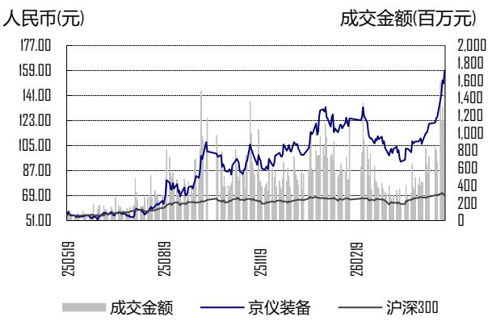  
公司基本情况 (人民币)

<table><tr><td>项目</td><td>2024</td><td>2025</td><td>2026E</td><td>2027E</td><td>2028E</td></tr><tr><td>营业收入(百万元)</td><td>1,026</td><td>1,426</td><td>2,197</td><td>3,086</td><td>4,192</td></tr><tr><td>营业收入增长率</td><td>38.28%</td><td>38.95%</td><td>54.01%</td><td>40.50%</td><td>35.84%</td></tr><tr><td>归母净利润(百万元)</td><td>153</td><td>148</td><td>336</td><td>513</td><td>728</td></tr><tr><td>归母净利润增长率</td><td>28.35%</td><td>-3.26%</td><td>126.88%</td><td>52.77%</td><td>42.03%</td></tr><tr><td>摊薄每股收益(元)</td><td>0.910</td><td>0.881</td><td>1.998</td><td>3.052</td><td>4.335</td></tr><tr><td>每股经营性现金流净额</td><td>-0.00</td><td>2.27</td><td>0.91</td><td>2.73</td><td>3.29</td></tr><tr><td>ROE(归属母公司)(摊薄)</td><td>7.37%</td><td>6.72%</td><td>13.32%</td><td>17.05%</td><td>19.69%</td></tr><tr><td>P/E</td><td>53.94</td><td>111.65</td><td>79.56</td><td>52.08</td><td>36.67</td></tr><tr><td>P/B</td><td>3.98</td><td>7.50</td><td>10.59</td><td>8.88</td><td>7.22</td></tr></table>

来源：公司年报、国金证券研究所

## 内容目录

一、半导体专用温控、废气处理、晶圆传片设备国产替代领军者.. 4  
1.1国资背景深耕半导体配套设备，三大产品打破国外厂商垄断 4  
1.2公司营收持续增长，盈利能力逐渐修复． 6  
二、下游晶圆厂持续扩产，配套设备市场维持高景气. 8  
2.1半导体市场景气度高，中国大陆稳居第一大半导体设备市场 8  
2.2把握下游扩产与国产替代双重红利，公司配套设备加速渗透 10  
三、技术底座与产能扩张共振，构筑深厚护城河. 12  
四、盈利预测与投资建议. 15  
4.1盈利预测， 15  
4.2投资建议及估值 17  
五、风险提示.. 17

## 图表目录

图表1：公司成立于2016年，产品覆盖半导体专用温控设备、半导体专用工艺废气处理设备和晶圆传片设备4  
图表2：温控设备贡献了公司半导体专用的设备主要营收.， 5  
图表3：公司客户覆盖了主流晶圆厂，设备可以配套国内外设备厂商 5  
图表4：公司深度绑定下游客户，客户集中度高 (2025年年报） 5  
图表5：公司实控人为北京国资委，股权结构清晰 (截至2026Q1) 6  
图表6：公司 2022-2026Q1营收稳步增长. 6  
图表7：受研发费用增加影响，公司2025年归母净利短期下滑 6  
图表8：公司盈利能力逐渐修复（单位：%） 7  
图表9：公司销售、管理费用率逐渐下降，研发费用率持续增长(单位：%) 7  
图表10：截至2026Q1，公司合同负债增至14.88亿元（单位：亿元） 8  
图表11：截至2025年底，公司发出商品增至15.62亿元（单位：亿元） 8  
图表12：WSTS预计2026年全球半导体销售额将接近万亿美元. 8  
图表13：中国大陆半导体销售额持续增加 9  
图表14：中国大陆半导体设备市场维持高景气（单位：亿美元） 9  
图表15：12英寸晶圆厂持续扩产． 10  
图表16：公司产品可应用于半导体制程各环节 10  
图表17：预计2031年全球半导体专用温控设备市场达到12.34亿美元(单位：亿美元) 11  
图表18：预计2031年全球半导体专用废气处理设备市场达到31.44亿美元（单位：亿美元） 11  
图表19：预计2031年全球晶圆传片设备市场达到13.24亿美元（单位：亿美元） 11  
图表20：2026Q1半导体设备进口额同比下滑14%， 12  
图表21：半导体设备进口数量呈现震荡下行趋势（单位：台） 12  
图表22：下游厂商扩产意愿强烈（购建固定资产、无形资产和其他长期资产支付的现金单位：亿元）.... 12  
图表 23：下游厂商在建工程规模持续积累 (单位：亿元） 12  
图表 24：公司在三大业务板块掌握了多项核心技术． 13  
图表25：预计公司募投项目将于2026年年底建成投产 13  
图表26：公司营收规模相比可比公司较小(单位：亿元) 14  
图表27：公司营收增速处于行业中游，平稳增长 (单位：%) 14  
图表28：公司毛利率略低于前道设备(单位：%) 14  
图表29：公司研发费用投入聚焦高效（单位：%） 14  
图表30：公司合同负债呈稳定上升趋势(单位：亿元） 15  
图表31：公司2026Q1在建工程大幅增加(单位：亿元） 15  
图表32：公司分产品营收拆分.. 16  
图表33：2025-2028E公司三费情况. 17  
图表34：可比公司估值比较． 17

## 一、半导体专用温控、废气处理、晶圆传片设备国产替代领军者

## 1.1国资背景深耕半导体配套设备，三大产品打破国外厂商垄断

京仪装备成立于2016年，总部位于北京，于2023年成功在上海证券交易所挂牌上市。自成立以来，公司始终聚焦于半导体专用设备的研发、生产与销售，致力于为集成电路制造环节提供高效益的生产设备。在发展过程中，公司深度参与国内集成电路产业关键产品技术的攻关，并积极承担国家级重点专项研发任务。经过多年技术沉淀，公司构建了以半导体专用温控设备（ChiIler）、半导体专用工艺废气处理设备（LocalScrubber）和晶圆传片设备（Sorter）为主的三大核心产品矩阵。凭借持续的研发投入与技术突破，公司半导体专用温控设备已成功打破国外厂商在该领域的长期垄断。目前，公司是国内极少数能够同时实现半导体专用温控设备和工艺废气处理设备规模化装机应用的本土制造商,核心产品技术水平已达到国内领先、国际先进标准，确立了其在国内半导体专用设备规模装机应用领域的技术引领者地位。

图表1：公司成立于2016年，产品覆盖半导体专用温控设备、半导体专用工艺废气处理设备和晶圆传片设备  
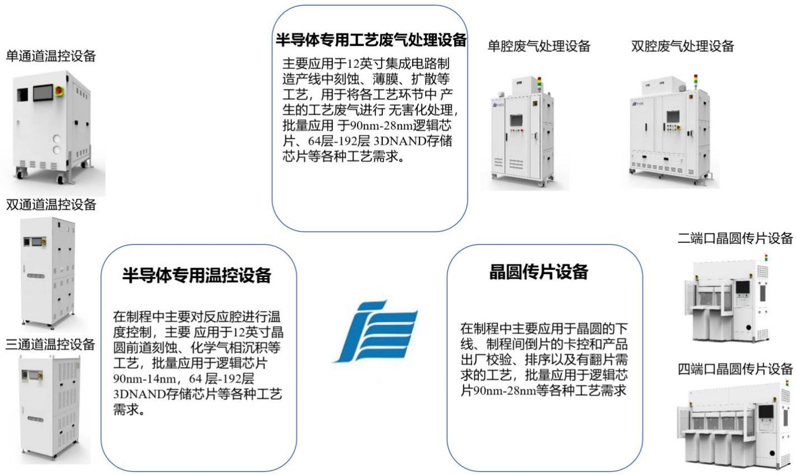  
来源：公司公告、公司官网、国金证券研究所

公司紧密贴合下游客户产线扩产与国产化需求，协同推进半导体专用温控设备、工艺废气处理设备及晶圆传片设备三大核心产品线。从公司2025年半导体专用设备的营收结构来看，温控设备作为业绩基本盘占比达71%，废气处理设备占比约26%，晶圆传片设备正处于导入起量阶段占比约3%。在市场推进层面，公司深度绑定下游关键客户。其中，温控设备具备“晶圆厂+设备商”双重客户属性，不仅直供中芯国际、长江存储、华虹集团等一线制造企业，还作为核心配套切入北方华创、中微公司等头部设备商体系；废气处理与传片设备亦在主流产线及功率半导体客户中持续推进验证与规模化导入。公司目前拥有优质、稳定的客户资源，在行业内积累了良好的产品、技术和服务口碑，与主要客户有着稳定的合作关系。我们预计，公司将深度受益于下游厂商的扩产和半导体设备国产化替代浪潮。

图表2：温控设备贡献了公司半导体专用的设备主要营收  
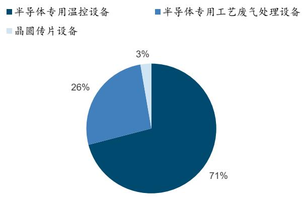  
来源：ifind、国金证券研究所

图表3：公司客户覆盖了主流晶圆厂，设备可以配套国内外设备厂商  
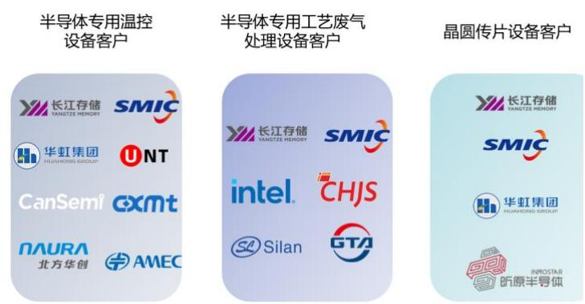  
来源：ifind、国金证券研究所

公司客户集中度维持高位，核心大厂业务敞口显著。2025年前五大客户营收占比达81.37%（其中前两大客户分别贡献32.94%和20.87%)，在半导体设备高验证壁垒的行业属性下，高客户集中度进一步印证了公司与国内一线晶圆厂已形成深度的供应链绑定。当前正值国内头部逻辑与存储晶圆厂资本开支密集落地期，公司凭借在核心客户中的大额敞口，能够直接跨越新产线验证周期承接扩产红利，在行业扩产周期中具备极强的业绩向上弹性与增长确定性。

图表4：公司深度绑定下游客户，客户集中度高(2025年年报）  
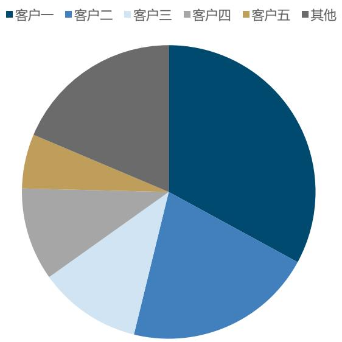  
来源：公司公告、国金证券研究所

公司国资底蕴深厚，股权及组织架构精简。公司实际控制人为北京市国资委，大股东北京京仪集团持股28.13%，第二大股东安徽北自持股11.99%，核心股权清晰稳定。截至2026年一季报，公司前十大股东汇集了社保基金、险资及多支半导体与Ai主题公募基金，机构持仓结构多元。旗下全资控股核心经营主体安徽京仪（100%)，并参股湖北三维半导体(4.13%)，整体组织架构扁平，聚焦主责主业。

图表5：公司实控人为北京国资委，股权结构清晰 (截至2026Q1)  
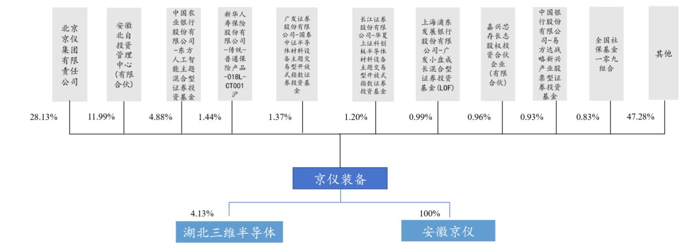  
来源：公司公告、ifind、国金证券研究所

## 1.2公司营收持续增长，盈利能力逐渐修复

营收体量快速扩张，归母净利短期承压。从营收端看，受益于国内半导体设备需求增加，公司积极拓展客户群体，半导体设备放量逻辑持续兑现，2022至2025年营收由6.64亿元增至14.26亿元，其中2024与2025年连续保持近40%的高位增长。从利润端看，归母净利润在2022至2024年随规模同步扩张，2025年录得1.48亿元，受研发费用增加及退税额减少影响阶段性承压（同比微降低3.26%)。26Q1来看，公司实现营收3.92亿元（同比+16.13%)，归母净利润0.34亿元（同比+29.45%)，利润增速扭转并跑贏营收。我们预计，随着下游存储厂商扩产，公司安徽基地顺利投产，规模效应逐步显现，公司盈利能力将逐渐修复。

图表6：公司2022-2026Q1营收稳步增长  
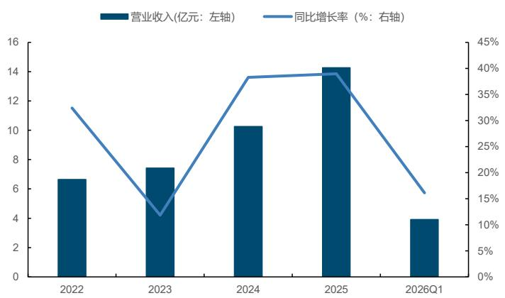  
来源：ifind、国金证券研究所

图表7：受研发费用增加影响，公司2025年归母净利短期下滑  
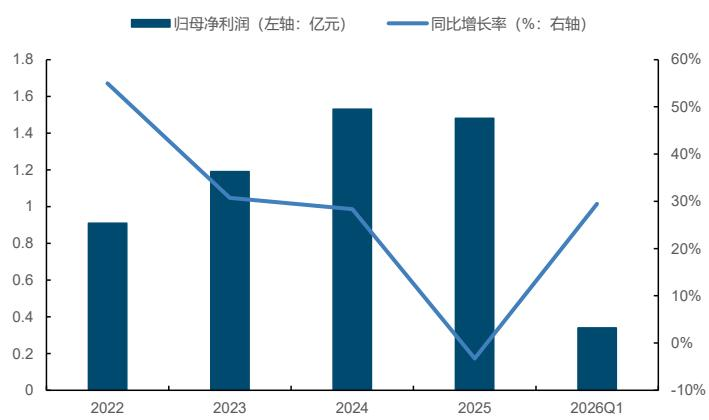  
来源：ifind、国金证券研究所

盈利能力小幅下滑，2026Q1显现企稳修复拐点。2022至2025年，公司综合毛利率由39.57%回落至32.64%(2025年同比-0.15pcts),净利率在2023年触及16.05%高点后下探至2025年的10.37%（2025年同比-4.53pcts)。2025年，公司毛利率小幅下降主要系废气处理及晶圆传片设备毛利率下降。2026Q1，公司盈利水平显著回暖，毛利率与净利率分别修复至35.26%和11.84%，预计未来随公司营收规模增长，盈利能力将进一步修复。

图表8：公司盈利能力逐渐修复(单位：%)  
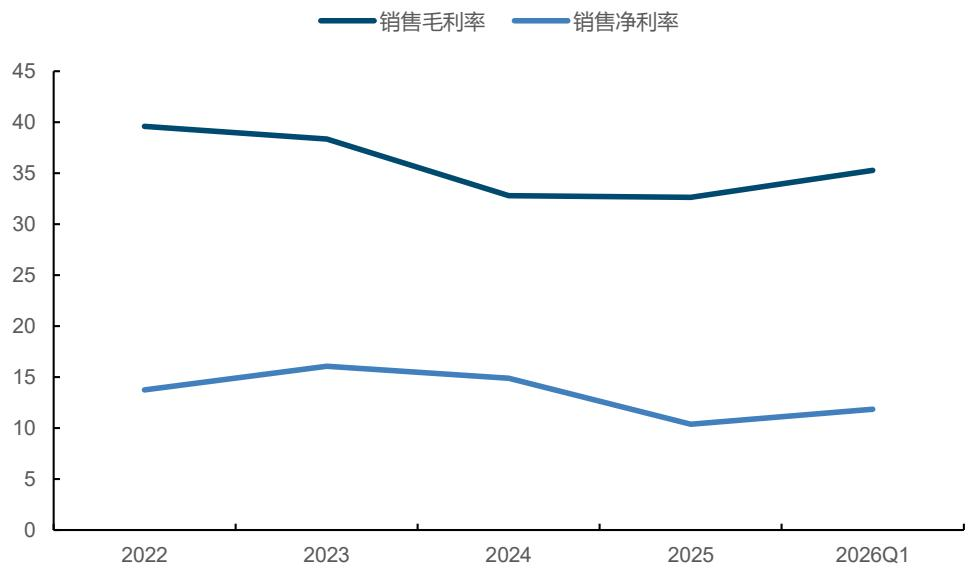  
来源：ifind、国金证券研究所

规模效应驱动销售与管理费率下行，研发投入强度持续升级。在销售与管理端，随着营收体量的快速扩张，经营杠杆逐步兑现。销售费用率与管理费用率自2023年起呈逐渐下降的趋势，至2026Q1已分别优化至6.26%和5.00%的较低水平。公司研发费用率呈现稳定上升的趋势，由2022年的7.29%稳步上行至2026Q1的9.99%。从绝对金额看，2025年研发费用同比大幅增长48.65%，主要系研发团队扩充及研发材料投入增加所致。截至2025年年底，公司累计拥有专利98项，其中发明专利26项。

图表9：公司销售、管理费用率逐渐下降，研发费用率持续增长(单位：%)  
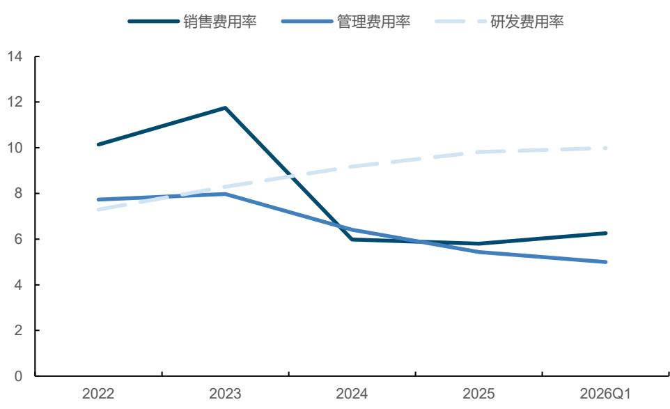  
来源：ifind、国金证券研究所

合同负债与发出商品同步高增，未来业绩增长能见度高。半导体设备行业通常采用“预收款-发货-产线验收后确认收入”的商业模式，合同负债与存货中的发出商品是观察公司在手订单与业绩转化趋势的核心前瞻指标。截至2026年Q1，公司合同负债由2022年的3.20亿元增至14.88亿元，反映出在手订单储备充足；截至2025年底，存货中发出商品余额由 2021年的1.95亿元增至15.62亿元，显示大量设备正处于交付验证流程。我们预计公司的前期订单将稳步转化为表内营收，中短期业绩增长的确定性较高。

图表10：截至2026Q1，公司合同负债增至14.88亿元（单位：亿元）  
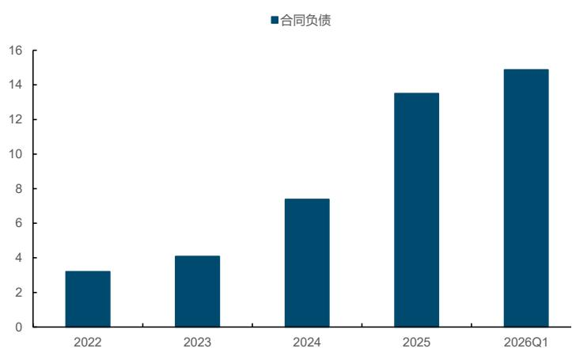  
来源：ifind、国金证券研究所

图表11：截至2025年底，公司发出商品增至15.62亿元（单位：亿元）  
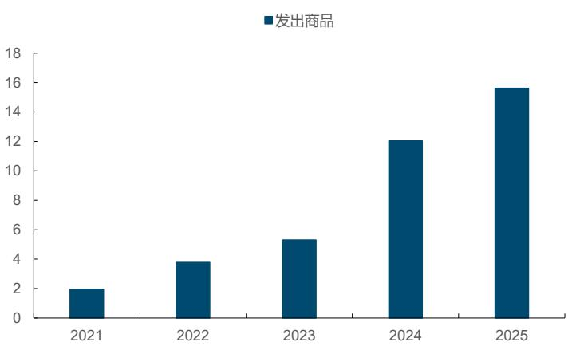  
来源：ifind、国金证券研究所

## 二、下游晶圆厂持续扩产，配套设备市场维持高景气

## 2.1半导体市场景气度高，中国大陆稳居第一大半导体设备市场

全球半导体市场景气上行，为设备端需求提供宏观支撑。据WSTS数据，受AI及数据中心基础设施需求驱动，2025年全球半导体销售额达7956亿美元（同比+26.2%)，其中Q4单季同比增速提升至38.4%，复苏动能逐季增强；同时WSTS预计2026年全球市场规模有望向万亿美元关口迈进。半导体行业整体景气度的持续修复，将有效保障下游晶圆制造端资本开支的扩张意愿。在此宏观背景下，下游产线对上游半导体设备的采购需求将保持旺盛。

图表12：WSTS预计2026年全球半导体销售额将接近万亿美元  
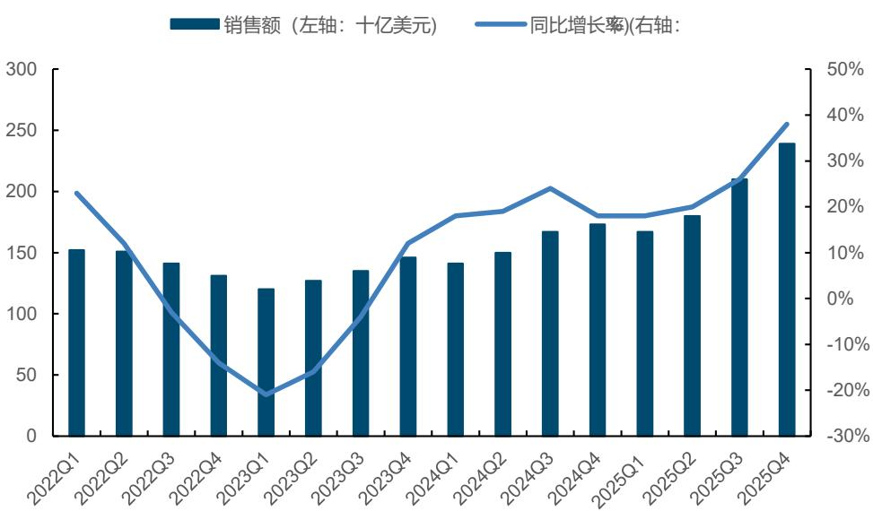  
来源：WSTS、国金证券研究所

国内半导体销售额持续增加，夯实本土设备采购基本面。据SIA统计数据，中国半导体市场自2023Q1（337.3亿美元，同比-33%）触及周期底部后，复苏趋势持续确立。2025年以来，国内市场销售额同比增速呈显著的逐季走高态势（2025年Q1至Q4增速分别为6%、13%、13%、26%)。进入2026Q1，单季销售额达到732.9亿美元，同比增速跃升至近60%，显示出国内半导体需求端强劲的向上弹性。国内半导体销售市场的持续回暖，标志着下游晶圆厂稼动率及盈利能力的实质性改善，这将有效驱动本土产线资本开支的平稳落地。

图表13：中国大陆半导体销售额持续增加  
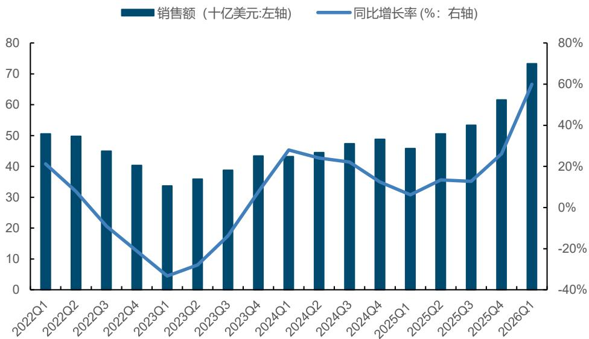  
来源：ifind、美国半导体协会、国金证券研究所

全球半导体设备支出创历史新高，大陆半导体设备市场维持高景气。据SEMI统计，在人工智能与高性能计算等前沿需求驱动下，2025年全球半导体设备销售额达到1350.6亿美元，同比增长15%，规模创下历史新纪录。其中，中国大陆2025年半导体设备支出达493.1亿美元，规模持续稳居全球首位。尽管同比微幅变动(微降0.5%)，但绝对开支规模依然维持在历史高位区间，主要系国内晶圆制造企业在成熟节点及精选先进产能上的持续战略性投入。中国大陆作为全球最大的半导体设备市场，其资本开支的高位韧性叠加供应链自主可控的长期诉求，为本土半导体设备环节提供了深厚的成长土壤。

图表14：中国大陆半导体设备市场维持高景气（单位：亿美元）  
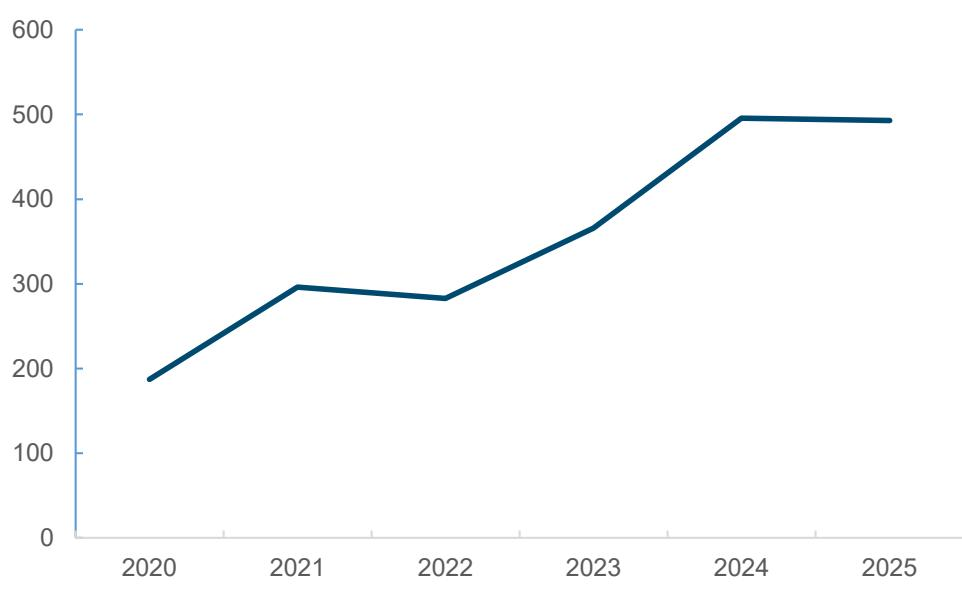  
来源：SEMI、国金证券研究所

12英寸晶圆厂步入长扩产周期，前端设备支出创历史新高。据SEMI最新预测，全球300mm（12英寸）前端晶圆厂设备支出正步入明确的结构性上行通道。预计2026年该项支出将同比增长18%，达到1330亿美元的历史新高，且在2027至2029年间将持续维持增长态势（增速预计分别为14%、3%、11%)。晶圆厂资本开支的长期扩张为上游设备端打开了明确的增量空间。公司深耕的半导体温控设备、废气处理设备及晶圆传片设备，均属于 12英寸逻辑及存储前端产线中的重要配套辅助设备。全球及本土晶圆厂先进制程的推进与成熟产能的持续扩充，将直接带动对公司核心产品线的规模化采购需求，为其中长期的订单增长提供坚实的产业周期支撑。

图表15：12英寸晶圆厂持续扩产  
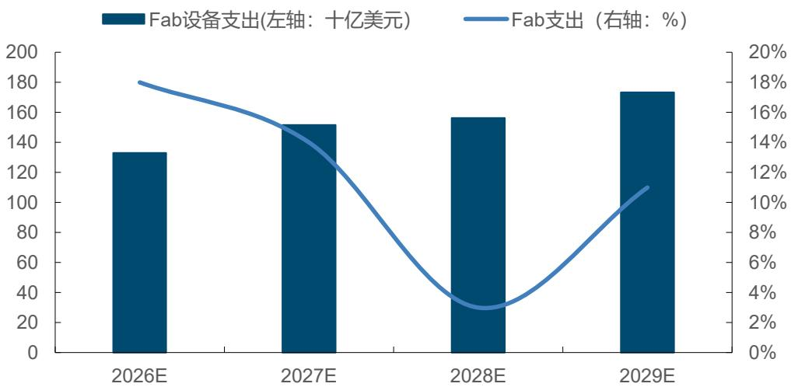  
来源：SEMI、国金证券研究所

## 2.2把握下游扩产与国产替代双重红利，公司配套设备加速渗透

公司产品覆盖半导体制造全环节，发挥基础配套作用。从应用场景来看，温控设备主要应用于刻蚀、离子注入、扩散、薄膜沉积及CMP 等环节；工艺废气处理设备主要用于刻蚀、薄膜及扩散环节；晶圆传片设备则负责各工艺节点间的晶圆下线、传片及倒片等自动化转运。公司设备有效配合了晶圆产线的主要物理与化学反应环境，作为维持制程稳定性与良率的辅助配套，其较广的应用覆盖面为公司在下游产线中的份额拓展提供了业务支撑。我们预计，随着下游晶圆厂的积极扩产，对于温控、废气处理、传片等配套设备的需求将进一步提升。

图表16：公司产品可应用于半导体制程各环节  
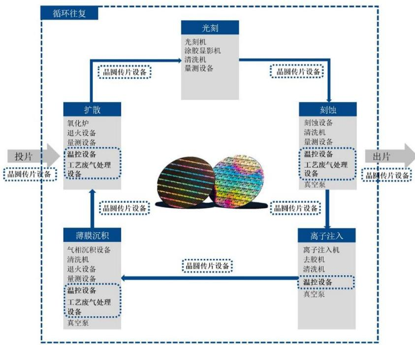  
来源：公司招股说明书、国金证券研究所

三大细分市场稳健扩容，废气处理设备呈现较高增速。根据QYResearch的预测数据，公司布局的三大核心设备细分市场均保持稳健扩容态势。其中，半导体专用工艺废气处理设备市场基数最大且增速较高，全球规模预计将由 2025 年的17.63亿美元增长至2031 年的31.44亿美元，期间复合年增长率（CAGR）达10.1%。同时，晶圆传片设备与半导体专用温控设备市场呈平稳扩张趋势，全球规模预计将分别从2025年的9.14亿美元和8.78亿美元，提升至2031年的13.24亿美元和12.34亿美元，对应CAGR均为5.9%。三大细分赛道的增长曲线与下游产线的扩产预期相契合，为公司相关业务线的中长期拓展提供了明确的市场空间。

图表17：预计2031年全球半导体专用温控设备市场达到12.34亿美元（单位：亿美元）  
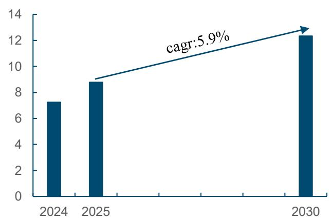  
来源：QYResearch、国金证券研究所

图表18：预计2031年全球半导体专用废气处理设备市场达到31.44亿美元（单位：亿美元）  
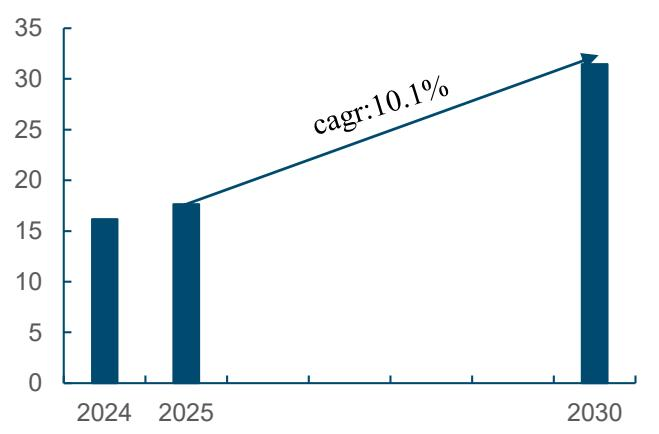  
来源：QYResearch、国金证券研究所

图表19：预计2031年全球晶圆传片设备市场达到13.24亿美元（单位：亿美元）  
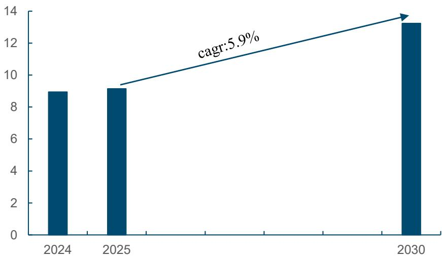  
来源：QYResearch、国金证券研究所

半导体设备进口增速回落，半导体设备国产替代稳步推进。从进口端数据来看，国内半导体设备进口金额增速已呈现明确的放缓及收缩趋势。2023与2024年，进口金额同比增速分别维持在22%和20%的较高区间，但至2025年，该增速已回落至6%。进入2026Q1，设备进口金额录得83.59亿美元，同比下滑14%，出现负增长。同期，在进口数量端，单季进口量整体也呈震荡下行态势，2026Q1设备进口量降至12483台，相较前期呈现出缩量特征。在中国大陆半导体设备市场扩容的背景下，海外设备进口金额增速的放缓与绝对数量的下降，反映出国内晶圆制造产线对海外设备的采购依赖度正在降低，表明本土设备在下游产线的验证与规模化导入正加速落地。公司作为温控与废气处理环节的设备供应商，有望持续受益于这一国产份额替代的行业进程。

图表20：2026Q1半导体设备进口额同比下滑14%  
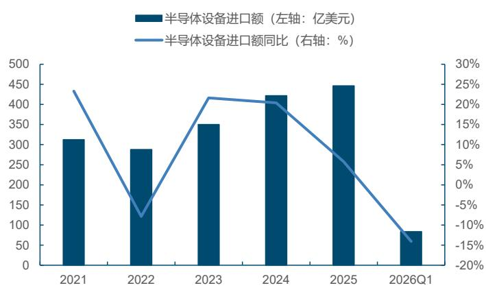  
来源：海关总署、ifind、国金证券研究所

图表21：半导体设备进口数量呈现震荡下行趋势（单位：台）  
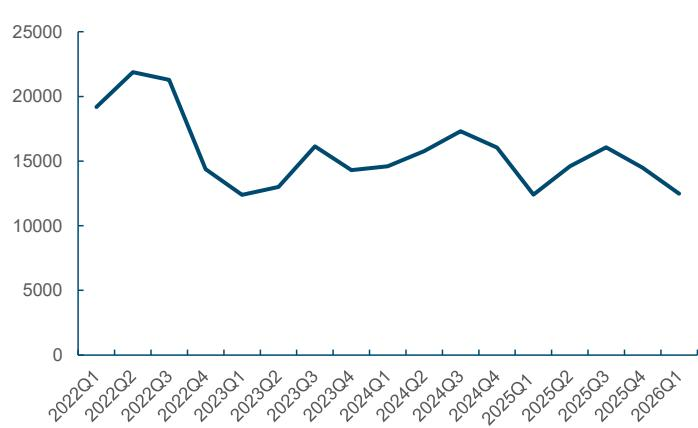  
来源：海关总署、ifind、国金证券研究所

下游晶圆厂资本开支与在建工程维持高位，逻辑与存储扩产共振牵引设备需求。国内头部逻辑代工与存储厂正处于产能扩张的密集投入期。逻辑代工方面，中2画降购建固定资产支出达599.51亿元，并预计今年持镁元的资本开支；华虹公司2025年在建工程亦攀升至144.87亿元。存储环节，以长鑫存储、长江存储为代表的头部存储企业伴随资本化进程持续推进扩产节奏，长鑫2024年资本开支达712.30亿元，2025 年资本开支497.39亿元。我们预测，由于晶圆制造，特别是存储芯片产线对制程温控及废气处理的稳定性有较高要求，随着长鑫科技、长江存储融资进程顺利，其将进一步顺应存储周期维持较高的资本开支，下游存储产线的建设将有效向上传导，为相关配套设备的采购带来平稳且长效的订单拉动效应。

图表22：下游厂商扩产意愿强烈（购建固定资产、无形资产和其他长期资产支付的现金 单位：亿元）  
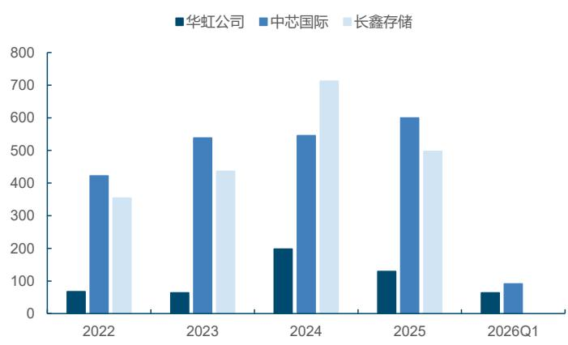  
来源：ifind、国金证券研究所注：长鑫存储未披露2026Q1数据

图表23：下游厂商在建工程规模持续积累(单位：亿元）  
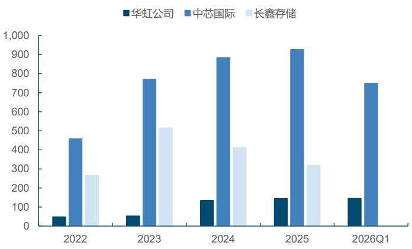  
来源：ifind、国金证券研究所注：长鑫存储未披露2026Q1数据

## 三、技术底座与产能扩张共振，构筑深厚护城河

公司核心技术矩阵持续完善，产品全面适配国内先进节点。公司依托长期的自主研发与工艺积累，在三大核心业务板块均构建了体系化的技术壁垒。公司温控设备有效满足了晶圆制造中宽温区、高精度的温控需求；废气处理设备在提升特殊气体处理效率的同时，切实解决了产线管路易堵塞的痛点，显著优化了设备的维护周期；晶圆传片设备则实现了复杂工况下的高速与超洁净转运。扎实的底层技术储备为公司设备向高端工艺节点的覆盖提供了直接支撑。目前，公司三大产品线已实现对国内主流及先进集成电路制造产线的全面覆盖。其中，在逻辑芯片领域，公司半导体专用温控设备已成功覆盖90nm-14nm 制程，公司废气处理设备已成功导入并应用于28nm及以下先进制程；在3DNAND存储领域，产品已适配192层的先进制造工艺。

图表24：公司在三大业务板块掌握了多项核心技术
<table><tr><td>设备种类</td><td>具体技术类型</td></tr><tr><td rowspan="4">半导体专用温控设备</td><td>半导体温控装置制冷控制技术</td></tr><tr><td>半导体温控装置精密温控技术</td></tr><tr><td>半导体温控装置节能技术</td></tr><tr><td>低温等离子废气处理技术</td></tr><tr><td rowspan="4">半导体专用工艺废气处理设备</td><td>新型材料防腐及密封技术</td></tr><tr><td>系统设计算法及原理</td></tr><tr><td>半导体废气处理纯氧燃烧技术</td></tr><tr><td>Harsh工艺除尘技术</td></tr><tr><td rowspan="4">晶圆传片设备</td><td>半导体晶圆传控技术</td></tr><tr><td>晶圆翻片技术</td></tr><tr><td>X-θ自动寻心算法</td></tr><tr><td>微晶背接触传控技术</td></tr><tr><td></td><td>晶圆区域检测技术</td></tr></table>

来源：公司公告、国金证券研究所

核心技术边界延伸至真空泵领域，多品类布局加速向半导体配套设备平台化转型。根据国家知识产权局信息，公司于2026年5月15日公开了一项名为“用于真空泵吹扫的气体检测装置及气体检测方法”的发明专利（公开号：CN122041960A)。真空干泵与公司现有的半导体专用温控设备、工艺废气处理设备同属晶圆制造前道工艺中高度相关的关键附属配套设备，且在刻蚀、薄膜沉积等核心工序中往往需要协同配置。公司的战略布局正由单点设备供应商向半导体配套设备综合平台演进。未来随着真空泵等新产品管线的逐步验证与商业化落地，公司有望通过多产品矩阵组合，进一步提升单一晶圆厂客户的采购份额与单线价值量，深化平台化协同效应与竞争壁垒。

募投项目稳步推进，产能扩充保障订单交付。为应对下游日益增长的设备采购需求，公司正加速推进安徽研发生产基地项目建设。截至2025年末公司集成电路制造专用高精密控制装备研发生产（安徽）基地项目累计投入进度已达49.16%，整体建设节奏推进顺利，预计将于2026年底达到预定可使用状态。该基地的投产将大幅提升公司半导体专用温控设备与工艺废气处理设备的制造能力。新增产能的稳步释放将有效匹配公司充沛的在手订单，打破潜在的供给侧瓶颈，为后续业绩的规模化兑现提供底层的产能支撑。

图表25：预计公司募投项目将于2026年年底建成投产
<table><tr><td>序号</td><td>项目名称</td><td>投资总额 （万元）</td></tr><tr><td>1</td><td>集成电路制造专用高精密控制装备研发生产（安徽）基地项目</td><td>50,600.00</td></tr><tr><td>2</td><td>补充流动资金</td><td>40,000.00</td></tr><tr><td>合计</td><td>合计</td><td>90,600.00</td></tr></table>

来源：公司招股说明书、国金证券研究所

公司营收基数相对较小，营收平稳增长。从绝对体量来看，由于公司主营的温控、废气处理等产品属于半导体制造的辅助配套设备，其单机价值量与市场总规模相对特定，2025 年公司营收规模（14.26亿元）相较于前道主设备龙头仍有差距，在选取的同业可比公司中整体规模尚小。从收入增速来看，公司在2024年和2025年分别保持了租8388%5%的稳健增长，与华海清科（35.82%、36.46%）及中微公司（44.73%、36.62%）的同期表现基本趋同。

图表26：公司营收规模相比可比公司较小（单位：亿元）  
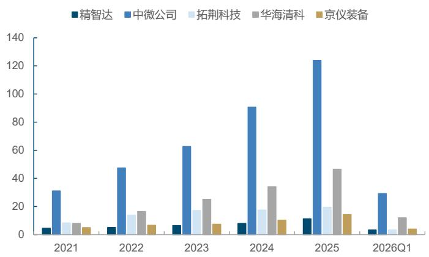  
来源：ifind、国金证券研究所

图表27：公司营收增速处于行业中游，平稳增长（单位：%）  
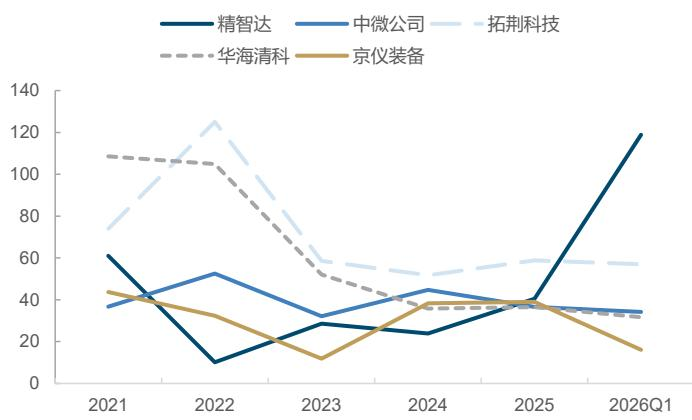  
来源：ifind、国金证券研究所

公司毛利率贴近行业平均水平，研发投入聚焦且高效。在盈利能力方面，公司综合毛利率走势整体与行业平均水平保持同频。虽受设备类型与单机价值量的客观差异影响，公司毛利率略低于拓荆科技、中微公司等前道主设备厂商，但2026Q1已企稳修复至35.26%。在研发端，公司研发费用率呈稳步上行趋势（由2021年的6.55%提升至2026Q1的9.99%)。公司研发费用率略低于可比公司均值，主要系公司产品线布局相对聚焦，尽管 2025 年研发材料投入有所增加，但整体核心研发投入仍以人员薪酬为主，高价材料耗用相对较少。公司以较高的研发转化效率维系了核心竞争优势，在保证技术迭代的同时兼顾了良好的控费效能。

图表28：公司毛利率略低于前道设备（单位：%)  
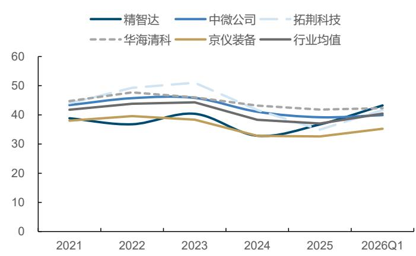  
来源：ifind、国金证券研究所

图表29：公司研发费用投入聚焦高效（单位：%)  
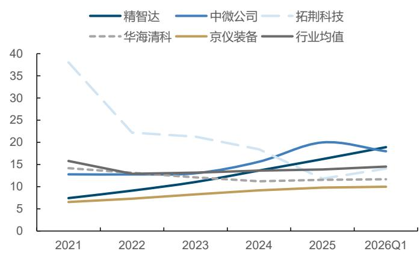  
来源：ifind、国金证券研究所

公司订单与扩产共振向上，国内可比公司合同负债与在建工程出现分化。合同负债方面，部分前道设备龙头步入前期订单交付与消化阶段，指标自高位有所回落；而拓荆科技等企业则延续攀升态势。相较之下，公司合同负债表现为逐年稳步扩容，展现出较强的订单获取动能。2026Q1，公司合同负债14.88亿元。在建工程方面，行业公司基于各自产能规划节奏互有增减；公司在建工程规模则自2024年起显著提速，2026Q1已增加至3.18亿元。

图表30：公司合同负债呈稳定上升趋势（单位：亿元）  
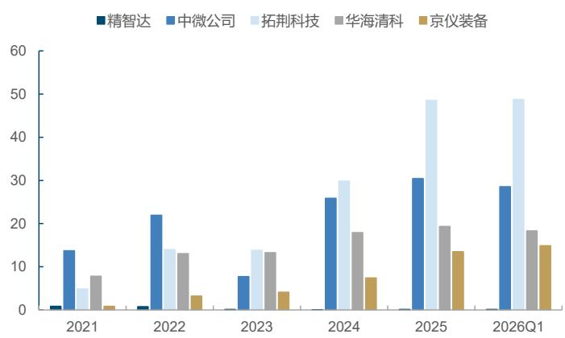  
来源：ifind、国金证券研究所

图表31：公司2026Q1在建工程大幅增加（单位：亿元）  
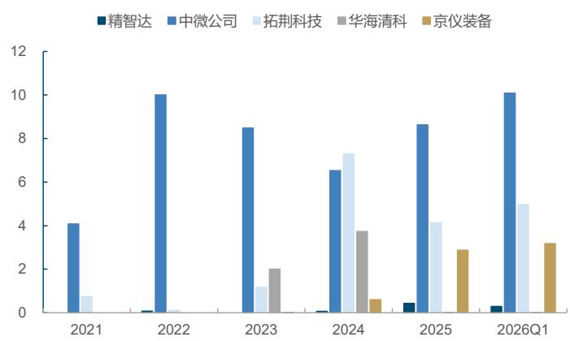  
来源：ifind、国金证券研究所

## 四、盈利预测与投资建议

## 4.1盈利预测

半导体设备是产业链核心的上游支撑环节。根据 SEMI最新预测，2025年全球半导体设备销售额达到1350.6亿美元，同比增长15%。根据QYresearch预测，全球半导体专用温控设备、半导体专用废气处理设备、晶圆传片设备市场将分别从2025年的8.78、17.63、9.14亿美元，增长至2031年的12.34、31.44、13.24亿美元，CAGR分别为5.9%、10.1%、5.9%。分地区看，中国大陆2025年半导体设备支出达493.1亿美元维持高景气度。我们判断，随着下游长鑫、长存等存储厂商的进一步扩产，及存储、逻辑芯片先进制程需求增加，国内晶圆厂的资本开支将进一步增高；叠加核心设备本土化国产替代进程加速，半导体设备行业将维持高景气度。

半导体专用温控设备：公司的半导体专用温控设备已全面适配国内头部逻辑及存储大厂的先进制程产线，批量应用于逻辑芯片90nm-14nm，64层-192层3DNAND存储芯片等各种工艺需求。随着下游扩产订单的密集交付及安徽生产基地新增产能的加速释放，公司在手订单的转化效率将大幅提升，规模效应进一步显现。公司产品已成功适配我们预测半导体专用温控设备2026-2028年将分别实现营收14.60亿元/20.78亿元/29.11亿元，分别同比+55.82%/+42.33%/+40.08%。

半导体专用工艺废气处理设备：公司产品切实解决了产线管路易堵塞的痛点，显著提升了特殊工艺气体的处理效率。伴随晶圆厂前期庞大的在建工程向实质性投产转化，厂务及附属设备的采购需求已进入修复与放量期。我们预测半导体专用工艺废气处理设备2026-2028年将分别实现营收5.05亿元/6.73亿元/8.11亿元，分别同比+45.12%/+33.33%/+20.38%。

晶圆传片设备：公司凭借微晶背接触及高速多轴协同传控等底层技术突破，已成功实现先进节点产线的导入验证，批量应用于逻辑芯片90nm-28nm等各种工艺需求。我们预测晶圆传片设备2026-2028 年将分别实现营收0.60 亿元/0.93亿元/1.39 亿元，分别同比+68.62%/+55.48%/+48.23%。

零配件及支持性设备、维护维修等服务：属于具备高确定性与高毛利特征的存量后市场业务。随着公司温控与废气处理核心设备在国内晶圆厂的累计装机量持续攀升，配套的耗材更换与维保周期相继到来，该业务将呈现快速增长。我们预测零配件及支持性设备2026-2028年收入将分别为1.38亿元/1.93亿元/2.67亿元(同比+65.13%/+40.12%/+38.32%);维护维修等服务收入将分别为0.33亿元/0.48亿元/0.65亿元（同比+55.32%/+43.43%/+35.12%)。

毛利率端：受到零部件国产化等成本降低因素影响，同行业可比公司2026Q1毛利率均值同比上升7.1pcts；考虑到公司各核心业务线的产品迭代与规模效应逐步兑现，我们预计公司整体销售毛利率将步入明确的上升修复通道，2026-2028年将分别达到38.12%、40.14%和40.88%。具体分业务来看：

半导体专用温控设备：公司产品已成功适配国内头部大厂192层及以上3D NAND等先进制程，高端工艺节点对应的设备单机价值量及技术溢价显著提升，预计2026-2028年该板块毛利率将分别抬升至42.29%、43.54%和43.80%。

半导体专用工艺废气处理设备：随着公司真空泵等产品量产出货，公司加速向半导体配套综合平台转型，产品规模化出货及市占率扩大带来的规模效应，将有效摊薄单位制造成本与固定费用，预计2026-2028年该业务毛利率将稳步改善至31.69%、35.21%和35.46%。

晶圆传片设备：由于目前该产品仍处于产线验证与规模化导入的磨合初期，产线调试与早期制造成本较高，导致整体毛利率维持在偏低水平。预计2026-2028年毛利率分别为4.96%、8.17%和9.97%，后续随工艺成熟及起量将逐渐优化。

零配件及维保等后市场业务：随着公司三大设备在下游晶圆厂的历史累计装机基数持续攀升，具备高毛利属性的后市场耗材替换与维保服务进入刚性放量期。预计零配件及支持性设备2026-2028年毛利率将分别为32.84%、36.53%、41.34%；维护维修等服务毛利率将分别为34.15%、39.02%、41.39%。

图表32：公司分产品营收拆分
<table><tr><td></td><td>单位</td><td>2024</td><td>2025</td><td>2026E</td><td>2027E</td><td>2028E</td></tr><tr><td colspan="7">半导体专用温控设备</td></tr><tr><td>营收</td><td>百万元</td><td>628.72</td><td>936.99</td><td>1460. 04</td><td>2078.07</td><td>2910.96</td></tr><tr><td>YoY</td><td>%</td><td>36.50%</td><td>49.03%</td><td>55.82%</td><td>42.33%</td><td>40.08%</td></tr><tr><td>占比</td><td>%</td><td>61. 25%</td><td>65.70%</td><td>66.47%</td><td>67.34%</td><td>69. 44%</td></tr><tr><td>毛利率</td><td>%</td><td>35.92%</td><td>36.37%</td><td>42.29%</td><td>43.54%</td><td>43.80%</td></tr><tr><td colspan="7">半导体专用工艺废气处理设备</td></tr><tr><td>营收</td><td>百万元</td><td>323. 49</td><td>348.07</td><td>505. 13</td><td>673. 48</td><td>810.74</td></tr><tr><td>YoY</td><td>%</td><td>49.63%</td><td>7. 60%</td><td>45.12%</td><td>33.33%</td><td>20.38%</td></tr><tr><td>占比</td><td>%</td><td>31.51%</td><td>24.41%</td><td>23.00%</td><td>21.82%</td><td>19.34%</td></tr><tr><td>毛利率</td><td>%</td><td>29.35%</td><td>26.73%</td><td>31. 69%</td><td>35.21%</td><td>35.46%</td></tr><tr><td colspan="7"></td></tr><tr><td>营收</td><td>百万元</td><td>24.52</td><td>晶圆传片设备 35. 64</td><td>60.10</td><td>93.45</td><td>138.52</td></tr><tr><td>YoY</td><td>%</td><td>0.00%</td><td>45.34%</td><td>68.62%</td><td>55.48%</td><td>48.23%</td></tr><tr><td>占比</td><td>%</td><td>2.39%</td><td>2.50%</td><td>2. 74%</td><td>3.03%</td><td>3.30%</td></tr><tr><td>毛利率</td><td>%</td><td>7.56%</td><td>5.00%</td><td>4.96%</td><td>8.17%</td><td>9.97%</td></tr><tr><td colspan="7"></td></tr><tr><td>营收</td><td>百万元</td><td>37.78</td><td>零配件及支持性设备 83.56</td><td>137.99</td><td>193.35</td><td>267. 44</td></tr><tr><td>YoY</td><td>%</td><td>-26. 42%</td><td>121. 17%</td><td>65.13%</td><td>40.12%</td><td>38.32%</td></tr><tr><td>占比</td><td>%</td><td>3. 68%</td><td>5.86%</td><td>6. 28%</td><td>6. 27%</td><td>6.38%</td></tr><tr><td>毛利率</td><td>%</td><td>27. 20%</td><td>27. 63%</td><td>32.84%</td><td>36.53%</td><td>41.34%</td></tr><tr><td colspan="7"></td></tr><tr><td>营收</td><td>百万元</td><td>11.95</td><td>维护、维修等服务 21.43</td><td>33.29</td><td>47.75</td><td>64.52</td></tr><tr><td>YoY</td><td>%</td><td>-15.43%</td><td>79.36%</td><td>55.32%</td><td>43.43%</td><td>35.12%</td></tr><tr><td>占比</td><td>%</td><td>1. 16%</td><td>1. 50%</td><td>1. 52%</td><td>1. 55%</td><td>1. 54%</td></tr><tr><td>毛利率</td><td>%</td><td>30.98%</td><td>29.07%</td><td>34.15%</td><td>39.02%</td><td>41.39%</td></tr><tr><td></td><td></td><td></td><td>合计</td><td></td><td></td><td></td></tr><tr><td colspan="7"></td></tr><tr><td>营业总收入 YoY</td><td>百万元</td><td>1026. 47</td><td>1426. 24</td><td>2196. 55</td><td>3086.10</td><td>4192. 18 35.84%</td></tr><tr><td></td><td>%</td><td>38. 28%</td><td>38.95%</td><td>54.01%</td><td>40.50%</td><td></td></tr><tr><td>销售毛利率</td><td>%</td><td>32.79%</td><td>32. 64%</td><td>38.12%</td><td>40.14%</td><td>40.88%</td></tr></table>

来源：ifind、国金证券研究所

费用情况：半导体设备属于典型的技术密集型行业，为满足下游客户向28nm 逻辑及192层的3DNAND等先进制程的演进需求，并推进半导体专用真空泵等新产品管线的研发与验证，我们预计公司未来将持续保持高强度的研发投入力度，预计2026-2028年研发费用率将呈现稳步上行趋势，分别为9.85%/10.08%/10.98%。销售费用方面，2025年公司销售费用率为5.80%，未来随着公司营收体量的快速扩张以及在核心大客户（中芯、长鑫等）中份额的巩固，销售端的规模效应将持续改善，我们预测公司2026-2028年销售费用率将稳中有降，分别为5.52%/5.21%/5.12%。管理费用方面，2025年公司管理费用率为5.43%，考虑到2026年安徽研发生产基地结转投产可能伴随组织架构的扩充及短期摊销增加，预计2026年管理费用率将阶段性增至5.53%，但随着后续产能平稳爬坡与效率优化，预计2027-2028 年将逐步回落，2026-2028年分别为5.53%/5.31%/5.21%。

图表33：2025-2028E公司三费情况
<table><tr><td rowspan=1 colspan=1></td><td rowspan=1 colspan=1>2024</td><td rowspan=1 colspan=1>2025</td><td rowspan=1 colspan=1>2026E</td><td rowspan=1 colspan=1>2027E</td><td rowspan=1 colspan=1>2028E</td></tr><tr><td rowspan=1 colspan=1>销售费用率</td><td rowspan=1 colspan=1>5.98%</td><td rowspan=1 colspan=1>5.80%</td><td rowspan=1 colspan=1>5.52%</td><td rowspan=1 colspan=1>5.21%</td><td rowspan=1 colspan=1>5.12%</td></tr><tr><td rowspan=1 colspan=1>管理费用率</td><td rowspan=1 colspan=1>6.41%</td><td rowspan=1 colspan=1>5.43%</td><td rowspan=1 colspan=1>5.53%</td><td rowspan=1 colspan=1>5.31%</td><td rowspan=1 colspan=1>5.21%</td></tr><tr><td rowspan=1 colspan=1>研发费用率</td><td rowspan=1 colspan=1>9.17%</td><td rowspan=1 colspan=1>9.81%</td><td rowspan=1 colspan=1>9.85%</td><td rowspan=1 colspan=1>10.08%</td><td rowspan=1 colspan=1>10.98%</td></tr></table>

来源：ifind，国金证券研究所

## 4.2投资建议及估值

我们选取了A股中主营业务同为半导体设备的中微公司、拓荆科技、华海清科和精智达作为可比公司。中微公司与拓荆科技作为国内前道刻蚀与薄膜沉积设备的龙头，其在逻辑及存储产线的验证与装机节奏，与京仪装备的核心产品（高精度温控及废气处理）具有高度紧密的产业链伴生关系；华海清科与精智达同享国内晶圆厂周期性扩产带来的设备需求红利。上述四家公司均为半导体专用设备各细分赛道的领军者，面临着相似的技术壁垒与客户验证周期，其估值对京仪装备具有较强的参考意义。

在半导体设备供应链本土化加速的背景下，京仪装备在细分领域具备显著的卡位优势与稀缺性：公司是目前国内唯一一家实现半导体专用温控设备大规模装机应用的本土企业，也是极少数实现废气处理设备规模量产的厂商。其核心技术指标已成功打破国外长期垄断，

产品深度绑定长鑫存储、长江存储、中芯国际、华虹集团等主流晶圆厂，并已实现先进制程产线的批量出货。

根据盈利预测，4家可比公司2026年PE的平均数为92.85倍，中位数为87.76倍。充分考虑公司在半导体设备温控、废气处理、晶圆传片设备赛道的领先地位、显著的订单转化成长性，以及未来在先进制程渗透率提升的广阔空间，我们给予公司2026年93倍 PE估值。首次覆盖，给予“买入”评级。

图表34：可比公司估值比较
<table><tr><td rowspan="2">股价 股票名称</td><td colspan="6"></td><td colspan="4">PE</td></tr><tr><td>（元）</td><td>2024A</td><td>2025A</td><td>2026E</td><td>2027E</td><td>2028E</td><td>2024A</td><td>2025A</td><td>2026E 2027E</td><td>2028E</td></tr><tr><td>中微公司432.90</td><td>2.60</td><td>3.37</td><td>4.99</td><td>6.76</td><td>8.65</td><td>72.87</td><td>80.87</td><td>86.84</td><td>64.08</td><td>50.09</td></tr><tr><td>拓荆科技 529.94</td><td>2.46</td><td>3.28</td><td>5.99</td><td>8.48</td><td>11.32</td><td>62.15</td><td>100.12</td><td>88.68</td><td>62.58</td><td>46.82</td></tr><tr><td>华海清科 267.51</td><td>4.32</td><td></td><td>3.06 4.06</td><td>5.22</td><td>6.55</td><td>37.70</td><td>48.98</td><td>65.91</td><td>51.27</td><td>40.83</td></tr><tr><td>精智达592.00</td><td>0.85</td><td>0.70</td><td>2.72</td><td>4.15</td><td>6.23</td><td>85.51</td><td>321.3</td><td>129.95</td><td>85.24</td><td>56.83</td></tr><tr><td>平均数</td><td></td><td></td><td></td><td></td><td></td><td></td><td></td><td>92.85</td><td>65.79</td><td>48.64</td></tr><tr><td>中位数</td><td></td><td></td><td></td><td></td><td></td><td></td><td></td><td>87.76</td><td>63.33</td><td>48.46</td></tr><tr><td>京仪装备158.94</td><td>0.91</td><td></td><td>0.88</td><td>2.00</td><td>3.05</td><td>4.33 53.94</td><td>111. 65</td><td>79.56</td><td>52.08</td><td>36.67</td></tr></table>

来源：ifind、国金证券研究所(2026年5月15日股价，除公司数据外均为ifind一致预期)

## 五、风险提示

## 下游晶圆厂扩产及资本开支不及预期的风险

公司产品主要应用于半导体制造产线，其需求直接受下游晶圆厂产能规划及设备采购节奏的驱动。若未来半导体终端需求复苏乏力，或部分头部存储与逻辑厂商因宏观经济、技术迭代放缓等原因延迟扩产步伐、削减资本开支规划，将直接导致公司新增订单减少或存量订单延期交付，进而对公司的盈利增长造成不利影响。

## 核心技术迭代与新产品客户验证不及预期的风险

半导体制造对制程良率的要求极为苛刻，随着下游产线向28nm及更先进制程或更高层数

的 3DNAND演进，对温控精度、废气处理效率及传片洁净度的要求持续提升。若公司在新产品领域的研发未能取得实质性突破，或核心设备在下游先进制程产线的验证导入周期意外拉长，将削弱公司的相对竞争优势，影响其长期市占率的提升。

## 市场竞争加剧导致毛利率承压的风险

随着国内半导体设备市场的快速发展及国产替代红利的显现，行业内现有竞争者可能通过降价抢占份额，同时可能吸引具有资金或技术实力的潜在进入者跨界布局。若未来细分赛道爆发价格战，且公司未能通过安徽生产基地的规模效应及供应链集采有效摊薄成本，可能导致公司综合毛利率出现下滑。

## 限售股解禁的风险

公司于2025年12月1日解禁了限售股168万股，占解禁前流通股比例为1.41%，占解禁后流通股比例为1.39%。公司将于2026年11月30日解禁限售股4725万股，占解禁前流通股比例为39.13%，占解禁后流通股比例为28.13%，股票解禁将对公司股价造成影响。

## 存货周转周期较长的风险

受半导体设备行业“发货-产线验收后确认收入”的商业模式影响，公司存货中处于交付验证流程的发出商品持续积累。整体处于较高水平且呈现拉长趋势。若未来下游晶圆厂因自身产能规划调整或宏观需求波动，导致设备验证进度放缓或验收周期被动拉长，将进一步降低公司的存货周转效率。这不仅会增加存货跌价减值的财务风险，还可能对公司整体的营运资金流转造成较大的挤压与占用压力。

附录：三张报表预测摘要
<table><tr><td colspan="7">损益表 (人民币百万元)</td></tr><tr><td></td><td>2023</td><td>2024</td><td>2025</td><td>2026E</td><td>2027E</td><td>2028E</td></tr><tr><td>主营业务收入</td><td>742</td><td>1,026</td><td>1,426</td><td>2,197</td><td>3,086</td><td>4,192</td></tr><tr><td>增长率</td><td></td><td>38.3%</td><td>38.9%</td><td>54.0%</td><td>40.5%</td><td>35.8%</td></tr><tr><td>主营业务成本</td><td>-458</td><td>-690</td><td>-961</td><td>-1,359</td><td>-1,847</td><td>-2,478</td></tr><tr><td>%销售收入</td><td>61.6%</td><td>67.2%</td><td>67.4%</td><td>61.9%</td><td>59.9%</td><td>59.1%</td></tr><tr><td>毛利</td><td>285</td><td>337</td><td>465</td><td>837</td><td>1,239</td><td>1,714</td></tr><tr><td>%销售收入</td><td>38.4%</td><td>32.8%</td><td>32.6%</td><td>38.1%</td><td>40.1%</td><td>40.9%</td></tr><tr><td>营业税金及附加</td><td>-5</td><td>-8</td><td>-9</td><td>-11</td><td>-15</td><td>-21</td></tr><tr><td>%销售收入</td><td>0.7%</td><td>0.8%</td><td>0.6%</td><td>0.5%</td><td>0.5%</td><td>0.5%</td></tr><tr><td>销售费用</td><td>-87</td><td>-61</td><td>-83</td><td>-121</td><td>-161</td><td>-215</td></tr><tr><td>%销售收入</td><td>11.8%</td><td>6.0%</td><td>5.8%</td><td>5.5%</td><td>5.2%</td><td>5.1%</td></tr><tr><td>管理费用</td><td>-59</td><td>-66</td><td>-77</td><td>-121</td><td>-164</td><td>-218</td></tr><tr><td>%销售收入</td><td>8.0%</td><td>6.4%</td><td>5.4%</td><td>5.5%</td><td>5.3%</td><td>5.2%</td></tr><tr><td>研发费用</td><td>-62</td><td>-94</td><td>-140</td><td>-216</td><td>-311</td><td>-460</td></tr><tr><td>%销售收入</td><td>8.3%</td><td>9.2%</td><td>9.8%</td><td>9.9%</td><td>10.1%</td><td>11.0%</td></tr><tr><td>息税前利润 (EBIT)</td><td>72</td><td>107</td><td>156</td><td>367</td><td>588</td><td>799</td></tr><tr><td>%销售收入</td><td>9.7%</td><td>10.5%</td><td>11.0%</td><td>16.7%</td><td>19.0%</td><td>19.1%</td></tr><tr><td>财务费用</td><td>3</td><td>9</td><td>1</td><td>2</td><td>1</td><td>4</td></tr><tr><td>%销售收入</td><td>-0.3%</td><td>-0.9%</td><td>-0.1%</td><td>-0.1%</td><td>0.0%</td><td>-0.1%</td></tr><tr><td>资产减值损失</td><td>-4</td><td>-24</td><td>-27</td><td>-32</td><td>-48</td><td>-23</td></tr><tr><td>公允价值变动收益</td><td>0</td><td>7</td><td>9</td><td>8</td><td>7</td><td>6</td></tr><tr><td>投资收益</td><td>0</td><td>13</td><td>9</td><td>20</td><td>10</td><td>6</td></tr><tr><td>%税前利润</td><td>0.0%</td><td>8.0%</td><td>5.7%</td><td>5.5%</td><td>1.8%</td><td>0.8%</td></tr><tr><td>营业利润</td><td>124</td><td>168</td><td>160</td><td>365</td><td>557</td><td>792</td></tr><tr><td>营业利润率</td><td>16.7%</td><td>16.4%</td><td>11.2%</td><td>16.6%</td><td>18.1%</td><td>18.9%</td></tr><tr><td>营业外收支</td><td>10</td><td>-1</td><td>-1</td><td>0</td><td>0</td><td>0</td></tr><tr><td>税前利润</td><td>133</td><td>168</td><td>159</td><td>365</td><td>557</td><td>792</td></tr><tr><td>利润率</td><td>18.0%</td><td>16.3%</td><td>11. 2%</td><td>16.6%</td><td>18.1%</td><td>18.9%</td></tr><tr><td>所得税</td><td>-14</td><td>-15</td><td>-11</td><td>-29</td><td>-45</td><td>-63</td></tr><tr><td>所得税率</td><td>10.6%</td><td>8.9%</td><td>7.1%</td><td>8.0%</td><td>8.0%</td><td>8.0%</td></tr><tr><td>净利润</td><td>119</td><td>153</td><td>148</td><td>336</td><td>513</td><td>728</td></tr><tr><td>少数股东损益</td><td>0</td><td>0</td><td>0</td><td>0</td><td>0</td><td>0</td></tr><tr><td>归属于母公司的净利润</td><td>119</td><td>153</td><td>148</td><td>336</td><td>513</td><td>728</td></tr><tr><td>净利率</td><td>16.0%</td><td>14.9%</td><td>10.4%</td><td>15.3%</td><td>16.6%</td><td>17.4%</td></tr></table>

<table><tr><td colspan="7">现金流量表 (人民币百万元)</td></tr><tr><td></td><td>2023</td><td>2024</td><td>2025</td><td>2026E</td><td>2027E</td><td>2028E</td></tr><tr><td>净利润</td><td>119</td><td>153</td><td>148</td><td>336</td><td>513</td><td>728</td></tr><tr><td>少数股东损益</td><td>0</td><td>0</td><td>0</td><td>0</td><td>0</td><td>0</td></tr><tr><td>非现金支出</td><td>21</td><td>49</td><td>61</td><td>74</td><td>124</td><td>108</td></tr><tr><td>非经营收益</td><td>0</td><td>-30</td><td>-20</td><td>20</td><td>-10</td><td>-2</td></tr><tr><td>营运资金变动</td><td>-99</td><td>-172</td><td>192</td><td>-277</td><td>-169</td><td>-282</td></tr><tr><td>经营活动现金净流</td><td>41</td><td>0</td><td>381</td><td>153</td><td>458</td><td>553</td></tr><tr><td>资本开支</td><td>-29</td><td>-120</td><td>-242</td><td>-234</td><td>-90</td><td>-95</td></tr><tr><td>投资</td><td>0</td><td>-542</td><td>-107</td><td>8</td><td>7</td><td>6</td></tr><tr><td>其他</td><td>-300</td><td>14</td><td>15</td><td>20</td><td>10</td><td>6</td></tr><tr><td>投资活动现金净流</td><td>-329</td><td>-648</td><td>-334</td><td>-206</td><td>-74</td><td>-83</td></tr><tr><td>股权募资</td><td>1,287</td><td>0</td><td>0</td><td>0</td><td>0</td><td>0</td></tr><tr><td>债权募资</td><td>-40</td><td>-51</td><td>19</td><td>46</td><td>94</td><td>110</td></tr><tr><td>其他</td><td>-12</td><td>-26</td><td>-37</td><td>-21</td><td>-33</td><td>-46</td></tr><tr><td>筹资活动现金净流</td><td>1,235</td><td>-77</td><td>-18</td><td>25</td><td>61</td><td>64</td></tr><tr><td>现金净流量</td><td>947</td><td>-725</td><td>29</td><td>-28</td><td>446</td><td>533</td></tr></table>

来源：公司年报、国金证券研究所

<table><tr><td colspan="7">资产负债表 (人民币百万元)</td></tr><tr><td></td><td>2023</td><td>2024</td><td>2025</td><td>2026E</td><td>2027E</td><td>2028E</td></tr><tr><td>货币资金</td><td>1,251</td><td>525</td><td>580</td><td>546</td><td>988</td><td>1,518</td></tr><tr><td>应收款项</td><td>232</td><td>386</td><td>291</td><td>570</td><td>770</td><td>1,038</td></tr><tr><td>存货</td><td>957</td><td>1,988</td><td>2,395</td><td>2,912</td><td>3,766</td><td>4,856</td></tr><tr><td>其他流动资产</td><td>340</td><td>923</td><td>1,012</td><td>1,017</td><td>1,025</td><td>1,038</td></tr><tr><td>流动资产</td><td>2,779</td><td>3,823</td><td>4,278</td><td>5,044</td><td>6,550</td><td>8,449</td></tr><tr><td>%总资产</td><td>97.2%</td><td>94.5%</td><td>89.4%</td><td>88.6%</td><td>90.8%</td><td>92.6%</td></tr><tr><td>长期投资</td><td>9</td><td>9</td><td>6</td><td>6</td><td>6</td><td>6</td></tr><tr><td>固定资产</td><td>16</td><td>96</td><td>333</td><td>557</td><td>577</td><td>592</td></tr><tr><td>%总资产</td><td>0.6%</td><td>2.4%</td><td>7.0%</td><td>9.8%</td><td>8.0%</td><td>6.5%</td></tr><tr><td>无形资产</td><td>10</td><td>54</td><td>55</td><td>51</td><td>47</td><td>43</td></tr><tr><td>非流动资产</td><td>81</td><td>222</td><td>507</td><td>647</td><td>661</td><td>672</td></tr><tr><td>%总资产</td><td>2.8%</td><td>5.5%</td><td>10.6%</td><td>11.4%</td><td>9.2%</td><td>7.4%</td></tr><tr><td>资产总计</td><td>2,861</td><td>4,045</td><td>4,784</td><td>5,692</td><td>7,211</td><td>9,121</td></tr><tr><td>短期借款</td><td>18</td><td>9</td><td>122</td><td>168</td><td>262</td><td>373</td></tr><tr><td>应付款项</td><td>376</td><td>1,066</td><td>969</td><td>1,504</td><td>2,044</td><td>2,719</td></tr><tr><td>其他流动负债</td><td>452</td><td>793</td><td>1,417</td><td>1,485</td><td>1,887</td><td>2,323</td></tr><tr><td>流动负债</td><td>846</td><td>1,868</td><td>2,508</td><td>3,157</td><td>4,194</td><td>5,414</td></tr><tr><td>长期贷款</td><td>0</td><td>0</td><td>0</td><td>0</td><td>0</td><td>0</td></tr><tr><td>其他长期负债</td><td>81</td><td>102</td><td>74</td><td>14</td><td>10</td><td>7</td></tr><tr><td>负债</td><td>927</td><td>1,970</td><td>2,583</td><td>3,171</td><td>4,204</td><td>5,421</td></tr><tr><td>普通股股东权益</td><td>1,934</td><td>2,074</td><td>2,202</td><td>2,520</td><td>3,007</td><td>3,699</td></tr><tr><td>其中：股本</td><td>168</td><td>168</td><td>168</td><td>168</td><td>168</td><td>168</td></tr><tr><td>未分配利润</td><td>240</td><td>370</td><td>485</td><td>804</td><td>1,291</td><td>1,983</td></tr><tr><td>少数股东权益</td><td>0</td><td>0</td><td>0</td><td>0</td><td>0</td><td>0</td></tr><tr><td>负债股东权益合计</td><td>2,861</td><td>4,045</td><td>4,784</td><td>5,692</td><td>7,211</td><td>9,121</td></tr></table>

<table><tr><td colspan="7">比率分析</td></tr><tr><td></td><td>2023</td><td>2024</td><td>2025</td><td>2026E</td><td>2027E</td><td>2028E</td></tr><tr><td>每股指标</td><td></td><td></td><td></td><td></td><td></td><td></td></tr><tr><td>每股收益</td><td>0.709</td><td>0.910</td><td>0.881</td><td>1.998</td><td>3.052</td><td>4.335</td></tr><tr><td>每股净资产</td><td>11.510</td><td>12.347</td><td>13.104</td><td>15.002</td><td>17.901</td><td>22.019</td></tr><tr><td>每股经营现金净流</td><td>0.245</td><td>-0.002</td><td>2.270</td><td>0.910</td><td>2.728</td><td>3.289</td></tr><tr><td>每股股利</td><td>0.075</td><td>0.125</td><td>0.125</td><td>0.100</td><td>0.153</td><td>0.217</td></tr><tr><td>回报率</td><td></td><td></td><td></td><td></td><td></td><td></td></tr><tr><td>净资产收益率</td><td>6.16%</td><td>7.37%</td><td>6.72%</td><td>13.32%</td><td>17.05%</td><td>19.69%</td></tr><tr><td>总资产收益率</td><td>4.16%</td><td>3.78%</td><td>3.09%</td><td>5.90%</td><td>7.11%</td><td>7.98%</td></tr><tr><td>投入资本收益率</td><td>3.28%</td><td>4.69%</td><td>6.23%</td><td>12.56%</td><td>16.54%</td><td>18.06%</td></tr><tr><td>增长率</td><td></td><td></td><td></td><td></td><td></td><td></td></tr><tr><td>主营业务收入增长率</td><td>11.84%</td><td>38.28%</td><td>38.95%</td><td>54.01%</td><td>40.50%</td><td>35.84%</td></tr><tr><td>EBIT</td><td>-21.30%</td><td>49.92%</td><td>45.60%</td><td>134.80%</td><td>60.07%</td><td>36.01%</td></tr><tr><td>净利润增长率</td><td>30.75%</td><td>28.35%</td><td>-3.26%</td><td>126.88%</td><td>52.77%</td><td>42.03%</td></tr><tr><td>总资产增长率</td><td>116.45%</td><td>41.38%</td><td>18.28%</td><td>18.97%</td><td>26.69%</td><td>26.48%</td></tr><tr><td>资产管理能力</td><td></td><td></td><td></td><td></td><td></td><td></td></tr><tr><td>应收账款周转天数</td><td>103.2</td><td>105.8</td><td>83.3</td><td>90.8</td><td>87.2</td><td>86.5</td></tr><tr><td>存货周转天数</td><td>660.7</td><td>779.2</td><td>832.5</td><td>790.5</td><td>760.2</td><td>730.4</td></tr><tr><td>应付账款周转天数</td><td>195.4</td><td>292.9</td><td>289.9</td><td>290.8</td><td>293.4</td><td>295.1</td></tr><tr><td>固定资产周转天数</td><td>7.9</td><td>12.7</td><td>11.8</td><td>84.9</td><td>61.5</td><td>45.3</td></tr><tr><td>偿债能力</td><td></td><td></td><td></td><td></td><td></td><td></td></tr><tr><td>净负债/股东权益</td><td>-79.26%</td><td>-65.79%</td><td>-63.62%</td><td>-52.38%</td><td>-55.47%</td><td>-56.45%</td></tr><tr><td>EBIT利息保障倍数</td><td>-28.4</td><td>-11.7</td><td>-115.7</td><td>-166.3</td><td>-396.9</td><td>-204.4</td></tr><tr><td>资产负债率</td><td>32.41%</td><td>48.71%</td><td>53.98%</td><td>55.72%</td><td>58.29%</td><td>59.44%</td></tr></table>

## 市场中相关报告评级比率分析

<table><tr><td>日期</td><td>一周内</td><td>一月内</td><td>二月内</td><td>三月内</td><td>六月内</td></tr><tr><td>买入</td><td>0</td><td>o</td><td>2</td><td>4</td><td>6</td></tr><tr><td>增持</td><td>0</td><td>1</td><td>2</td><td>2</td><td>0</td></tr><tr><td>中性</td><td>0</td><td>0</td><td>0</td><td>0</td><td>0</td></tr><tr><td>减持</td><td>0</td><td>0</td><td>0</td><td>0</td><td>0</td></tr><tr><td>评分</td><td>0.00</td><td>2.00</td><td>1.50</td><td>1.33</td><td>1.00</td></tr></table>

来源：聚源数据

## 投资评级的说明：

买入：预期未来6一12个月内上涨幅度在15%以上;

增持：预期未来6一12个月内上涨幅度在5%一15%;

中性：预期未来6一12个月内变动幅度在-5%一5%;

减持：预期未来6一12个月内下跌幅度在5%以上。

市场中相关报告评级比率分析说明：

市场中相关报告投资建议为“买入”得1分，为“增持”得2分，为“中性”得3分，为“减持”得4分，之后平均计算得出最终评分，作为市场平均投资建议的参考。

最终评分与平均投资建议对照：

1.00=买入；1.01\~2.0=增持；2.01\~3.0=中性

3.01\~4.0=减持

## 特别声明：

国金证券股份有限公司经中国证券监督管理委员会批准，已具备证券投资咨询业务资格。

本报告版权归“国金证券股份有限公司”（以下简称“国金证券"）所有，未经事先书面授权，任何机构和个人均不得以任何方式对本报告的任何部分制作任何形式的复制、转发、转载、引用、修改、仿制、刊发，或以任何侵犯本公司版权的其他方式使用。经过书面授权的引用、刊发，需注明出处为“国金证券股份有限公司”，且不得对本报告进行任何有悼原意的删节和修改。

本报告的产生基于国金证券及其研究人员认为可信的公开资料或实地调研资料，但国金证券及其研究人员对这些信息的准确性和完整性不作任何保证。本报告反映撰写研究人员的不同设想、见解及分析方法，故本报告所载观点可能与其他类似研究报告的观点及市场实际情况不一致，国金证券不对使用本报告所包含的材料产生的任何直接或间接损失或与此有关的其他任何损失承担任何责任。且本报告中的资料、意见、预测均反映报告初次公开发布时的判断，在不作事先通知的情况下，可能会随时调整，亦可因使用不同假设和标准、采用不同观点和分析方法而与国金证券其它业务部门、单位或附属机构在制作类似的其他材料时所给出的意见不同或者相反。

本报告仅为参考之用，在任何地区均不应被视为买卖任何证券、金融工具的要约或要约邀请。本报告提及的任何证券或金融工具均可能含有重大的风险，可能不易变卖以及不适合所有投资者。本报告所提及的证券或金融工具的价格、价值及收益可能会受汇率影响而波动。过往的业绩并不能代表未来的表现。

客户应当考虑到国金证券存在可能影响本报告客观性的利益冲突，而不应视本报告为作出投资决策的唯一因素。证券研究报告是用于服务具备专业知识的投资者和投资顾问的专业产品，使用时必须经专业人士进行解读。国金证券建议获取报告人员应考虑本报告的任何意见或建议是否符合其特定状况，以及 (若有必要)咨询独立投资顾问。报告本身、报告中的信息或所表达意见也不构成投资、法律、会计或税务的最终操作建议，国金证券不就报告中的内容对最终操作建议做出任何担保，在任何时候均不构成对任何人的个人推荐。

在法律允许的情况下，国金证券的关联机构可能会持有报告中涉及的公司所发行的证券并进行交易，并可能为这些公司正在提供或争取提供多种金融服务。

本报告并非意图发送、发布给在当地法律或监管规则下不允许向其发送、发布该研究报告的人员。国金证券并不因收件人收到本报告而视其为国金证券的客户。本报告对于收件人而言属高度机密，只有符合条件的收件人才能使用。根据《证券期货投资者适当性管理办法》，本报告仅供国金证券股份有限公司客户中风险评级高于C3级(含C3级）的投资者使用；本报告所包含的观点及建议并未考虑个别客户的特殊状况、目标或需要，不应被视为对特定客户关于特定证券或金融工具的建议或策略。对于本报告中提及的任何证券或金融工具，本报告的收件人须保持自身的独立判断。使用国金证券研究报告进行投资，遭受任何损失，国金证券不承担相关法律责任。

若国金证券以外的任何机构或个人发送本报告，则由该机构或个人为此发送行为承担全部责任。本报告不构成国金证券向发送本报告机构或个人的收件人提供投资建议，国金证券不为此承担任何责任。

此报告仅限于中国境内使用。国金证券版权所有，保留一切权利。

上海

电话：021-80234211

北京

电话：010-85950438

深圳

电话：0755-86695353

邮箱：researchsh@gjzq.com.cn

邮箱：researchbj@gjzq.com.cn

邮箱：researchsz@gjzq.com.cn

邮编：201204

邮编：100005

邮编：518000

地址：上海浦东新区芳甸路1088号

地址：北京市东城区建内大街26号

地址：深圳市福田区金田路2028号皇岗商务中心

紫竹国际大厦5楼

新闻大厦8层南侧

18楼1806

  
【小程序】国金证券研究服务

  
【公众号】国金证券研究