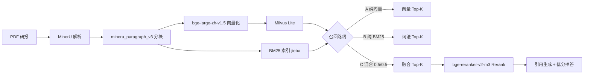

# commercial-rag 项目中期结果总结

> 数据规模：**24 份研报**（半导体 / 电力 / 互联网电商各 8 份）→ **1352** chunks，**991** 可检索  
> 评测集：**90 题**（事实型 58 / 对比型 17 / 汇总型 15）  
> 更新日期：2026-05

---

## 1. 技术路线总览



| 阶段 | 选型 | 说明 |
|------|------|------|
| PDF 解析 | **MinerU**（方案 B） | 结构化 `content_list_v2.json` + Markdown；断点续跑 |
| 分块 | **mineru_paragraph_v3** | 段落合并、表格拆分、噪声过滤、`embedding_text` 增强 |
| Embedding | **bge-large-zh-v1.5**（1024 维） | 查询侧加 `query: ` 前缀 |
| 向量库 | **Milvus Lite**（COSINE） | 本地 `milvus.db`，991 条 |
| 词法检索 | **BM25Okapi + jieba** | `data/vector/bm25_index.pkl` |
| 混合召回 | 向量 + BM25 **min-max 归一化加权** | 默认各 0.5；Milvus 距离转 `1-distance` |
| Rerank | **bge-reranker-v2-m3** | Top-20 候选 → Top-5；transformers 5.x 时回退 CrossEncoder |
| 生成 | 模板式引用回答 + 拒答 | Top-1 rerank 分 < 0.35 时拒答 |

**当前生产 CLI（`rag_pipeline.py`）仍为「向量 Top-20 → Rerank → Top-5」**；离线评测已切换为「混合 Top-20 → Rerank → Top-5」。迁移 AutoDL 后建议统一为混合链路。

---

## 2. 对比实验一览

### 实验 A：三路召回（90 题，Top-10）

**目的**：比较纯向量 / 纯 BM25 / 混合融合对检索 Recall 的影响。

| 路线 | Recall@3 | Recall@5 | Recall@10 | MRR |
|------|----------|----------|-----------|-----|
| A 纯向量 | 70.0% | 73.3% | 76.7% | 0.618 |
| B 纯 BM25 | 82.2% | 85.6% | **88.9%** | 0.726 |
| C 混合 (0.5/0.5) | **84.4%** | **86.7%** | 87.8% | **0.772** |

**按题型（Recall@5）**：

| query_type | 纯向量 | BM25 | 混合 |
|------------|--------|------|------|
| factual（58） | 74.1% | 86.2% | **89.7%** |
| comparative（17） | 70.6% | 76.5% | 76.5% |
| summary（15） | 73.3% | **93.3%** | 86.7% |

**结论**：
- BM25 在数字、专有名词、汇总型问题上显著优于纯向量（@10 达 88.9%）。
- 混合路 MRR 最高（0.772），事实型 Recall@5 最优（89.7%）。
- 汇总型 pure BM25 @5 仍略高于混合（93.3% vs 86.7%），可调权重或单独策略。

**产出**：`data/eval/eval_route_comparison.csv`、`eval_route_comparison_by_query_type.csv`

---

### 实验 B：纯向量 + Rerank（90 题）

**目的**：验证「宽召回 + 精排」在纯向量基线上的增益。

| 策略 | Recall@5 | Top-1 | MRR |
|------|----------|-------|-----|
| 向量直接 Top5 | 73.3% | 53.3% | 0.615 |
| 向量 Top20 → Rerank Top5 | **80.0%** | **65.6%** | **0.707** |
| **Δ** | **+6.7%** | **+12.2%** | **+0.093** |

**生成答案**（引用 + 拒答评测）：

| 策略 | 事实准确率 | 拒答恰当率 |
|------|-----------|-----------|
| 向量直接 Top5 | 70.0% | 60.0% |
| 向量 + Rerank | **77.8%** | **70.0%** |

Rerank **修复 8 题** Recall（q10/q34/q36/q38/q40/q51/q73/q89），**回退 2 题**（q29/q50）。

**结论**：Rerank 对纯向量链路增益大，但 Recall@5（80%）仍低于 BM25/混合（85.6%/86.7%）。

---

### 实验 C：混合召回 + Rerank（90 题，当前主线）

**目的**：在最强初召回（混合）上叠加 Rerank，对比直接 Top5。

| 策略 | Recall@5 | Top-1 | MRR |
|------|----------|-------|-----|
| 混合直接 Top5 | 84.4% | 66.7% | 0.743 |
| 混合 Top20 → Rerank Top5 | **85.6%** | **71.1%** | **0.768** |
| **Δ** | **+1.1%** | **+4.4%** | **+0.025** |

**生成答案**：

| 策略 | 事实准确率 | 拒答恰当率 |
|------|-----------|-----------|
| 混合直接 Top5 | 80.0% | 70.0% |
| 混合 + Rerank | **88.9%** | **80.0%** |
| **Δ** | **+8.9%** | **+10.0%** |

Rerank **修复 5 题**（q15/q19/q40/q66/q89），**回退 4 题**（q06/q50/q56/q81）。  
典型失败：**q06** — 混合直接 Top1 已命中正确 chunk `0053`，Rerank 误将附录 `0068` 排到前面。

**产出**：`data/eval/eval_rerank_comparison.csv`、`eval_rerank_answer_comparison.csv`

---

### 实验 D：Milvus 索引类型（调研，未跑实测）

**目的**：评估 Flat / IVF / HNSW 在大规模下的取舍。  
**结论**：Milvus Lite 不支持切换索引类型；若 200 份研报规模需 IVF/HNSW，应迁移 Milvus Standalone。详见 `docs/milvus-index-comparison.md`。

---

## 3. 技术路线带来的累计提升

以 **Recall@5** 和 **事实准确率** 为主指标，串联各阶段最优结果：

| 阶段 | 配置 | Recall@5 | 事实准确率 | 相对起点 |
|------|------|----------|-----------|----------|
| 基线 | 纯向量 Top5 | 73.3% | ~70% | — |
| + Rerank | 向量 Top20→Rerank Top5 | 80.0% | 77.8% | +6.7% / +7.8% |
| + 混合召回 | 混合直接 Top5 | 84.4% | 80.0% | +11.1% / +10% |
| **当前最优** | **混合 Top20→Rerank Top5** | **85.6%** | **88.9%** | **+12.3% / +18.9%** |

**关键洞察**：
1. **混合召回是最大单项提升**（+11% Recall@5），尤其改善事实型与含数字/代码的问题。
2. **Rerank 在弱基线上增益大**（向量 +6.7%），在强基线上增益小但 **Top-1 与答案质量仍明显提升**（事实准确率 +8.9%）。
3. **生成准确率 > 检索 Recall**：Rerank 通过 Top-1 精排显著拉高下游答案质量，即使 Recall@5 仅 +1.1%。

---

## 4. 分块与数据质量（24 份研报）

| 指标 | 数值 |
|------|------|
| 总 chunk | 1352 |
| 可检索 | 991（73.3%） |
| 正文 / 表格 / 噪声 | 396 / 595 / 361 |
| embedding tokens max | 510（≤512） |
| display_name 填充率 | 100% |
| 单位/噪声规则违规 | 0 |

---

## 5. 已知问题与下一阶段（200 份 × 4 行业）

| 问题 | 现状 | 建议 |
|------|------|------|
| `rag_pipeline.py` 未接混合召回 | 评测用 hybrid，CLI 仍 vector | AutoDL 上改为 `HybridRetriever` |
| q06 类附录误排 | Rerank 偏好长附录 | 过滤 `content_type=noise` 或降权附录 |
| eval 与生产不一致 | 离线分进程省内存 | GPU 服务器可合并进程 |
| 规模 24→800 份 | Milvus Lite 单机 | 监控延迟，必要时 Standalone + IVF |
| 评测集 90 题 | 覆盖 3 行业 | 扩至 4 行业 × 题型分层 |
| FlagEmbedding vs transformers 5.x | 自动回退 CrossEncoder | 可 pin `transformers<5` 或统一 CrossEncoder |

---

## 6. 复现实验命令

```bash
# 数据流水线
python src/parse_pdf_mineru.py
python src/chunk_mineru.py
python src/embed_chunks.py
python src/build_bm25_index.py

# 实验 A：三路召回
python src/eval_retrieval.py --compare-routes --top-k 10

# 实验 C：混合 + Rerank（含答案评测，约 30min CPU）
python src/eval_rerank.py
python src/eval_rerank.py --skip-answer   # 仅检索

# 交互
python src/rag_chat.py "京仪装备2026E毛利率预测是多少？"
```

---

## 7. 结果文件索引

| 文件 | 实验 |
|------|------|
| `eval_route_comparison.csv` | A 三路召回 |
| `eval_route_comparison_by_query_type.csv` | A 按题型 |
| `eval_rerank_comparison.csv` | B/C 检索对比（当前为 C 混合） |
| `eval_rerank_answer_comparison.csv` | B/C 答案对比 |
| `eval_rerank_results.csv` | 逐题明细 |
