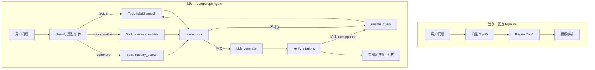
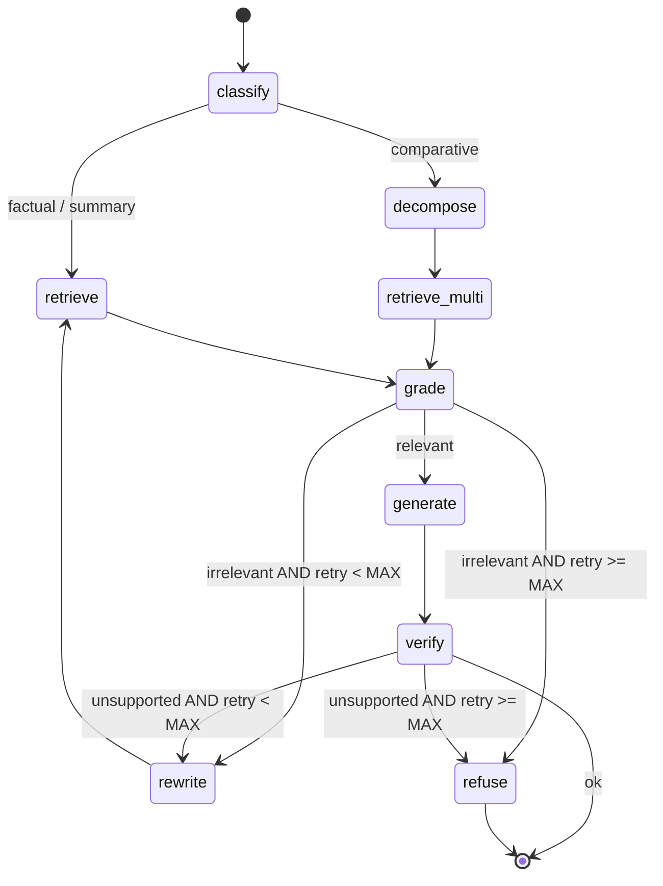
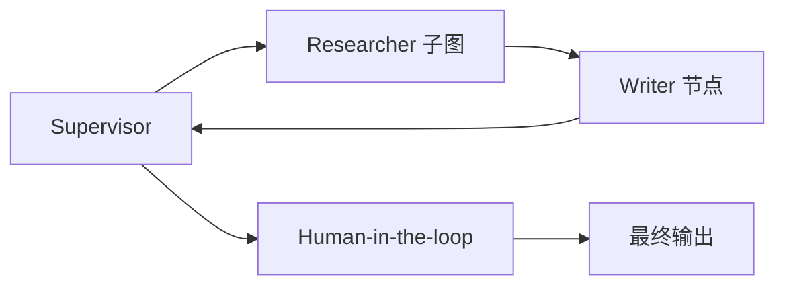

# Agent 架构设计（FinReport-Agent）

> **状态**：设计文档（Phase 0 尚未落地）  
> **前置阅读**：[midterm-summary.md](midterm-summary.md)、[eval-scheme.md](eval-scheme.md)、[rerank-scheme.md](rerank-scheme.md)  
> **目标**：在现有 hybrid + Rerank RAG 底座上，演进为 **LangGraph Agentic RAG**，形成可评测、可观测、适合 Agent 技术岗展示的项目。

---

## 1. 背景与动机

### 1.1 当前系统是什么

commercial-rag 已完成端到端 **Advanced RAG** 流水线（24 份 POC 研报，90 题人工评测）：

```
PDF → MinerU → chunk_mineru → bge-large-zh + BM25
                              ↓
                    混合召回 Top-30 (0.4~0.5 向量权重)
                              ↓
                    bge-reranker-v2-m3 → Top-5
                              ↓
                    模板引用生成 + 低分拒答 (threshold=0.35)
```

**离线最优链路**（`eval_rerank.py`）：混合 Top30 → Rerank Top5 — Recall@5 **85.6%**，事实准确率 **88.9%**（详见 [midterm-summary.md](midterm-summary.md)）。

### 1.2 当前与 Agent 的差距

| 能力 | 现状 | Agent 目标 |
|------|------|------------|
| 检索策略 | 离线评测已用 `HybridRetriever`；CLI `rag_pipeline.py` **仍为纯向量** | 统一 hybrid + 按题型路由 |
| 生成 | `rag_answer.py` 抽取式模板，**无 LLM** | Grounded LLM 生成 + 结构化输出 |
| 编排 | 线性 pipeline | LangGraph 状态图（条件分支、循环、可观测） |
| 多步推理 | `retrieval.py` 已有 comparative 多实体 RRF | Agent 层显式 decomposition + grader 循环 |
| 评测 | Recall@K、事实准确率 | + Agent 轨迹、Tool 选择、自校正成功率 |
| 观测 | 无 | Langfuse / 本地 trajectory JSONL |

### 1.3 为什么不推倒重来

- **检索内核已验证**：hybrid + Rerank 在 90 题上有完整 ablation，不应为接 LangChain 而替换 Milvus/BM25 实现。
- **评测集是差异化资产**：`eval_questions.jsonl` 含 `query_type`、`must_contain_any`、`negative_stock_codes`，可直接扩展 Agent 指标。
- **Rich metadata**：chunk 含 `stock_code`、`company_name`、`section_title`、`content_type` 等，天然适合封装为 Agent Tool。

**原则**：LangGraph 负责 **编排与决策**；`retrieval.py` / `reranker.py` / `rag_answer.py` 负责 **检索与答案契约**。

---

## 2. 目标架构总览

### 2.1 从 Pipeline 到 Agent



### 2.2 分层设计

| 层 | 职责 | 主要模块（现有 / 规划） |
|----|------|-------------------------|
| **L0 数据** | PDF 解析、分块、索引 | `parse_pdf_mineru.py`、`chunk_mineru.py`、`embed_chunks.py`、`build_bm25_index.py` |
| **L1 检索** | 向量 / BM25 / 混合 / RRF | `retrieval.py`、`query_enhance.py`、`bm25_store.py`、`milvus_store.py` |
| **L2 精排** | Cross-encoder Rerank | `reranker.py` |
| **L3 生成** | 引用格式、拒答、LLM 合成 | `rag_answer.py` → `rag_llm.py`（规划） |
| **L4 Agent** | 路由、Tool、循环、状态 | `src/agent/`（规划） |
| **L5 评测** | 离线 benchmark + 轨迹 | `eval_retrieval.py`、`eval_rerank.py` → `eval_agent.py`（规划） |
| **L6 观测** | Trace / 可视化 | Langfuse 或 `data/eval/agent_trajectories.jsonl`（规划） |

---

## 3. LangGraph 设计

### 3.1 核心抽象

采用 [LangGraph](https://github.com/langchain-ai/langgraph) **StateGraph**，而非线性 LangChain Chain：

| 概念 | 本项目映射 |
|------|------------|
| **State** | 用户 query、推断的 `query_type` / `stock_code`、检索 hits、rerank hits、messages、retry_count、final_answer |
| **Node** | `classify`、`retrieve`、`grade`、`rewrite`、`generate`、`verify`、`refuse` |
| **Edge** | 固定流转，如 `retrieve → grade` |
| **Conditional Edge** | grader 不通过 → `rewrite`；超 retry → `refuse`；comparative → `decompose` |
| **Checkpoint** | Phase 3：低置信度 Human-in-the-loop |
| **Tool** | 包装 L1/L2 检索函数，供 ReAct 或固定图节点调用 |

### 3.2 Phase 1 主图（Adaptive RAG）

Phase 1 采用 **固定状态图 + 条件边**（非纯 ReAct），保证 factual 题型走短路、可复现：



**节点说明**：

| 节点 | 输入 | 输出 | 实现要点 |
|------|------|------|----------|
| `classify` | `query` | `query_type`, `stock_code?`, `route` | 规则 + 轻量 LLM；可复用 `query_enhance.extract_compare_entities` |
| `decompose` | comparative query | `sub_queries[]` | 每实体一条子 query |
| `retrieve` | query, metadata | `recall_hits[]` | 调用 `HybridRetriever.retrieve()` |
| `retrieve_multi` | sub_queries | merged hits | 已有 `rrf_fuse`（`retrieval.py`） |
| `rerank` | recall_hits | `rerank_hits[]` | `BGEReranker.rerank_hits()` |
| `grade` | query, rerank_hits | `relevant: bool`, `reason` | LLM 二元评分或 top1 score + 规则 |
| `rewrite` | query, grade_reason | `query'` | LLM 改写，注入 `section_keywords` 类提示 |
| `generate` | query, rerank_hits | `RAGAnswer` | LLM + citation 模板 |
| `verify` | answer, hits | `supported: bool` | 规则：`must_contain_any` 式数字/实体校验 |
| `refuse` | — | `REFUSAL_MESSAGE` | 复用 `rag_constants.REFUSAL_MESSAGE` |

### 3.3 Phase 2：Tool Use Agent

在 Phase 1 图稳定后，将检索能力暴露为 LangChain Tool，允许 LLM 动态选路：

| Tool | 签名（示意） | 底层 |
|------|--------------|------|
| `hybrid_search` | `(query, stock_code?, top_k=30)` | `HybridRetriever` + `RecallRoute.HYBRID` |
| `bm25_search` | `(query, stock_code?, top_k=30)` | `RecallRoute.BM25` |
| `vector_search` | `(query, top_k=30)` | `RecallRoute.VECTOR` |
| `search_by_stock` | `(stock_code, query, top_k=20)` | hybrid + `_apply_stock_boost` |
| `search_by_industry` | `(industry_label, query, top_k=30)` | BM25 metadata 过滤（需扩展） |
| `compare_two_stocks` | `(entity_a, entity_b, metric)` | 两次 retrieve + RRF |
| `get_chunk_detail` | `(chunk_id)` | 从 `chunks.jsonl` / BM25 metadata 取原文 |

**Tool 封装原则**：

- 返回 JSON：`{chunk_id, company_name, section_title, text, score, page_start}`，便于 LLM 引用。
- 不在 Tool 内调用 LLM。
- 每次调用写入 State 的 `tool_calls[]`，供评测与 trace。

### 3.4 Phase 3：Multi-Agent

参考 [FinanceAgent](https://github.com/Xq0273/FinanceAgent) 的 Supervisor 模式，主图 + 子图：



| Agent | 职责 |
|-------|------|
| **Supervisor** | 判断单轮 QA vs 多步研报任务；路由到 Researcher 或结束 |
| **Researcher** | 运行 Phase 1/2 检索子图，产出 evidence pack |
| **Writer** | 基于 evidence 生成结构化回答 /  mini 研报 |
| **Human** | confidence < τ 时展示 evidence，用户确认后继续 |

Phase 3 可选暴露 **MCP Server**，将 `hybrid_search` 等 Tool 注册为 MCP 工具。

---

## 4. 与现有代码的映射

### 4.1 可直接复用的模块

| 文件 | Agent 中的角色 |
|------|----------------|
| `src/retrieval.py` | `HybridRetriever`、`rrf_fuse`、comparative 多实体召回 |
| `src/query_enhance.py` | BM25 query 扩展、实体抽取、动态 hybrid 权重 |
| `src/reranker.py` | 精排节点 |
| `src/rag_answer.py` | Citation 数据结构、拒答逻辑、`is_answer_factually_supported` |
| `src/rag_constants.py` | 拒答阈值、Top-K 默认值 |
| `src/eval_retrieval.py` | 题型分布、Recall 指标基线 |
| `src/eval_rerank.py` | 答案准确率基线 |

### 4.2 Phase 0 必须先修的技术债

| 问题 | 现状 | 动作 |
|------|------|------|
| CLI 未接 hybrid | `rag_pipeline.py` 仅 `_hits_from_vector` | 改为 `HybridRetriever.from_paths` + `RecallRoute.HYBRID` |
| 无 LLM 生成 | `generate_answer_with_citations` 为抽取模板 | 新增 `rag_llm.py`，保留 citation / refuse 契约 |
| classify 未接入 CLI | `query_type` 仅在 eval 脚本传入 | Agent `classify` 节点推断或默认 `factual` |

### 4.3 已知检索问题（Agent grader 需感知）

来自 [midterm-summary.md](midterm-summary.md) 与 [CURSOR_AGENT_CONTEXT.md](CURSOR_AGENT_CONTEXT.md)：

- **q06 类**：Rerank 将附录 chunk 排到盈利预测正文前；`_apply_content_type_adjustments` 已对 `comparable_table` 降权，Agent `grade` 节点应进一步检查 `section_title` 与 query 指标一致性。
- **trap 题**（如 q25）：应用 `negative_stock_codes` 规则或 `search_by_stock` 约束。
- **transformers 5.x**：`reranker.py` 可能回退 CrossEncoder，Agent 层无需感知，但评测需记录实际 backend。

---

## 5. 状态定义（Phase 1）

```python
# src/agent/state.py（规划）

from typing import Annotated, TypedDict
import operator

class AgentState(TypedDict):
    query: str
    query_original: str
    query_type: str          # factual | comparative | summary
    stock_code: str
    route: str               # hybrid | bm25 | vector
    sub_queries: list[str]
    recall_hits: list[dict]
    rerank_hits: list[dict]
    grade_pass: bool
    grade_reason: str
    retry_count: int
    answer: str
    refused: bool
    refusal_reason: str
    citations: list[dict]
    tool_calls: Annotated[list[dict], operator.add]  # 轨迹累积
    messages: Annotated[list, operator.add]           # LLM 对话（可选）
```

**常量建议**：

| 常量 | 默认值 | 说明 |
|------|--------|------|
| `MAX_REWRITE_RETRIES` | 2 | rewrite 上限，防死循环 |
| `RECALL_TOP_K` | 30 | 与 `rag_constants.DEFAULT_RECALL_TOP_K` 一致 |
| `RERANK_TOP_K` | 5 | 与 `rag_constants.DEFAULT_RERANK_TOP_K` 一致 |
| `REFUSAL_THRESHOLD` | 0.35 | 与 `DEFAULT_RERANK_REFUSAL_THRESHOLD` 一致 |
| `GRADE_MIN_TOP1` | 0.35 | 与拒答阈值对齐，或可单独调 |

---

## 6. 生成层设计（LLM）

### 6.1 模型选型

| 阶段 | 推荐 | 说明 |
|------|------|------|
| Phase 0–1 | DeepSeek API / Qwen2.5-7B-Instruct | 中文金融表达好、成本低 |
| Phase 2+ | 本地 vLLM 部署 Qwen2.5-14B | 便于 trace 与离线评测 |

### 6.2 输出契约

沿用现有 `RAGAnswer` 结构，扩展 LLM 路径：

```python
# 结构化输出（Pydantic）
class GeneratedAnswer(BaseModel):
    answer: str
    cited_chunk_ids: list[str]
    confidence: float  # 0~1
```

**Prompt 约束**：

1. 仅依据提供的 context chunks 作答。
2. 数字、评级必须与原文一致；无法找到则明确说「不确定」。
3. 正文使用 `[1][2]` 标注，末尾输出【参考文献】（格式与 `Citation.format_line()` 一致）。
4. 若 context 与问题无关，输出拒答语义而非编造。

### 6.3 拒答策略（双层）

```
Layer 1（规则）：top1 rerank < REFUSAL_THRESHOLD → 不调 LLM，直接 REFUSAL_MESSAGE
Layer 2（Agent）：grade / verify 失败且 retry 耗尽 → REFUSAL_MESSAGE
```

这与现有 `rag_answer.py` 行为兼容，且便于 ablation（规则拒答 vs Agent 拒答）。

---

## 7. 按题型的 Agent 策略

对应 [eval-scheme.md](eval-scheme.md) 三类 `query_type`：

| query_type | 题量 | 检索特点 | Agent 策略 |
|------------|------|----------|------------|
| `factual` | 58 | 数字/评级；hybrid Recall@5 **89.7%** | **短路**：classify → hybrid retrieve → rerank → generate；可跳过 decompose |
| `comparative` | 17 | 跨公司；Recall 偏低 | **decompose** → 每实体 retrieve → RRF → 聚合 generate |
| `summary` | 15 | 行业归纳；BM25 @5 有时优于混合 | 增大 recall pool；允许 `industry_search` Tool；generate 允许多 chunk 摘要 |

**路由伪代码**：

```python
def route_after_classify(state: AgentState) -> str:
    if state["query_type"] == "comparative":
        return "decompose"
    return "retrieve"
```

---

## 8. 评测体系

### 8.1 保留现有指标（baseline 不可丢）

| 指标 | 脚本 | 用途 |
|------|------|------|
| Recall@3/5/10, MRR | `eval_retrieval.py` | 检索 ablation |
| Top-1, 事实准确率, 拒答恰当率 | `eval_rerank.py` | 生成质量 baseline |
| 分 query_type | `eval_route_comparison_by_query_type.csv` | 题型弱点分析 |

### 8.2 新增 Agent 指标（`eval_agent.py` 规划）

| 指标 | 定义 |
|------|------|
| **Task Success Rate** | 90 题中 `is_answer_factually_supported` 通过比例 |
| **Δ vs Pipeline** | 相对 Phase 0 hybrid+LLM baseline 的提升 |
| **Tool Selection Accuracy** | 预测 `stock_code` / route 与 gold `doc_id` 一致率 |
| **Avg Steps** | 平均 retrieve + rewrite 轮次 |
| **Self-Correction Rate** | 首次失败、rewrite 后成功的比例 |
| **Refusal Precision** | 应拒答题（无 gold chunk）拒答比例 |
| **P95 Latency** | 端到端耗时（含 LLM） |

### 8.3 轨迹日志格式

每题输出一行 JSONL（`data/eval/agent_trajectories.jsonl`）：

```json
{
  "question_id": "q06",
  "query": "京仪装备2026E毛利率预测是多少？",
  "query_type": "factual",
  "nodes": ["classify", "retrieve", "rerank", "grade", "generate", "verify"],
  "tool_calls": [{"tool": "hybrid_search", "stock_code": "688652", "hit_count": 30}],
  "retry_count": 0,
  "refused": false,
  "task_success": true,
  "latency_ms": 4200
}
```

Phase 2 可接 [RAGAS](https://github.com/explodinggradients/ragas)：`faithfulness`、`answer_relevancy`。

---

## 9. 目录与依赖规划

### 9.1 目标目录结构

```
commercial-rag/
├── src/
│   ├── agent/                    # Phase 1 新增
│   │   ├── __init__.py
│   │   ├── state.py              # AgentState
│   │   ├── graph.py              # build_graph() → compiled StateGraph
│   │   ├── nodes/
│   │   │   ├── classify.py
│   │   │   ├── retrieve.py
│   │   │   ├── grade.py
│   │   │   ├── rewrite.py
│   │   │   ├── generate.py
│   │   │   └── verify.py
│   │   ├── tools/
│   │   │   ├── search.py         # 包装 HybridRetriever
│   │   │   └── metadata.py       # stock / industry 过滤
│   │   └── prompts/
│   │       ├── grade.txt
│   │       ├── rewrite.txt
│   │       └── generate.txt
│   ├── rag_llm.py                # Phase 0：LLM 生成
│   ├── eval_agent.py             # Phase 1：Agent 评测
│   ├── agent_chat.py             # Phase 1：CLI 入口
│   └── ...                       # 现有模块保持不变
├── docs/
│   └── agent-architecture.md     # 本文档
└── data/eval/
    ├── agent_trajectories.jsonl
    └── eval_agent_comparison.csv
```

### 9.2 依赖增量（`requirements-agent.txt` 规划）

```
# Phase 0–1 最小集
langgraph>=0.2.0
langchain-core>=0.3.0
langchain-openai>=0.2.0      # 或 langchain-deepseek 等
pydantic>=2.0

# Phase 2 可选
langfuse>=2.0                # trace
ragas>=0.2                   # 自动化 RAG 评测

# Phase 3 可选
fastapi>=0.110
uvicorn>=0.27
mcp>=1.0                     # MCP Server
```

**不引入**：LangChain 全量 VectorStore 替换 Milvus；避免 `langchain-community` 深度耦合。

---

## 10. 分阶段实施计划

### Phase 0：基线统一（约 1 周）

**目标**：Agent 建立在正确的 RAG + LLM 基线上。

| 任务 | 交付 |
|------|------|
| `rag_pipeline.py` 接入 `HybridRetriever` | 与 `eval_rerank.py` 一致 |
| 新增 `rag_llm.py` | LLM 生成 + 保留 citation / refuse |
| 新增 `eval_rag_generation.py` | 90 题 LLM vs 模板对比 CSV |
| 更新 `rerank-scheme.md` | 记录 LLM baseline 数字 |

**验收**：LLM pipeline 事实准确率 ≥ 模板 pipeline；comparative 题型不显著退步。

### Phase 1：LangGraph Adaptive RAG（约 2–3 周）

**目标**：可运行状态图 + 轨迹日志 + 90 题 Agent 评测。

| 任务 | 交付 |
|------|------|
| `src/agent/` 目录与 `graph.py` | 5–7 节点主图 |
| `agent_chat.py` CLI | 交互式问答 |
| `eval_agent.py` | Task Success、Avg Steps、trajectory JSONL |
| `docs/agent-eval-report.md` | 对比 Phase 0 baseline |

**验收**：

- 整体 Task Success ≥ Phase 0
- comparative 题型 Task Success 提升 ≥ 5%（或 Recall@5 提升）
- 每题可导出完整 node 路径

**刻意不做**：Multi-Agent、MCP、Web UI。

### Phase 2：Tool Agent + 幻觉校验（约 3–4 周）

| 任务 | 交付 |
|------|------|
| 6 个 LangChain Tool | 见 §3.3 |
| ReAct 或 ToolNode 集成 | LLM 动态选 Tool |
| `verify` 节点增强 | 数字/实体 citation 校验 |
| 扩展 20 道 multi-hop 题 | 加入 `eval_questions.jsonl` |
| Langfuse 集成 | 可视化 trace |

### Phase 3：产品化 Multi-Agent（约 4–6 周）

| 任务 | 交付 |
|------|------|
| Supervisor-Researcher-Writer | 主图 + 子图 |
| FastAPI + SSE | 流式 API |
| Gradio / Streamlit Demo | 可演示 UI |
| MCP Server | 对外暴露检索 Tool |
| RAGAS 评测 | faithfulness 报告 |
| 200 份 × 4 行业 | 规模扩展（见 README 规划） |

---

## 11. 风险与规避

| 风险 | 影响 | 规避 |
|------|------|------|
| Agent 弱于固定 pipeline | factual 已 89.7% Recall@5 | factual 走短路；仅 comparative/summary 启用 rewrite 循环 |
| LLM 非确定性 | 评测不可复现 | `temperature=0`、固定 prompt version、记录 model id |
| 延迟增加 | 多轮 retrieve + LLM | 缓存 embedder/reranker；factual 限制 MAX_RETRIES=1 |
| 依赖膨胀 | 维护成本 | 只引 langgraph + langchain-core；检索不迁移 |
| 过度模仿 FinanceAgent | scope 失控 | 严格按 Phase 交付，每阶段有 CSV 指标 |
| q06 类 appendix 误排 | 错误答案 | grade + `content_type` / `section_title` 规则；verify 数字来源 |

---

## 12. 开源参考（借鉴边界）

| 项目 | 借鉴 | 不借鉴 |
|------|------|--------|
| [Langchain-Chatchat](https://github.com/chatchat-space/Langchain-Chatchat) | KB 对话结构 | 整体 fork，替换现有检索 |
| [QAnything](https://github.com/netease-youdao/QAnything) | 两阶段检索 UX | 重复实现 hybrid |
| [FinanceAgent](https://github.com/Xq0273/FinanceAgent) | Supervisor 主图/子图、MCP | ES 全量替换 Milvus |
| [Financial_Agentic_RAG](https://github.com/DeepakSilaych/Financial_Agentic_RAG) | grader + 子问题分解 | 英文 10-K 领域迁移 |
| [LangGraph Agentic Graph RAG](https://github.com/JEONGHEESIK/LangGraph-Agentic-Graph-RAG) | hop-based 路由 | Neo4j / Weaviate GraphRAG（当前规模 unnecessary） |

---

## 13. 简历项目定位（备忘）

**项目名称**：FinReport-Agent — 中文金融研报 LangGraph Agentic RAG

**一句话**：基于自研 hybrid 检索评测体系（90 题、Recall@5 85.6%），用 LangGraph 构建可观测、可自校正的多 Tool 金融研报 Agent。

**可讲深度点**：

1. 为何 factual 短路、comparative 才启用多步（有 90 题 ablation 数据支撑）
2. grader 条件边与 rewrite 上限如何防止死循环
3. 在不替换 Milvus 的前提下将检索封装为 Tool 并保持评测可复现

---

## 14. 相关命令（规划）

```bash
conda activate commercial-rag

# Phase 0：LLM baseline
python src/eval_rag_generation.py

# Phase 1：Agent 评测
python src/eval_agent.py
python src/eval_agent.py --export-trajectories data/eval/agent_trajectories.jsonl

# Phase 1：交互
python src/agent_chat.py "澜起科技和芯朋微哪家2026E PE更高？"
python src/agent_chat.py --verbose   # 打印 node 路径
```

---

## 15. 文档索引

| 文档 | 关系 |
|------|------|
| [midterm-summary.md](midterm-summary.md) | 检索 / Rerank 实验结论（Agent baseline 数字来源） |
| [eval-scheme.md](eval-scheme.md) | 90 题评测集与 query_type 定义 |
| [rerank-scheme.md](rerank-scheme.md) | 拒答阈值、引用格式 |
| [CURSOR_AGENT_CONTEXT.md](CURSOR_AGENT_CONTEXT.md) | AutoDL 开发上下文（实现 Phase 0 时同步更新 §8 优先级） |

---

*最后更新：2026-05 · 随 Phase 0 落地同步修订 §4.2、§10 验收数字。*
