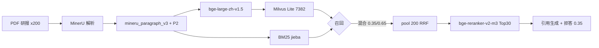

# commercial-rag 项目中期结果总结

> **当前规模（2026-05-28）**：**200 份研报**（四行业 × 50）→ **7,382** 可检索 chunk；评测集 **150 题**  
> **最新快照**：混合 Recall@10 **92.0%**，Rerank 答案事实准确率 **88.0%** — 详见 **[eval-results.md](eval-results.md)**

---

## 1. 技术路线总览



| 阶段 | 选型 | 说明 |
|------|------|------|
| PDF 解析 | **MinerU** | `content_list_v2.json` + Markdown |
| 分块 | **mineru_paragraph_v3 + P2** | 评级 headline、表语义化、可比表标签、附录合并 |
| Embedding | **bge-large-zh-v1.5**（1024 维） | 查询 `query: ` 前缀 |
| 向量库 | **Milvus Lite**（COSINE） | `data/vector/milvus.db` |
| 词法 | **BM25Okapi + jieba** | `data/vector/bm25_index.pkl` |
| 混合召回 | min-max 加权融合 | 默认 **向量 0.35 / BM25 0.65**；pool **200** |
| 查询增强 | `query_enhance.py` | BM25 扩展、对比实体、动态权重 |
| Rerank | **bge-reranker-v2-m3** | pool 30 → Top 5 |
| 生成 | 模板引用 + 拒答 | Top-1 rerank < **0.35** 拒答 |

**注意**：`rag_pipeline.py` / `rag_chat.py` 若未接 `HybridRetriever`，与离线评测链路可能不一致，迁移后建议统一。

---

## 2. 当前评测结果（150 题，P2 索引）

### 2.1 三路召回 @10（权重 0.35）

| 路线 | Recall@3 | Recall@5 | Recall@10 | MRR |
|------|----------|----------|-----------|-----|
| 纯向量 | 80.0% | 83.3% | 86.0% | 0.748 |
| 纯 BM25 | 78.7% | 84.7% | 92.0% | 0.750 |
| **混合** | **86.7%** | **90.7%** | **92.0%** | **0.836** |

### 2.2 混合权重扫描 @10

| 向量 / BM25 | Recall@10 |
|-------------|-----------|
| 0.50 / 0.50 | 91.3% |
| **0.40 / 0.60** | **92.0%**（MRR 最高 0.839） |
| **0.35 / 0.65** | **92.0%**（**当前默认**） |
| 0.30 / 0.70 | 91.3% |

### 2.3 Rerank + 答案

| 策略 | Recall@5 | 事实准确率 |
|------|----------|-----------|
| 混合直接 Top5 | 92.7% | 84.0% |
| **混合 + Rerank** | 90.7% | **88.0%** |

### 2.4 优化阶段对比（150 题）

| 阶段 | Recall@10 | 答案准确率 |
|------|-----------|-----------|
| 基线（优化前） | 84.7% | 82.7% |
| P0 + P1（重切分前索引） | 87.3% | 86.7% |
| **P2 + 权重 0.35** | **92.0%** | **88.0%** |

---

## 3. 已实施优化清单

### P0 — 评测与答案

| 模块 | 改动 |
|------|------|
| `rag_tokens.py` | must 别名、数字模糊匹配 |
| `eval_retrieval.py` | 对股+must 放宽 section；评级 metadata |
| `rag_answer.py` / `reranker.py` | embedding_text 摘录；评级句注入 |

### P1 — 检索

| 模块 | 改动 |
|------|------|
| `retrieval.py` | stock_code +0.12、pool 200、可比表 -0.10、对比多查询 RRF |
| `query_enhance.py` | BM25 查询扩展、实体抽取 |
| `bm25_store.py` | 返回 embedding_text、content_type |
| `eval_rerank_common.py` | Rerank 池 20→30 |

### P2 — 分块与索引

| 模块 | 改动 |
|------|------|
| `chunk_mineru.py` | `rating_headline`、表指标语义化、`comparable_table`、附录合并 |
| 全量重跑 | chunk → embed → bm25 |

---

## 4. 分块与数据质量（200 份）

| 指标 | 数值 |
|------|------|
| 总 chunk | 10,263 |
| 可检索 | 7,382（72.0%） |
| table / text / noise | 4547 / 2675 / 2881 |
| rating_headline | 114 |
| comparable_table | 46 |

---

## 5. 已知问题与 P3 方向

| 问题 | 现状 | 建议 |
|------|------|------|
| 对比题 Recall@10 80.8% | 12 miss 中 5 题为 comparative | per-entity 分检索 + RRF |
| 通宝类封面评级 | 无 rating_headline | 封面「增持-A」强制 headline |
| 答案 hit 但 must 失败 | 12 题 | 报告期过滤、EPS 定向摘录、must 不满足拒答 |
| 生产 CLI 未接 hybrid | 评测已 hybrid | 统一 `HybridRetriever` |

详见 **[eval-badcase-analysis.md](eval-badcase-analysis.md)**。

---

## 6. 复现实验命令

```bash
export HF_ENDPOINT=https://hf-mirror.com HF_HOME=/root/autodl-tmp/hf_cache
export HF_HUB_CACHE=/root/autodl-tmp/hf_cache/hub TRANSFORMERS_CACHE=/root/autodl-tmp/hf_cache/hub

python src/chunk_mineru.py
python src/embed_chunks.py
python src/build_bm25_index.py

python src/eval_retrieval.py --compare-routes --top-k 10
python scripts/eval_hybrid_weight_sweep.py
python src/eval_rerank.py
```

---

## 7. 结果文件索引

| 文件 | 内容 |
|------|------|
| `data/eval/eval_route_comparison.csv` | 三路召回 |
| `data/eval/eval_hybrid_weight_sweep.csv` | 权重分组 |
| `data/eval/eval_rerank_comparison.csv` | Rerank 检索 |
| `data/eval/eval_rerank_answer_comparison.csv` | 答案/拒答 |
| `data/eval/eval_misses_hybrid.jsonl` | 12 题检索 miss |
| `docs/eval-results.md` | **当前结果快照（推荐阅读）** |

---

## 附录 A：24 份 POC 基线（90 题，历史）

> 早期 POC：24 份研报、991 可检索 chunk、90 题评测。数字仅供历程对照。

| 实验 | 最优 Recall@5 | 事实准确率 |
|------|---------------|-----------|
| 三路 @10 | 混合 86.7% @5 | — |
| 混合 + Rerank | **85.6%** | **88.9%** |

POC 详细表见 git 历史或 `archive/poc24_backup_20260528_1108/docs/midterm-summary.md`。
